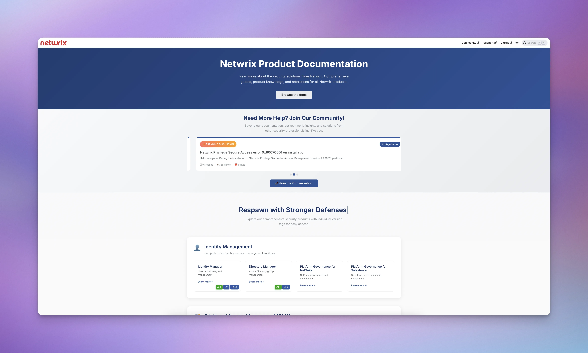

<div align="center">
  
</div>

# Netwrix Product Documentation

A centralized documentation site for all Netwrix security products, built with [Docusaurus v3.8.1](https://docusaurus.io/) and a simple prouct configuration for easy maintenance.

## 🎯 Overview

This documentation site serves all Netwrix product documentation.

- **19+ Security Products** across 6 categories:
  - Identity Management
  - Privileged Access Management (PAM)
  - Directory Management
  - Endpoint Management
  - Data Security Posture Management (DSPM)
  - Identity Threat Detection & Response (ITDR)
- **Multi-version Support** with version management
- **Centralized Configuration** - single source of truth for all product docs
- **Search** capabilities with Algolia

## 🚀 Quick Start

### Prerequisites

- **Node.js 18+**
- **npm**
- **Git**

### Installation

```bash
# Clone the repository
git clone https://github.com/netwrix/docs.git
cd docs

# Install dependencies
npm install

# Start development server
npm run start
```

## 📁 Project Structure

```
├── src/
│   ├── config/
│   │   └── products.js           # CENTRALIZED CONFIGURATION
│   ├── components/
│   │   ├── HomepageFeatures/     # Dynamic product grid homepage (auto-generated)
│   │   ├── ProductMetaTags/      # Search meta tags (auto-generated)
│   │   ├── CommunityHighlights/  # Community section
│   │   └── CommunityShowcase/    # Community section
│   ├── css/
│   │   └── custom.css           # Theme customization
│   └── pages/
│       └── index.js             # Homepage with dynamic links
├── docs/                        # Product documentation
│   ├── 1secure/                 # SaaS/single-version products
│   ├── accessanalyzer/          # Multi-version products
│   │   ├── 11.6/
│   │   └── 12.0/
│   ├── identitymanager/
│   │   ├── 6.1/
│   │   ├── 6.2/
│   │   └── saas/
│   └── [other product docs]/
├── sidebars/                    # Sidebar configurations (referenced by products.js)
│   ├── 1secure.js
│   ├── accessanalyzer/
│   │   ├── 11.6.js
│   │   └── 12.0.js
│   └── [other product sidebars]/
├── scripts/                     # Development utilities

├── static/                      # Static assets
│   └── img/
│       ├── branding/            # Logos and brand assets
│       └── product_docs/        # Product images
├── docusaurus.config.js         # Main config
└── package.json
```

## 🛠️ Development

### Available Commands

```bash
# Development
npm run start                     # Start development server
npm run start-chok                # Start development server with polling (for network drives)

# Building & Testing
npm run build                     # Full production build

# Utilities
npm run clear                     # Clear Docusaurus cache
npm run serve                     # Serve production build after `npm run build`
```

### Building/Running Specific Products

You can build or run the documentation for a single product using the `DOCS_PRODUCT` environment variable:

**Windows (PowerShell):**
```powershell
$ENV:DOCS_PRODUCT="pingcastle"
npm run start
```

**Unix/Linux/macOS:**
```bash
export DOCS_PRODUCT="pingcastle"
npm run start
```

This works with any command (`start`, `start-chok`, `build`) and speeds up development when working on a single product. Available product IDs can be found in `src/config/products.js`.

*Note: you may get a warning when you first run this. This warning doesn't seem to appear again and the site worked as expected*

### Development Workflow

The centralized system makes development simple:

1. **Start development server**: `npm run start`
2. **Make changes** to documentation or configuration
3. **Hot reload** automatically updates the site
4. **All products and versions** work seamlessly

## ⚙️ Centralized Configuration System

### Global Product Config: `src/config/products.js`

All product configuration for _building the site_ (e.g. naming) is managed in a single file. Here's how it works:

```javascript
// Define a product once
{
  id: 'accessanalyzer',
  name: 'Access Analyzer',
  description: 'Analyze and audit file system permissions',
  path: 'docs/accessanalyzer',
  category: 'Data Security Posture Management (DSPM)',
  icon: '🔍',
  versions: [
    {
      version: '12.0',
      label: '12.0',
      isLatest: true,
      sidebarFile: './sidebars/accessanalyzer/12.0.js'
    },
    {
      version: '11.6',
      label: '11.6',
      isLatest: false,
      sidebarFile: './sidebars/accessanalyzer/11.6.js'
    }
  ]
}
```

**Automatically generates**:

- ✅ Docusaurus plugin configurations
- ✅ Homepage product grid
- ✅ SEO meta tags
- ✅ URL routing
- ✅ Version management

### Configuration Schema

```typescript
interface Product {
  id: string; // Unique identifier
  name: string; // Display name
  description: string; // Homepage description
  path: string; // Documentation path
  category: string; // Product category
  icon?: string; // Emoji icon
  versions: ProductVersion[]; // Version configurations
  defaultVersion?: string; // Override default version
}

interface ProductVersion {
  version: string; // Version identifier (e.g., '12.0', 'current')
  label: string; // Display label
  isLatest: boolean; // Is this the latest version?
  sidebarFile: string; // Path to sidebar configuration
}
```

### Theme Customization

Key CSS variables in `src/css/custom.css`:

```css
--ifm-color-primary: #2a5298; /* Netwrix blue */
--ifm-color-primary-dark: #254a89; /* Darker variant */
--ifm-font-family-base: 'Inter'; /* Primary font */
```

## 📊 Adding New Products & Versions

### 🆕 Adding a New Product

The centralized system makes adding products incredibly simple:

**1. Add to `src/config/products.js`:**

```javascript
{
  id: 'newproduct',
  name: 'New Product Name',
  description: 'Brief product description',
  path: 'docs/newproduct',
  category: 'Product Category', // Must match existing category
  icon: '🔧',
  versions: [
    {
      version: 'current',
      label: 'Current',
      isLatest: true,
      sidebarFile: './sidebars/newproduct.js'
    }
  ]
}
```

**2. Create documentation structure:**

```bash
mkdir docs/[newproduct]
```

**3. Create sidebar configuration:**

```bash
echo "// @ts-check

/** @type {import('@docusaurus/plugin-content-docs').SidebarsConfig} */
const [newproduct]sidebar = {
  sidebar: [
    {
      type: 'autogenerated',
      dirName: '.',
    },
  ],
};

export default sidebars;
" > sidebars/[newproduct].js
```

**That's it!** The new product automatically appears on the homepage with proper routing.

### 📈 Adding a New Version

**1. Update the product in `src/config/products.js`:**

```javascript
// Add to existing product's versions array
versions: [
  {
    version: '[newversion]', // New version
    label: '[newversion]',
    isLatest: true, // Mark new version as latest
    sidebarFile: './sidebars/[productname]/[newversion].js',
  },
  {
    version: '1.0',
    label: '1.0',
    isLatest: false, // Update previous version latest to false
    sidebarFile: './sidebars/[productname]/1.0.js',
  },
];
```

**2. Create version documentation:**

```bash
mkdir docs/productname/[newversion]
```

**3. Create version sidebar:**

```bash
echo "// @ts-check

/** @type {import('@docusaurus/plugin-content-docs').SidebarsConfig} */
const [newproduct]sidebar = {
  sidebar: [
    {
      type: 'autogenerated',
      dirName: '.',
    },
  ],
};

export default sidebars;
" > sidebars/[newproduct].js
```

### 🏷️ Adding Product Categories

Add to the `PRODUCT_CATEGORIES` in `src/config/products.js` for the product category it belongs to:

```javascript
{
  id: 'new-category',
  title: 'New Category Name',
  description: 'Category description',
  icon: '🎯'
}
```

## 📝 Content Guidelines

### Example Documentation Structure

```
docs/productname/
├── index.md              # Product overview
├── getting-started/      # Quick start guides
├── user-guide/          # End user documentation
├── administration/      # Admin guides
├── api-reference/       # API documentation
└── troubleshooting/     # Common issues
```

### Frontmatter Template

```yaml
---
title: 'Page Title'
sidebar_label: 'Sidebar Label'
description: 'SEO description'
---
```

### Image Guidelines

- **Location**: `/static/img/product_docs/productname/`
- **Format**: Use `.webp` for performance
- **Paths**: Always absolute from project root

```markdown

```

## 🚀 Deployment

### Automatic Deployment

- **Production**: Auto-deploys from `main` branch
- **Development**: Auto-deploys from `dev` branch

## 🤝 Contributing

### Simplified Development Workflow

Contributing is easy:

1. **Start development server**:

```bash
npm run start
```

2. **Make your changes** to documentation or configuration

3. **Test builds**:

```bash
npm run build
```

4. **Submit pull request**

Create a PR to the dev branch, and then main when ready for production.

## 🔍 Testing & Quality Assurance

### Common Testing Scenarios

- ✅ **Homepage loads** with all product categories
- ✅ **Product pages accessible** from homepage links
- ✅ **Version badges work** for multi-version products

## 📚 Resources

- **Docusaurus Documentation**: [docusaurus.io](https://docusaurus.io/)
- **MDX Guide**: [mdxjs.com](https://mdxjs.com/)
- **React Documentation**: [react.dev](https://react.dev/)
- **Algolia Documentation**: [algolia.com](https://www.algolia.com/doc/)

## 📄 License

This documentation site is MIT licensed and open source, and is maintained by Netwrix Corporation.
