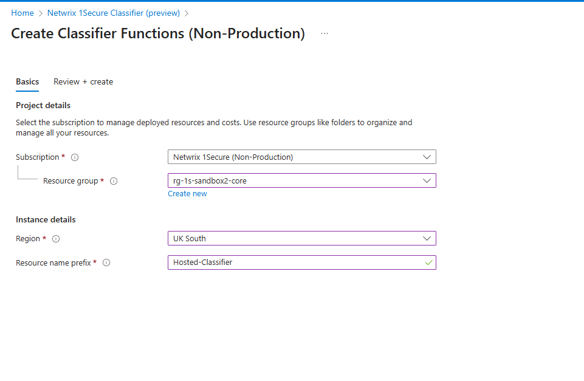
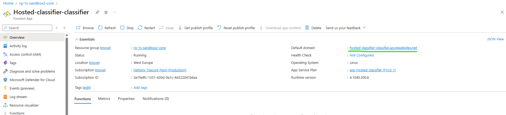
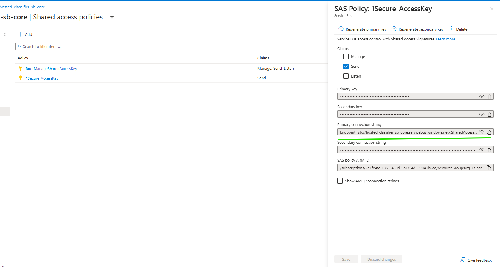
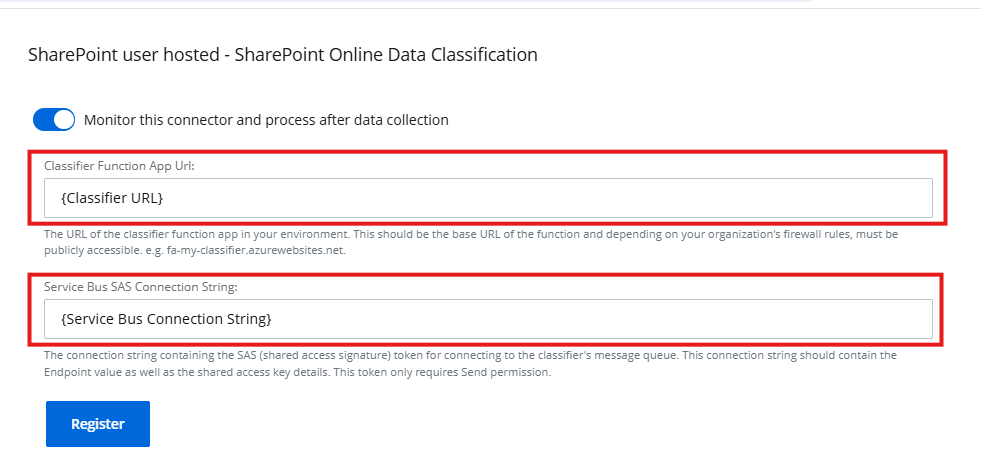
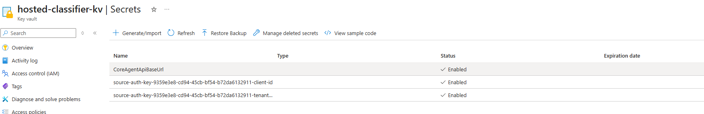
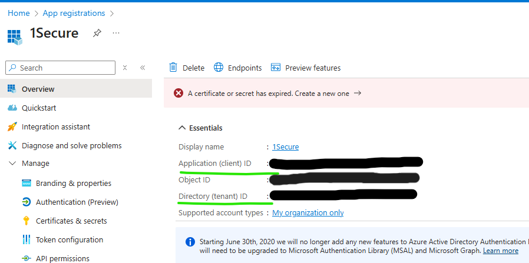
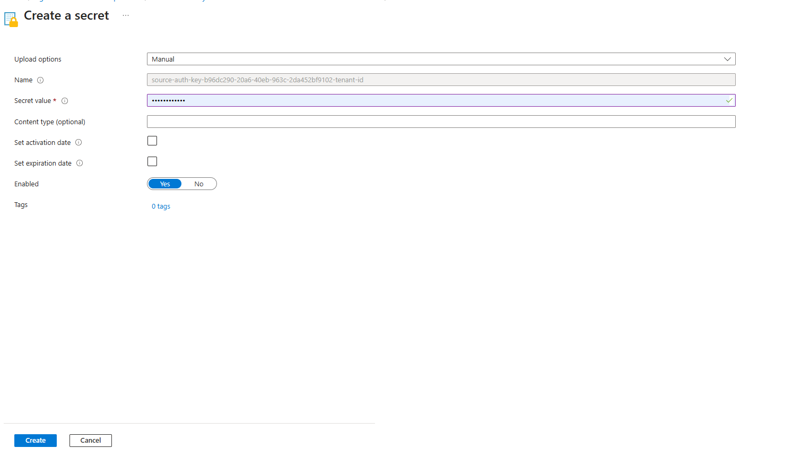
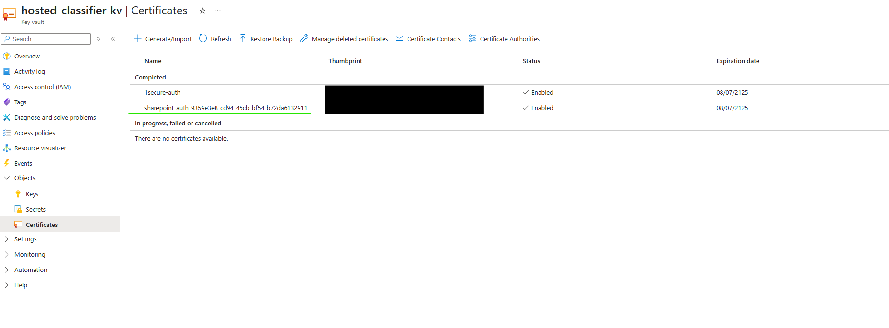
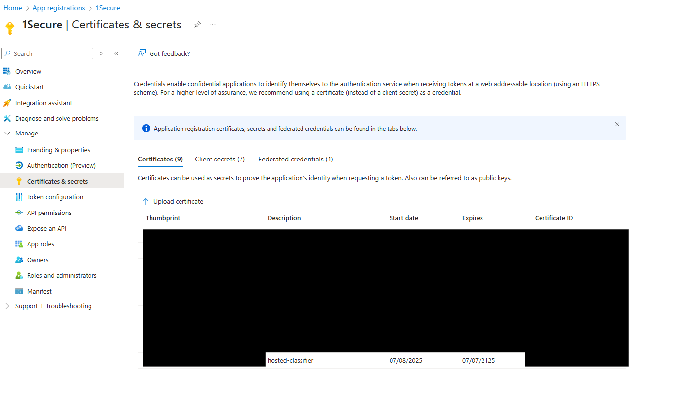

# Configure SharePoint Online Classification App

## Create 1Secure SPO Data Classification Connector

* Log in to 1Secure
* Go to Configuration
* Go to Managed organizations
* Select the child tenant you're working within
* Select the SharePoint Online source's Connectors
* Add/Edit SharePoint Online Data Classification

## Deploy and Configure the Classifier in Azure

* Create new resource group
* Give current user at least: Domain Services Contributor, Contributor, Key Vault Secrets Officer, Key Vault Certificates User, and Role Based Access Control Administrator within resource group
* Add "Netwrix 1Secure Classifier" from marketplace

  \
  
* Set Region
* Set Resource name `<prefix>`e.g. CompanyName-1Secure
* After creation go to resource group
* Go to `<prefix>`-textextraction
* Open Functions page and go to App Keys
* Copy "default" key
* Go to `<prefix>`-classifier
* Open Settings folder and go to Environment variables
* Paste "default" key into "TextExtraction__ApiKey" value

## Register the Classifier in 1Secure

* In Azure classifier app, go to Overview
* Click on the "Default domain" link and copy the full url (see below)

  \
  

* In 1Secure and paste as "Classifier Function App Url"
* Go to `<prefix>`-sb-core
* Open Settings Folder and go to Shared access policies
* Create new shared access policy, only 'Send' claims are required

 

* Copy the "Primary connection string"
* Swap to 1Secure tab and paste as "Service Bus SAS Connection String"

 

* Press Register
* After success, save and swap back to Azure Portal (tab 1)

## Set Up Classifier Link to SPO

**On Azure Portal (tab 1):**

* Go to `<prefix>`-kv
* Open Objects folder and go to Secrets
* Swap to Azure Portal (tab 2)

**On Azure Portal (tab 2):**

* Open your SharePoint App Registration

 

* Copy App Registration tenant ID
* Swap to Azure Portal (tab 1)
  * Click on the secret with the name "source-auth-key-\{Guid\}-__tenant-id__"
  * Click "+New Version"
  * Paste the tenant ID as the secret value
  * Click Create\n
* Copy App Registration client ID
* Swap to Azure Portal (tab 1)
  * Click on the secret with the name "source-auth-key-\{Guid\}-__client-id__"
  * Click "+New Version"
  * Paste the client ID as the secret value
  * Click Create

**On Azure Portal (tab 1):**

 

* Go to Certificates
* Click on "sharepoint-auth-\{Guid\}"
* Click on current version
* Click on "Download in CER format"
* Swap to Azure Portal (tab 2)

**On Azure Portal (tab 2):**

* Open Manage folder in App Registration and click Certificates & Secrets
* Go to Certificates
* Click "Upload certificate"
* Upload the downloaded certificate and give it a name

 

## Troubleshooting

### General Errors

**Classification connector successfully registers but shows status 'New' even after a successful state crawl**

* There could be errors in the classifier app - check the Application Insights resource (in the classifier resource group, resource ending in `-ai`) for more detailed errors - use the below section for further troubleshooting steps

### Application Insights Errors

**No ClientId was specified**

*(Full error: Microsoft.Graph.ServiceException: Code: generalException Message: An error occurred sending the request. ---> MSAL.NetCore.4.70.2.0.MsalClientException: ErrorCode: no_client_id……)*

* Check that the client ID and tenant ID secrets are set in the KeyVault instance

**The maximum entity size has been reached or exceeded for queue**

* The classifier has been unable to process service bus messages and the queue is now full, the queue can be emptied. The classifications should be processed successfully on the next crawl.
  * In the classifier resource group, find the service bus namespace resource (named `<classifier-name>`**-class-sb-core**)
  * Open the **state-classification** queue, and click **Service Bus Explorer** in the left-hand side bar
  * Click **Peek Mode** and change it to **Receive Mode**, then click **Purge messages**

**Name or service not known**

*(Example error: Microsoft.Graph.ServiceException: Code: generalException*\n*Message: An error occurred sending the request.*\n *---> System.AggregateException: Retry failed after 4 tries. Retry settings can be adjusted in ClientOptions.Retry or by configuring a custom retry policy in ClientOptions.RetryPolicy. (Name or service not known (*`<classifier-name>`*-kv:443))*

* One of the environment variables may be incorrect in the classifier or text extraction app. Ensure that URLs in the variables are valid (for example variables `FileDownload__ClientCredentialsKeyVaultUrl` and `TextExtraction__ApiBaseUrl`)