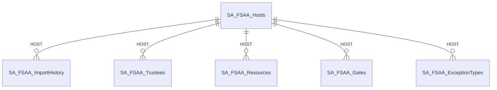
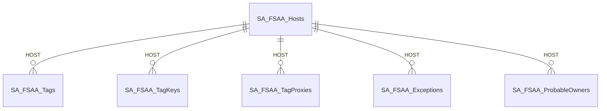
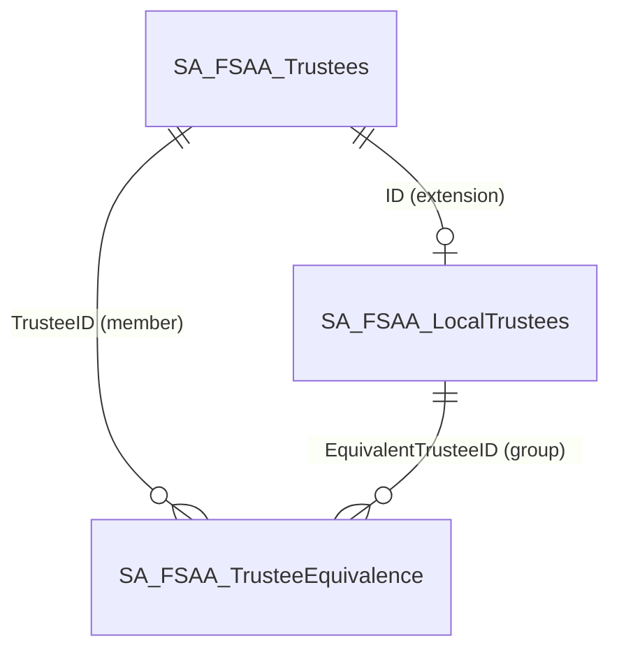
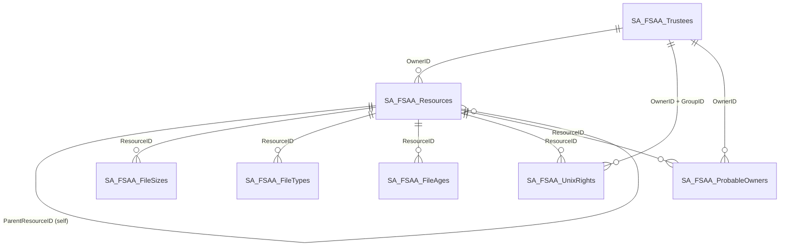
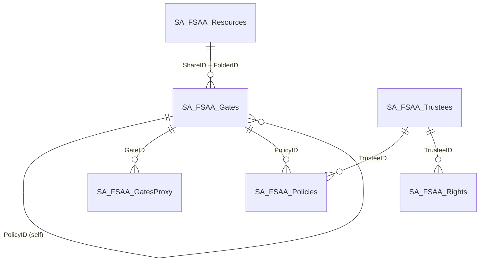
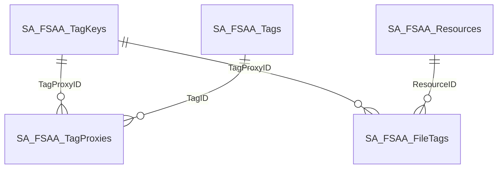
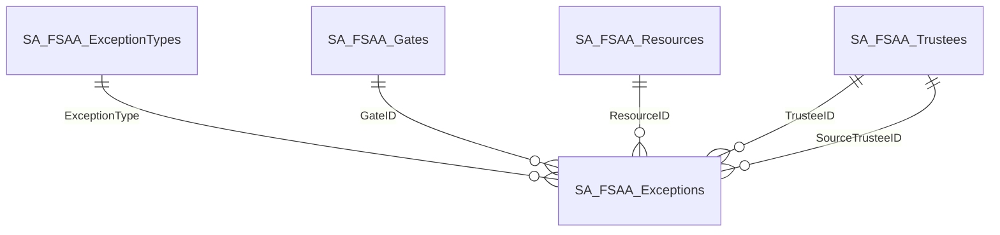
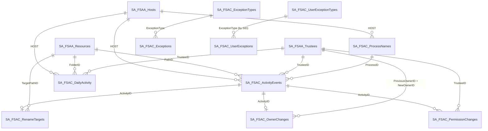
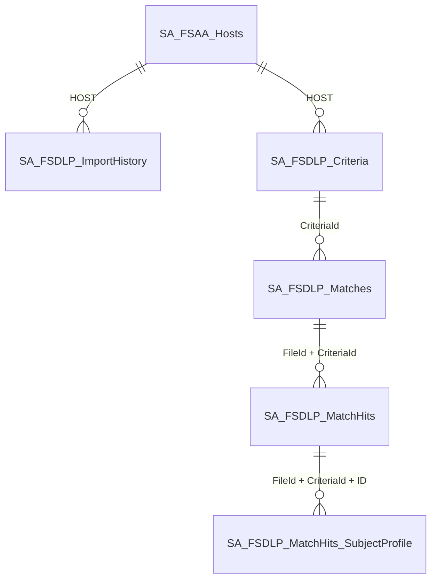
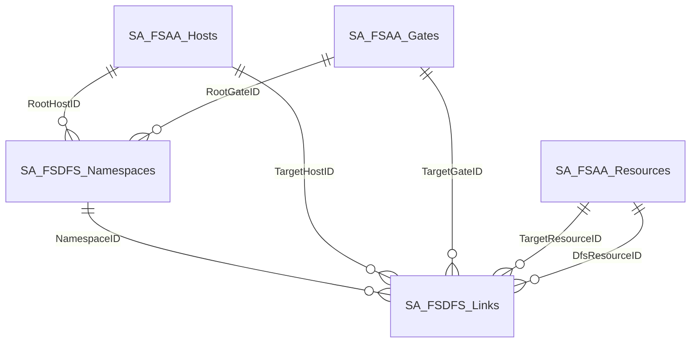

# Table Relationship Diagrams (ERD)

The following subsystem-focused sub-diagrams divide the schema. Relationship lines use standard crow's foot notation: a single vertical bar on the parent side and a crow's foot (fork) on the child side means "exactly one parent, zero or more children"; a single bar on each side with an open circle means one-to-zero-or-one (sidecar / extension table).

:::note
Every core table includes a `HOST INT` column that is a foreign key to `SA_FSAA_Hosts.ID` with `ON DELETE CASCADE`. To keep the sub-diagrams readable, that fan-out is shown only in the **Top-level partitioning** diagram; in the other diagrams `HOST` is implicit on every relationship.

Tables not shown in any diagram (no foreign keys): `SA_FSAA_SchemaVer` (single-row config) and `SA_FSAA_ScanHistory` (audit log).
:::

---

## Top-level Partitioning

`SA_FSAA_Hosts` is the root of the schema. Every other table includes a `HOST` column whose foreign key cascades on delete, so removing a host atomically purges its entire data set. The following diagrams are **representative, not exhaustive** — they show the parent tables for each subsystem; the per-subsystem diagrams later in this section cover the remaining HOST-partitioned tables (for example, `SA_FSAA_Rights`, `SA_FSAA_LocalTrustees`, `SA_FSAA_GatesProxy`, `SA_FSAA_Policies`, the four `SA_FSAA_File*` aggregations, and every `SA_FSAC_*` / `SA_FSDLP_*` / `SA_FSDFS_*` table).

**Core subsystem roots:**

**Tag infrastructure and exception/ownership tables:**

---

## Trustees

`SA_FSAA_Trustees` is the canonical trustee table. `SA_FSAA_LocalTrustees` is a 1:0..1 *extension* that adds NT-style domain/name/display fields for principals that are local to the host. `SA_FSAA_TrusteeEquivalence` is the local-group-membership edge table — `TrusteeID` is the member, `EquivalentTrusteeID` is the local-group it belongs to.

---

## Resources & Content Aggregations {#resources--content-aggregations}

`SA_FSAA_Resources` is the file/folder/share tree (note the self-reference for parent-child folder hierarchy and the `OwnerID` FK back to `SA_FSAA_Trustees`). The five sidecar tables on the right hold per-resource aggregations populated by the structural import.

---

## Gates and Permissions

A "gate" is a way to reach a resource — an SMB share, NFS export, or LSA-policy container. `SA_FSAA_Gates` self-references through `PolicyID` (an NFS export gate points at its export-policy gate). `SA_FSAA_GatesProxy` is the dedup bridge between resources and gates (`SA_FSAA_Resources.GatesProxyID` is a logical reference, not an enforced FK). `SA_FSAA_Rights` holds the per-trustee allow/deny ACL entries; `RightsProxyID` is also a logical reference from `SA_FSAA_Resources` rather than an enforced FK.

:::note
Logical (un-enforced) references not shown: `SA_FSAA_Resources.RightsProxyID → SA_FSAA_Rights.RightsProxyID` and `SA_FSAA_Resources.GatesProxyID → SA_FSAA_GatesProxy.ID`. These are denormalized pointers maintained by the import pipeline; no FK constraint is created on them so that bulk imports can stage rows in any order.
:::

---

## Tags

Tags use a three-table dedup pattern. `SA_FSAA_Tags` holds each unique tag string. `SA_FSAA_TagKeys` defines a "tag set" identity. `SA_FSAA_TagProxies` is the membership table linking tag sets to their tags. `SA_FSAA_Resources.TagProxyID` and `SA_FSAA_FileTags.TagProxyID` reference the tag-set identity in `TagKeys`.

---

## Exceptions

`SA_FSAA_ExceptionTypes` is the per-host catalog of exception classes. `SA_FSAA_Exceptions` carries one row per detected anomaly and has FKs out to *all four* foundational tables — Hosts, Gates, Resources, and Trustees (twice — `TrusteeID` and `SourceTrusteeID`). Most of these FK columns are nullable because different exception types use different combinations.

---

## Activity Collection

`SA_FSAC_ActivityEvents` is the audit-event firehose; each row is one observed file-system operation (read / add / update / delete / permission-change / rename). Every event references the resource (`PathID`), the trustee that performed the operation, and the process (`ProcessID`) that ran it. Three detail tables hang off `ActivityEvents`: `SA_FSAC_PermissionChanges` and `SA_FSAC_OwnerChanges` for permission-change and owner-change details, and `SA_FSAC_RenameTargets` for rename destinations. `SA_FSAC_DailyActivity` is a daily aggregation rolled up by `(folder, trustee, operation)`. `SA_FSAC_Exceptions` records detected anomalies; `SA_FSAC_UserExceptions` is the per-user variant (partitioned by `SID` instead of by host).

---

## Sensitive Data

`SA_FSDLP_Criteria` lists the active DLP patterns. `SA_FSDLP_Matches` records, for each `(file, criterion)` pair, how many hits were found. `SA_FSDLP_MatchHits` carries the per-hit excerpt (prefix / data / suffix) and confidence score. `SA_FSDLP_MatchHits_SubjectProfile` links each hit to a subject in the central Subject Profile system (the identity / attribute that the matched data corresponds to). `FileId` on Matches is a logical reference to `SA_FSAA_Resources.ID`.

:::note
Logical (un-enforced) reference not shown: `SA_FSDLP_Matches.FileId → SA_FSAA_Resources.ID`. The DLP collector populates `FileId` to match the FSAA resource ID but no SQL FK constraint is created so DLP imports can run independently of structural scans.

`SA_FSDLP_MatchHits_SubjectProfile` has foreign keys into the central Subject Profile tables (`SA_SubjectProfile_Sources`, `SA_SubjectProfile_Identities`, `SA_SubjectProfile_AttributeValues`). Those tables are owned by the Subject Profile module and not shown here.
:::

---

## DFS Namespaces

`SA_FSDFS_Namespaces` lists the discovered DFS namespaces. `SA_FSDFS_Links` resolves each DFS-side path into the physical target (host / gate / resource) on a real file server. The link table has FKs into both the FSAA host and the FSAA structural tables on the target side.

