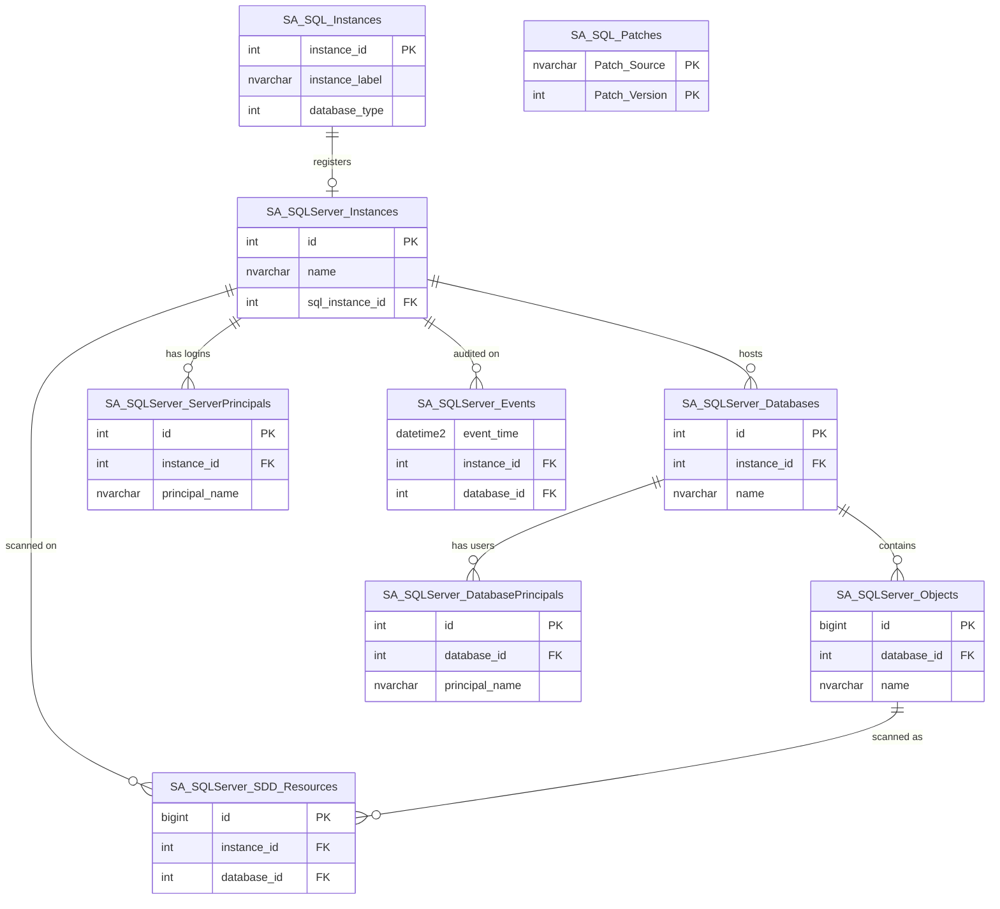
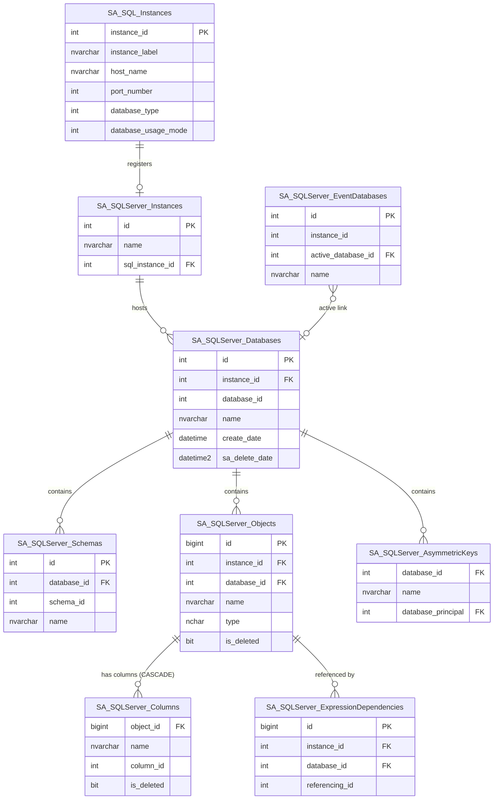
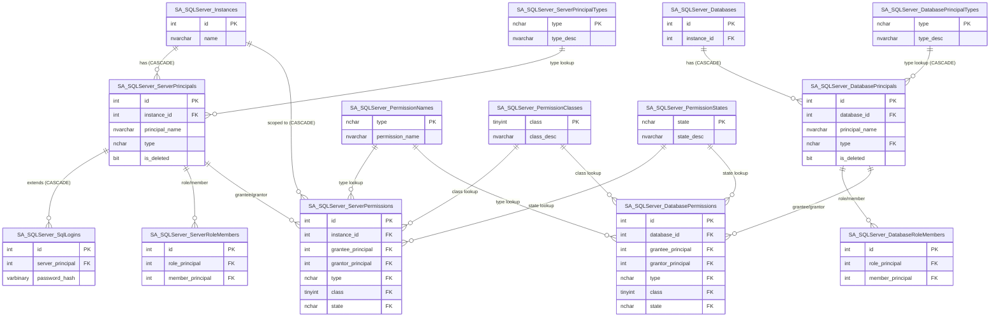
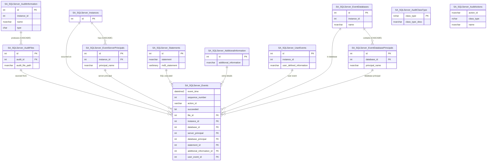

# Table Relationship Diagrams (ERD)

## High-Level Overview

The schema is organized into four major subsystems, each detailed in the diagrams below. This overview shows only the top-level entities and how the subsystems connect.



---

## Instance & Database Hierarchy

Shows how SQL Server instances, databases, schemas, objects, and columns relate. Includes the cross-module instance registry and asymmetric keys.



---

## Principals & Permissions

Shows server-level and database-level principals, role memberships, permissions, and their shared lookup tables.



---

## Audit Events

Shows the star-schema audit event fact table and all its dimension/lookup tables. The Events table is a heap (no PK) with 11 foreign keys.



---

## Sensitive Data Discovery (SDD)

Shows the SDD subsystem: criteria definitions, scannable resources, match aggregates, individual match hits, subject profile linkage, and scan history.

```mermaid
erDiagram
    Instances["SA_SQLServer_Instances"] {
        int id PK
    }

    Databases["SA_SQLServer_Databases"] {
        int id PK
    }

    Objects["SA_SQLServer_Objects"] {
        bigint id PK
    }

    Criteria["SA_SQLServer_SDD_Criteria"] {
        int id PK
        nvarchar name
        uniqueidentifier pattern_guid
    }

    InstanceCriteria["SA_SQLServer_SDD_InstanceCriteria"] {
        int instance_id FK
        int criteria_id FK
    }

    DatabaseCriteria["SA_SQLServer_SDD_DatabaseCriteria"] {
        int database_id FK
        int criteria_id FK
    }

    ResourceTypes["SA_SQLServer_SDD_ResourceTypes"] {
        tinyint id PK
        nvarchar type_desc
    }

    Resources["SA_SQLServer_SDD_Resources"] {
        bigint id PK
        tinyint type FK
        int instance_id FK
        int database_id FK
        bigint object_id FK
        int last_scanned FK
    }

    Matches["SA_SQLServer_SDD_Matches"] {
        bigint resource_id FK
        int criteria_id FK
        int match_count
        bigint match_location
    }

    MatchHits["SA_SQLServer_SDD_MatchHits"] {
        bigint resource_id FK
        int criteria_id FK
        nvarchar match_data
        nvarchar hit_column
    }

    MatchHitsSP["SA_SQLServer_SDD_MatchHits_SubjectProfile"] {
        bigint resource_id PK
        int criteria_id PK
        int source_id PK
        bigint identity_id PK
    }

    ScanHistory["SA_SQLServer_SDD_ScanHistory"] {
        int id PK
        int instance_id FK
        datetime2 scan_date
        bit aborted
    }

    SupportedTypes["SA_SQLServer_SDD_SupportedDataTypes"] {
        int id PK
        nvarchar data_type
        bit is_enabled
    }

    Criteria ||--o{ InstanceCriteria : "assigned to"
    Criteria ||--o{ DatabaseCriteria : "assigned to"
    Criteria ||--o{ Matches : "matched by"
    Criteria ||--o{ MatchHits : "hit by"
    Instances ||--o{ InstanceCriteria : "scoped to"
    Databases ||--o{ DatabaseCriteria : "scoped to"
    ResourceTypes ||--o{ Resources : "type lookup"
    Instances ||--o{ Resources : "scanned on"
    Databases ||--o{ Resources : "scanned in"
    Objects ||--o{ Resources : "scanned as"
    ScanHistory ||--o{ Resources : "last scan"
    Instances ||--o{ ScanHistory : "scan history"
    Resources ||--o{ Matches : "has matches"
    Resources ||--o{ MatchHits : "has hits"
    Resources ||--o{ MatchHitsSP : "profile link (CASCADE)"
