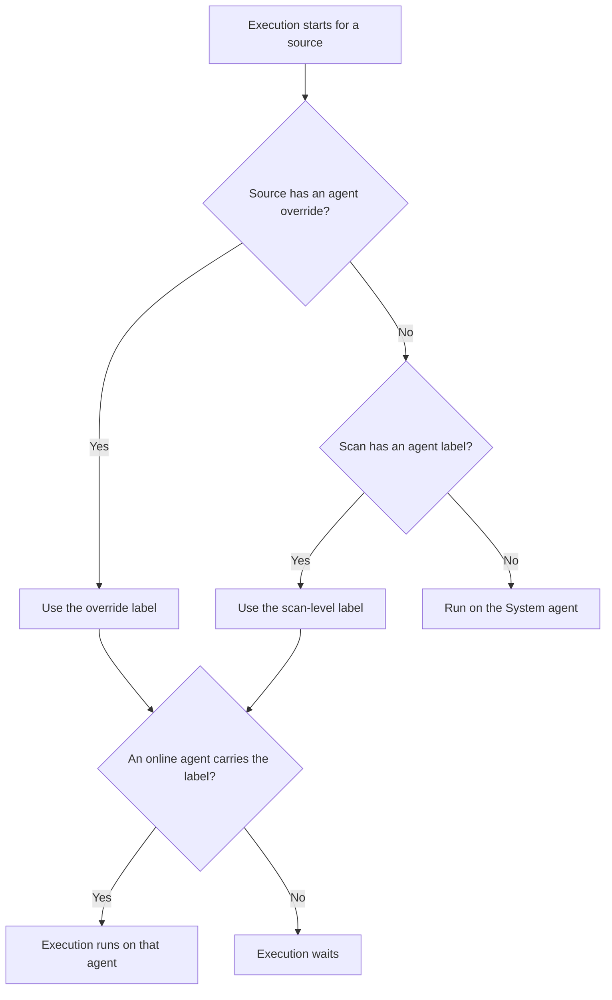

Labels are how you tell a scan where to run. Each deployed agent carries one or more `key=value` labels. A scan names a label, and its executions run on an agent that carries it. Leave the label out and the scan runs on the System agent.

Agent labels are separate from the labels you put on sources. Source labels group sources and pick scan targets; agent labels pick the machine that does the scanning. They don't interact, and they follow different rules. [Labels](../sources/labels.md) describes source labels.

## Agent Labels

You add labels when you [deploy an agent](deploy-agent.md) and change them later with **Edit**. A deployed agent must have at least one label. The System agent has no labels you can edit, so its **Labels** column on the Agents page is empty.

The **Labels** field's hint reads "Keys and values are lowercased; spaces become hyphens." Access Analyzer trims surrounding spaces, lowercases the key and the value, and turns each run of spaces inside them into a single hyphen. Enter `Data Center` as the key and `US East` as the value, and the stored label is `data-center=us-east`.

After that clean-up, the key and the value must fit these rules.

| Part | Must start with | Can contain | Maximum length |
|---|---|---|---|
| Key | A letter or number | Letters, numbers, and hyphens | 53 characters |
| Value | A letter or number | Letters, numbers, hyphens, underscores, and dots | 63 characters |

Avoid two keys. Access Analyzer reserves `name`, and `default` marks the System agent internally. Common choices are `region`, `environment`, and `network`, but any keys that make sense for you are fine.

Pick labels around how you'll route scans, not around how the hosts are built. `region=us-east` and `network=dmz` describe what a scan needs; `cpu=16` doesn't. The **Search agents…** field on the Agents page finds agents by label key, label value, or `key:value`, so a consistent scheme helps there too.

## Agent Selection

You select a scan's agent when you create it, in the **Agent** field on the **Schedule** step. The dropdown has two groups: **System**, holding the single option **System agent**, and **Agent labels**, listing every `key=value` your agents carry. Select one label. Any agent that carries it can run the scan.

A scan with several sources can send one of them elsewhere. On the **Configure** step:

1. Expand the source type's section (for example **File Server**).
2. Click **Add source override**.
3. In **Source to override**, select the source.
4. In the override's **Agent** field, select a label.

Click **Remove override** to undo it. The override applies to that source only; the scan's other sources keep the scan-level choice.

When an execution starts, Access Analyzer picks the agent for each source in this order:

Two details matter here. First, matching is exact: the agent must carry both the key and the value of the label you picked. An agent labeled `region=us-west` doesn't qualify for `region=us-east`, and an agent with only `env=production` doesn't either. Second, an agent that shows **Offline** on the Agents page can't run scans, so a match on labels alone isn't enough; the agent must be online.

Access Analyzer decides routing each time an execution starts, not when you save the scan. Relabeling an agent, or changing a scan's **Agent** field, takes effect from the next execution.

The **Agent** column on the Scans page shows where each scan runs: **System** for scans with no label, otherwise the label.

## Executions With No Matching Agent {#when-no-agent-matches}

The **Agent** dropdown only offers labels that agents carry, but nothing checks again later. If you delete or relabel the only agent with a scan's label, the scan keeps that label and its schedule fires as normal. Access Analyzer creates the execution, but no scanning happens and the execution doesn't fail immediately. It waits for an agent that carries the label to come online: a new agent you deploy, an offline agent that comes back, or an existing agent you relabel. If no matching agent comes online within about two hours, Access Analyzer marks the execution **Failed**, and the scan's next scheduled execution tries again.

The same wait happens when the only matching agent goes offline.

If an execution shows **Running** but makes no progress:

1. Go to **Configuration > Agents**.
2. Check for a **Healthy** agent whose **Labels** include the scan's label.
3. If there isn't one, deploy an agent with that label, bring the offline agent back online, or edit the scan and select a label that an online agent carries.

Editing the scan fixes its next execution only; the execution that's already waiting still needs a matching agent to come online. The Home page's **Needs attention** panel lists offline agents with a **Check agents** link, the quickest way to spot an agent that has gone offline. [Scan executions](../scans/scan-executions.md) lists every execution and its status.

## Example

Suppose you run the Access Analyzer server in your main data center and have two more agents deployed.

| Agent | Labels |
|---|---|
| **Default Agent** (the System agent) | none |
| `agent-east` | `env=production`, `region=us-east` |
| `agent-west` | `env=production`, `region=us-west` |

You configure four scans.

| Scan | Agent field | Override | Where it runs |
|---|---|---|---|
| HR shares | **System agent** | none | On the server, because you set no label |
| East finance shares | `region=us-east` | none | On `agent-east`, the only agent with that label |
| All production shares | `env=production` | none | On either `agent-east` or `agent-west`, since both carry the label |
| Regional archives | `region=us-east` | `fs-west-01` set to `region=us-west` | On `agent-east` for every source except `fs-west-01`, which runs on `agent-west` |

If `agent-west` goes offline, "All production shares" keeps running on `agent-east`, while the `fs-west-01` override in "Regional archives" waits for `agent-west` to report **Healthy** again, or fails after about two hours.

Later you delete `agent-east` to rebuild it. "East finance shares" and the `region=us-east` sources of "Regional archives" keep their label, so their next executions wait, while "All production shares" continues on `agent-west`. The waiting executions start as soon as you deploy the rebuilt agent with `region=us-east` again; if that takes longer than about two hours, Access Analyzer marks them **Failed** and the next scheduled executions try again.
