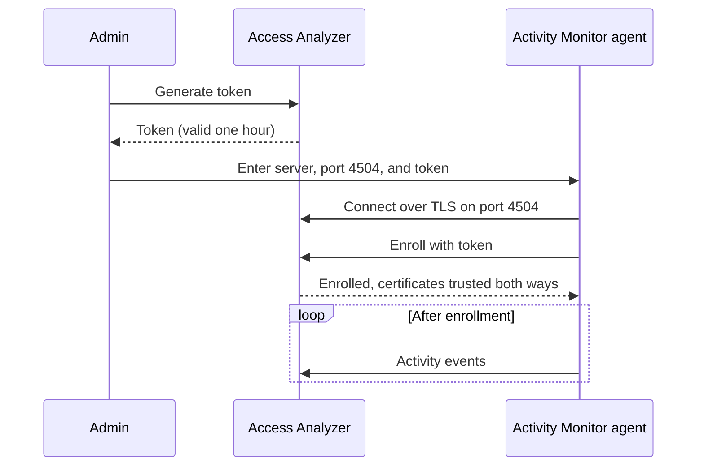

Netwrix Activity Monitor records who did what in the systems it monitors. Access Analyzer knows what data you have and who can reach it. Connect the two and Access Analyzer also knows who actually opened, changed, or deleted that data on file servers, in SharePoint Online, and in Microsoft 365 Copilot. You can see, for example, which users touched sensitive files on a share that's open to everyone.

The connection is one-way: an Activity Monitor agent sends events to the Access Analyzer server over a Transmission Control Protocol (TCP) connection on port 4504, secured with TLS.

## How the integration works

Setup is a one-time enrollment, followed by a continuous stream of events.

Once Access Analyzer accepts the token, each side remembers the other's certificate, and the agent never needs the token again. From then on the agent sends events as they happen, and Access Analyzer stores them alongside its scan results.

The Activity Monitor output sends three kinds of events: File System, SharePoint Online, and Microsoft 365 Copilot.

## Where the data appears

Activity data shows up in three places. Only the dashboard includes SharePoint Online and Copilot events; the two reports cover file server activity.

- The [Data security dashboard](../dashboards-reports/dashboards/data-security.md) has an **Activity** tab with the tiles **Total Events**, **Failed Events**, **Active Users**, and **Data Sources with Activity**; the charts **Events by Type**, **Activity Over Time**, **Events by Data Source**, and **Top Users by Activity**; and an **Activity Detail** table. Filter it by **Start Date**, **End Date**, **Event Type**, **Activity Source**, **User**, and **Event Status**.
- The **Activity Investigation** report under [Data reports](../dashboards-reports/reports/data.md). Every framework under [Compliance reports](../dashboards-reports/reports/compliance.md) includes it too.
- The **Share Audit** report, also under Data reports, draws on file server activity in its **Activity** tab, in the **Probable Owner** card on the **Overview** tab, and in the **Users by Activity on Sensitive Files** chart on the **Sensitive Data** tab.

Until an enrolled agent sends events, every card on the **Activity** tab reads **No results!**.

## Prerequisites

- **Activity Monitor version.** Netwrix Activity Monitor 10.0 with an output of type **Access Analyzer 26**. The [Activity Monitor documentation](/docs/activitymonitor/10_0/admin/outputs/accessanalyzer26) covers adding and editing that output.
- **Network path.** The host running the Activity Monitor agent must reach the Access Analyzer server on TCP port 4504. Open that port inbound on the server's firewall and on anything between the two hosts.
- **TLS certificate.** The Access Analyzer listener on port 4504 presents the same TLS certificate as the web interface, the one you supplied when you [installed Access Analyzer](../install/run-the-installer.md). The connection uses TLS 1.3. If the certificate has expired, the listener doesn't start and agents can't connect.
- **Admin role.** Only an Admin sees the **Enrollment token** panel, generates tokens, and changes the connection settings. A Viewer can see the connection settings but not change them. See [Users and roles](../settings/users.md).

## Generate an enrollment token

1. Sign in to Access Analyzer as an Admin.
2. Go to **Settings > Application**.
3. Scroll to the **Netwrix Activity Monitor** card. The **Enrollment token** panel is at the bottom of the card, below the four connection settings.
4. Click **Generate token**. If a token already exists, the button reads **Generate new token** instead.
5. Click the **Copy** icon next to the token. The message **Token copied to clipboard** confirms it.

The panel shows the token in a read-only field with an **Expires** line under it. Three things about the token matter when you plan an enrollment session:

- It's valid for one hour, so generate it right before you start enrolling. After an hour Access Analyzer rejects it and you generate a new one.
- Generating a new token invalidates any earlier token. Only the newest token works. Don't click **Generate new token** while a colleague is still enrolling with the previous one.
- One token can enroll several agents. The first enrollment doesn't consume it. If you have five Activity Monitor agents to connect, generate one token and use it for all five within the hour.

For example, a token generated at 09:00 expires at 10:00. Between those times you can enroll as many agents as you like with it. At 09:30, if you generate another token, the 09:00 token stops working immediately, even though it hasn't reached its expiry time.

If the panel is disabled, the port 4504 listener has no TLS certificate and Access Analyzer can't issue a token. The panel shows **NAM listener certificate isn't configured on this server.** NAM is short for Netwrix Activity Monitor. The listener uses the certificate you supplied at installation; see [Troubleshooting](#troubleshooting).

## Enroll the Activity Monitor agent

The rest of the setup happens in Activity Monitor. The following steps are the outline; the field-by-field description is in the Activity Monitor documentation for the [Access Analyzer 26 output](/docs/activitymonitor/10_0/admin/outputs/accessanalyzer26).

1. In Activity Monitor, add an output of type **Access Analyzer 26**, or open the properties of an existing one.
2. In **Server in SERVER:PORT format**, enter the Access Analyzer server and the listener port, for example `aa.corp.example.com:4504`. A short name, fully qualified domain name (FQDN), or IP address all work, as long as the agent can resolve it.
3. In **Enrollment Token**, paste the token you copied from Access Analyzer.
4. Click **Enroll**.

The agent connects, checks that the server's certificate matches the one described in the token, and sends the token. Access Analyzer accepts it, records the agent, and events start flowing. Repeat for each agent, reusing the same token while it's valid.

## Certificate trust after enrollment

Enrollment does more than check the token. The token carries a fingerprint of the public key in the Access Analyzer server's TLS certificate, so the agent knows it has reached the right server before it sends anything. In return, Access Analyzer records the fingerprint of the public key in the agent's certificate. Renewing a certificate with the same key pair keeps that trust intact. From then on the two sides recognize each other by those certificates alone.

That trust depends on the certificates in use at enrollment time:

- If you replace the Access Analyzer TLS certificate with one that uses a different key pair, enrolled agents no longer trust the server. Generate a new token and enroll each agent again.
- If an agent's certificate changes, for example because it generated a new key pair, Access Analyzer no longer trusts that agent. Enroll it again with a fresh token.

Access Analyzer treats an agent that connects with an unrecognized certificate as new: the agent has 10 seconds by default to present a valid token before Access Analyzer disconnects it.

## Connection settings

The four settings in the **Netwrix Activity Monitor** card on **Settings > Application** tune how the listener treats agent connections. The defaults suit most environments. Each row shows its setting key, with the allowed range under the field. To change a value, edit it and click **Save changes** in the bar that appears at the bottom of the page. Changes apply to new connections without a restart. [Application settings](../settings/application.md) describes how the settings page itself behaves, including the **Overridden** badge and the reset-to-default control.

| Setting | Default | Range | What it controls |
|---|---|---|---|
| `activitymonitor_connection_timeout` | 900 | 5–3600 | Seconds of inactivity before Access Analyzer drops an idle Activity Monitor agent. |
| `activitymonitor_enrollment_ban_duration_seconds` | 10 | 5–300 | Seconds to ban a source IP after it presents an invalid enrollment code (the code is the part of the token the agent sends). |
| `activitymonitor_enrollment_first_message_timeout_seconds` | 10 | 5–60 | Seconds to wait for the first message from a newly connected Activity Monitor agent. |
| `activitymonitor_max_message_size` | 16777216 | 65536–67108864 | Maximum size in bytes of a single Activity Monitor message (default 16 MB). |

For example, with the default `activitymonitor_connection_timeout` of 900, Access Analyzer disconnects an agent that sends nothing for 15 minutes. Raise it to 3600 to keep a quiet agent connected for up to an hour.

## Troubleshooting

The listener writes to the application logs.

1. Go to **Settings > System logs**. Only an Admin can open this tab.
2. In **Component**, select `nam-listener`.
3. Set **From** and **To** to the window in which you tried to enroll.

The [System logs](../settings/system-logs.md) page explains the filters and the **Log details** drawer.

The listener logs these messages:

| Message | Meaning |
|---|---|
| `nam listener: bound` | The listener started and is accepting connections on port 4504. |
| `nam listener: connection limit reached, rejecting` | The listener is at its limit of 100 simultaneous connections and refused a new one. |
| `nam listener: TLS certificate expires soon` | The certificate is close to its expiry date. Renew it before then; the listener doesn't start with an expired certificate. |
| `nam writer: unknown activity type, dropped` | An event arrived with an activity type Access Analyzer doesn't store, so Access Analyzer dropped it. |

Match the symptom to its likely cause:

| Symptom | Likely cause | What to do |
|---|---|---|
| **Enroll** fails and nothing appears in the logs for that time | TCP port 4504 is blocked between the agent host and the Access Analyzer server. | Open the port on the server's firewall and any firewall in between. Confirm the agent host can resolve the server name you entered. |
| **Enroll** fails even though the agent reaches the server | The token is more than an hour old, or someone clicked **Generate new token** after you copied it. | Generate a new token and enroll again. After a rejected token, Access Analyzer ignores connections from that agent's IP address for `activitymonitor_enrollment_ban_duration_seconds` (10 seconds by default), so wait before retrying. |
| Every agent stopped sending data at the same time | The listener is no longer running because the Access Analyzer TLS certificate has expired, or someone replaced the certificate with one that uses a different key pair, so enrolled agents no longer recognize the server. | Check **Settings > System logs** for `nam listener: bound` after the last restart. If the certificate has expired, renew it; see [Install Access Analyzer](../install/run-the-installer.md). If someone replaced it with a different key pair, generate a new token and enroll each agent again. |
| One agent stopped sending data after a change on its host | The agent's certificate changed. | Enroll that agent again. |
| The **Enrollment token** panel is disabled with **NAM listener certificate isn't configured on this server.** | The listener has no TLS certificate to present, so Access Analyzer can't issue tokens. | The listener uses the certificate supplied during installation. Confirm the installation completed with a valid certificate and key; see [Install Access Analyzer](../install/run-the-installer.md). |
