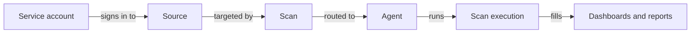

Most of Access Analyzer's vocabulary sits in the sidebar under **Configuration**. The terms below come in the order a new administrator meets them.

## Source and source type

A source is one system that Access Analyzer connects to and scans. Its source type, one of **File Server**, **Active Directory**, **Entra ID**, or **SharePoint Online**, decides which scan types can run against it and which service account type it needs. A File Server source named `fs-finance-01` pointing at `fs01.corp.example.com` supports Access scans and Sensitive data scans. [Sources](sources/index.md) covers adding and managing them.

## Service account

A service account is a saved credential that Access Analyzer uses to sign in to a source. Attach it to every source that needs it and rotate the secret in one place. Its type must match the source: Username/password for File Server and Active Directory, Client ID/secret for Entra ID, Client ID/certificate for SharePoint Online, and SSH username/key for deploying agents. A `corp-file-servers` account holding a domain user that can read the shares serves every File Server source in that domain. [Service accounts](service-accounts/index.md) covers each type.

## Agent and the System agent

An agent is a Linux machine that runs scans. Every installation has the System agent, which runs on the Access Analyzer server and appears as **Default Agent** on the Agents page; every scan runs there unless you route it elsewhere. Deploy more agents to reach segmented networks, keep scan traffic near the data, or take load off the server. An agent named `agent-london` in the London office scans the file servers there, so the traffic stays local. [Agents](agents/index.md) explains when to add one.

## Label

A label is a `key=value` pair. Source labels group sources and let a scan target every source that carries them, so a newly labeled source joins the right scans on their next run. Agent labels sit on deployed agents and tell a scan where to run. The two kinds don't interact. Give `fs-finance-01` the labels `site=london` and `team=finance`, and give `agent-london` the agent label `site=london`; a scan can select the source by one and run on the agent by the other. See [Labels](sources/labels.md) and [Agent labels and scan routing](agents/agent-labels.md).

## Scan and scan type

A scan is a saved definition: a name, one scan type, a target, settings per source type, an agent, and a schedule. The scan collects nothing until it runs. You choose the type at creation, and it decides what the scan collects. An **Access scan** inventories shares, folders, files, sites, and their permissions. A **Sensitive data scan** reads file content and matches it against sensitive data patterns. An **Identity sync** pulls users, groups, and memberships from a directory. "Finance access" is an Access scan targeting `team=finance` sources; "Finance sensitive data" reads the same sources after the first has completed. See [Scans](scans/index.md) and [Scan types](scans/scan-types.md).

## Schedule

A schedule makes a scan run on its own. A scan is either manual, running only when someone clicks **Run**, or scheduled hourly, daily, weekly, or monthly at a start time saved in the time zone of the browser that saved it. A scheduled run does exactly what **Run** does, label targets included. "Finance access" set to **Daily** at 02:00 shows **Daily 2AM** on the Scans page and **Active** under **Schedule Status**. [Schedules](scans/schedules.md) covers the options.

## Scan execution and scan target

The scan target is the set of sources a scan covers: a fixed list (**Specific sources**) or a rule (**Sources matching labels**) that Access Analyzer evaluates again at each run. A scan execution is one run of one scan against one source, with its own status, object count, duration, and logs. "Finance access" run against three `team=finance` sources creates three executions, and one can end **Failed** while the others reach **Completed**. [Scan executions](scans/scan-executions.md) lists every status.

## Sensitive data pattern and pattern group

A sensitive data pattern is a regular expression with a name, a description, and a confidence level: Low, Medium, or High. A pattern group collects related patterns under a name such as **PCI DSS** (Payment Card Industry Data Security Standard) or **Credentials**. Scans work at the group level: pick the groups, and every pattern in them runs. Access Analyzer ships 139 built-in patterns in 11 built-in groups. A custom employee ID pattern placed in the built-in **PII** (personally identifiable information) group runs in every scan that classifies PII. See [Sensitive data patterns](sensitive-data-patterns/index.md).

## Dashboard and report

Dashboards and reports are where scan results appear. A dashboard gives the wide view of one area: counts, charts, and a detail table. A report answers one question, with filters tuned to it. Both refresh only when you click **Refresh**. After "Finance access" completes, the Data security dashboard counts the objects and permissions it collected, and the **Open Access** report lists the finance folders that Everyone or Domain Users can reach. [Dashboards and reports](dashboards-reports/index.md) maps each to the scan that feeds it.

## Role

A role decides what a user can do; every user holds exactly one of three. **Admin** can do everything, including changing sources, scans, agents, service accounts, patterns, and settings. **User admin** manages user accounts and single sign-on only, with no access to dashboards, sources, or scans. **Viewer** has read-only access and can pause, resume, and stop scan executions. Give the storage team's on-call engineer the Viewer role: they can follow executions and read reports without changing a scan. See [Users and roles](settings/users.md).

## Objects and identities

The installer's size table measures capacity in two units. Objects are what an Access scan inventories: shares, folders, and files on a file server; sites, libraries, and documents in SharePoint Online. The **Objects** column on the Scan executions page counts them per run. Identities are the users and groups an Identity sync collects. A file server holding 12 million files and folders plus a domain with 3,000 users and groups fits the **small** size in [Requirements](install/requirements.md).
