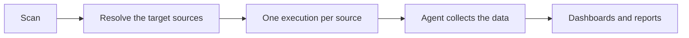

import Tabs from '@theme/Tabs';
import TabItem from '@theme/TabItem';

A scan is a saved definition: a name, one scan type, a target, settings per source type, an agent, and a schedule. The scan collects nothing until it runs. Each run creates one scan execution per target source, and those executions are what fill the dashboards and reports.

Three scan types exist. An **Access scan** inventories shares, folders, files, sites, and their permissions. A **Sensitive data scan** reads file content and classifies it against sensitive data patterns. An **Identity sync** pulls users, groups, and memberships from a directory. [Scan types](scan-types.md) explains what each one collects, which source types support it, and every setting. [Schedules](schedules.md) covers when scans run, and [Scan executions](scan-executions.md) covers following a run after it has started.

## How a scan runs

Whether you click **Run** or a schedule fires, the same thing happens.

Access Analyzer resolves the target first. For a scan that targets specific sources, that's the list you picked. For a scan that targets sources by label, Access Analyzer looks up which sources carry the labels at that moment, so it picks up a source you labeled yesterday without any change to the scan. Each source then gets its own execution, and each execution runs on the agent the scan (or a per-source override) points at. Access Analyzer skips a source that already has an execution in progress for this scan rather than starting it twice, and resumes a source whose execution is paused.

## The Scans page

Go to **Configuration > Scans**. The page lists every scan with its type, target, agent, and schedule.

| Column | What it shows |
|---|---|
| **Name** | The scan's name. Click it to open **Edit scan**. An icon next to the name shows the scan's description in a tooltip. |
| **Scan Type** | **Access**, **Sensitive data**, or **Identity sync**. |
| **Target** | The sources the scan covers, or the labels that select them. |
| **Agent** | **System** when the scan runs on the System agent, otherwise the agent label as `key=value`. |
| **Schedule** | **Manual**, or a short summary of the schedule such as **Daily 2AM** or **Hourly**. Click it to open the calendar. |
| **Schedule Status** | **Active** when the scan runs on a schedule, **Disabled** when it runs manually. |
| **Created** | When you created the scan. |
| **Actions** | The row menu; see [Row actions](#row-actions). |

**Search scans…** matches the scan name, the scan type, the names and types of the target sources, and label selectors written as `key=value`. The **Scan type** and **Source type** dropdowns narrow the list further, and **Clear filters** resets both. You can sort by **Name**, **Scan Type**, or **Created**; the newest scans come first by default. The table shows 10, 25, 50, or 100 rows per page.

Scan names don't have to be unique. Two scans can both be called "Finance shares", so give scans names that tell them apart at a glance.

### Row actions

The **Actions** menu on each row offers up to five items. **Run**, **Pause**, and **Stop** appear only when they can do something.

| Action | What it does | When it appears |
|---|---|---|
| **Run** | Starts one execution per target source, or resumes a source's paused execution, and opens Scan executions filtered to this scan. | At least one target source has no execution in progress, or has a paused execution you can resume |
| **Pause** | Asks every active execution of the scan to pause. Paused executions keep their progress, and you can resume them. | The scan has an execution that can be paused |
| **Stop** | Opens **Stop scan**, which stops every running and paused execution of the scan. | The scan has an execution that hasn't finished |
| **Edit scan** | Opens the scan at the **Review** step. | Always |
| **Delete** | Opens **Delete scan**. | Always |

After **Run**, a notification reports the outcome: **Scan started** with the number of sources started, **Scan resumed** when the run picks up paused executions, **Scan already running** when every source already has an execution in progress, or **Scan partially started** when some sources couldn't start. If a scan targets sources by label and no source carries those labels at the moment, there is nothing to run and the scan doesn't start.

### Calendar view

**Calendar view** opens the **Scan schedule calendar**, a month grid of upcoming scheduled runs across every scan. Switch between **month**, **week**, **day**, and **agenda** views, and move with **Previous**, **Today**, and **Next**. The legend tells **Access scan**, **Sensitive data scan**, and **Disabled** entries apart, and the footer counts the scheduled executions in view. Clicking a scan's **Schedule** cell opens the same calendar.

## Before you begin

You need at least one source whose type supports the scan type you want. File Server and SharePoint Online sources support Access and Sensitive data scans; Active Directory and Entra ID sources support Identity sync. [Sources](../sources/index.md) covers adding them.

For a File Server source, a Sensitive data scan needs a completed Access scan first, because it picks its files from the inventory that the Access scan built. Run the Access scan to completion before you run the Sensitive data scan.

If you want to target sources by label, put the labels on the sources first. [Labels](../sources/labels.md) explains source labels.

## Create a scan

Creating a scan takes five steps: **Type**, **Target**, **Configure**, **Schedule**, and **Review**. The panel shows **Step N of 5** as you go, and **Back** returns to the previous step at any point.

1. Go to **Configuration > Scans**.
2. Click **Create scan**.

### Select the scan type

1. Under **What should this scan do?**, select **Access**, **Sensitive data**, or **Identity sync**.
2. Click **Next**.

:::note

You can't change the scan type after you create the scan. To collect something else, create another scan.

:::

### Select the target

Under **Which sources should this scan cover?**, select one of two targeting modes.

**Specific sources** is a fixed list. You pick the sources, and the list stays as it is until you edit the scan. **Sources matching labels** is a rule: the scan covers every source that carries all the labels you select. Access Analyzer re-evaluates the rule every time the scan runs, so it picks up sources that gain the labels later and drops sources that lose them.

Either way, the step offers only sources whose type supports the scan type. If none do, the step says so, and you need to add a suitable source first.

<Tabs groupId="scan-target">
<TabItem value="sources" label="Specific sources">

1. Select **Specific sources**.
2. Select the checkbox next to each source to scan. Use **Search sources…** to find a source in a long list.
3. Confirm the counter under the list shows the number you expect.
4. Click **Next**.

</TabItem>
<TabItem value="labels" label="Sources matching labels">

1. Select **Sources matching labels**.
2. In **Source labels**, select one or more labels. A source must carry every label you add.
3. Check the match count under the field. It updates as you add labels and tells you how many sources qualify today.
4. Click **Next**.

</TabItem>
</Tabs>

You can save a label-targeted scan that matches no sources yet. It targets whatever matches when it runs. While a scan targets a label, you can't delete that label.

### Configure scan settings

Every source type in the target starts on its default settings. You can leave it there, customize the settings for all sources of that type, or give individual sources their own values. [Scan types](scan-types.md) lists every setting.

1. Expand the section for a source type. Its badge reads **Defaults** or **Customized**.
2. Keep **Use default configuration**, or select **Customize for all File Server sources**. The label names the source type; when the target is a single source it reads **Customize this source**.
3. Change the settings. **Reset to defaults** puts them back.
4. To give one source its own settings, under **Source overrides**, select the source in **Source to override**.
5. Click **Add source override**. The override has its own copy of every setting and its own **Agent** picker. **Remove override** discards it.
6. For a Sensitive data scan, set the pattern groups under **Sensitive data classification**. See [Sensitive data scan](scan-types.md#sensitive-data-scan).
7. Click **Next**.

If a source type has no settings for this scan type, the section says so and the sources run with the defaults. For a scan that targets sources by label, individual overrides become available when at least one source matches. If a source stops matching, its override moves to **Inactive overrides**.

### Set the schedule and agent

1. Under **When should this scan run?**, keep **Manual — run on demand** or select **On a schedule**.
2. If you selected **On a schedule**, select a **Frequency** and its time options. [Schedules](schedules.md) describes each option and the time zone rule.
3. In **Agent**, keep **System agent** or select an agent label. [Agent labels and scan routing](../agents/agent-labels.md) explains how Access Analyzer applies the choice.
4. Click **Next**.

### Name and review the scan

1. In **Name**, enter a name. This is the only required field on the step.
2. Optionally, enter a **Description**. It shows as a tooltip on the Scans page.
3. Check the **Summary** card. It lists **Scan type**, **Target**, **Settings**, and **Schedule**. To go back to a step, click **Edit** next to **Target**, **Settings**, or **Schedule**.
4. Click **Create scan** to save the scan, or **Create & run now** to save it and start it immediately. Both buttons stay disabled until you've entered a name.

**Create & run now** creates the scan first and then starts it. If the run can't start, you see **Scan created but failed to start**, and the scan is still there to run later from the Scans page.

Closing the panel with unsaved changes opens **Unsaved changes**: "You have unsaved changes that will be lost if you leave. Are you sure you want to leave?" **Stay** keeps you in the panel; **Leave** discards the changes.

## Edit a scan

1. Go to **Configuration > Scans**.
2. Click the scan's name, or open its **Actions** menu and click **Edit scan**. The **Edit scan** panel opens at **Step 5 of 5: Review**.
3. Click **Edit** next to the section you want to change.
4. Make the change.
5. Click **Next** until you're back at **Review**.
6. Click **Save changes**.

Everything except the scan type can change.

:::warning

Removing a source from a scan's target, whether by clearing its checkbox or by changing the labels so it no longer matches, deletes that source's executions for this scan and stops any that are running.

:::

## Delete a scan

1. Go to **Configuration > Scans**.
2. Open the scan's **Actions** menu and click **Delete**.
3. In the **Delete scan** dialog, click **Delete**.

The dialog states the consequences: "Are you sure you want to delete this scan? This action can't be undone. Any running executions will be stopped, and all associated scan executions and data will be permanently removed." When an execution is in progress, the dialog adds a line warning that deleting the scan stops it. Deletion goes ahead either way.
