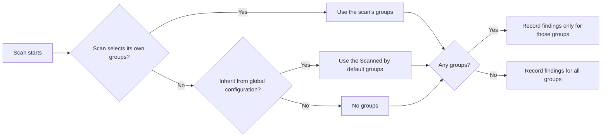

A pattern group is a named set of sensitive data patterns. Groups are the unit a Sensitive data scan works with: when you configure a scan, you pick groups, and the scan keeps findings only for the patterns in those groups. The scan records each finding under both the pattern name and the group name, and the **Sensitive Data Overview** report lets you filter on either.

Access Analyzer ships 11 built-in groups, from **PCI DSS** (Payment Card Industry Data Security Standard) and **HIPAA** (Health Insurance Portability and Accountability Act) to **Credentials** and **PII** (personally identifiable information). They're listed with their patterns in [Built-in patterns](built-in-patterns.md). You can create your own groups for anything the built-in set doesn't capture, such as a group per business unit or per project, and fill them with [custom patterns](custom-patterns.md).

You manage groups in the **Pattern Groups** panel on **Configuration > Sensitive data patterns**. The page needs the Admin role.

## View the patterns in a group

Click a group in the **Pattern Groups** panel. The patterns table filters to that group's patterns and shows **Showing patterns in group** together with the group name. Search and the **Confidence** filter keep working within the group.

Click **Show all patterns** to return to the full list. The **Ungrouped** row works the same way for patterns that belong to no group.

## Create a pattern group

1. Go to **Configuration > Sensitive data patterns**.
2. In the **Pattern Groups** panel, click **New**.
3. In **Name**, enter a name for the group.
4. In **Description**, describe what the group is for.
5. In **Tags**, add any tags you want to attach to the group.
6. Click **Create Group**.

The group appears in the panel without a **Built-in** badge, and a message confirms the save: **Pattern group "`<name>`" created successfully.**

| Field | Required | Details |
|---|---|---|
| **Name** | Yes | 1 to 255 characters. Group names are unique regardless of case, so `hr data` can't coexist with `HR Data`. |
| **Description** | No | Up to 2,000 characters. Shown under the group name in the panel and in the scan's group picker. |
| **Tags** | No | Free-text keywords attached to the group. |

A new group is empty. Add patterns to it with **Manage patterns**, or set the group in a pattern's **Groups** field when you create or edit the pattern.

## Edit a pattern group

1. In the **Pattern Groups** panel, open the group's actions menu.
2. Click **Edit**.
3. Change **Name**, **Description**, or **Tags**.
4. Click **Save Changes**.

**Edit** and **Delete** are disabled for built-in groups. Scans and the default set refer to groups by name. After you rename a custom group, reselect it in any scan that picks its own groups, and check its **Scanned by default** switch.

## Manage the patterns in a group

1. In the **Pattern Groups** panel, open the group's actions menu.
2. Click **Manage patterns**.
3. Under **Add existing patterns**, select one or more patterns in **Select patterns to add**.
4. Click **Add Selected**.
5. To remove a pattern, click the remove icon next to it under **Current patterns**.
6. Click **Close**.

A message confirms each change: **Patterns added to the group.** or **Pattern removed from the group.** Changes apply immediately; there is no separate save.

**Manage patterns** works on custom patterns only, in built-in and custom groups alike. Built-in patterns keep the memberships they ship with, so in a built-in group you can add your own patterns but can't change the built-in ones. A group with nothing added yet shows **No patterns in this group yet.**

:::tip

If a custom pattern you expect isn't offered in **Select patterns to add**, open the pattern with **Edit pattern** and add the group in its **Groups** field instead. Both paths produce the same membership.

:::

## Test a group's patterns

1. In the **Pattern Groups** panel, open the group's actions menu.
2. Click **Test patterns**.
3. Select **Line by line** or **Multiline**.
4. In **Sample text**, paste text that should trigger the group's patterns.
5. Click **Test**.

The **Test Group — `<name>`** dialog shows one highlighted section per pattern in the group, headed by the pattern name, so you can see which patterns fired on which parts of the text. A pattern that fails to compile shows its error in red inside its own section, and the other patterns still run.

A group test shares a single 2-second limit across every pattern in the group, so keep samples short for large groups such as **GDPR** (General Data Protection Regulation). See [Test patterns](index.md#test-patterns) for the modes and result formats.

## Scanned by default

Every group row has a **Scanned by default** switch. Together, the groups with the switch on form the global default set: the groups a Sensitive data scan classifies against when it inherits the global configuration rather than choosing its own.

The switch saves as soon as you turn it on or off, for built-in and custom groups alike. If the save fails, a message reports it: **Failed to update the default scan setting for "`<name>`".**

Turning every switch off doesn't stop classification. A scan that inherits an empty default set classifies against all groups; see [How a scan picks its groups](#how-a-scan-picks-its-groups).

## How a scan picks its groups

On a Sensitive data scan's **Configure** step, the **Sensitive data classification** section has two cards. **Configuration source** holds the **Inherit from global configuration** switch, on for new scans. While it's on, the alert **Using global configuration with `<N>` pattern group(s) enabled.** tells you how many groups the default set holds. Turn it off to pick groups for this scan alone in **Sensitive Data Pattern Groups to Classify**, where you can search, select individual groups, or click **Select All**.

When the scan runs, it resolves its groups like this:

Two things follow from this:

- An empty set means everything, not nothing. If no group is scanned by default and a scan inherits, or a scan overrides with no groups selected, the scan classifies against all groups, built-in and custom.
- The scan matches groups by name. When the set isn't empty, it keeps findings only for patterns in groups with those names, so a scan that names a deleted group records nothing for it.

For the other **Configure** settings and their defaults, see [Scan types](../scans/scan-types.md); for creating, editing, and running a scan, see [Scans](../scans/index.md).

## Delete a pattern group

1. In the **Pattern Groups** panel, open the group's actions menu.
2. Click **Delete**.
3. Confirm the deletion.

A message confirms the deletion: **Pattern group "`<name>`" was deleted successfully.** Deleting a group doesn't delete its patterns: they keep their other memberships, and a pattern with no other group moves to **Ungrouped**. You can't delete built-in groups.

:::warning

You can delete a group even when scans select it or its **Scanned by default** switch is on. A scan whose own selection still names the deleted group records no findings for that name, and if that was its only group, the scan records no findings at all until you edit its group selection.

:::
