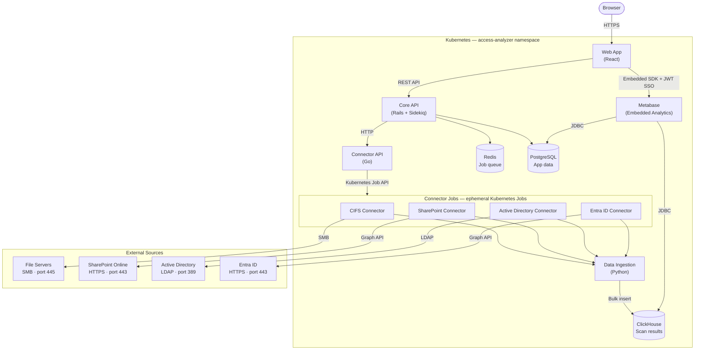

# Overview

## Product Overview

Netwrix Access Analyzer is an on-premises Data Security Posture Management (DSPM) platform that helps security and compliance teams discover where sensitive data lives, who has access to it, and where access risks exist across their environment.

Organizations face a persistent challenge: sensitive data accumulates across file servers, cloud platforms, and identity systems faster than security teams can track it. Permissions expand over time, inheritance gets broken, and stale data sits untouched for years — all without anyone knowing. Access Analyzer addresses this by scanning your data sources and identity providers continuously, classifying what it finds, and surfacing the results in dashboards and reports your team can act on.

Access Analyzer connects to the following source types:

- **File servers** — Scans SMB/CIFS file shares for permissions, folder-level ACLs, file ownership, and sensitive data content
- **SharePoint Online** — Scans SharePoint sites for permissions, sharing links, and sensitive data across document libraries
- **Active Directory** — Syncs users, groups, group memberships, and security risks from on-premises AD domains
- **Entra ID** — Syncs Microsoft Information Protection (MIP) sensitivity labels from your Microsoft 365 tenant

After each scan, results are stored in a high-performance analytics database and made available through embedded Metabase dashboards and reports. Security teams can filter by domain, file server, site, or classification type, and drill into specific findings without writing queries.

## Architecture Overview

Access Analyzer runs entirely within your Kubernetes cluster. All components — the web application, API server, analytics database, and connector jobs — deploy to a single `access-analyzer` namespace. No data leaves your infrastructure.

The platform uses a scan-as-job model: when a scan is triggered, the Connector API creates an ephemeral Kubernetes Job for the connector type (CIFS, SharePoint, Active Directory, or Entra ID). The job runs, connects to the external source, collects data, and streams results to the data ingestion service, which bulk-inserts them into ClickHouse. When the job completes, it posts a webhook back to the Core API to finalize the scan execution record.

### Components

**Web App** — React single-page application served from the cluster. Handles scan management, source configuration, results browsing, and embeds Metabase dashboards via the Metabase SDK using JWT-based single sign-on.

**Core API** — Rails 8 application that exposes the REST API used by the web app. Manages application state in PostgreSQL, queues background jobs through Sidekiq and Redis, and coordinates scan execution by delegating to the Connector API.

**Connector API** — Go service that translates scan requests from the Core API into Kubernetes Job definitions. It creates connector Jobs, monitors their completion, and posts results back to the Core API via webhook.

**Connector Jobs** — Ephemeral Kubernetes Jobs that run the actual scan work. Each connector type (CIFS, SharePoint, Active Directory, Entra ID) is a containerized Python handler. Jobs connect directly to their target source, collect data, and stream rows to the Data Ingestion service in batches. Jobs are created on demand and cleaned up after completion.

**Data Ingestion** — Python service that receives batched rows from connector jobs and bulk-inserts them into ClickHouse. Provides write isolation — connectors never write to ClickHouse directly.

**Metabase** — Embedded analytics platform pre-configured with Access Analyzer dashboards and reports. Connects to both PostgreSQL and ClickHouse via JDBC. Users access Metabase through the web app with no separate login required.

### Data Stores

| Store | Purpose |
|-------|---------|
| **PostgreSQL** | Application data: users, sources, scans, scan executions, service accounts, configuration |
| **ClickHouse** | Scan results: file objects, permissions, ACLs, group memberships, sensitive data findings |
| **Redis** | Sidekiq job queue and session cache for the Core API |
