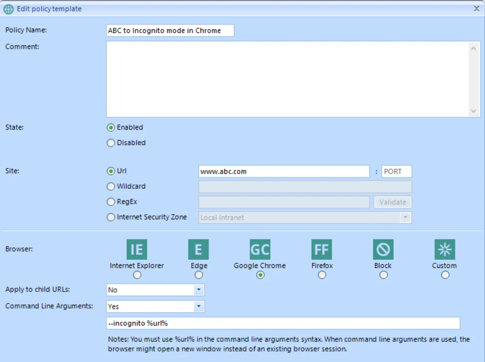
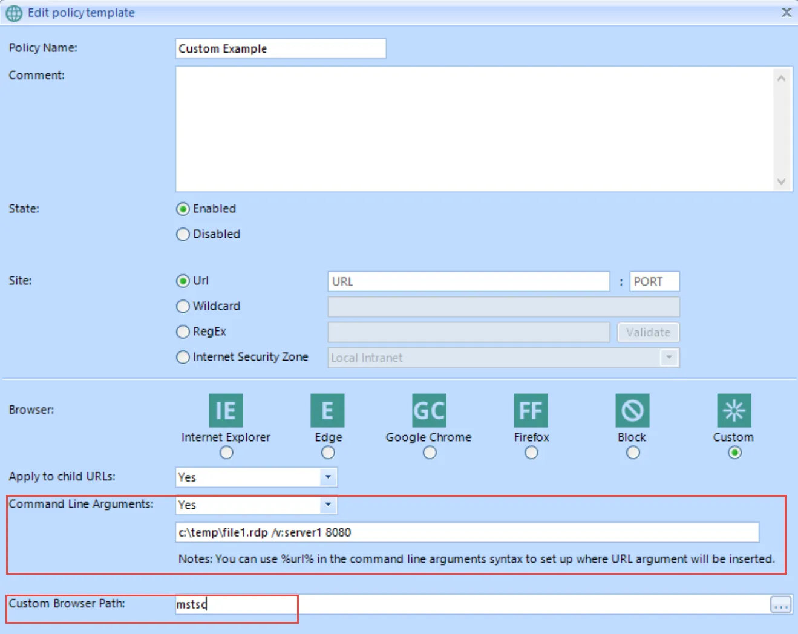

# Using Command Line Arguments

This feature enables you to create a route in situations where you start off in the wrong browser
and want to open up the right browser, with specific options such as  `-incognito` for Chrome and
`-private-window` for Firefox, or launch a custom App-V virtualized Internet Explorer plugin like
this one:

```
-noframemerging /appwe:76d7f387-c5c4-44a9-8982-cca6124a6aec. 
```

Below is an example of launching www.abc.com in Chrome's incognito mode.



Note how you must specifically include **%url%** to specify where the URL will reside on the command
line. Just selecting **incognito** by itself is not enough. The **%url%** will populate the correct
URL, and it is up to you to place it correctly within the command line arguments structure, based on
your needs.

Another use for the **Custom** policy that utilizes command line arguments might be if you want to
launch a specific non-browser application instead of launching an actual browser. For example, one
use might be to launch a Remote Desktop Protocol (RDP) session that calls a remote program, which
would usually be a browser on the RDP machine.

To do this, select **Custom** for the browser type. Then set the **Command Line Arguments** field to
**Yes**. Finally, in the **Custom Browser Path** and **Command Line Arguments** field, specify the
application you want to launch (as in, MSTSC) and the command line arguments to pass (as in,
`c:\temp\file1.rdp /v:server1 8080`).


