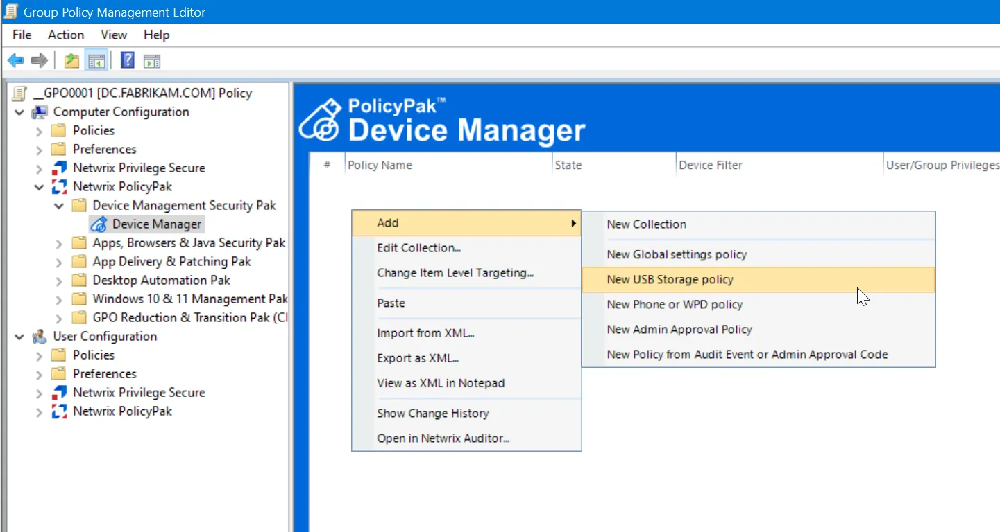
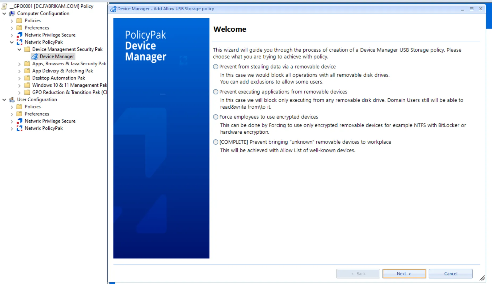
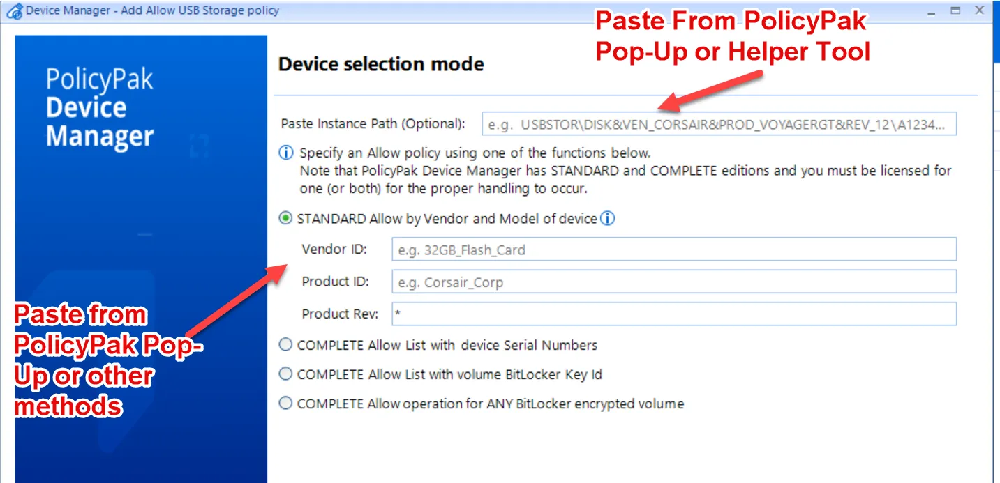
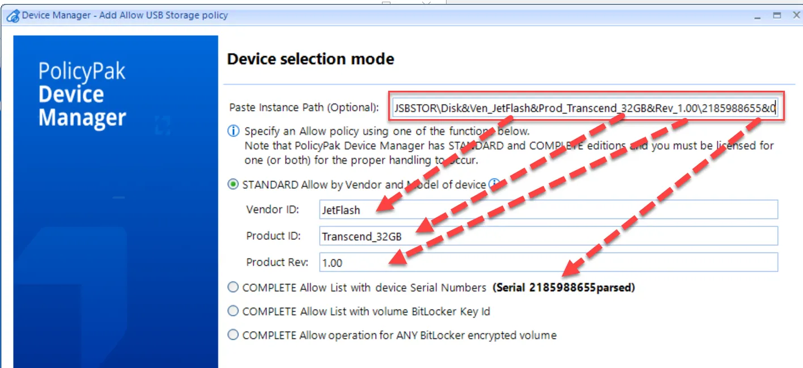
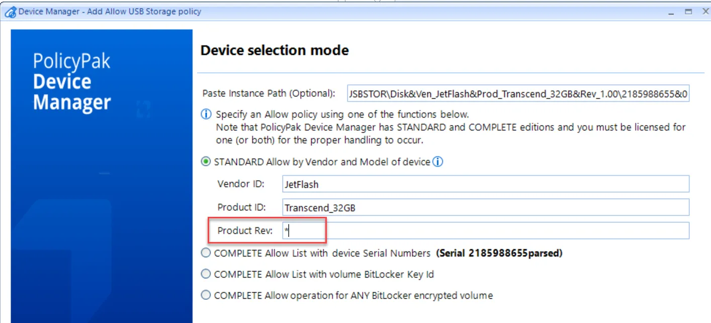
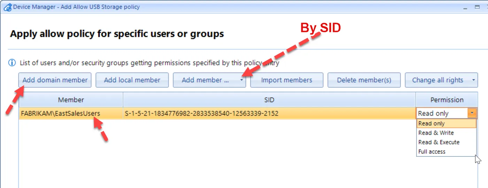
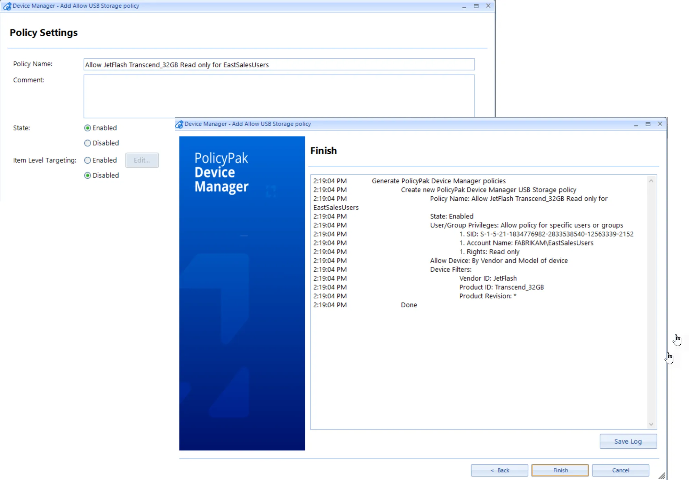
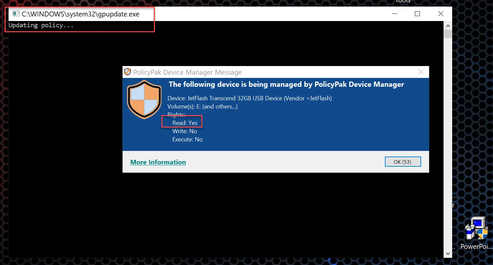
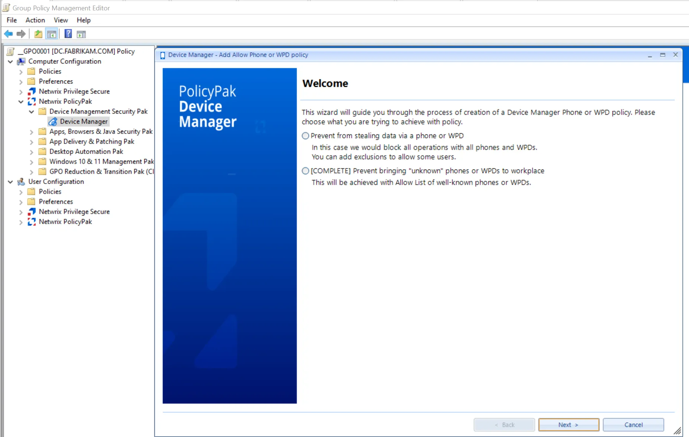

# Device Manager Policies

Now that USB, CD-ROM and Phone devices are all blocked, you may want to configure some policies for
device usage.

There are two main policy types in Endpoint Policy Manager Device Manager besides Global settings
policy:

- USB Storage Policy — Manage USB and CD-ROM / DVD device types
- Phone/WPD Policy — Manage Phone / WPD device types

## USB Storage Policies (for USB and CD-ROMs/DVDs)

In this section you will create USB Storage policies which are suitable for USB and also CD-ROM and
DVDs.



Without a Global Settings policy in place, creating a new USB policy will ask you some questions to
guide you down a path to configure both a Global Settings policy and USB policy at the same time.



With a Global Settings policy already in place, when you create a USB policy, you will be prompted
to select between two options, as shown on the Welcome window. Without going into every permutation
of what's possible in Endpoint Policy Manager Device Manager with regard to USB policy, we will
explore the most popular path, which is Allow Users to use specific devices.


This path lets you configure who will use what devices, and what kind of access will they have on
those devices.

Allow specific devices with details gained from:

- The Pop-Up on the endpoint
- The Endpoint Policy Manager Device Manager Helper Tool
- Other Methods like Windows Device Manager or vendor documentation



The most reliable way to get what you need is either from the Endpoint Policy Manager Pop-Up on the
endpoint or from the Endpoint Policy Manager Device Manager Helper Utility.

This is an example copy/paste from the pop-up as seen earlier:

```
Device Info: Product = Transcend_32GB, Vendor = JetFlash, Revision = 1.00, DevInstPath Serial = 2185988655
Device Instance Path: USBSTOR\Disk&Ven_JetFlash&Prod_Transcend_32GB&Rev_1.00\2185988655&0
Policy Info: GpoName = PPDM with AA, GpoId = D13C5DEE-86D4-40A9-AA1A-7A34CFBCC883, Collection = Device Manager, CollectionId = 5896A6F0-F04D-43DB-BD33-FF3B804920DC
```

The simplest way to populate the Device Selection Mode screen is to take the Device Instance Path
and copy and paste it into the editor. When you do, the Vendor ID, Product ID, Product Rev and
Serial Number are all auto-detected.

:::note
You may ignore the **STANDARD** or **COMPLETE** designations in the Endpoint Policy
Manager Device Manager UI. Typically, Endpoint Policy Manager is sold in Enterprise or SaaS editions
and in those configurations you get **COMPLETE** (meaning all the features).
:::




At this point, you may use:

- Allow by Vendor and Model of device — Must have at least Vendor and Product ID to proceed, and
  this specifies a USB type to continue
- Allow list with device Serial Numbers — Similar to "Vendor and Model of device" but also
  additionally restricts to a specific serial number
- Allow list with volume Bitlocker Key ID — Use the PP Device Manager Helper tool to get the
  Bitlocker Key ID and place here to restrict a specific device
- Allow operation for ANY Bitlocker Encrypted volume — A blanket policy to allow for any Bitlocker
  Encrypted volume

For this walkthrough, we suggest you use: Vendor ID and ProductID and in the Product Rev, you
replace it with a \* meaning all revisions.



On the next screen, you can **Add domain member** meaning an Active Directory user or group.
Alternatively you can select **Add member...** and select a specific SID which can be useful if
you're adding users not-joined to Active Directory, and only using an MDM service.

:::note
To get an overview of how to acquire SIDs with your MDM service and then use them with
Endpoint Policy Manager Device Manager, see the
[How do I get Azure AD SIDs and use them with Item Level Targeting?](/docs/endpointpolicymanager/knowledgebase/gettingstarted/knowledgebase/tipstricksandfaqs/entraidsids.md)
and [Block and Allow USB and CD-ROMs with your MDM solution](/docs/endpointpolicymanager/knowledgebase/devicemanager/videolearningcenter/methods/mdm.md) topics for
additional information.
:::




In this way you're specifying which user gets what permission. For this example, select **Read
Only**.

The next screen lets you give this policy a name, set the state to **Enabled** or **Disabled**,
and/or use **Item Level Targeting**.

The final screen shows the writing of the policy. You can click **Finish**.



After the policy is delivered to the endpoint and refreshed (using GPupdate for domain joined
machines for example), the results can be seen on the endpoint.



Now, reading from this USB is allowed, but other operations (like Write and Execute) will produce
errors.

In this Quickstart you used Vendor and Product ID to allow Read access to a specific user group.
However, as a reminder you may also use Endpoint Policy Manager Device Manager to:

- Allow specific user(s) to use all devices. This is useful if you want some people to have blanked
  access to all devices. Not usually advised. See the
  [Allow ONE user (or group) access to USB and/or CD-ROM and DVDs](/docs/endpointpolicymanager/knowledgebase/devicemanager/videolearningcenter/gettingstarted/usbdriveallowuser.md)
  topic for additional information.
- Allow specific devices based upon Serial Number(s). See the
  [Permit specific devices by serial number](/docs/endpointpolicymanager/knowledgebase/devicemanager/videolearningcenter/gettingstarted/serialnumber.md) topic for
  additional information.
- Allow specific devices based upon BitLocker Key ID (restricts a specific BitLocker device) or
  Allow ANY BitLocker encrypted volume (useful if you just want to make sure users are using
  Bitlocker to keep data always encrypted). See the
  [Restrict access only to Bitlocker drives](/docs/endpointpolicymanager/knowledgebase/devicemanager/videolearningcenter/gettingstarted/bitlockerdrives.md) topic for
  additional information.

## Phone / WPD Policies

WPD stands for Windows Portable Device. WPDS are any kinds of portable storage devices like music
players which may have addressable storage. Phone/WPD policies are only Allow/Deny. There is no way
to dial in the rights to these devices.

:::note
Not every kind of Phone or WPD device may be immediately supported because they sometimes
use protocols which are unexpected. You may open a support case to investigate if we can attempt to
support your unique Phone/WPD device.
:::


If creating a Phone/WPD policy in place with no Global Settings policy, a Wizard will help guide you
to configure both a Global Settings policy and a Phone/WPDpolicy at the same time.



If you already have a Global Settings policy in place, the editor will ask what's seen below, which
is similar to the questions when adding a USB device earlier.

The typical route is Allow Users to use specific phones or other WPDs.


