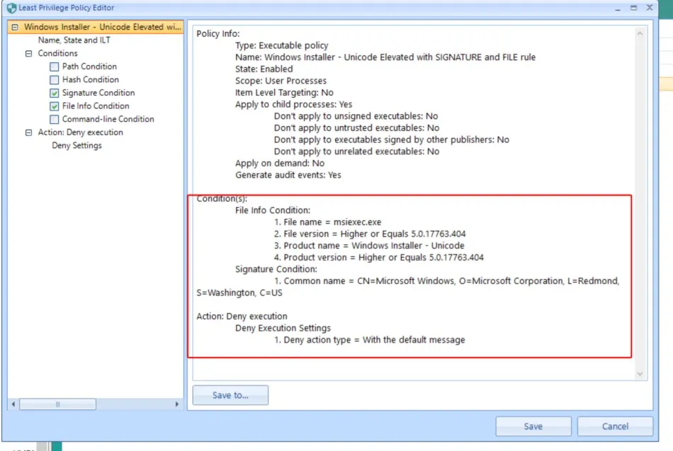
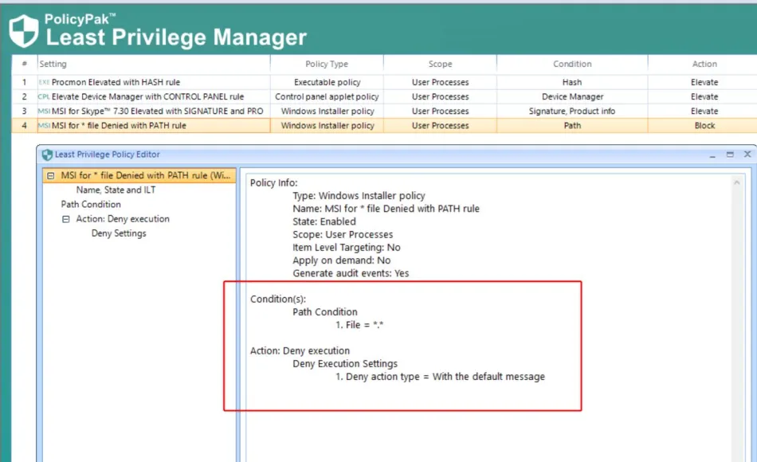
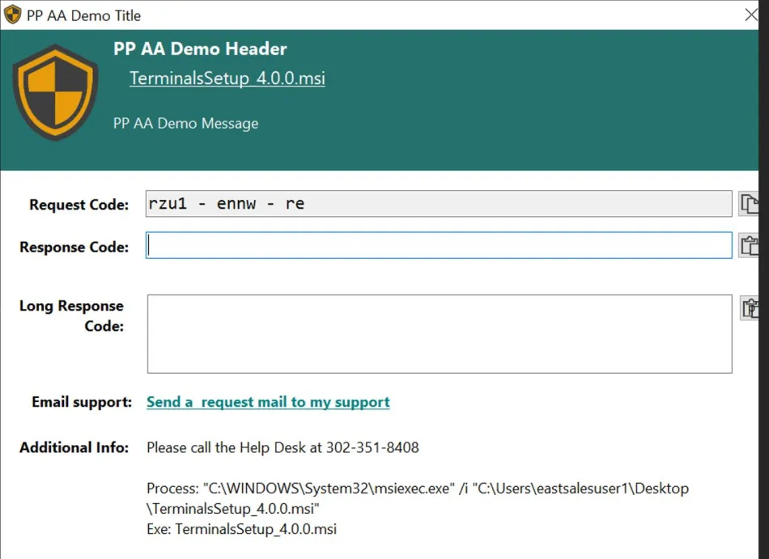

# Why can MSIs be installed from a USB drive when the only access granted to users is READ access

## Problem

Users can install MSI (Windows Installer Packages) from a USB drive where they have only been
granted READ access by the Device Manager.

## Cause

The Endpoint Policy Manager Device manager is working as expected. You can install an MSI from a USB
drive where the user only has READ access because double-clicking (i.e., launching) an MSI is really
only a READ event by C:\Windows\System32\msiexec.exe, which reads the MSI's database contents and
performs the install. MSIEXEC is doing the executing but only requires READ access to the MSI file
in order to do so. In other words, Endpoint Policy Manager DM is a file filter driver which handles
filters. If you give someone READ access, they have the filter to read the file. Then the MSIEXEC
can pick up the ball and run with it.

## Possible Resolutions

In addition to limiting access to the USB drive by using Device Manager, the best way to stop
MSIEXEC is to then use Endpoint Policy Manager Least Privilege Manager (LPM) to block MSIEXEC, since
it is calling the input to the database.

There are a few ways you can do this using Endpoint Policy Manager Least Privilege Manager:

1. You can block MSIEXEC directly from an .EXE rule with a DENY Executable policy.

   

2. You can block all .MSIs with a DENY Windows Installer Policy.

   

3. You can turn on Admin Approval.

   

Why is an extra step in Least Privilege Manager needed? Because Endpoint Policy Manager Least
Privilege Manager is a process driver which handles processes. If you specify what to do on a
process level, Endpoint Policy Manager Least Privilege Manager handles it, including elevation and
blocking.

So, you cannot use Endpoint Policy Manager Device Manager to filter a PROCESS (MSIEXEC), but you
could filter it for NO READ access to files.

You cannot use Endpoint Policy Manager Least Privilege Manager to filter specific files, but you can
filter it to tell MSIEXEC PROCESS what to do.
