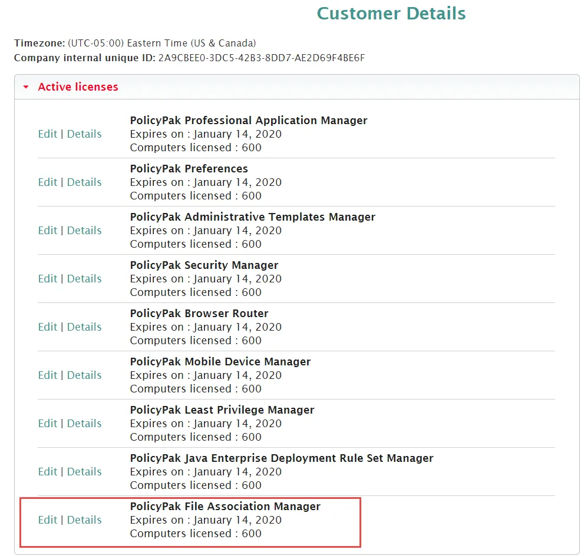
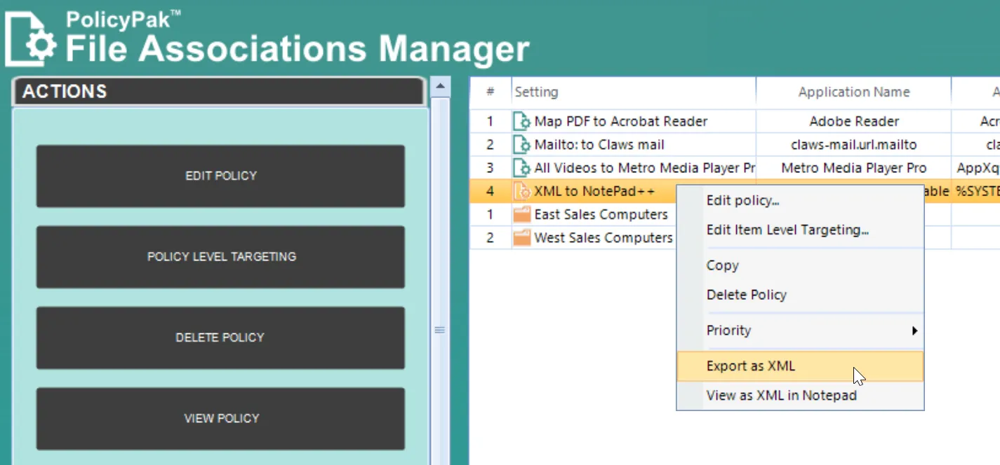

# Exporting Collections

[Using Endpoint Policy Manager with MDM and UEM Tools](/docs/endpointpolicymanager/manuals/introductionandquick/mdm/uemtools/uemtools.md) explains how to use
the Endpoint Policy Manager Exporter to wrap up any Endpoint Policy Manager directives and deliver
them using Microsoft Endpoint Manager (SCCM and Intune), KACE, you own MDM service, or Endpoint
Policy Manager Cloud. However, we recommend NOT using Endpoint Policy Manager File Associations
Manager directives with Endpoint Policy Manager Cloud or an MDM service. This is because Endpoint
Policy Manager File Associations Manager directives cannot work with non-domain-joined machines.
Regardless, all Endpoint Policy Manager Cloud customers are licensed for Endpoint Policy Manager
File Associations Manager, so if you decide to use Endpoint Policy Manager Cloud with some
domain-joined machines, Endpoint Policy Manager File Associations Manager will function as expected
using Endpoint Policy Manager Cloud.

:::note
For a video demonstrating the use of Endpoint Policy Manager Cloud with domain-joined
machines. See the
[Endpoint Policy Manager Cloud and Endpoint Policy Manager OnPremise – Together using PPCloud Licenses](/docs/endpointpolicymanager/knowledgebase/gettingstartedcloud/videolearningcenter/usingwithothermethods/onpremise.md)
topic for additional information.
:::

To export a policy for later use with Endpoint Policy Manager Exporter or Endpoint Policy Manager
Cloud, right-click the collection or the policy, and select **Export to XML**.

:::note
For a video showing how to export policies and how to use Endpoint Policy Manager
Exporter. See the
[Deploying Endpoint Policy Manager directives without Group Policy (Endpoint Policy Manager Exporter Utility)](/docs/endpointpolicymanager/knowledgebase/gettingstartedmdm/videolearningcenter/exportingtips/exporterutility.md)
topic for additional information.
:::

:::note
Exported collections or policies maintain any Item-Level Targeting set within them. If
you've used items that represent Group Membership in Active Directory, then those items will only
function when the machine is domain-joined.

:::
