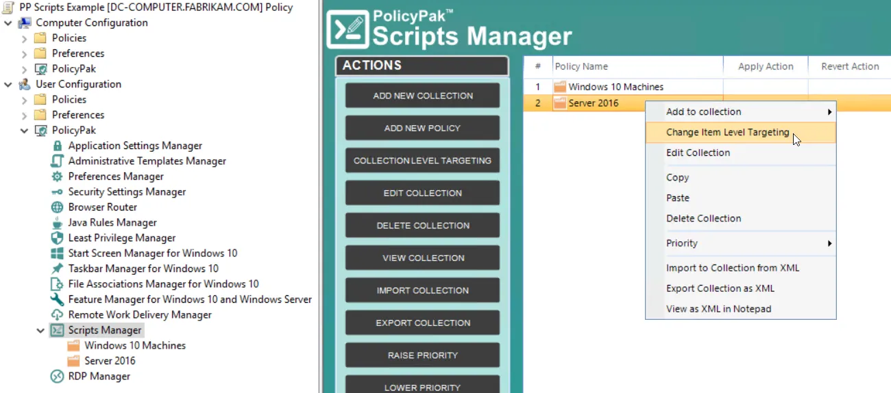
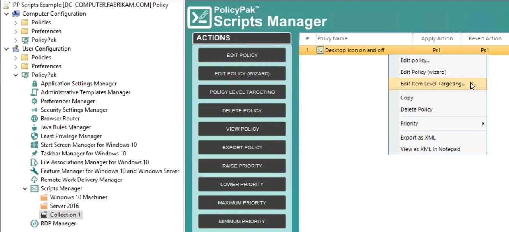
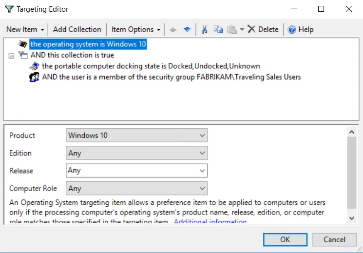
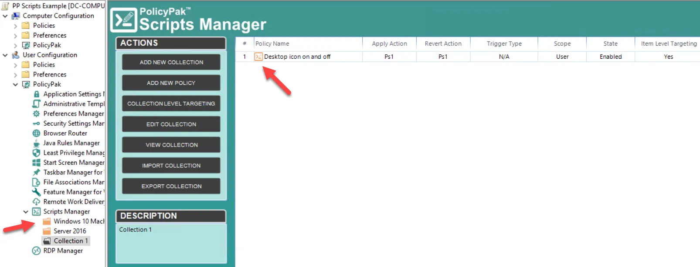

# Using Item-Level Targeting with Collections and Policies

Item-Level Targeting is used in Microsoft Group Policy Preferences and other areas of Netwrix
Endpoint Policy Manager (formerly PolicyPak) to target or filter where specific items will apply.
With Endpoint Policy Manager Scripts & Triggers Manager, Item-Level Targeting can be placed on
collections, as well as Endpoint Policy Manager Scripts & Triggers Manager policies within
collections.

A collection enables you to group together Endpoint Policy Manager Scripts & Triggers Manager
policies so they can act together. For instance, you might create a collection for only East Sales
computers and another for West Sales computers. Or you might create a collection for Windows 10
machines and one for Windows Server 2016 RDS, as seen in Figure 24.

Figure 24. Scripts & Triggers Manger allows the user to create collections and then set Item-Level
Targeting upon the collections.

Right-click any Endpoint Policy Manager Scripts & Triggers Manager policy, and select "Edit Item
Level Targeting," as demonstrated in Figure 25.

Figure 25. Setting Item-Level Targeting for policy entries themselves.

The "Edit Item Level Targeting" menu item brings up the Targeting Editor, which is shown in
Figure 26. You can select any combination of characteristics you want to test for. Administrators
familiar with Group Policy Preferences' Item-Level Targeting will be at home in this interface as it
is functionally equivalent.

You can apply one or more targeting items to a policy, which enables targeting items to be joined
logically, also shown in Figure 26. You can also add targeting collections, which group together
targeting items in much the same way parentheses are used in an equation. In this way, you can
create a complex determination about where a policy will be applied. Collections may be set to
"And", "Or", "Is", or "Is Not."

Figure 26. In this example, the Pak would only apply to Windows 10 machines when the machine is
portable and the user is in the FABRIKAM\Traveling Sales Users group.

Below are some real-world examples of of how you can use Item-Level Targeting.

- Software prerequisites. If you want to configure an application's settings, first make sure the
  application is installed on the user's computer before configuring it. You can use File Match or
  Registry Match targeting items (or both) to verify a specific version of a file or a registry
  entry is present. (For an example of this, look in the Uninstall registry key.)
- Mobile computers. If you want to deploy settings exclusively for users on mobile PCs, then filter
  the rule to apply only to mobile PCs by using the "Portable Computer" targeting item.
- Operating system version. You can specify different settings for applications based on the
  operating system version. To do this, create one rule for each operating system. Then filter each
  rule using the "Operating System" targeting item.
- Group membership. You can link the Group Policy Object (GPO) to the whole domain or organizational
  unit (OU), but only members within a specific group will pick up and process the rule settings.
- IP range. You can specify different settings for various IP ranges, like different settings for
  the home office and each field office.

After editing is completed, close the editor. Note that the icon for the policy or collection has
changed to orange, which shows that it now has Item-Level Targeting, as seen in Figure 27.

Figure 27. When the policy or collection's icon is orange, the entry has Item-Level Targeting.

When Item-Level Targeting is on, the policy won't apply unless the conditions are true. If
Item-Level Targeting is on a collection, then none of the items in the collection will apply unless
the Item-Level Targeting on the collection evaluates to True.
