# Agent

The Endpoint Protector Agent enforces the Rights and Settings received from the Endpoint Protector
Server on the protected endpoints (Windows, Mac, and Linux).

You can download the Endpoint Protector Agent directly from the Endpoint Protector UI. For detailed
information about downloading the Endpoint Protector Agent, refer to the
[Client Software](/docs/endpointprotector/admin/systemconfiguration/overview.md#client-software) topic.

:::note
You can use tools like Active Directory or JAMF to deploy the Endpoint Protector Agent in
large networks.
:::

:::note
Starting with Endpoint Protector Server version 5.8.0.0, an additional security feature is
available to protect the integrity of the Agent. This feature, accessible via Device Control on the
Global Settings page, is known as the Tamper Mode setting. It is designed to prevent unauthorized
termination or modification of the Endpoint Protector Agent.
:::

:::note
When enabling Debug logging, deploying a fresh installation, or during upgrade processes where critical drivers/services (such as DPI, browser plugins, or Outlook add-ins) must be reloaded, it is recommended to restart the operating system. This mandatory first step in troubleshooting ensures that all dependencies are properly initialized."
:::

## Agent install parameters

To improve the Endpoint Protector installation process, use the Endpoint Protector tool that allows
you to run installation-related actions, identify your current Linux distribution, and view Endpoint
Protector Release Notes.

Use the following commands:

- i - install
- u - uninstall
- rn - release notes
- l - distribution list

**Optional CLI commands for installers**

### Windows
You can also apply manual proxy settings using CLI commands:

Example:

msiexec.exe /i "C:\Work\Tools\EPPClientSetup.5.7.1.5_x86_64.msi" /q REBOOT=ReallySuppress
RUNNOTIFIER=0 /log "C:\Windows\TEMP\epp-upgrade.log" WSIP="192.168.18.125"  WSPORT="8080" 
DEPT_CODE="defdep"  PROXYIP="127.0.0.1" PROXYPORT="80" AUTHUSR="user_name" AUTHPASS="password"

Where:

- PROXY_IP – IP of the proxy
- PROXY_PORT – Port of the proxy
- AUTHUSR – Username (if authentication for proxy is needed)
- AUTHPASS – Password (if authentication for proxy is needed)

You can also use CLI Commands below to install Endpoint Protector Client in specific mode of working.

- WSIP – server address
- WSPORT – server port number
- DEPT_CODE – department code
- IPV6MAPPING – IPV6 Mapping IPv4 addresses
- SUPPRESSRD – suppress FileRead/FileDelete events for NS and Removable devices
- DISABLECAP – disabling loading of CAP drivers (CAP will not work)

:::note
Starting with the 2511 Clients release, the install parameters "IPV6MAPPING," "SUPPRESSRD," and "DISABLECAP" will persist during the EPP Client upgrade process.
:::

### macOS
:::note
For macOS, please contact the Netwrix Support team to obtain the latest version of the
installer script, which allows customization of installation parameters.
:::

### Linux

For Linux, you can only use CLI arguments in the options to bypass proxy settings.sh file. To do so,
follow these steps:

**Step 1 –** Access the installation folder, open a Terminal, and run the following command:

`cd pathToLinuxClientFolder`

**Step 2 –** To run commands as root, run the following command and type your password.

`sudo su`

**Step 3 –** Open the options.sh configuration file with the following command:

`gedit options.sh`

**Step 4 –** In the configuration file, you will view the following fields for the proxy setup:

#EPPCLIENT_HTTPS_PROXY=

#export EPPCLIENT_HTTPS_PROXY

**Step 5 –** Remove the # before each entry to apply the proxy setups.

**Step 6 –** For the first proxy setup, EPPCLIENT_HTTPS_PROXY, add the proxy server information in
the address:port:user:password format.

**Example: EPPCLIENT_HTTPS_PROXY=address:port:user:password**

**Step 7 –** Save the changes, and then run the installation without having a VPN connection:

`bash install.sh`

Additional CLI commands for Linux in specific mode:

- #EPPCLIENT_SUPRESSRW - suppress FileRead/FileDelete events for NS and Removable devices
- #EPPCLIENT_DISABLECAP - disabling loading of CAP drivers (CAP will not work)

## Bypass Proxy Settings

You have the ability to bypass proxy settings for all operating systems.

#### Windows and macOS

**Endpoint Protector Wizard Installer**

Select the option to **Use Manual Proxy Settings** from the Endpoint Protector Wizard installer and
then provide the following information:

- Proxy IP – IP of the proxy server
- Proxy Port – Port of the proxy
- Select the Use authentication checkbox
- Username – add proxy server username
- Password – add proxy server password

## Agent Installation

To see which distributions are supported for EPP, please check the [supportability article](/docs/endpointprotector/supportability/client-supportability.md).

For Windows and Mac, your input in installing the Endpoint Protector Agent is minimal. The
Installation folder and Server information are already pre-configured, and downloadable from the
Endpoint Protector Server.

:::note
For Linux installation instructions, read the readmeLinux.txt file available under the Read
this before installing link.
:::

The main supported Linux distributions are listed below:

- Ubuntu
- RedHat

Optional distributions will be provided on the product portal and are available upon request after validation by the Netwrix Product Team. Below are examples of on-demand distributions:
- Debian
- Fedora
- Pardus OS
- AWS Linux
- OpenSUSE
- SUSE
- SLED Linux Enterprise Server

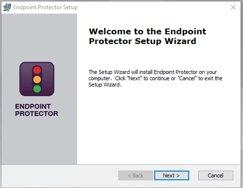

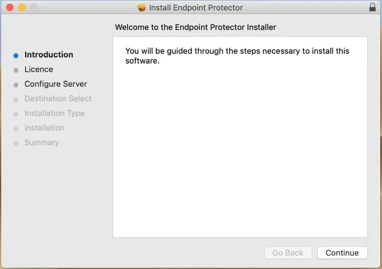

### Installation on macOS with Deep Packet Inspection and VPN Traffic Intercept Active

Follow the steps to install on macOS with Deep Packet Inspection and VPN Traffic Intercept active.

**Step 1 –** Open the Endpoint Protector Server.

**Step 2 –** Go to the **System configuration** section, select **Client Software** and then download
the macOS Endpoint Protector Agent.

**Step 3 –** Decompress the downloaded file.

**Step 4 –** Open the **.pkg** file and follow the installation steps and give the requested
permissions.

**Step 5 –** After the installation is complete, go to **System Preferences** > **Security &
Privacy** > **Privacy tab** > **Full Disk Access**. Search for Endpoint Protector Client, select the
checkbox, and then **save** the changes.

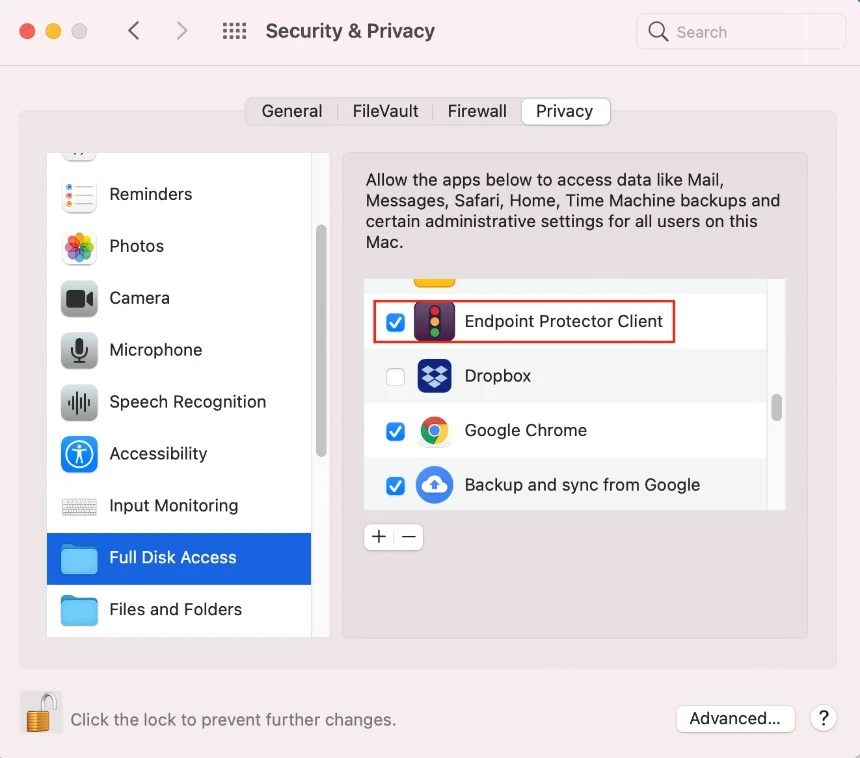

**Step 6 –** Open the Endpoint Protector Server and activate Deep Packet Inspection by navigating to
**Device Control** > **Users/Computer/Group/Global Settings** > **Manage Settings** > **Endpoint
Protector Client** > **Deep Packet Inspection**.

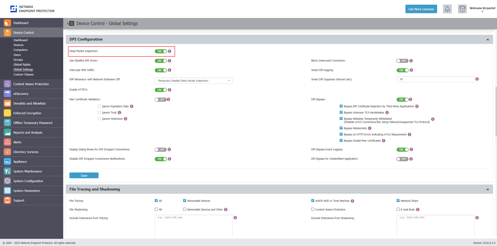

:::note
For more information about Deep Packet Inspection and configurable options, please visit the dedicated [documentation section for DPI](/docs/endpointprotector/admin/cap_module/deeppacket.md).
:::

**Step 7 –** Go to the **System Configuration** section, then **System Settings** > **Deep Packet
Inspection Certificate**, and download the **CA Certificate**.

**Step 8 –** Open the **Keychain Access** application from your macOS and select **System**.

**Step 9 –** Decompress the downloaded **ClientCerts** file.

**Step 10 –** Select **cacert.pem** file and drag and drop it on **System > Keychain Access**.

**Step 11 –** Double-click the **X** on the newly added certificate and on the Trust section, select
**Always Trust**.

**Step 12 –** **Save** the changes.

**Step 13 –** Activate **Intercept VPN Traffic**.

**Step 14 –** Select one option for **EPP behavior when network extension is disabled**.

- Temporarily Disable Deep Packet Inspection – this option will temporary disable Deep Packet
  Inspection
- Block Internet Access – this option will end the Internet connection until the end-user approves
  the Endpoint Protector Proxy Configuration once the computer is rebooted.

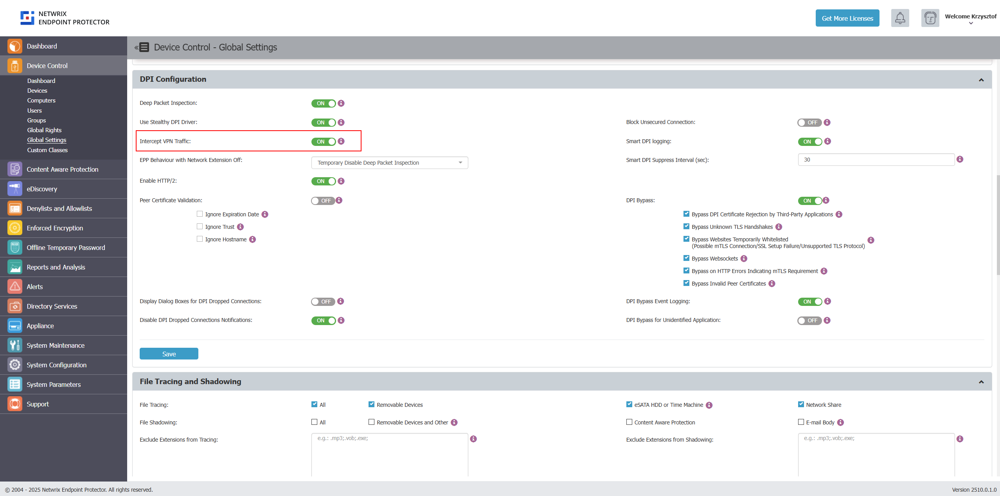

**Step 15 –** **Save** the changes.

**Step 16 –** The following pop-up will be displayed informing the end-user that a System Extension
is blocked and needs to be allowed.

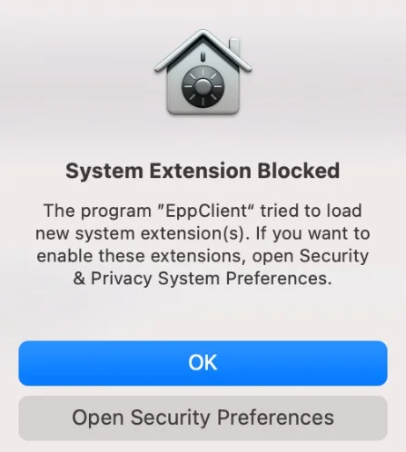

**Step 17 –** Go to **System Preferences** > **Security and Privacy** > select the **General tab**
and **allow** the Endpoint Protector Client Extension.

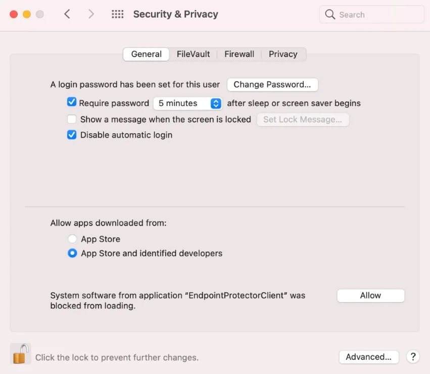

**Step 18 –** **Allow** the Endpoint Protector Proxy Configuration from the pop-up window.

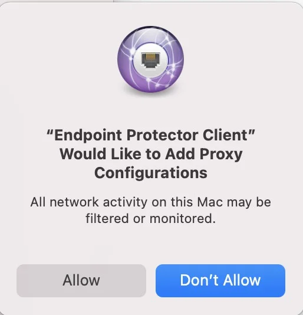

At this point, the macOS Endpoint Protector Client installation is completed.

:::note
If EPPNotifier is not visible or notifications do not display after the installation or
upgrade of the Endpoint Protector Client on macOS, please resolve this issue by restarting your
machine. In situations where the Endpoint Protector Client is installed and then uninstalled on
macOS, you may still see EPPNotifier in the Notification settings. To remove it from the list, simply
right-click and select "Reset notifications."
:::

### Debian Based Distributions

While the installation process is similar, each distribution and version have their own
particularities.

The following are several examples of supported distributions:

- Ubuntu
- LinuxMint
- Debian

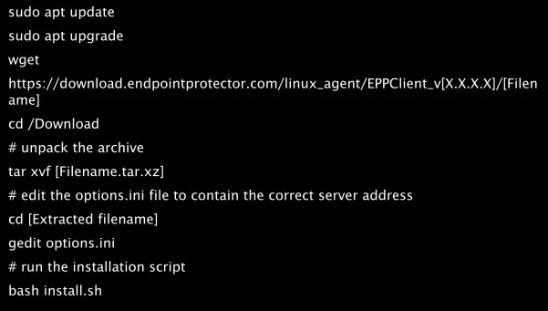

### RedHat based distributions

While the installation process is similar, each distribution and version have their own
particularities.

The following are several examples of supported distributions:

- CentOS
- RedHat
- Fedora
- AWS Linux 2

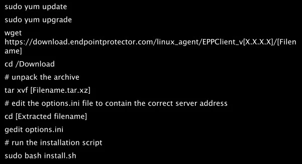

- OpenSuse
- SUSE
- SLED Linux Enterprise Server

#### Setting the Server IP

For all RedHat-based distributions, you need to follow an additional step after executing the above
commands in order to set the Endpoint Protector Server IP.

Based on each distribution, follow the corresponding method:

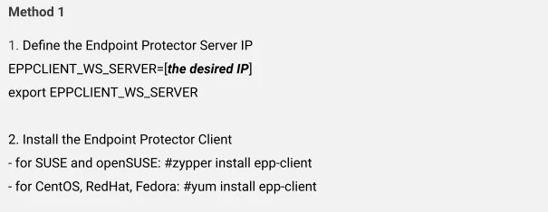

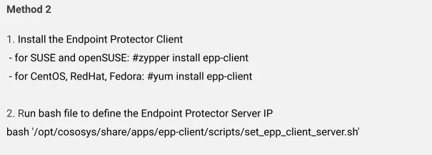

## The Windows Subsystem for Linux

The Windows Subsystem for Linux (WSL) allows you to run native Linux distributions directly within
your Windows environment. However, due to its nature, the Endpoint Protector Client cannot be
directly installed as an application within WSL.

While direct installation is not possible, you can still manage and control the usage of WSL
applications through the Application Denylist feature in Endpoint Protector. This allows you to
define specific applications or processes associated with WSL that you want to restrict and monitor.

Follow the steps to use use Denylists to control WSL applications.

**Step 1 –** Navigate to the [Denylists and Allowlists](/docs/endpointprotector/admin/denylistsallowlists/overview.md)
section within the Endpoint Protector Console.

**Step 2 –** Create a new **Denylist entry**.

**Step 3 –** In the **Application Name field**, specify the WSL application you want to control.
This could be:

- `wsl *` – This wildcard entry will match all WSL applications.
- `wsl.exe` – This entry will specifically target the `wsl.exe` executable.
- `wsl.exe --help` – This entry will target the specific command `wsl.exe --help`.
- `wsl --list`– This entry will target the `wsl --list` command.

:::note
Endpoint Protector Client cannot directly control the usage of WSL Bash command-line tools
on Windows.

:::
