# Agent

The Endpoint Protector Agent enforces the Rights and Settings it receives from the Endpoint Protector
Server on the protected endpoints (Windows, Mac, and Linux).

You can download the Endpoint Protector Agent directly from the Endpoint Protector UI. For detailed
information about downloading the Endpoint Protector Agent, refer to the
[Client Software](/docs/endpointprotector/admin/systemconfiguration/overview.md#client-software) topic.

:::note
You can use tools like Active Directory or JAMF to deploy the Endpoint Protector Agent in
large networks.
:::


:::note
Starting with Endpoint Protector Server version 5.8.0.0, an additional security feature is
available to protect the integrity of the Agent. This feature, accessible via Device Control on the
Global Settings page, is the Tamper Mode setting. It prevents unauthorized
termination or modification of the Endpoint Protector Agent.
:::

:::note
When enabling Debug logging, deploying a fresh installation, or during upgrade processes that require a reload of critical drivers/services (such as Deep Packet Inspection (DPI), browser plugins, or Outlook add-ins), restart the operating system. This mandatory first step in troubleshooting ensures that all dependencies initialize properly.
:::

## Lightweight, Cross-Platform Architecture

The Endpoint Protector Agent doesn't require OS kernel-level integration. This reduces the risk of
conflicts with other security software, such as antivirus, endpoint detection and response (EDR), and
host-based intrusion prevention system (HIPS) solutions, and keeps the
Agent's footprint on the endpoint to a minimum.

### Kernel Independence

The Agent doesn't inject kernel-level drivers or extensions on Windows, macOS, or Linux. This avoids
the stability and compatibility risks associated with kernel-mode components, such as system crashes
from driver conflicts or extension issues after an OS update.

On Linux specifically, the Agent doesn't depend on Dynamic Kernel Module Support (DKMS) or require a
rebuild after each kernel update. This removes the operational risk of endpoint protection breaking
after a routine kernel update — a common problem with kernel-module-based agents.

### Cross-OS Feature Parity

The Agent maintains feature parity across Windows, macOS, and Linux for Device Control (DC),
Content Aware Protection (CAP), and eDiscovery. The Enforced Encryption Client, which provides FIPS
140-3 validated removable media encryption, offers full parity between Windows and macOS.

Netwrix designs Endpoint Protector for full feature parity across Windows, macOS, and Linux from
initial release, rather than treating Linux as a delayed follow-up to Windows and macOS support. The
only differences between operating systems are in the specific applications that content inspection
covers, since the native applications and file-handling behaviors on each OS are inherently
platform-specific.

### Processor Architecture Support

The EPP Client supports both x86-64 and ARM64 processor architectures across Windows, macOS, and Linux:

- **Windows** — x86-64 and ARM64 (Windows on ARM)
- **macOS** — x86-64 (Intel) and ARM64 (Apple Silicon)
- **Linux** — x86-64 and ARM64 (RHEL 10.x and Ubuntu 26.04)

This gives Netwrix consistent endpoint coverage as organizations adopt ARM-based hardware, such as Apple Silicon Macs, Windows on ARM devices, and ARM-based Linux servers.

## Agent Installation

To see which distributions EPP supports, check the [supportability article](/docs/endpointprotector/supportability/client-supportability.md).

For Windows and Mac, installing the Endpoint Protector Agent requires minimal input. The
installation folder and server information come pre-configured, and you can download the Agent from
the Endpoint Protector Server.

:::note
For Linux installation instructions, read the readmeLinux.txt file available under the Read this before installing link.
:::

The main supported Linux distributions include:
- Ubuntu
- RedHat

:::note
For Ubuntu-based distributions outside the officially tested and certified list, such as Mint Linux, and RHEL-based distributions such as Rocky Linux, Oracle Linux, or CentOS, the EPP Client installer built for the corresponding base version generally works without additional configuration. In some cases, the Linux administrator might need to manually adjust dependencies to match the base distribution. For installation steps, see [Linux](/docs/endpointprotector/admin/agent.md#linux) install guide under Agent Install Parameters in the Agent documentation.
:::

Netwrix provides optional distributions on the product portal upon request, after the Netwrix Product Team validates them. The following are examples of on-demand distributions:
- Debian
- Fedora
- Pardus OS
- AWS Linux
- OpenSUSE
- SUSE
- SLED Linux Enterprise Server

Beyond this list, Netwrix can also build a Client for the latest version of other custom Linux distributions on request, as a **Feature Request (FR)** through Netwrix Support. Netwrix Product Management reviews and prioritizes these requests, which may involve a billable service. For details, see [Linux Clients](/docs/endpointprotector/supportability/client-supportability.md#linux-clients) in the Netwrix Endpoint Protector Agent Support Policy.

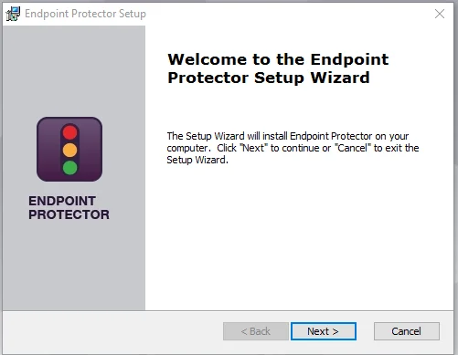

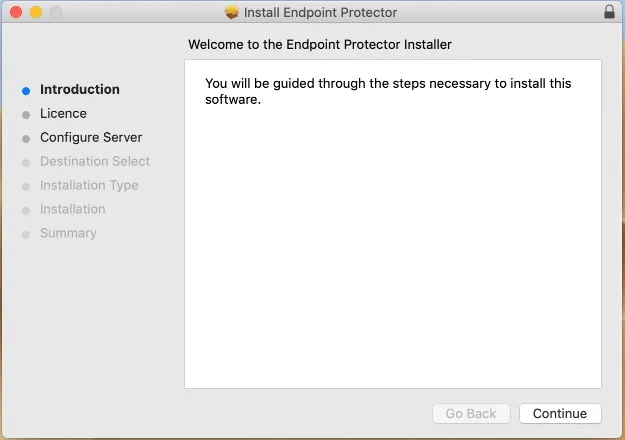


### Agent install parameters

To improve the Endpoint Protector installation process, use the Endpoint Protector tool to run
installation-related actions, identify your current Linux distribution, and view Endpoint
Protector Release Notes.

Use the following commands:

- i - install
- u - uninstall
- rn - release notes
- l - distribution list
 
**Optional CLI commands for installers**


#### Windows
You can also apply manual proxy settings using CLI commands:

Example:

```
msiexec.exe /i "C:\Work\Tools\EPPClientSetup.5.7.1.5_x86_64.msi" /q REBOOT=ReallySuppress RUNNOTIFIER=0 /log "C:\Windows\TEMP\epp-upgrade.log" WSIP="192.168.18.125" WSPORT="8080" DEPT_CODE="defdep" PROXYIP="127.0.0.1" PROXYPORT="80" AUTHUSR="user_name" AUTHPASS="password"
```

Where:

- PROXYIP – IP of the proxy
- PROXYPORT – Port of the proxy
- AUTHUSR – Username (if the proxy requires authentication)
- AUTHPASS – Password (if the proxy requires authentication)

You can also use the following CLI commands to install Endpoint Protector Client in a specific working mode.

- WSIP – server address
- WSPORT – server port number
- DEPT_CODE – department code
- IPV6MAPPING – IPV6 Mapping IPv4 addresses
- SUPPRESSRD – suppress FileRead/FileDelete events for NS and Removable devices
- DISABLECAP – disabling loading of CAP drivers (CAP will not work)

:::note
Starting with the 2511 Clients release, the install parameters "IPV6MAPPING," "SUPPRESSRD," and "DISABLECAP" will persist during the EPP Client upgrade process.
:::

#### macOS
:::note
For macOS, contact the Netwrix Support team to obtain the latest version of the
installer script, which lets you customize installation parameters.
:::


#### Linux

For Linux, you can use CLI arguments only in the options.sh file to bypass proxy settings. To do so,
follow these steps:

**Step 1 –** Access the installation folder, open a Terminal, and run the following command:

`cd pathToLinuxClientFolder`

**Step 2 –** To run commands as root, run the following command and enter your password.

`sudo su`

**Step 3 –** Open the options.sh configuration file with the following command:

`gedit options.sh`

**Step 4 –** In the configuration file, you see the following fields for the proxy setup:

#EPPCLIENT_HTTPS_PROXY=

#export EPPCLIENT_HTTPS_PROXY

**Step 5 –** Remove the # before each entry to apply the proxy setups.

**Step 6 –** For the first proxy setup, EPPCLIENT_HTTPS_PROXY, add the proxy server information in
the address:port:user:password format.

**Example: EPPCLIENT_HTTPS_PROXY=address:port:user:password**

**Step 7 –** Save the changes, and then run the installation without a VPN connection:

`bash install.sh`

Additional CLI commands for Linux in specific mode:

- #EPPCLIENT_SUPRESSRW - suppress FileRead/FileDelete events for NS and Removable devices
- #EPPCLIENT_DISABLECAP - disabling loading of CAP drivers (CAP will not work)

### Bypass Proxy Settings

You can bypass proxy settings for all operating systems.

#### Windows and macOS

**Endpoint Protector Wizard Installer**

Select the option to **Use Manual Proxy Settings** from the Endpoint Protector Wizard installer and
then provide the following information:

- Proxy IP – IP of the proxy server
- Proxy Port – Port of the proxy
- Select the Use authentication checkbox
- Username – add proxy server username
- Password – add proxy server password

### Increased Communication Security

During interactive installation, the installer wizard includes an **Increased Communication Security** checkbox. When you enable it, the EPP Client uses certificate-based authentication during the registration process and for all subsequent communication with the EPP Server.
This option corresponds to the **Client Registration Certificate** feature configured on the server side. Before enabling it, ensure that you deployed a cryptographic identity signed by the EPP Root CA to the endpoint and that it appears in **Certificate Manager** under *Local Computer → Certificates → Personal*.


:::note
This option requires you to enable and configure the **Client Registration Certificate** feature on the EPP Server ([**Appliance → Server Maintenance → Client Registration Certificate**](/docs/endpointprotector/admin/appliance.md)) before you install the client. Enabling it without the corresponding server-side configuration prevents the client from registering.
:::


### Installation on macOS with Deep Packet Inspection and VPN Traffic Intercept Active

To install on macOS with Deep Packet Inspection and VPN Traffic Intercept active, complete the following steps:

**Step 1 –** Open the Endpoint Protector Server.

**Step 2 –** Go to the **System configuration** section, select **Client Software** and then download
the macOS Endpoint Protector Agent.

**Step 3 –** Decompress the downloaded file.


**Step 4 –** Open the **.pkg** file, follow the installation steps, and grant the requested
permissions.

**Step 5 –** After the installation is complete, go to **System Preferences** > **Security &
Privacy** > **Privacy tab** > **Full Disk Access**. Search for Endpoint Protector Client, select the
checkbox, and then **save** the changes.

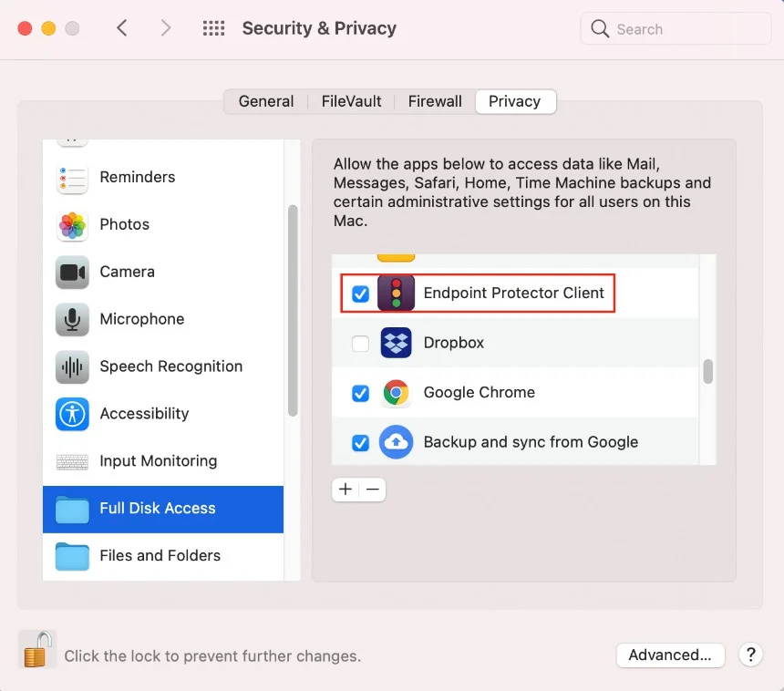

**Step 6 –** Open the Endpoint Protector Server and activate Deep Packet Inspection by navigating to
**Device Control** > **Users/Computer/Group/Global Settings** > **Manage Settings** > **Endpoint
Protector Client** > **Deep Packet Inspection**.

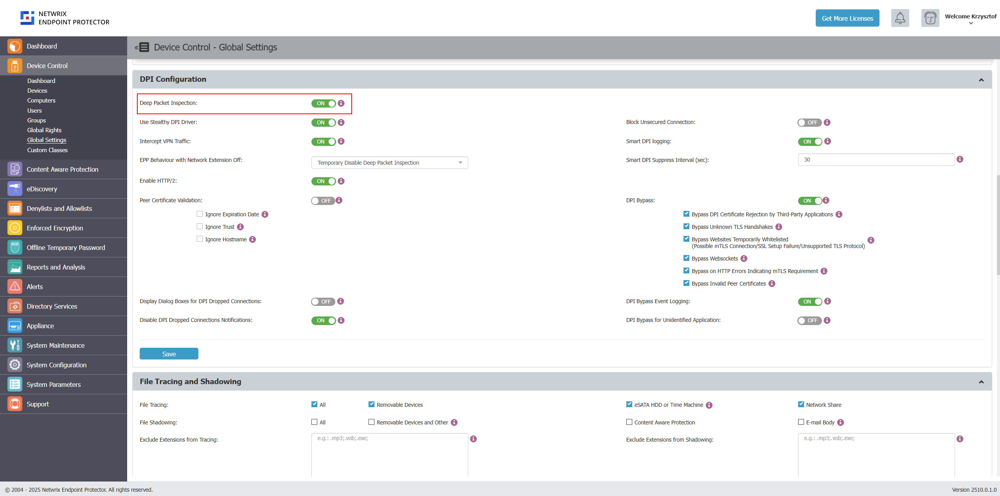

:::note
To learn about Deep Packet Inspection and its configurable options, see the [documentation section for DPI](/docs/endpointprotector/admin/cap_module/deeppacket.md).
:::

**Step 7 –** Go to the **System Configuration** section, then **System Settings** > **Deep Packet
Inspection Certificate**, and download the **CA Certificate**.


**Step 8 –** Open the **Keychain Access** application from your macOS and select **System**.

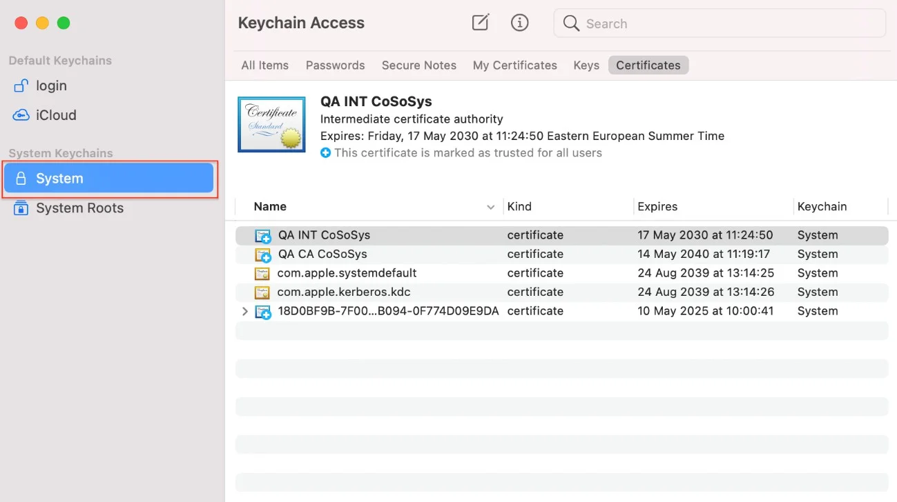

**Step 9 –** Decompress the downloaded **ClientCerts** file.

**Step 10 –** Select **cacert.pem** file and drag and drop it on **System > Keychain Access**.

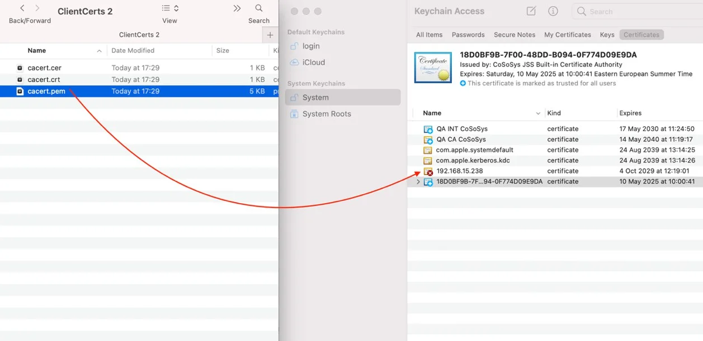

**Step 11 –** Double-click the **X** on the newly added certificate and on the Trust section, select
**Always Trust**.


**Step 12 –** **Save** the changes.

**Step 13 –** Activate **Intercept VPN Traffic**.

**Step 14 –** Select one option for **EPP behavior when network extension is disabled**.

- Temporarily Disable Deep Packet Inspection – this option temporarily disables Deep Packet
  Inspection
- Block Internet Access – this option ends the Internet connection until the end user approves
  the Endpoint Protector Proxy Configuration after restarting the computer.

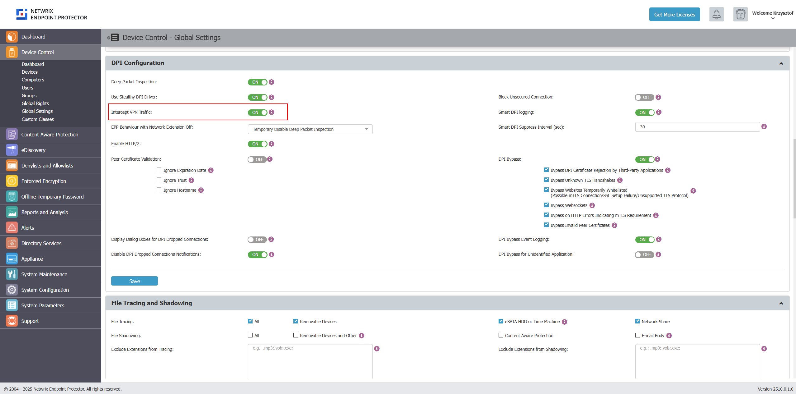

**Step 15 –** **Save** the changes.

**Step 16 –** The following pop-up displays, informing the end user that macOS blocked a System
Extension and that the user must allow it.

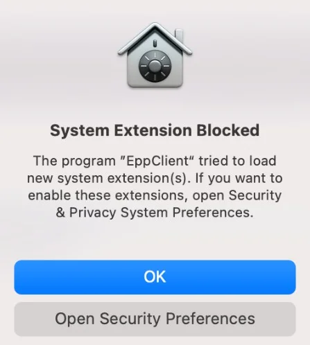

**Step 17 –** Go to **System Preferences** > **Security and Privacy** > select the **General tab**
and **allow** the Endpoint Protector Client Extension.

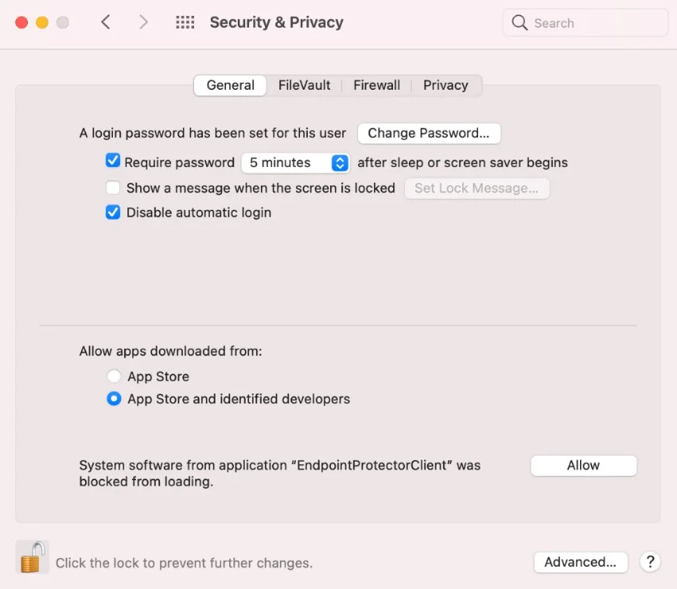

**Step 18 –** **Allow** the Endpoint Protector Proxy Configuration from the pop-up window.

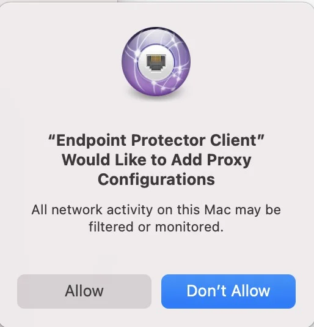

The macOS Endpoint Protector Client installation is now complete.

:::note
If EPPNotifier isn't visible or notifications don't display after the installation or
upgrade of the Endpoint Protector Client on macOS, resolve this issue by restarting your
machine. If you install and then uninstall the Endpoint Protector Client on
macOS, you may still see EPPNotifier in the Notification settings. To remove it from the list,
right-click and select "Reset notifications."
:::

### Debian Based Distributions

While the installation process is similar, each distribution and version have their own
particularities.

The following are several examples of supported distributions:

- Ubuntu
- Debian

:::note
Ubuntu-based distributions like Mint Linux generally work without additional configuration when you use the EPP Client installer built for the corresponding Ubuntu base version. For example, Mint Linux 22.3 might work with the EPP installer for Ubuntu 24.04 LTS. In some cases, the Linux administrator might need to manually adjust dependencies to match the base distribution.
:::

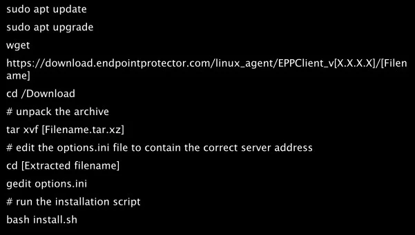

### RedHat based distributions

While the installation process is similar, each distribution and version have their own
particularities.

The following are several examples of supported distributions:
- RedHat
- Fedora
- AWS Linux 2

:::note
RedHat (RHEL)-based distributions like Rocky Linux, Oracle Linux, and CentOS generally work without additional configuration when you use the EPP Client installer built for the corresponding RHEL base version. For example, Oracle Linux 10.1 might work with the EPP installer for RHEL 10.1. In some cases, the Linux administrator might need to manually adjust dependencies to match the base distribution.
:::

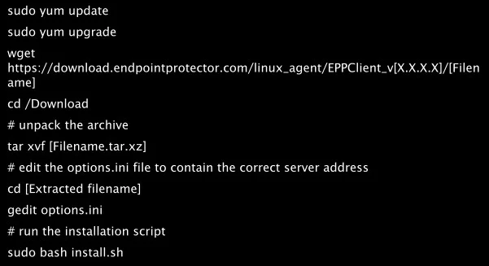

- OpenSuse
- SUSE
- SLED Linux Enterprise Server

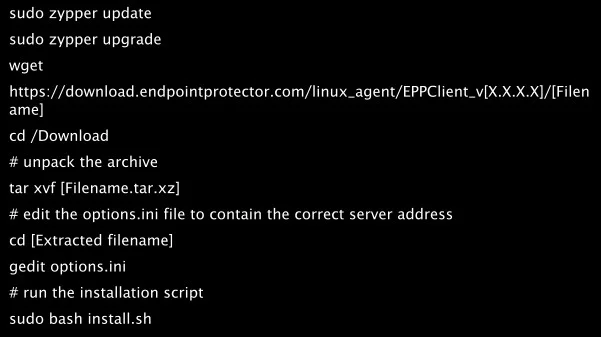

#### Setting the Server IP

For all RedHat-based distributions, after you run these commands, complete one additional step to
set the Endpoint Protector Server IP.

Based on each distribution, follow the corresponding method:

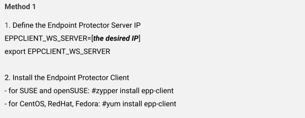

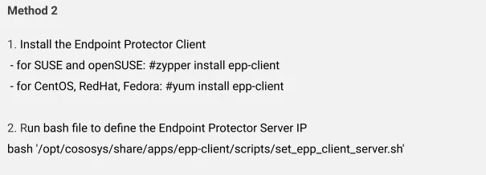

## WSL - Windows Subsystem for Linux

With the Windows Subsystem for Linux (WSL), you can run native Linux distributions directly within your Windows environment. 

### WSL1

You can't install the Endpoint Protector Client directly as an application within WSL.

While direct installation isn't possible, you can still manage and control the usage of WSL
applications through the Application Denylist feature in Endpoint Protector. With this feature, you can
define specific applications or processes associated with WSL that you want to restrict and monitor.

To use Denylists to control WSL applications, complete the following steps:

**Step 1 –** Navigate to the [Denylists and Allowlists](/docs/endpointprotector/admin/denylistsallowlists/overview.md)
section within the Endpoint Protector Console.

**Step 2 –** Create a new **Denylist entry**.

**Step 3 –** In the **Application Name field**, specify the WSL application you want to control.
This could be:

- `wsl *` – This wildcard entry will match all WSL applications.
- `wsl.exe` – This entry will specifically target the `wsl.exe` executable.
- `wsl.exe --help` – This entry will target the specific command `wsl.exe --help`.
- `wsl --list`– This entry will target the `wsl --list` command.

:::note
Endpoint Protector Client can't directly control the usage of WSL Bash command-line tools
on Windows.
:::

### WSL2

WSL2 lets you start a lightweight virtual machine with a specific Linux distribution, and offers two options for controlling it:

- Configure an Application Denylist, as with [WSL1](#wsl1), to block WSL2 usage entirely.
- Deploy a dedicated Linux EPP Client inside the WSL2 Linux machine to gain EPP visibility into it.
  The EPP Server treats the installed instance as a separate machine, which lets you apply
  more granular policies.

:::note
Netwrix has only tested Ubuntu 26.04 (ARM and x64) and RHEL 10 (x64) in its lab.
:::

## EPP Client Integrity Checks

This article explains key EPP Client behaviors related to integrity checking, policy synchronization, and service termination. It covers how the EPP Client validates itself at startup, how it communicates and downloads policy changes, and how it classifies and reports different types of client termination.

### Client Integrity Check Overview

The Client Integrity check runs automatically at EPP service/daemon startup. It verifies two things:

- The existence of all expected EPP component files on the endpoint.
- The validity of file signatures *(signature validation applies to Windows only)*.

If the check passes without issue, the EPP Client reports the status as **Client Integrity OK**, confirming all EPP component files are present and their signatures are valid (on Windows).

If the check fails for any reason, the EPP Client reports a **Client Integrity Failure** event in the EPP Server.

### File Existence vs. Missing Installation File

When the daemon starts, it checks that all expected files are present and reports any that are missing. Two related terms you may encounter:

| Term | Meaning |
|---|---|
| **Install files** | The full set of files that should be present on the endpoint after a successful EPP Client installation. |
| **Installation file missing** | The startup check couldn't find one or more expected files. This condition triggers a Client Integrity Failure event. |

## Tamper mode

Tamper mode provides increased self-protection for the EPP Client. When you disable tamper mode, the EPP Client relies on standard self-protection mechanisms: watchdog, service auto-restart, and Client Integrity checks. When you enable tamper mode, the EPP Client also blocks unauthorized termination and modification.

With tamper mode enabled:

- EPP Client installation folders on Windows and macOS have restricted access.
- The EPP Client prevents unauthorized actors from unloading processes on Windows and daemons on macOS.

To enable tamper mode, see [Client Mode](./dc_module/globalsettings.md#client-mode).

:::note
Requires EPP Client version 2605 hotfix 1 or later (2605.x.2.x) for the full feature set.
:::

## Policy Received Events

### How Policy Synchronization Works

Each time the EPP Client communicates with the EPP Server, it presents the hash of its current configuration XML. The server compares this hash against the current expected configuration:

- If the hashes **match**, the server takes no action.
- If the hashes **differ**, the server exposes the updated configuration with a new hash for the client to download, and raises a **Policy Received** event. The EPP Client then automatically downloads and applies the new settings.

Any change to Computer or User settings — including configuration items, rights, or policies — modifies the configuration XML and its hash, which triggers this process.

## Client Termination Event Types

### How the EPP Client Classifies Termination

If the EPP Client service didn't stop cleanly, the agent evaluates the state of relevant files, registry keys, and drivers to determine what happened. Based on the results, the agent reports one of three events:

| Event Type | Condition & Meaning |
|---|---|
| **Unplanned Client Termination** | All files, registry keys, and drivers are intact. The service stopped or terminated unexpectedly, with no signs of tampering or removal. |
| **Forced Uninstall Attempt** | The service stopped or terminated, and one or more files, registry keys, or drivers are in an unexpected state — indicating a partial or unauthorized removal attempt. |
| **Uninstall Attempt** | Someone deliberately initiated an uninstall of the EPP Client — either directly on the endpoint (e.g. via Add/Remove Programs) or remotely from the EPP Server using the **Uninstall Client** action. |

The EPP Client agent reports these three event types, which appear in the EPP Server event log for the relevant endpoint.
