# Alerts

From this section, you can define E-mail Alerts for the main events detected by Endpoint Protector:
System Alerts, Device Control Alerts, Content Aware Alerts, and Enforced Encryption Alerts.

:::note
Before creating alerts, make sure the Endpoint Protector E-mail Server Settings have been
configured from the System Configuration, System Settings section. You also have the option to verify
these settings by sending a test E-mail.
:::

For each Administrator to appear in the list of recipients for the Alerts, this has to be provided
under the Administrator details from the System Configuration, System Administrators section.

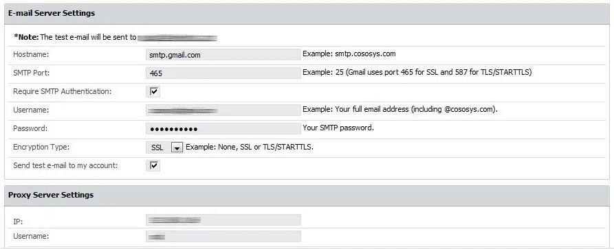

## System Alerts

From this section, you can create system alerts, including APNS certificate expiry, updates and
support expiry, endpoint licenses used, etc.

### Creating a System Alert

Follow the steps to add a new Alert.

**Step 1 –** Click **Create**, provide the required information and then click **Save**.

- Event – select the type of event that generates the alert
- Updates and Support – set an alert regarding each module’s maintenance status (Device Control,
  Content Aware Protection, and eDiscovery)

    :::note
    You can disable the Update and Support system alert from General Dashboard, System
    Status.
    :::

- Endpoint Licenses – set an alert to be notified of the percentage of used Endpoint Licenses and
  eliminate the risks of having unprotected endpoints as each network is constantly growing. Define
  alerts when the percentage of used Endpoint Licenses reaches 70%, 80%, or 90%.
- Client Uninstall – set an alert each time an Endpoint Protector Client is uninstalled for better
  management of an extensive network. This is particularly helpful when there are several assigned
  Administrators.
- Server Disk Space – set an alert to be notified of the Server Disk Space status and ensure Server
  Disk Space remains available for logs to be stored and policies are correctly applied.
- Define alerts when disk space reaches 70%, 80%, or 90% and then select the monitored partitions
  from the available root, epp and boot.
- Device Control – Logs Amount – set an alert each time the Number of Device Control Logs Stored
  reaches a specific amount. Select from the available intervals or define a custom value.
- Content Aware – Logs Amount –set an alert each time the Number of Content Aware Logs Stored
  reaches a specific amount. Select from the available intervals or define a custom value.
- Password Expiration – set an alert to be notified when a password is about to expire. Define the
  alert using the 10, 5, or 1 day options.
- Not Seen Online – set an alert each time a protected endpoint has not been seen online in the
  specific timeframe. Select an option from the available intervals or define a custom interval. This
  alert can also identify computers where the Endpoint Protector Client might have been uninstalled.
- Unplanned Client Termination – set an alert to identify when a user tries to terminate the
  Endpoint Protector process.

**Step 2 –** Alert Name – Add a name for the alert.

**Step 3 –** Options –Based on the type of alert you selected, define the alert using the additional
options.

**Step 4 –** Administrators - Select the Administrators that will receive the alerts.

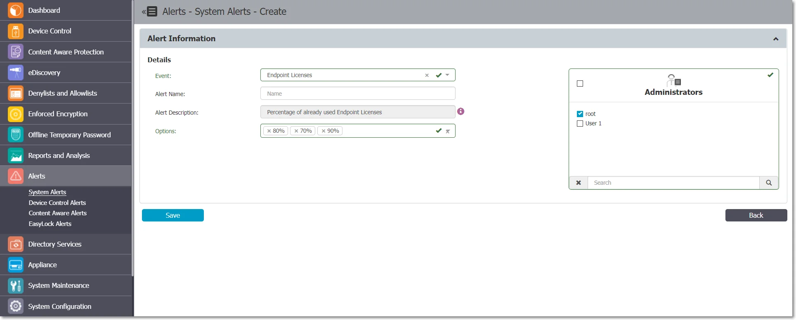

### System Alerts History

From this section, you can view a history of the System Alerts. Alerts that are no longer needed for
auditing purposes can later be deleted.

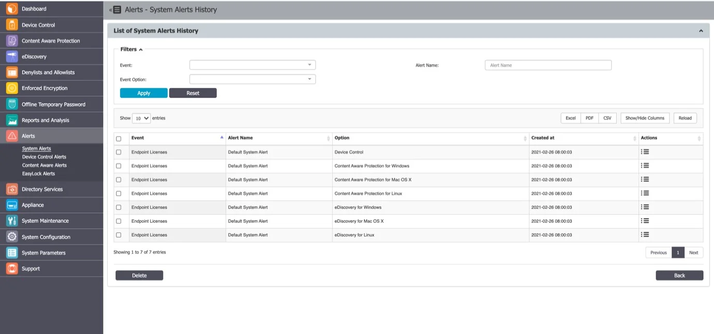

## Device Control Alerts

From this section, you can create Device Control alerts, for events such as Connected, File Read,
File Write, Enforced Encryption – successfully deployed, etc.

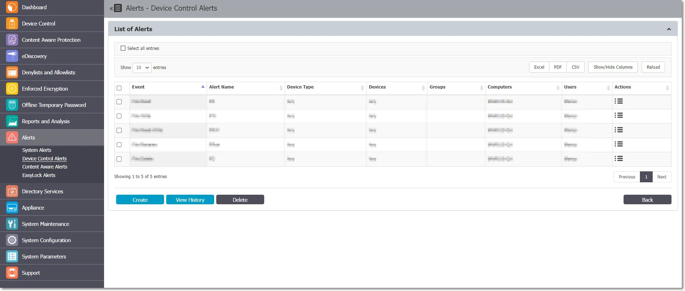

### Creating a Device Control Alert

To add a new device control alert, click **Create**, provide the required information, and then
click **Save**.

- Event – select the event type that generates the alert;
- Alerts Name – add a name for the alert;
- Device Type – select the device type from the drop-down list of available devices;
- Devices – select the specific device already available in the system;
- Monitored Entities – select the Groups, Computers, or Users that generate the event;
- Administrators – select the Administrators that will receive the alerts.

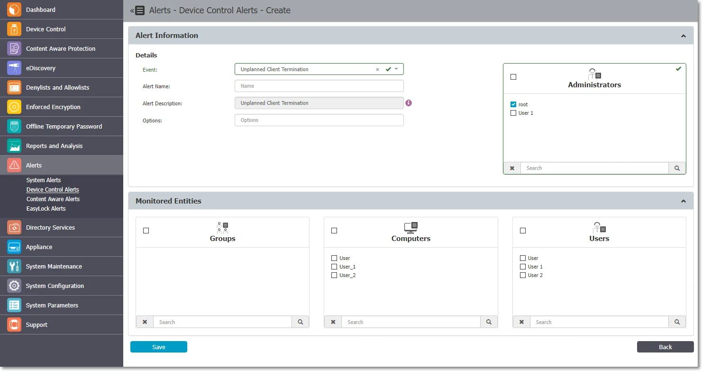

### Device Control Alerts History

From this section, you can view a history of the Device Control Alerts. Alerts that are no longer
needed for auditing purposes can later be deleted.

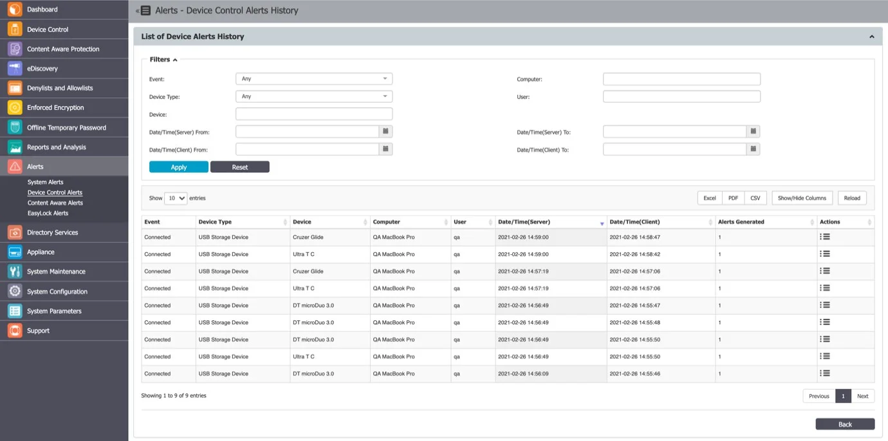

## Content Aware Alerts

From this section, you can create Content Aware alerts, for events such as Content Threat Detected
or Content Threat Blocked.

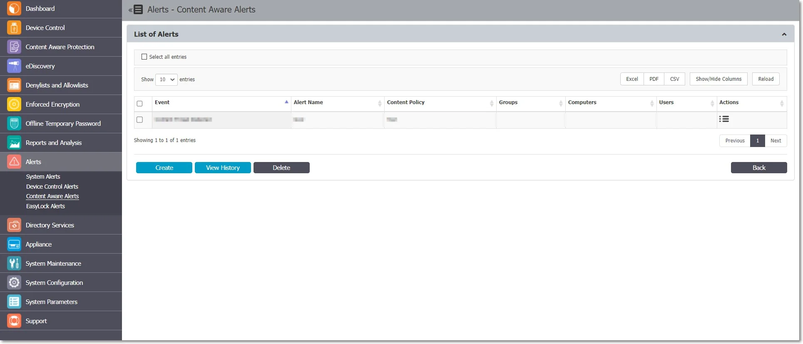

### Creating a Content Aware Alert

Follow the steps to create a content aware alert.

**Step 1 –** To add a new Alert, click **Create** and provide the information required.

- Event - the event type that generates the alert (Content Threat Detected or Content Threat
  Blocked)

    - Content Threat DetectedDPI bypasswhitelist
    - Content Threat Blocked
    - Content Remediation Session Active
    - Content Remediation Request Canceled by User
    - DPI Bypassed Traffic

- Alerts Name – Add a name for the alert.
- Content Policy – Select a policy to apply the alert (this field is not available if you select DPI
  Bypass Traffic event).
- Administrators – Select the Administrators that will receive the alerts.
- Monitored Entities – Select the Groups, Computers, or Users that generate the event .

**Step 2 –** Click **Save**.

The alert sent on the email will also include a CSV file with a report of the threats found.

:::note
Before creating the alert, ensure the selected Content Aware Policy is enabled on the
chosen Computer, User, Group, or Department.
:::

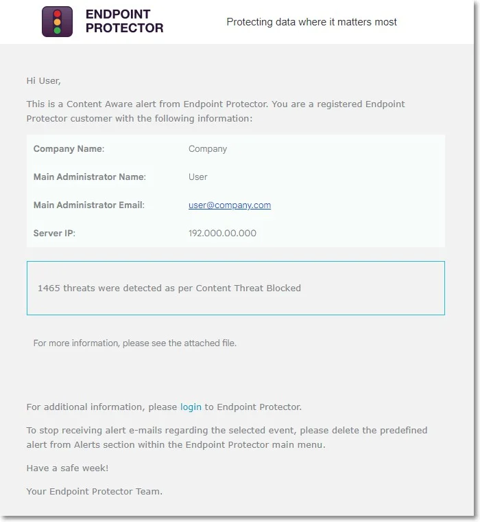

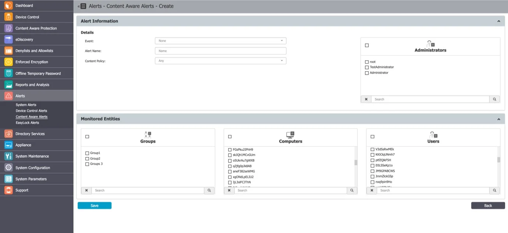

### Content Aware Alerts History

From this section, you can view a history of the Content Aware Alerts. Alerts that are no longer
needed for auditing purposes can later be deleted.

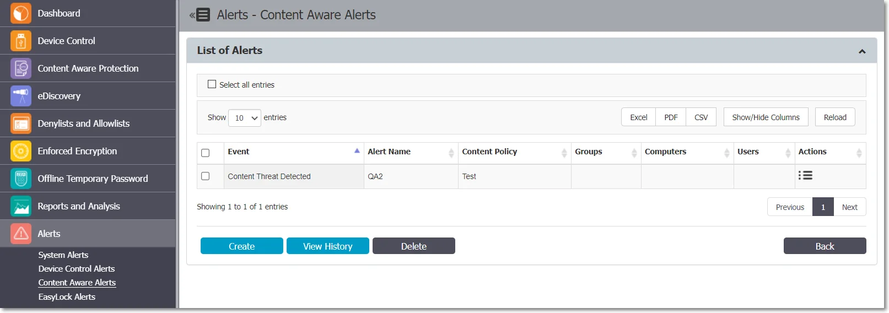

## Enforced Encryption Alert

From this section, you can create Enforced Encryption alerts, for events such as password changes,
messages sent, etc.

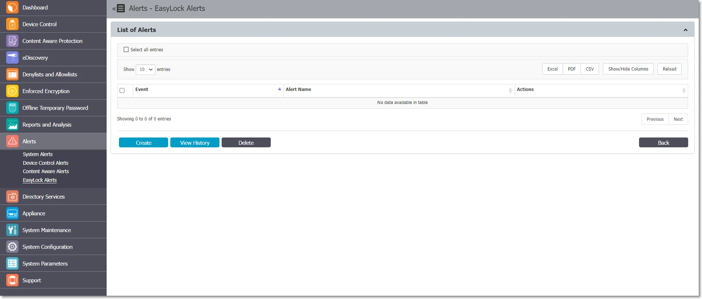

### Creating an Enforced Encryption Alert

Follow the steps to create an enforced encryption alert.

**Step 1 –** Click **Create** and provide the required information.

- Event – Select the type of event that generates the alert

    - Send Message
    - Change Master Password
    - Change User’s Password
    - Reset Device
    - Change Settings – Installation and Execution
    - Re-deploy Client
    - Master Password Login Success
    - Password Login Failure
    - Password Login Exceeded

- Alerts Name – Add a name for the alert.
- Administrators - Select the Administrators that will receive the alerts.

**Step 2 –** Click **Save**.

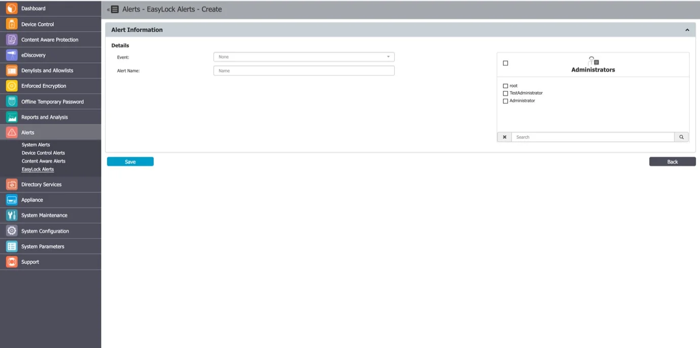

### Enforced Encryption Alert History

From this section, you can view the history of the Enforced Encryption Alerts. Alerts that are no
longer needed for auditing purposes can later be deleted.

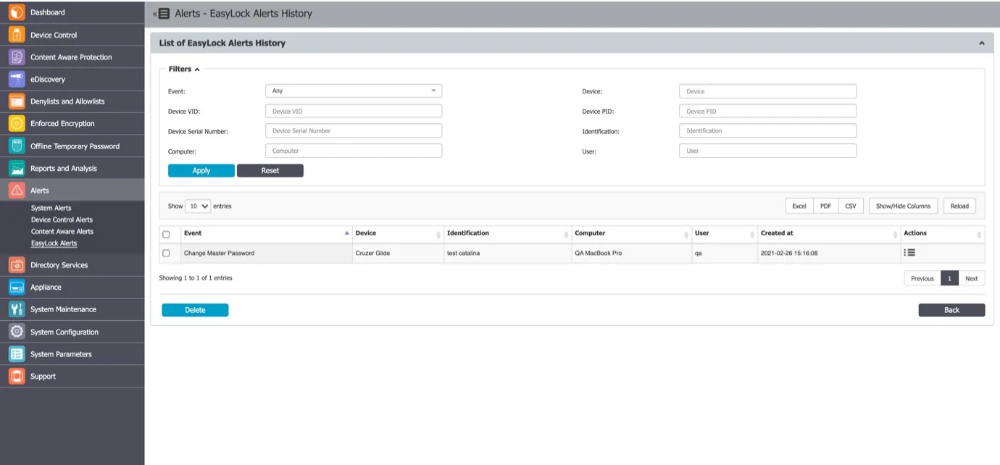
