# Alerts

From this section, you can define email alerts for the main events detected by Endpoint Protector:
System Alerts, Device Control Alerts, Content Aware Alerts, Enforced Encryption Alerts, and Log Alerts.

:::note
Before creating alerts, ensure the Endpoint Protector email server settings have been
configured from **System Configuration** > **System Settings**. You can verify
these settings by sending a test email.
:::

For each administrator to appear in the list of recipients for alerts, an email address must be provided
under the administrator details from **System Configuration** > **System Administrators**.

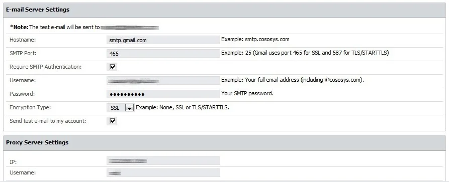

## System alerts

From this section, you can create system alerts, including APNS certificate expiry, updates and
support expiry, endpoint licenses used, and others.

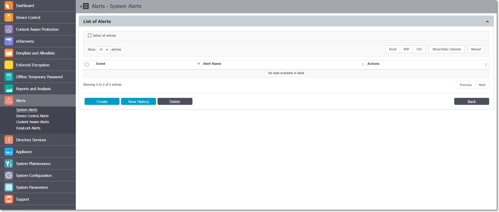

### Create a system alert

1. Click **Create**, provide the required information, and then click **Save**.

   - **Event**—select the type of event that generates the alert:
     - **Updates and Support**—set an alert regarding each module's maintenance status (Device Control, Content Aware Protection, and eDiscovery)
     - **Endpoint Licenses**—set an alert to be notified when the percentage of used Endpoint Licenses reaches 70%, 80%, or 90%
     - **Client Uninstall**—set an alert each time an Endpoint Protector Client is uninstalled
     - **Server Disk Space**—set an alert to be notified when disk space reaches 70%, 80%, or 90%. Select the monitored partitions from the available root, epp, and boot options
     - **Device Control – Logs Amount**—set an alert when the number of Device Control logs stored reaches a specific amount
     - **Content Aware – Logs Amount**—set an alert when the number of Content Aware logs stored reaches a specific amount
     - **Password Expiration**—set an alert when a password is about to expire (10, 5, or 1 day before expiration)
     - **Not Seen Online**—set an alert when a protected endpoint hasn't been seen online within the specified timeframe
     - **Unplanned Client Termination**—set an alert when a user tries to terminate the Endpoint Protector process

   :::note
   You can disable the Update and Support system alert from **General Dashboard** > **System Status**.
   :::

2. Enter an **Alert Name**.
3. Configure the alert options based on the event type you selected.
4. Select the **Administrators** who will receive the alerts.

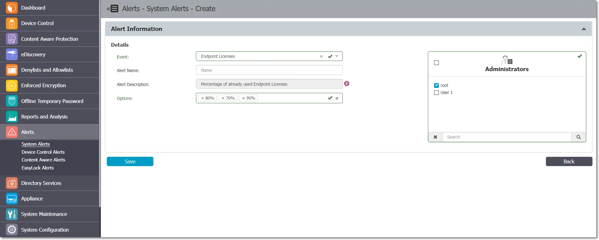

### System alerts history

From this section, you can view a history of the system alerts. Delete alerts that are no longer needed for
auditing purposes.

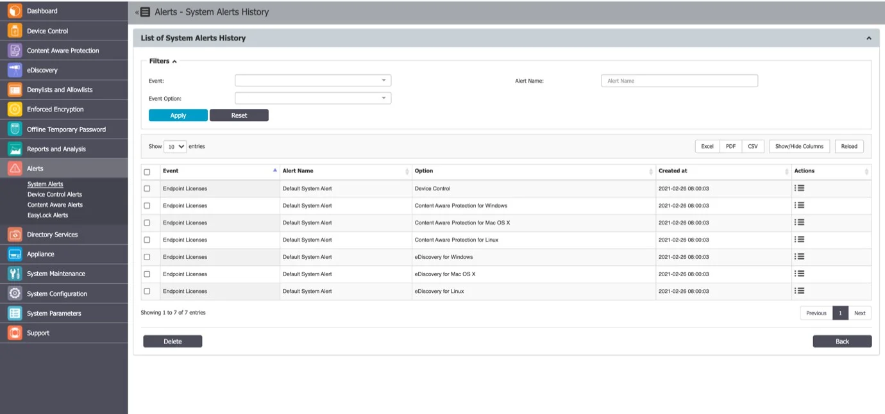

## Device Control alerts

From this section, you can create Device Control alerts for events such as Connected, File Read,
File Write, and Enforced Encryption successfully deployed.

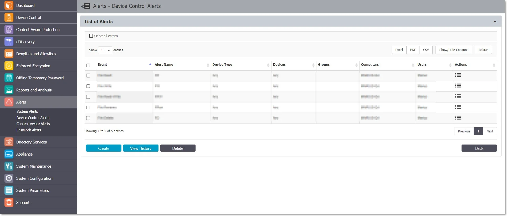

### Create a Device Control alert

1. Click **Create** and provide the required information:
   - **Event**—select the event type that generates the alert
   - **Alert Name**—enter a name for the alert
   - **Device Type**—select the device type from the drop-down list
   - **Devices**—select the specific device already available in the system
   - **Monitored Entities**—select the groups, computers, or users that generate the event
   - **Administrators**—select the administrators who will receive the alerts
2. Click **Save**.

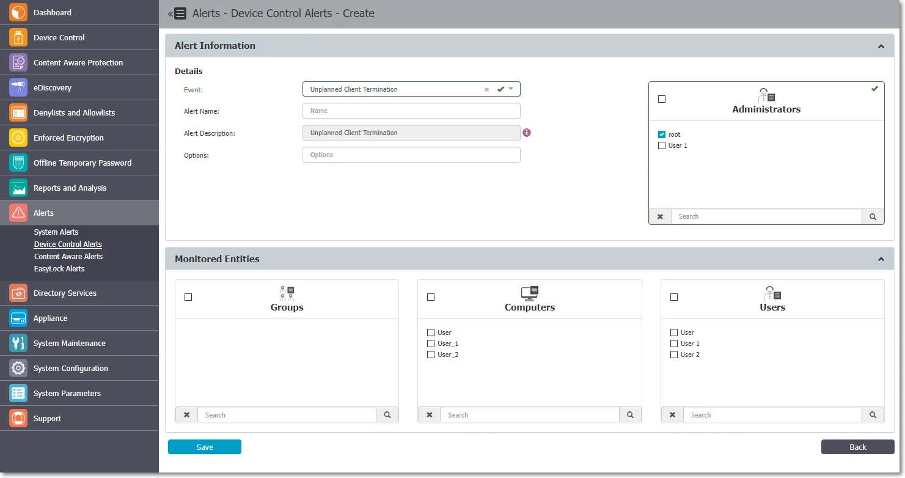

### Device Control alerts history

From this section, you can view a history of the Device Control alerts. Delete alerts that are no longer
needed for auditing purposes.

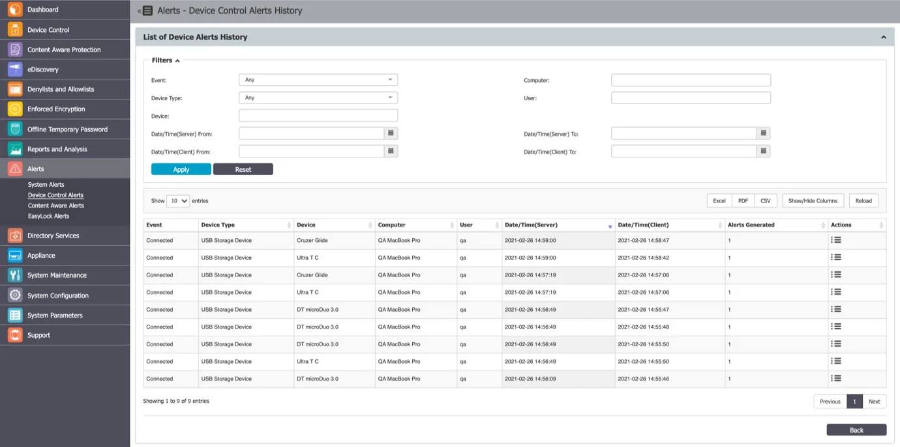

## Content Aware alerts

From this section, you can create Content Aware alerts for events such as Content Threat Detected
or Content Threat Blocked.

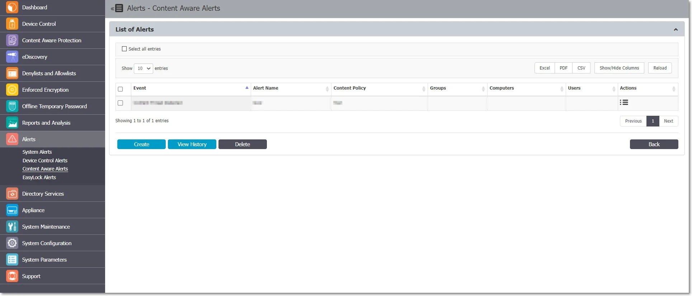

### Create a Content Aware alert

1. Click **Create** and provide the required information:
   - **Event**—select the event type (Content Threat Detected, Content Threat Blocked, Content Remediation Session Active, Content Remediation Request Canceled by User, or DPI Bypassed Traffic)
   - **Alert Name**—enter a name for the alert
   - **Content Policy**—select a policy to apply the alert (this field isn't available if you select DPI Bypass Traffic)
   - **Administrators**—select the administrators who will receive the alerts
   - **Monitored Entities**—select the groups, computers, or users that generate the event
2. Click **Save**.

The alert email includes a CSV file with a report of the threats found.

:::note
Before creating the alert, ensure the selected Content Aware policy is enabled on the
chosen computer, user, group, or department.
:::

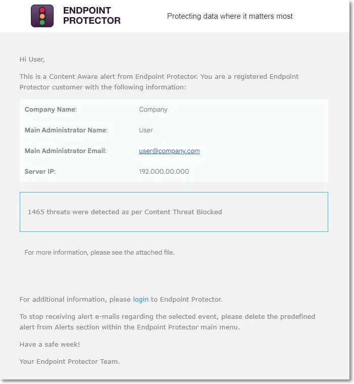

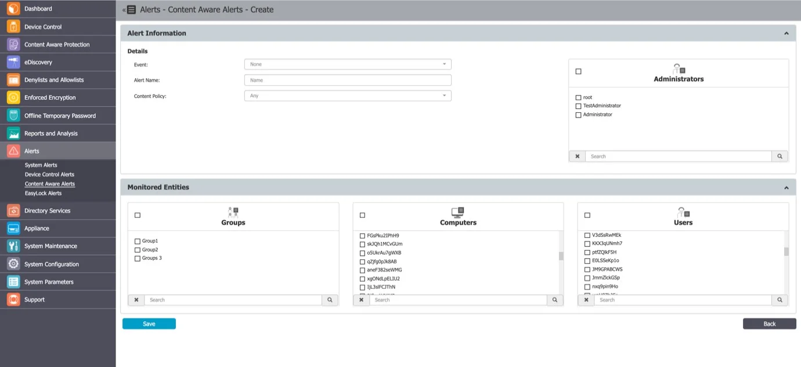

### Content Aware alerts history

From this section, you can view a history of the Content Aware alerts. Delete alerts that are no longer
needed for auditing purposes.

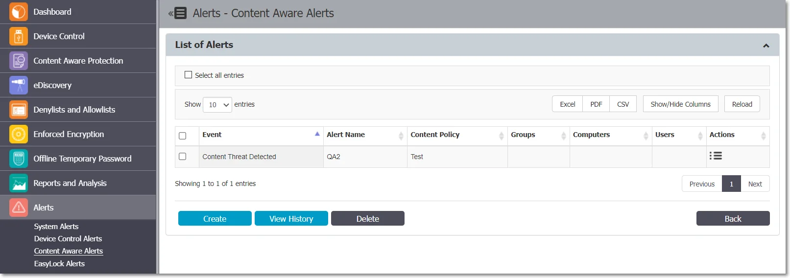

## Log alerts

Log alerts provide event-driven alerting based on Device Control and Content Aware Protection logs stored in CrateDB. Log alerts replace and extend the legacy per-module alert types with a unified, priority-based alerting system.

### How log alerts work

Log alerts are evaluated on a scheduled basis at three priority levels:

| Priority | Evaluation frequency | Use case |
|----------|---------------------|----------|
| High | Every two minutes | Critical security events that require immediate notification |
| Medium | Every 12 hours | Important events that don't require real-time alerting |
| Low | Daily at midnight | Informational events for periodic review |

When a log alert condition is met, the system sends an email notification to the selected administrators with a CSV attachment containing the matching log entries.

### Create a log alert

1. Navigate to **Alerts** > **Log Alerts**.
2. Click **Create** and provide the required information:
   - **Alert Name**—enter a descriptive name for the alert
   - **Priority**—select the evaluation frequency (High, Medium, or Low)
   - **Log Type**—select whether the alert applies to Device Control or Content Aware Protection logs
   - **Monitored Entities**—filter the alert by specific machine names, user names, or groups
   - **Administrators**—select the administrators who will receive the alert notifications
3. Click **Save**.

### Filter log alerts

You can scope log alerts to specific entities:

- **Machine names**—alert only on events from specific computers
- **User names**—alert only on events generated by specific users
- **Groups**—alert only on events from computers or users in specific groups

### Log alerts history

The Log Alerts History section provides a full audit trail of triggered alerts. From this section, you can:

- View the date and time each alert was triggered
- View the alert details and the matching log entries
- Download the alert attachment (CSV report)
- Delete alert history entries that are no longer needed

Alert history entries are automatically cleaned up after the configured retention period (default: 29 days).

### Migration from legacy alerts

When the scalability architecture is active, existing Device Control and Content Aware alerts are automatically migrated to the Log Alerts framework. The migration process runs in the background and preserves the original alert configurations.

## Enforced Encryption alert

From this section, you can create Enforced Encryption alerts for events such as password changes
and messages sent.

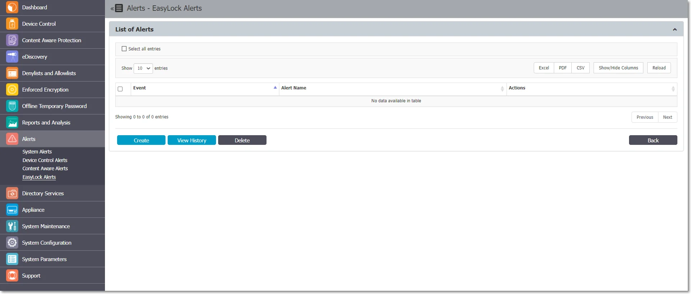

### Create an Enforced Encryption alert

1. Click **Create** and provide the required information:
   - **Event**—select the type of event:
     - Send Message
     - Change Master Password
     - Change User's Password
     - Reset Device
     - Change Settings – Installation and Execution
     - Re-deploy Client
     - Master Password Login Success
     - Password Login Failure
     - Password Login Exceeded
   - **Alert Name**—enter a name for the alert
   - **Administrators**—select the administrators who will receive the alerts
2. Click **Save**.

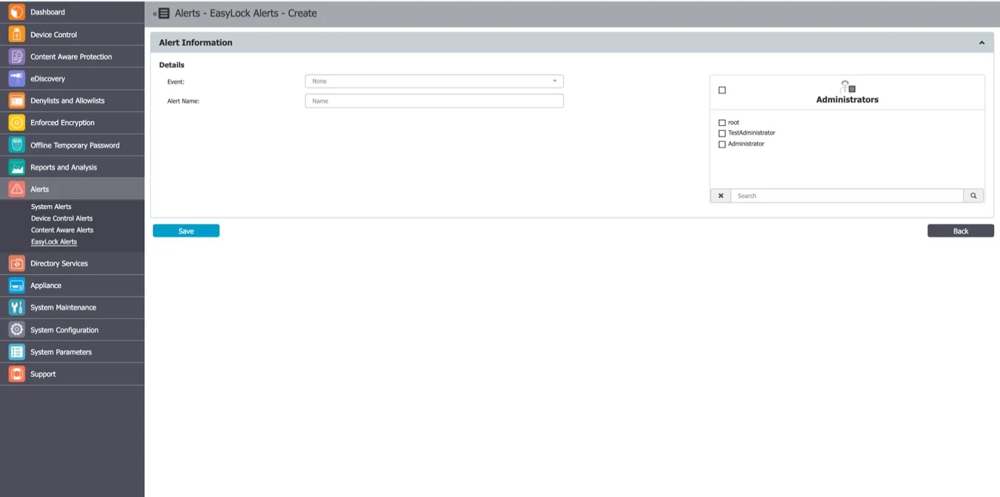

### Enforced Encryption alert history

From this section, you can view the history of the Enforced Encryption alerts. Delete alerts that are no
longer needed for auditing purposes.

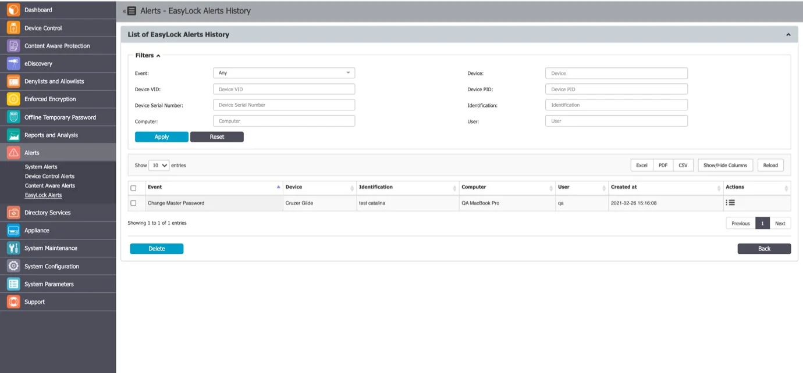
