# Appliance

## Server Information

From this section you can view general information about the Server, the System Fail/Over status,
information on Disk Space usage and Database, and the Server Uptime.

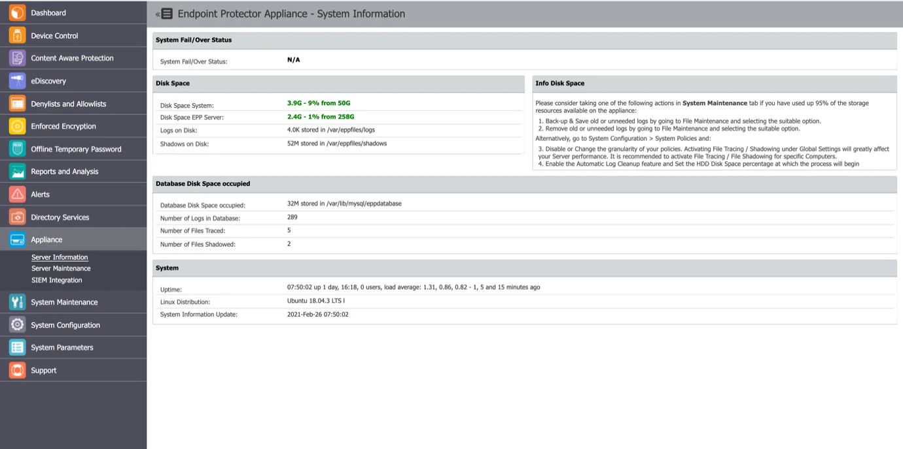

## Server Maintenance

In this section, you can set up a preferential time zone and NTP synchronization server, configure
the IP and DNS, register the client certificate, set up a self-signing certificate, perform routine
operations and manage the SSH access.

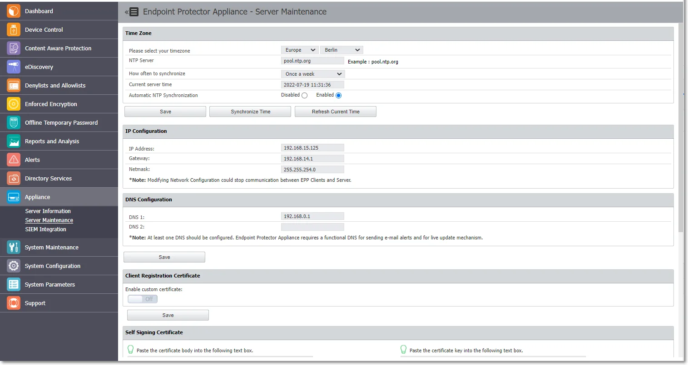

### Time Zone

In this section you can set a preferential time zone and/or sync the appliance to an NTP source.

- Time zone – select from the drop-down lists the zone and location
- NTP Server – type the server or go with the default entry
- How often to synchronize – select from the drop-down a time interval when to synchronize of go
  with the default selection

:::note
The appliances are prefigured to sync once a week with pool.ntp.org.
:::

- Current server time – the field displays the current server time
- Automatic NTP Synchronization – opt in or out to trigger the NTP synchronization automatically
- Click Save to keep all modifications without triggering the synchronization process
- Click Synchronize Time to trigger the synchronization, which will occur in the next 5 minutes. The
  Alerts and Logs will be reported after the 5 minutes in a format of your choice
- Click Refresh Current Time to update the Current server time field

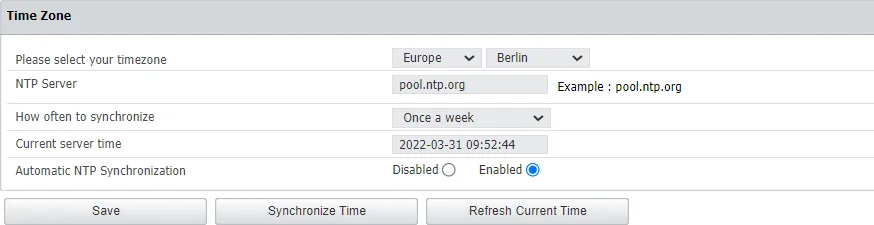

### IP Configuration

In this section you can change the network settings for the appliance to communicate correctly in
your network.

:::note
Starting with the 2509 EPP Server release, the EPP Server no longer supports the DHCP client option. This means that administrators must assign a fixed IP address to the EPP Server.
:::

:::note
Once you change the IP address, close and open again the Internet browser and then access
the Endpoint Protector Administration and Reporting Tool with the new IP address.
:::

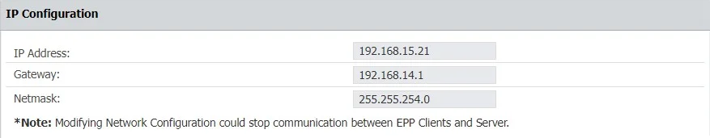

Additionally, if you want to switch to using IPV6 exclusively, starting with version 2512, you can do so by turning on the IPV6 option.
Doing so will disable the IPV4 option and vice versa.
Changes from one IP version to another should always be followed by a Save operation to apply the configuration.

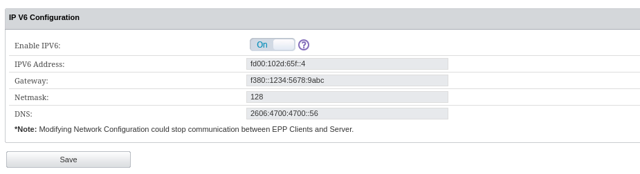

:::note
For appliances hosted on the following types of images, IP change options will not be available in the UI, but only in the command line: AWS AZURE, GCP. If you are hosting EPP on one of these image types, please use command line option to enter the Setup wizard and change the IP address from there.
:::

:::note
When transitioning from IPv4 to IPv6 or vice versa, changes to the Nginx configuration may be necessary:
- If you are using IPv4 and transitioning to IPv6, ensure that the Nginx configuration is updated to listen on the IPv6 address.
- If you are using IPv6 and transitioning to IPv4, ensure that the Nginx configuration is updated to listen on the IPv4 address.
For customers using the standard Nginx configuration (most users), adjustments are made automatically. Also, as stated above, changes from one IP version to another should always be followed by a Save operation to apply the configuration.

For customers with custom Nginx configurations (such as those using a different port for client communication), these changes might impact the communication between the agent and server.

In such scenarios, please note that we do not provide official support for custom configurations as part of our documentation. However, our support team is available to assist and manually adjust configurations.
:::

### DNS Configuration

In this section you can modify or add a DNS server address and then Save your changes.

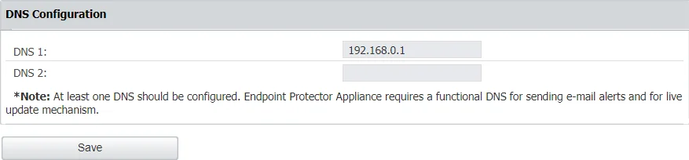

### Client Registration Certificate

From this section, you can register and then verify the Endpoint Protector Client certificate
signature. The client registration certificate is an additional security measure enabling
certificate-based authentication.

:::warning
The Client Registration Certificate feature is not available for Linux!
:::

**Step 1 –** Enable the custom certificate setting and then upload the certificate chain, Root CA and
Intermediate;

When the custom certificate is **enabled** then:

- Endpoint Protector Server will validate the client certificate at the registration phase
- Endpoint Protector Client will not validate the server certificate

When the custom certificate is **disabled** then:

- Endpoint Protector Server will not validate the client certificate at the registration phase
- Endpoint Protector Client will not validate the server certificate

**Step 2 –** Enable the test certificate setting and then upload a **certificate signed by root CA**
just for testing the signature (for example the Endpoint Protector Client certificate)

**Step 3 –** Click **Save** and allow 2 minutes for the information to be validated. You will view a
successful message confirming the custom certificate was added and the test certificate is valid.

:::note
The client registration authentication certificate and the Endpoint Protector server
certificate must be issued by the same CA.
:::

For this feature to work, there must be cryptographic identities signed by the root CA deployed on
the endpoints.

- On macOS these identities should be added to System Keychain in the "My Certificates" section
- On Windows they should be placed in the Certificate Manager's Local Computer\Certificates\Personal
  section

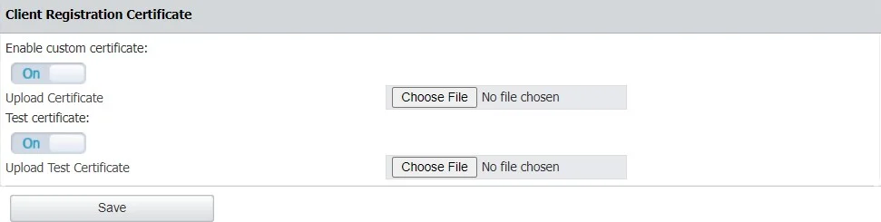

### Server Certificate Validation

From this section, you can configure Server Certificate Validation, which ensures that certificates
used for all communication requests on Endpoint Protector clients are validated. This feature is
crucial for maintaining secure communication between various Endpoint Protector products.

:::note
All certificate validation statuses will be reported to the Endpoint Protector Server and
stored for debugging purposes in Endpoint Protector Client logs.
:::

:::warning
Please use this feature responsibly, as improper certificate usage with certification
validation might disrupt Endpoint Protector Client to Endpoint Protector Server communication. For a
successful connection, both server and client certificate validation must be enabled.
:::

:::note
Starting from the 5.9.0 or later, enabling this option activates Endpoint Protector Server
Certificate Validation for all Endpoint Protector Client communication. This strengthens security by
ensuring trusted and valid certificates are used.
:::

### Appliance Operations

In this section you can perform appliance operations such as Reboot or Shutdown.

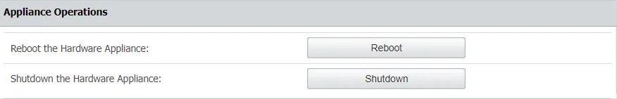

### SSH Server

In this section you can manage user access to the Appliance through the SSH protocol.

:::info
Set this option to **Enable** before requesting Support access.
:::

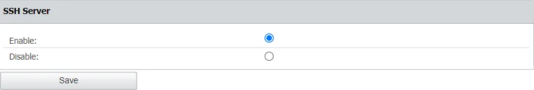

## SIEM Integration

SIEM are a third-party security information and event management tools that allow logging and
analyzing logs generated by network devices and software. The integration with SIEM technology
enables Endpoint Protector to transfer activity events to a SIEM server for analysis and reporting.

In this section, you can add, edit or delete an existing SIEM Server integration. To edit or delete
a SIEM Server you need to select an available SIEM server integration.

:::warning
You can configure a maximum number of 4 SIEM Server integrations.
:::

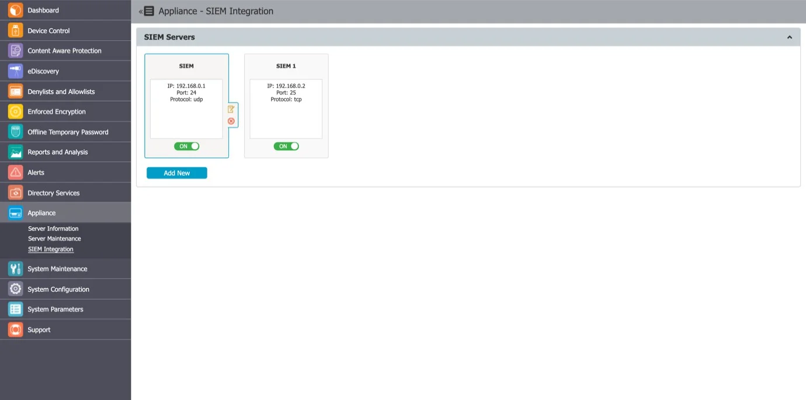

To create a SIEM Server, click **Add New** and provide the following information:

- SIEM Status – toggle switch to enable/disable the SIEM server
- Disable Logging – toggle switch to enable/disable logging

    :::note
    If you disable logging, logs will be stored on the Endpoint Protector server or on the
    SIEM server when SIEM is installed.
    :::

- Server Name – add a server name
- Server Description – add a description
- Server IP or DNS – add the IP or DNS
- Server Protocol – select the UDP or TCP server protocol

    :::note
    Based on the protocol you select you can enable [SIEM Encryption](#siem-encryption).
    :::

- Server Port – add a port
- Exclude Headers - toggle switch to enable/disable log headers

    :::note
    If you disable log headers, you will only export data to SIEM.
    :::

- Log Types – select from the available options the logs to send to the SIEM Server

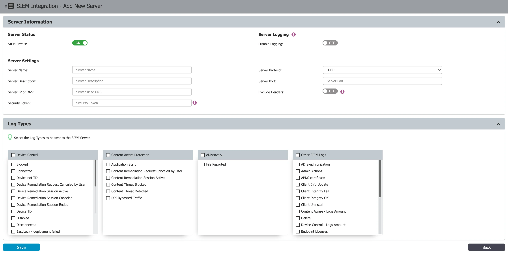

:::warning
Please be aware that the SIEM integration feature in Endpoint Protector comes with
certain limitations. To make use of the latest features of this SIEM integration, your environment
must meet specific criteria. It should have been installed from image version 5.6.0.0 or a more
recent version, and maintain an active HTTPS connection. Please note that SIEM integration is only
accessible in environments that meet these stringent prerequisites.
:::

### SIEM Encryption

When using the TCP protocol, you have the option to encrypt communication to each SIEM server. In
order to do so, enable the Encryption setting and then Upload the root CA that was used to sign the
server certificate for the SIEM server in .pem format.

:::warning
The certificate used on the SIEM server must be signed by the same CA as the one
uploaded to the Endpoint Protector Server.
:::

Endpoint Protector will check the following:

- The SIEM certificate is signed by the CA, and the CN or SAN matches the name for the SIEM machine
- The Root CA has the Basic Constraint CA set to true

When validating a certificate, the entire certificate chain must be valid, including the CA
certificate; if any certificate of the chain is invalid, the connection will be rejected.

Make sure you update the certificate files when they expire.

:::note
If you applied the latest patch using the option, and cannot view the SIEM encryption
setting, please contact Customer Support.
:::

### SIEM Export log formats

Each log entry follows this
format: `log_type: [field_name] field_value | [field_name] field_value | [field_name] field_value ..`

#### Log structure

The `log_type` is a combination of "Device Control" and the event name.

Example terms for log types include:

- Device Control – Blocked

- Device Control – Connected

- Device Control – Device not TD

To see the supported events on the Endpoint Protector Server, navigate to Appliances > SIEM
Integration > SIEM Policy.

#### Column header

The column header is `[field_name]`.

Example column headers include:

- [Event Name]
- [Client Computer]
- [IP Address]

You can find the complete list of `[field_name]` in the
[SIEM Export Log Fields](#siem-export-log-fields) section.

#### Contents of the column

The `field_value` represents the actual contents within the column.

Example field values include:

- Offline Temporary Password used
- User’s computer
- 192.168.0

### SIEM Export Log Fields

This section presents the field names for the Endpoint Protector Server's "Standard format," which
has been available since the Endpoint Protector 5.9.4 release. Endpoint Protector Server exports
logs to SIEM solutions with a maximum of 2,100 characters. Since the Endpoint Protector 5.9.1
release, we have increased the message limit to 10000 characters.

#### Device Control

The standard format for the Device Control fields is as follows:

- [Log ID]
- [Event Name]
- [Client Computer]
- [IP Address]
- [MAC Address]
- [Serial Number]
- [OS]
- [Client User]
- [Device Type]
- [Device]
- [Device VID]
- [Device PID]
- [Device Serial]
- [EPP Client Version]
- [File Name]
- [File Hash]
- [File Type]
- [File Size]
- [Justification]
- [Time Interval]
- [Date/Time(Server)]
- [Date/Time(Client)]
- [Date/Time(Server UTC)]
- [Date/Time(Client UTC)]

#### Content Aware Protection

When Reporting V1 is utilized, fields associated with Reporting V2 content, such as [Destination
Details], [Email Sender], and [Email Subject], will remain blank.

The standard format for the Content Aware Protection fields is as follows:

- [Log ID]
- [Client Computer]
- [IP Address]
- [MAC Address]
- [Serial Number]
- [OS]
- [Client User]
- [Content Policy]
- [Content Policy Type]
- [Destination Type]
- [Destination]
- [Destination Details]
- [Email Sender]
- [Email Subject]
- [Justification]
- [Device VID]
- [Device PID]
- [Device Serial]
- [File Name]
- [File Hash]
- [File Size]
- [Matched Item]
- [Item Details]
- [Date/Time(Server)]
- [Date/Time(Client)]
- [Date/Time(Server UTC)]
- [Date/Time(Client UTC)]

#### E-Discovery

The standard format for the E-Discovery fields is as follows:

- [Log ID]
- [Computer]
- [IP Address]
- [MAC Address]
- [Serial Number]
- [OS]
- [Policy]
- [Matched type]
- [Matched Item]
- [Path]
- [Discovered at]
- [Discovered at (UTC)]

#### Other SIEM Logs

**User Login/User Logout**

The standard format for the Other SIEM Logs fields is as follows:

- [Log ID]
- [Client Computer]
- [IP Address]
- [MAC Address]
- [Serial Number]
- [OS]
- [EPP Client Version]
- [Client User]
- [File Name]
- [File Type]
- [Date/Time(Server)]
- [Date/Time(Client)]
- [Date/Time(Server UTC)]
- [Date/Time(Client UTC)]

#### Client Integrity OK/Client Integrity Fail

The standard format for the Client Integrity OK/Client Integrity Fail fields is as follows:

- [Log ID]
- [Client Computer]
- [IP Address]
- [MAC Address]
- [Serial Number]
- [OS]
- [EPP Client Version]
- [Client User]
- [File Name]
- [File Type]
- [Date/Time(Server)]
- [Date/Time(Client)]
- [Date/Time(Server UTC)]
- [Date/Time(Client UTC)]

#### Admin Action

The standard format for the Admin Action fields is as follows:

- [Log ID]
- [Administrator]
- [Section]
- [Action Type]
- [Before]
- [After]
- [Date/Time(UTC)]

#### User Information Updated

The standard format for the User Information Updated fields is as follows:

- [Log ID]
- [Client Computer]
- [IP Address]
- [MAC Address]
- [Serial Number]
- [OS]
- [EPP Client Version]
- [Client User]
- [Date/Time(Server)]
- [Date/Time(Client)]
- [Date/Time(Server UTC)]
- [Date/Time(Client UTC)]

#### Policies Received

The standard format for the Policies Received fields is as follows:

- [Log ID]
- [Event Name]
- [Client Computer]
- [IP Address]
- [Client User]
- [OS]
- [Date/Time(Server)]
- [Date/Time(Client)]
- [Date/Time(Server UTC)]
- [Date/Time(Client UTC)]

#### Uninstall Attempt / Forced Uninstall Attempt

The standard format for the Uninstall Attempt/Forced Uninstall Attempt fields is as follows:

- [Log ID]
- [Event Name]
- [Client Computer]
- [IP Address]
- [MAC Address]
- [Serial Number]
- [OS]
- [Client User]
- [Device Type]
- [Device]
- [Device VID]
- [Device PID]
- [Device Serial]
- [EPP Client Version]
- [File Name]
- [File Hash]
- [File Type]
- [File Size]
- [Justification]
- [Time Interval]
- [Date/Time(Server)]
- [Date/Time(Client)]
- [Date/Time(Server UTC)]
- [Date/Time(Client UTC)]

#### Client Uninstall

The standard format for the Client Uninstall fields is as follows:

- [Log ID]
- [Client Computer]
- [IP Address]
- [MAC Address]
- [Serial Number]
- [Department]
- [EPP Client Version]
- [Last Time Online]
