# Appliance

## Server Information

From this section you can view general information about the Server, the System Fail/Over status,
information on Disk Space usage and Database, and the Server Uptime.

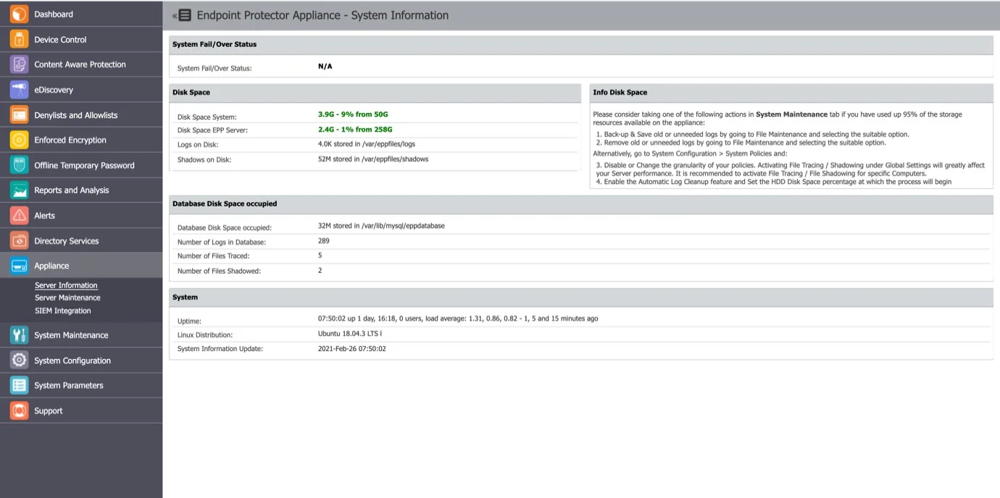

## Server Maintenance

In this section, you can set up a preferential time zone and NTP synchronization server, configure
the IP and DNS, register the client certificate, set up a self-signing certificate, perform routine
operations and manage the SSH access.

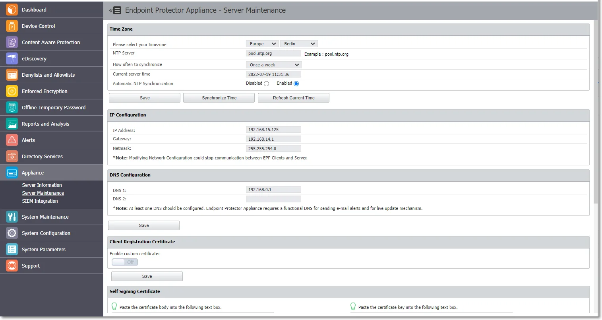

### Time Zone

In this section you can set a preferential time zone and/or sync the appliance to an NTP source.

- Time zone – select from the dropdown lists the zone and location
- NTP Server – enter the server or go with the default entry
- How often to synchronize – select from the dropdown a time interval when to synchronize of go
  with the default selection

:::note
The appliances are prefigured to sync once a week with pool.ntp.org.
:::

- Current server time – the field displays the current server time
- Automatic NTP Synchronization – opt in or out to trigger the NTP synchronization automatically
- Click Save to keep all modifications without triggering the synchronization process
- Click Synchronize Time to trigger the synchronization, which will occur in the next 5 minutes.
  Endpoint Protector reports the Alerts and Logs after the 5 minutes in a format of your choice
- Click Refresh Current Time to update the Current server time field

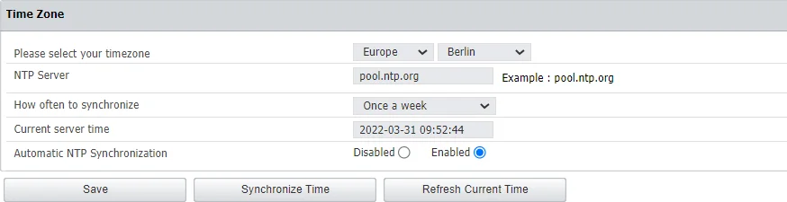

### IP Configuration

In this section you can change the network settings for the appliance to communicate correctly in
your network.

:::note
Starting with the 2509 Endpoint Protector (EPP) Server release, the EPP Server no longer supports the DHCP client option. This means that administrators must assign a fixed IP address to the EPP Server.
:::

:::note
After you change the IP address, close the Internet browser and open it again, then access
the Endpoint Protector Administration and Reporting Tool with the new IP address.
:::

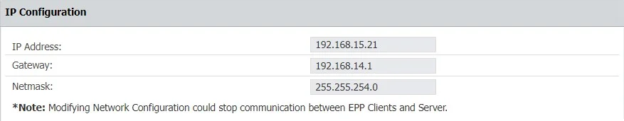

Additionally, if you want to switch to using IPV6 exclusively, starting with version 2512, you can do so by turning on the IPV6 option.
Doing so will disable the IPV4 option and vice versa.
Always click Save after changing from one IP version to another to apply the configuration.

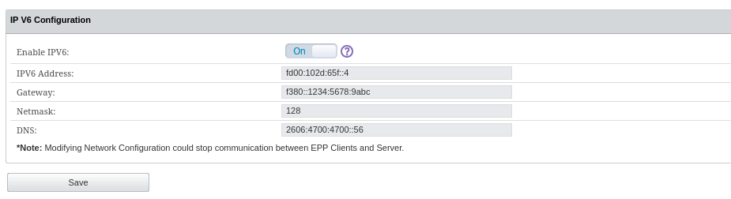

:::note
For appliances hosted on the following types of images, IP change options will not be available in the UI, but only in the command line: AWS AZURE, GCP. If you are hosting EPP on one of these image types, use command line option to enter the Setup wizard and change the IP address from there.
:::

:::note
When transitioning from IPv4 to IPv6 or vice versa, changes to the Nginx configuration may be necessary:
- If you are using IPv4 and transitioning to IPv6, ensure that the Nginx configuration is updated to listen on the IPv6 address.
- If you are using IPv6 and transitioning to IPv4, ensure that the Nginx configuration is updated to listen on the IPv4 address.
For customers using the standard Nginx configuration (most users), Endpoint Protector applies these adjustments automatically. Always click Save after changing from one IP version to another to apply the configuration.

For customers with custom Nginx configurations (such as those using a different port for client communication), these changes might impact the communication between the agent and server.

In such scenarios, the documentation doesn't officially support custom configurations. However, the Netwrix support team is available to assist with manual configuration adjustments.
:::

### DNS Configuration

In this section you can modify or add a DNS server address and then Save your changes.

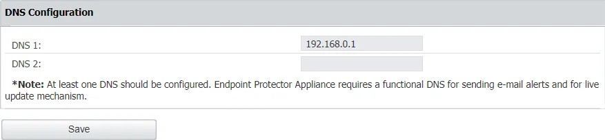

### Communication Security

By default, Endpoint Protector encrypts all communication between Endpoint Protector Clients and the Endpoint Protector Server using mutual TLS (mTLS). Both sides present certificates during the TLS handshake, which protects data in transit against interception.

To further harden the registration and communication process, Endpoint Protector provides two additional, optional security features that build on this foundation: **Client Registration Certificate** and **Server Certificate Validation**. When enabled, these options introduce certificate pinning into the client lifecycle — verifying not just that communication is encrypted, but
that both endpoints are who they claim to be. 

:::warning
The Client Registration Certificate feature isn't available for Linux.
:::

### Client Registration Certificate

The Client Registration Certificate feature enriches the client registration process by adding a certificate verification component: the Endpoint Protector Server validates the client's certificate during the registration phase, ensuring that only clients presenting a cryptographic identity signed by a trusted CA can register.
This provides an additional layer of protection in the enrollment flow — ensuring that only authorized, managed devices can register with the EPP Server, even when operating on shared or untrusted networks.

**Configuration**

**Step 1 –** Enable the custom certificate setting and then upload the certificate chain, Root CA and
Intermediate;

When the custom certificate is **enabled** then:

- Endpoint Protector Server will validate the client certificate at the registration phase
- Endpoint Protector Client will not validate the server certificate

When the custom certificate is **disabled** then:

- Endpoint Protector Server will not validate the client certificate at the registration phase
- Endpoint Protector Client will not validate the server certificate

**Step 2 –** Enable the test certificate setting and then upload a **certificate signed by root CA**
just for testing the signature (for example the Endpoint Protector Client certificate)

**Step 3 –** Click **Save** and allow 2 minutes for Endpoint Protector to validate the information.
You will view a successful message confirming that Endpoint Protector added the custom certificate
and that the test certificate is valid.

**Requirements**

:::note
The same CA must issue the client registration authentication certificate and the Endpoint
Protector server certificate.
:::

For this feature to work, you must deploy cryptographic identities signed by the root CA on the
endpoints.

- On macOS, add these identities to the System Keychain in the "My Certificates" section
- On Windows, place them in the Certificate Manager's Local Computer\Certificates\Personal
  section

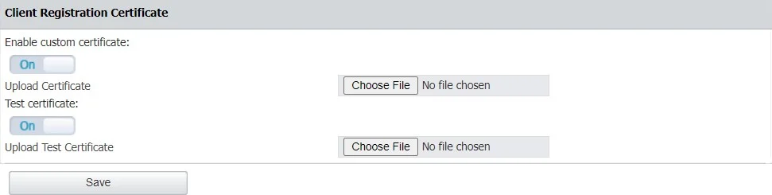

### Server Certificate Validation

While Client Registration Certificate secures the registration phase, Server Certificate Validation extends certificate verification to all ongoing communication. When enabled, the Endpoint Protector Client validates the server's SSL certificate on every outbound request — ensuring that clients only communicate with a trusted, legitimate Endpoint Protector Server and can't be redirected to a rogue or impersonated instance.
When enabled, the EPP Client validates the server's SSL certificate on every outbound request, verifying three key properties:
- **Certificate trust** — the server certificate must be issued by a trusted Certificate Authority recognized by the endpoint.
- **Expiration date** — the server certificate must be valid and not expired.
- **Hostname matching** — the server certificate's Common Name (CN) or Subject Alternative Name (SAN) must match the hostname the client is connecting to.

:::note
Starting with version 5.9.0.0, enabling this option activates Endpoint Protector Server Certificate Validation for all Endpoint Protector Client communication. This strengthens security by ensuring that all communication uses trusted and valid certificates.
:::

**Configuration**

From this section, you can configure Server Certificate Validation, which ensures that Endpoint Protector Clients validate the certificates used for all communication requests.

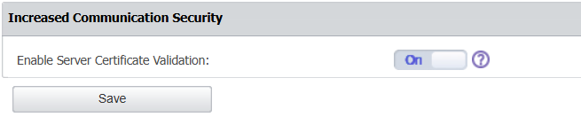

Before enabling, verify that:
- The EPP Server certificate is valid and not expired.
- The EPP Server certificate is issued by a CA trusted by all managed endpoints.
- The EPP Server hostname matches the certificate's CN or SAN exactly.

**Client-Side Configuration**
The server-side configuration alone isn't sufficient — you must also prepare the EPP Client to participate in certificate-based registration. You do this at installation time.
When you install the Endpoint Protector Client on Windows or macOS, the installer wizard includes an **Increased Communication Security** checkbox. Enabling this option instructs the EPP Client to use the certificate-based authentication flow during registration and all subsequent communication with the EPP Server. For detailed installation steps and a walkthrough of the installer wizard, refer to the [Agent Installation](/docs/endpointprotector/admin/agent.md#increased-communication-security) section.

:::warning
use this feature responsibly. Improper certificate configuration combined with enabled certificate validation may disrupt Endpoint Protector Client to Endpoint Protector Server communication.
**For a successful connection, you must enable both server and client certificate validation.**
:::

:::note
The Endpoint Protector Client reports all certificate validation statuses to the Endpoint
Protector Server and stores them in the Endpoint Protector Client logs for debugging.
:::

### Appliance Operations

In this section you can perform appliance operations such as Reboot or Shutdown.

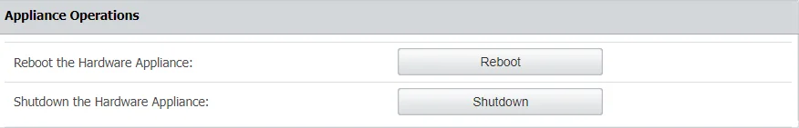

### SSH Server

In this section you can manage user access to the Appliance through the SSH protocol.

:::info
Set this option to **Enable** before requesting Support access.
:::

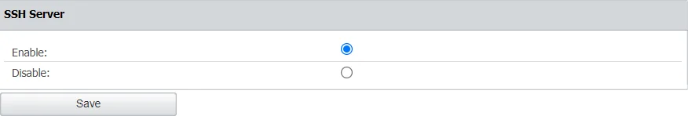

## SIEM Integration

Security information and event management (SIEM) tools are third-party tools that log and
analyze the logs generated by network devices and software. The integration with SIEM technology
enables Endpoint Protector to transfer activity events to a SIEM server for analysis and reporting.

In this section, you can add, edit, or delete an existing SIEM Server integration. To edit or delete
a SIEM Server you need to select an available SIEM server integration.

:::warning
You can configure a maximum of four SIEM Server integrations.
:::

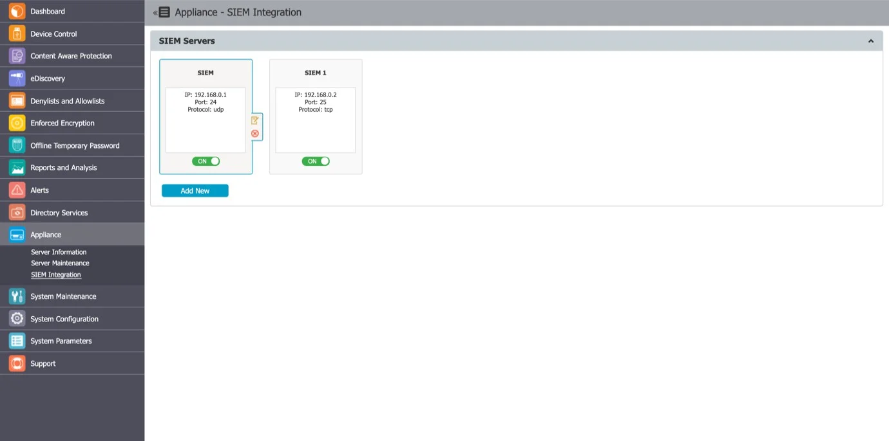

To create a SIEM Server, click **Add New** and provide the following information:

- SIEM Status – toggle switch to enable/disable the SIEM server
- Disable Logging – toggle switch to enable/disable logging

    :::note
    If you disable logging, Endpoint Protector stores logs on the Endpoint Protector server or
    on the SIEM server when you install SIEM.
    :::

- Server Name – add a server name
- Server Description – add a description
- Server IP or DNS – add the IP or DNS
- Server Protocol – select the UDP or TCP server protocol

    :::note
    Based on the protocol you select you can enable [SIEM Encryption](#siem-encryption).
    :::

- Server Port – add a port
- Exclude Headers - toggle switch to enable/disable log headers

    :::note
    If you disable log headers, you will only export data to SIEM.
    :::

- Log Types – select from the available options the logs to send to the SIEM Server

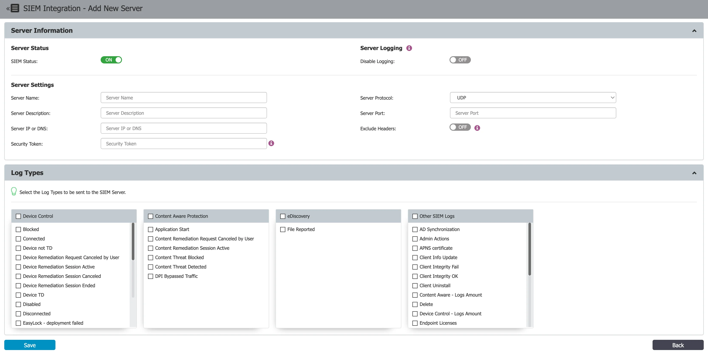

:::warning
The SIEM integration feature in Endpoint Protector comes with certain limitations. To use the latest features, your environment must meet specific criteria: you must have installed it from image version 5.6.0.0 or later, and it must maintain an active HTTPS connection. SIEM integration is only accessible in environments that meet these prerequisites.
:::

### SIEM Encryption

When using the TCP protocol, you can encrypt communication to each SIEM server. To do so, enable
the Encryption setting and then Upload the root CA used to sign the server certificate for the SIEM
server in .pem format.

:::warning
The same CA must sign both the certificate used on the SIEM server and the one
uploaded to the Endpoint Protector Server.
:::

Endpoint Protector will check the following:

- The CA signed the SIEM certificate, and the CN or SAN matches the name for the SIEM machine
- The Root CA has the Basic Constraint CA set to true

When Endpoint Protector validates a certificate, the entire certificate chain must be valid,
including the CA certificate; if any certificate in the chain is invalid, Endpoint Protector
rejects the connection.

ensure you update the certificate files when they expire.

:::note
If you applied the latest patch using the option, and can't view the SIEM encryption
setting, contact Customer Support.
:::

### SIEM Export log formats

Each log entry follows this
format: `log_type: [field_name] field_value | [field_name] field_value | [field_name] field_value ..`

#### Log structure

The `log_type` is a combination of "Device Control" and the event name.

Example terms for log types include:

- Device Control – Blocked

- Device Control – Connected

- Device Control – Device not TD

To see the supported events on the Endpoint Protector Server, navigate to Appliances > SIEM
Integration > SIEM Policy.

#### Column header

The column header is `[field_name]`.

Example column headers include:

- [Event Name]
- [Client Computer]
- [IP Address]

You can find the complete list of `[field_name]` in the
[SIEM Export Log Fields](#siem-export-log-fields) section.

#### Contents of the column

The `field_value` represents the actual contents within the column.

Example field values include:

- Offline Temporary Password used
- User’s computer
- 192.168.0

### SIEM Export Log Fields

This section presents the field names for the Endpoint Protector Server's "Standard format," available since the Endpoint Protector 5.9.4 release. Endpoint Protector Server exports logs to SIEM solutions with a maximum of 2,100 characters. Starting with Endpoint Protector 5.9.1, the message limit increased to 10,000 characters.

:::warning
From Endpoint Protector 2608 onward, Device Control and Content Aware Protection SIEM log entries use internal database field names as keys (for example, `machine_name`, `destination_type`) instead of the readable field names listed in this section (for example, `[Client Computer]`, `[Destination Type]`). This is a side effect of the underlying log platform migration to CrateDB, not an intentional change to the SIEM export format. There is no setting to restore the readable field names. If your SIEM parser or field mappings rely on those readable names, update them using the [SIEM Field Name Mapping (2608+)](#siem-field-name-mapping-2608) table.
:::

#### Device Control

The standard format for the Device Control fields is as follows:

- [Log ID]
- [Event Name]
- [Client Computer]
- [IP Address]
- [MAC Address]
- [Serial Number]
- [OS]
- [Client User]
- [Device Type]
- [Device]
- [Device VID]
- [Device PID]
- [Device Serial]
- [EPP Client Version]
- [File Name]
- [File Hash]
- [File Type]
- [File Size]
- [Justification]
- [Time Interval]
- [Date/Time(Server)]
- [Date/Time(Client)]
- [Date/Time(Server UTC)]
- [Date/Time(Client UTC)]
- [Shadow Exists]
- [Repository Type]

#### Content Aware Protection

When you use Reporting V1, fields associated with Reporting V2 content, such as [Destination
Details], [Email Sender], and [Email Subject], remain blank.

The standard format for the Content Aware Protection fields is as follows:

- [Log ID]
- [Client Computer]
- [IP Address]
- [MAC Address]
- [Serial Number]
- [OS]
- [Client User]
- [Content Policy]
- [Content Policy Type]
- [Destination Type]
- [Destination]
- [Destination Details]
- [Email Sender]
- [Email Subject]
- [Justification]
- [Device VID]
- [Device PID]
- [Device Serial]
- [File Name]
- [File Hash]
- [File Size]
- [Matched Item]
- [Item Details]
- [Date/Time(Server)]
- [Date/Time(Client)]
- [Date/Time(Server UTC)]
- [Date/Time(Client UTC)]
- [Certificate State]
- [Shadow Exists]
- [Repository Type]

#### E-Discovery

The standard format for the E-Discovery fields is as follows:

- [Log ID]
- [Computer]
- [IP Address]
- [MAC Address]
- [Serial Number]
- [OS]
- [Policy]
- [Matched type]
- [Matched Item]
- [Path]
- [Discovered at]
- [Discovered at (UTC)]

### SIEM Field Name Mapping (2608+) {#siem-field-name-mapping-2608}

From Endpoint Protector 2608 onward, Device Control and Content Aware Protection SIEM log entries use the internal database field name as the key instead of the readable field name. Use the following tables to update your SIEM parser or field mappings.

:::note
This mapping covers the fields shared with the Reporting module's export field list. A small number of internal ID fields (for example, `device_id`, `client_id`) may also appear in the live SIEM stream. Validate the mapping against a captured log sample from your environment before finalizing your SIEM parser configuration.
:::

#### Device Control field name mapping

| Readable name (pre-2608) | Database field name (2608+) |
| --- | --- |
| Client Computer | `machine_name` |
| IP Address | `ip` |
| Domain | `domain` |
| Client User | `client_name` |
| Department | `department_name` |
| Device Type | `device_type_name` |
| Device | `device_name` |
| Device VID | `vid` |
| Device PID | `pid` |
| Device Serial | `serial_no` |
| File Name | `file_name` |
| File Type | `file_type` |
| File Size | `file_size` |
| File Hash | `file_hash` |
| Justification | `ur_justification` |
| Time Interval | `ur_time_interval` |
| OS | `os_version` |
| Event Name | `event_name` |
| Shadow Exists | `shadow_exists` |
| Repository Type | `repository_type` |
| Date/Time(Server) | `timestamp` |
| Date/Time(Client) | `event_time_local` |
| EPP Client Version | `epp_client_version` |

#### Content Aware Protection field name mapping

| Readable name (pre-2608) | Database field name (2608+) |
| --- | --- |
| Content Policy | `content_policy` |
| Destination Type | `destination_type` |
| Destination | `destination` |
| Destination Details | `destination_details` |
| Email Sender | `email_sender` |
| Email Subject | `email_subject` |
| File Name | `file_name` |
| File Hash | `file_hash` |
| File Type | `file_type` |
| File Size | `file_size` |
| Matched Item | `matched_item` |
| Item Details | `item_details` |
| Client Computer | `machine_name` |
| Client User | `client_name` |
| IP Address | `ip` |
| OS | `os_type_name` |
| Event Name | `event_name` |
| Shadow Exists | `shadow_exists` |
| Repository Type | `repository_type` |
| Date/Time(Server) | `timestamp` |
| Date/Time(Client) | `event_time_local` |
| Date/Time(Client UTC) | `client_time_utc` |
| EPP Client Version | `epp_client_version` |

#### Other SIEM Logs

**User Login/User Logout**

The standard format for the Other SIEM Logs fields is as follows:

- [Log ID]
- [Client Computer]
- [IP Address]
- [MAC Address]
- [Serial Number]
- [OS]
- [EPP Client Version]
- [Client User]
- [File Name]
- [File Type]
- [Date/Time(Server)]
- [Date/Time(Client)]
- [Date/Time(Server UTC)]
- [Date/Time(Client UTC)]

#### Client Integrity OK/Client Integrity Fail

The standard format for the Client Integrity OK/Client Integrity Fail fields is as follows:

- [Log ID]
- [Client Computer]
- [IP Address]
- [MAC Address]
- [Serial Number]
- [OS]
- [EPP Client Version]
- [Client User]
- [File Name]
- [File Type]
- [Date/Time(Server)]
- [Date/Time(Client)]
- [Date/Time(Server UTC)]
- [Date/Time(Client UTC)]

#### Admin Action

The standard format for the Admin Action fields is as follows:

- [Log ID]
- [Administrator]
- [Section]
- [Action Type]
- [Before]
- [After]
- [Date/Time(UTC)]

#### User Information Updated

The standard format for the User Information Updated fields is as follows:

- [Log ID]
- [Client Computer]
- [IP Address]
- [MAC Address]
- [Serial Number]
- [OS]
- [EPP Client Version]
- [Client User]
- [Date/Time(Server)]
- [Date/Time(Client)]
- [Date/Time(Server UTC)]
- [Date/Time(Client UTC)]

#### Policies Received

The standard format for the Policies Received fields is as follows:

- [Log ID]
- [Event Name]
- [Client Computer]
- [IP Address]
- [Client User]
- [OS]
- [Date/Time(Server)]
- [Date/Time(Client)]
- [Date/Time(Server UTC)]
- [Date/Time(Client UTC)]

#### Uninstall Attempt / Forced Uninstall Attempt

The standard format for the Uninstall Attempt/Forced Uninstall Attempt fields is as follows:

- [Log ID]
- [Event Name]
- [Client Computer]
- [IP Address]
- [MAC Address]
- [Serial Number]
- [OS]
- [Client User]
- [Device Type]
- [Device]
- [Device VID]
- [Device PID]
- [Device Serial]
- [EPP Client Version]
- [File Name]
- [File Hash]
- [File Type]
- [File Size]
- [Justification]
- [Time Interval]
- [Date/Time(Server)]
- [Date/Time(Client)]
- [Date/Time(Server UTC)]
- [Date/Time(Client UTC)]

#### Client Uninstall

The standard format for the Client Uninstall fields is as follows:

- [Log ID]
- [Client Computer]
- [IP Address]
- [MAC Address]
- [Serial Number]
- [Department]
- [EPP Client Version]
- [Last Time Online]
