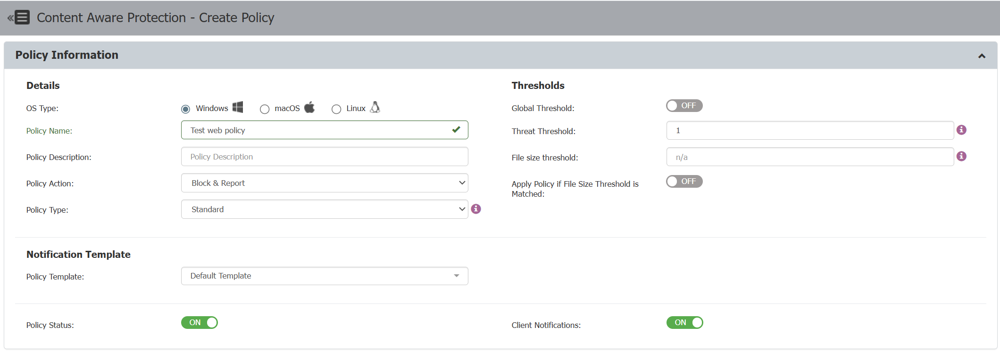
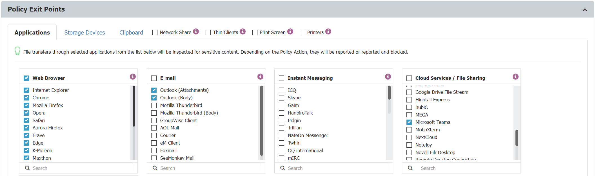
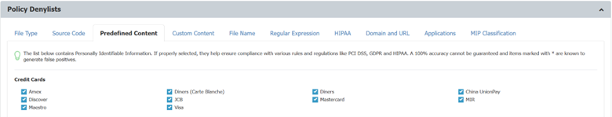
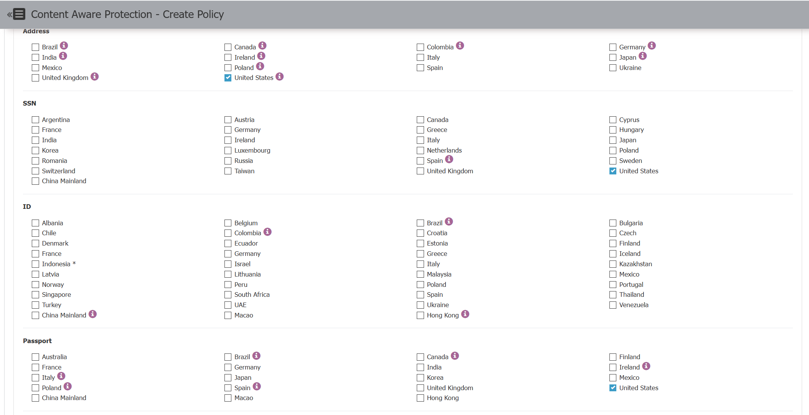
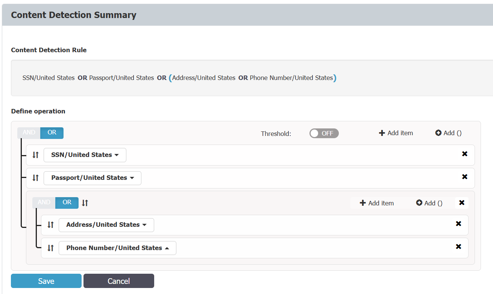

# Content Aware Protection for AI interactions

**Introduction**

As artificial intelligence tools become increasingly integrated into everyday business processes, Netwrix Endpoint Protector (EPP), a leader in Data Loss Prevention (DLP) technology, has addressed the need for enhanced visibility and control. With the introduction of EPP Client version 2511, users now have access to a feature that extends Data Loss Prevention to Large Language Models (LLMs).

**Key Features**

This new functionality enables businesses to maintain precise control over information exchanges with popular AI chat applications. By incorporating Data Loss Prevention for LLMs, EPP enhances security by:

-   Granting administrators the ability to manage who can interact with AI prompts through web applications.
-   Offering tools to oversee the management of sensitive content, whether it is typed directly or attached as a file.

**Benefits**

By implementing these controls, organizations can ensure that sensitive information is protected during interactions with AI applications, thereby reducing the risk of data leaks and maintaining compliance with internal and external data security policies.

## AI Interaction Visibility and Control in Netwrix Endpoint Protector: Data Loss Prevention for LLMs

By incorporating this capability into our DLP solutions, we ensure secure and compliant use of cutting-edge AI technologies, including ChatGPT, Microsoft Copilot, Google Gemini, DeepSeek, X Grok, and Claude, reinforcing our commitment to delivering superior data protection. Moreover, we extend coverage for Microsoft Copilot in Windows ecosystem, supporting the embedded Copilot add-in within Windows 11, the New Outlook, and the New Teams.

As artificial intelligence continues to transform communication and collaboration processes, Endpoint Protector is committed to developing innovative solutions that address the complex challenges of safeguarding data in modern enterprises. This release marks a significant advancement in our mission to provide superior data security in an increasingly AI-driven world.

## How to configure Netwrix EPP to be able to monitor AI prompt transactions?

To monitor or control AI prompts with EPP, you need to meet the following prerequisites:

-   EPP Server version 2509 or newer
-   EPP Client version 2511 or newer
-   CAP license with the Content Aware Protection (CAP) module enabled
-   DPI (Deep Packet Inspection) module enabled

If all of the above requirements are fulfilled, most of the setup is already complete. This is because any existing web browser monitor/control policy will automatically apply to user interactions with supported AI chat applications, enforcing your policy definitions when violations occur.

## Use Case Example:

### I. Simple CAP Policy Triggering on Credit Card Detection**

To configure a CAP policy for this purpose:

1.  Define the CAP "Policy Name," "Policy Action," and "Thresholds" according to your requirements.

2.  Define CAP application exit points by selecting the web browsers you want to monitor or control. Make sure the relevant browsers are checked so the policy will be applied when users interact with AI chat applications through these browsers.

3.  Define CAP Policy Denylists for this use case by selecting the necessary credit card patterns. Ensure that the appropriate patterns are checked so that the policy will detect and block any attempts to submit credit card information through AI chat applications.

4.  Save the policy and assign it to your selected endpoints.
5.  This will ensure that the policy is enforced on the devices where you want to monitor or control AI prompt transactions.

**You can check above example at the video below:**

<video controls width="100%">
  <source src="/videos/endpointprotector/capaiusecase1.mp4" type="video/mp4" />
  Your browser does not support the video tag.
</video>

**Description of video**:
At the initial stage, I conducted a simple comparative test across several AI platforms: Copilot, ChatGPT, Google Gemini, DeepSeek, and X Grok.​

    -   **Responsiveness Check** – Verified that each AI model was actively responding, ensuring the interaction was genuine and not a simulated or dummy web transaction triggered by the URL.​
    -   **Data Leakage Simulation** – Copied and pasted real credit card (CC) patterns and requested validation from each AI. By the way – samples are generated by one of AI engine:). The CAP (DLP) policy was configured to automatically block any transaction if CC data was detected.​
    -   **Cross-Engine Validation** – Repeated the same procedure across all mentioned AI engines to confirm consistent behavior and validate DLP enforcement.​
    -   **Conclusion** – The demonstration confirms that **Netwrix EPP DLP integrates seamlessly with AI tools such as Copilot, ChatGPT, Google Gemini, DeepSeek, and X Grok** to **prevent data leakage, enforce compliance, and ensure secure information handling at the endpoint level**, while maintaining a positive user experience.

### II. Contextual CAP Policy Triggering on PII patterns in combination for Copilot web & apps

To configure a CAP policy for this purpose:

1.  Define the CAP "Policy Name," "Policy Action," and "Thresholds" according to your requirements.

2.  Define CAP application exit points by selecting the web browsers you want to monitor or control. Make sure the relevant browsers are checked so the policy will be applied when users interact with AI chat applications through these browsers.

    **Tip:** For Copilot plugins in New Outlook, Teams, or Windows 11 25H2, it is recommended to also verify the in-app definitions for Outlook and Teams when configuring policies.

3.  Define Policy Denylists for this use case by selecting the necessary credit card patterns. Ensure that the appropriate patterns are checked so that the policy will detect and block any attempts to submit credit card information through AI chat applications.

\*\*Tip:\*\* You can use contextual rules to create complex pattern definitions for more accurate and flexible policy enforcement.

4.  Save the policy and assign it to your selected endpoints.
5.  This will ensure that the policy is enforced on the devices where you want to monitor or control AI prompt transactions.

**You can check above example at the video below:**

<video controls width="100%">
  <source src="/videos/endpointprotector/capaiusecase2.mp4" type="video/mp4" />
  Your browser does not support the video tag.
</video>

**Description of video:**

The test begins with verifying **Copilot’s functionality** to ensure proper operation.

    • **Initial HR Scenario** – An HR use case is simulated, where employment contract templates without sensitive data are enhanced using Copilot to improve formatting and presentation quality.

    • **Data Leakage Prevention Test** – A realistic dataset containing sensitive HR information from a CRM system is introduced. When this data is processed through Copilot, the Netwrix DLP solution detects the presence of personal data and automatically blocks the transaction, preventing unauthorized disclosure.

    • **Microsoft Teams Scenario** – The same test is conducted using Copilot integrated with Microsoft Teams. The DLP system again identifies sensitive information and stops the operation, confirming consistent protection within collaboration environments.

    • **Outlook Scenario** – The procedure is repeated in Microsoft’s new Outlook with Copilot Agent. Despite the platform change, the DLP system maintains the same behavior, successfully blocking data transmission.

    • **Conclusion** – The demonstration confirms that **Netwrix EPP DLP** integrates seamlessly with AI tools such as Copilot to **prevent data leakage**, **enforce compliance**, and **ensure secure information handling** across Microsoft 365 applications.
