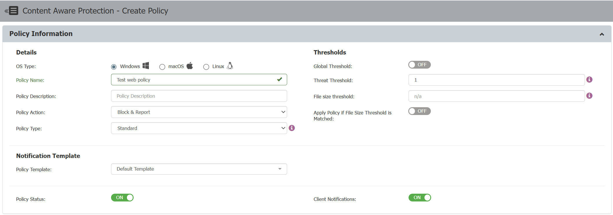
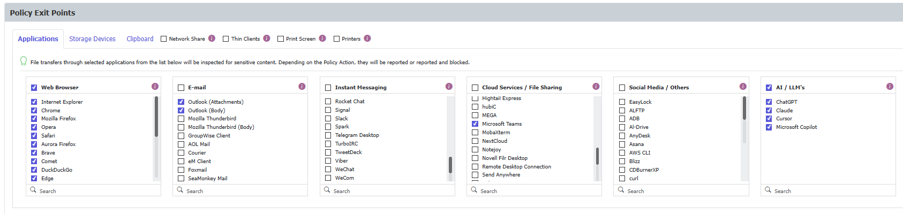
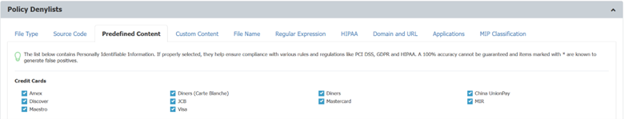
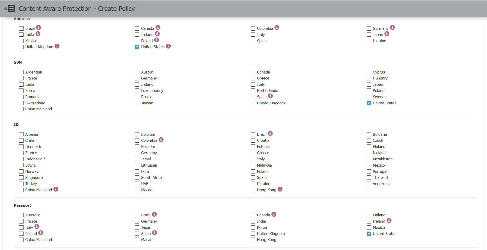
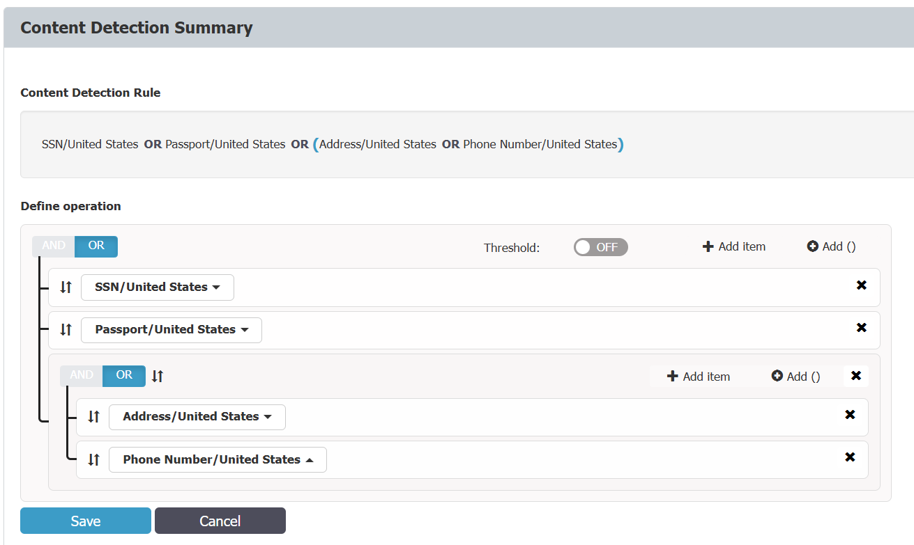

# Content Aware Protection for AI interactions

**Introduction**

As organizations increasingly integrate artificial intelligence tools into everyday business processes, sensitive data now flows through AI chat applications and Large Language Models (LLMs) as routinely as it does through email or cloud storage. Starting with EPP Client release 2511, Netwrix Endpoint Protector (EPP) extends its Data Loss Prevention (DLP) coverage to these AI interactions, giving administrators the same content-aware and context-aware visibility and control they already have over traditional data channels.

**Key Features**

This functionality gives administrators precise control over information exchanges with AI chat applications, web-based AI tools, and native AI desktop clients. Endpoint Protector's DLP for AI capability:

-   Lets administrators control which users and endpoints can interact with AI prompts, across web applications, browser extensions, and native desktop clients.
-   Inspects both ways sensitive data can enter a prompt: plain text a user types directly into the prompt, and the content of any file the user attaches to it.
-   Applies the same content-aware and context-aware detection engine already used for email, cloud storage, and removable media, so there's no separate AI-specific policy engine to learn or maintain.

**Benefits**

These controls extend an organization's existing DLP posture to AI interactions, reducing the risk of sensitive data leaving through AI chat platforms and helping meet internal data security policies and external regulatory requirements such as GDPR, HIPAA, and PCI DSS.

## AI Interaction Visibility and Control in Netwrix Endpoint Protector: Data Loss Prevention for LLMs

Endpoint Protector extends Data Loss Prevention to the most widely used AI technologies, ensuring secure and compliant use across your organization:

-   **AI chat web applications** — ChatGPT, Microsoft Copilot, Google Gemini, DeepSeek, X AI Grok, Claude, Meta AI, Perplexity, Cursor, Comet, Atlassian Rovo, and TimelyGPT.
-   **Embedded Microsoft Copilot integrations** — Windows 11, New Outlook, New Teams, and Edge.
-   **Native desktop clients** — ChatGPT, Claude (including Claude Code and Claude Cowork), Comet, Cursor, and Copilot.
-   **AI-powered IDEs** — Cursor.

:::note
Claude app processes text extraction from attachments locally. This local processing isn't part of EPP inspection. EPP triggers detection only when Claude Code sends this data to Claude's servers.
:::

## Configure Netwrix EPP to Monitor AI Prompt Transactions

To monitor or control AI prompts with EPP, you need to meet the following prerequisites:

-   use latest EPP Server version
-   use latest EPP Client version
-   Content Aware Protection (CAP) license with the CAP module enabled
-   Deep Packet Inspection (DPI) module enabled

If you meet these requirements, most of the setup is already complete, because any existing web browser monitor/control policy automatically applies to user interactions with supported AI chat applications and enforces your policy definitions when violations occur.

## Use Case Example

### Example 1: Simple CAP Policy Triggering on Credit Card Detection

To configure a CAP policy for this purpose:

1.  Define the CAP "Policy Name," "Policy Action," and "Thresholds" according to your requirements.

2.  Define CAP application exit points by selecting the web browsers you want to monitor or control. Ensure you check the relevant browsers so the policy applies when users interact with AI chat applications through these browsers.

    Explanation:
    - Check the desired web browsers in the **Web Browsers** group to cover visibility for AI/LLM prompts in web applications — for example, when a user accesses Copilot at `https://copilot.microsoft.com/` in a web browser.
    - Check both Outlook options in the **E-mail** group to cover the Copilot app extension in New Outlook.
    - Check **Microsoft Teams** in the **Cloud Services/File Sharing** group to cover Microsoft Teams Copilot extensions.
    - Check the desired native client apps in the **AI/LLMs** group to cover transactions in native AI client applications.
    

3.  Define CAP Policy Denylists for this use case by selecting the necessary credit card patterns. Ensure you check the appropriate patterns so the policy detects and blocks any attempts to submit credit card information through AI chat applications.

4.  Save the policy and assign it to your selected endpoints.
5.  Endpoint Protector enforces the policy on the devices where you want to monitor or control AI prompt transactions.

**Watch the following video to see this example:**

<video controls width="100%">
  <source src="/videos/endpointprotector/capaiusecase1.mp4" type="video/mp4" />
  Your browser doesn't support the video tag.
</video>

**Description of video**:
The test covers several AI platforms: Copilot, ChatGPT, Google Gemini, DeepSeek, and X Grok.

    -   **Responsiveness Check** – The test verified that each AI model was actively responding, ensuring the interaction was genuine rather than a simulated or dummy web transaction triggered by the URL.
    -   **Data Leakage Simulation** – The test submitted credit card (CC) patterns to each AI platform for validation. An AI engine generated the sample data. The CAP policy automatically blocks any transaction containing CC data.
    -   **Cross-Engine Validation** – The test repeated the same procedure across all mentioned AI engines to confirm consistent behavior and validate DLP enforcement.​
    -   **Conclusion** – The demonstration confirms that **Netwrix EPP DLP integrates seamlessly with AI tools such as Copilot, ChatGPT, Google Gemini, DeepSeek, and X Grok** to **prevent data leakage, enforce compliance, and ensure secure information handling at the endpoint level**, while maintaining a positive user experience.

### Example 2: Contextual CAP Policy Triggering on PII patterns in combination for Copilot web & apps

To configure a CAP policy for this purpose:

1.  Define the CAP "Policy Name," "Policy Action," and "Thresholds" according to your requirements.

2.  Define CAP application exit points by selecting the web browsers you want to monitor or control. Ensure you check the relevant browsers so the policy applies when users interact with AI chat applications through these browsers.

    Explanation:
    - Check the desired web browsers in the **Web Browsers** group to cover visibility for AI/LLM prompts in web applications — for example, when a user accesses Copilot at `https://copilot.microsoft.com/` in a web browser.
    - Check both Outlook options in the **E-mail** group to cover the Copilot app extension in New Outlook.
    - Check **Microsoft Teams** in the **Cloud Services/File Sharing** group to cover Microsoft Teams Copilot extensions.
    - Check the desired native client apps in the **AI/LLMs** group to cover transactions in native AI client applications.

:::tip
For Copilot plugins in New Outlook, Teams, or Windows 11 25H2 and later, also verify the in-app definitions for Outlook and Teams when configuring policies.
:::

3.  Define Policy Denylists for this use case by selecting the necessary credit card patterns. Ensure you check the appropriate patterns so the policy detects and blocks any attempts to submit credit card information through AI chat applications.

:::tip
You can use contextual rules to create complex pattern definitions for more accurate and flexible policy enforcement.
:::

4.  Save the policy and assign it to your selected endpoints.
5.  Endpoint Protector enforces the policy on the devices where you want to monitor or control AI prompt transactions.

**Watch the following video to see this example:**

<video controls width="100%">
  <source src="/videos/endpointprotector/capaiusecase2.mp4" type="video/mp4" />
  Your browser doesn't support the video tag.
</video>

**Description of video:**

The test begins by verifying that **Copilot** works correctly.

    -   **Initial HR Scenario** – The test simulates an HR use case in which Copilot enhances employment contract templates without sensitive data to improve formatting and presentation quality.

    -   **Data Leakage Prevention Test** – The test introduces a realistic dataset containing sensitive HR information from a CRM system. When Copilot processes this data, the Netwrix DLP solution detects personal data and automatically blocks the transaction, preventing unauthorized disclosure.

    -   **Microsoft Teams Scenario** – The test runs the same scenario using Copilot integrated with Microsoft Teams. The DLP system again identifies sensitive information and stops the operation, confirming consistent protection within collaboration environments.

    -   **Outlook Scenario** – The test repeats the procedure in Microsoft’s new Outlook with Copilot Agent. Despite the platform change, the DLP system maintains the same behavior, successfully blocking data transmission.

    -   **Conclusion** – The demonstration confirms that **Netwrix EPP DLP** integrates seamlessly with AI tools such as Copilot to **prevent data leakage**, **enforce compliance**, and **ensure secure information handling** across Microsoft 365 applications.
