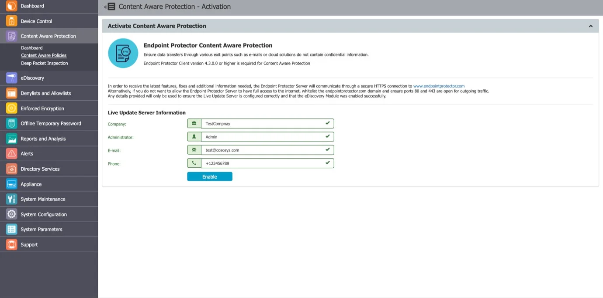
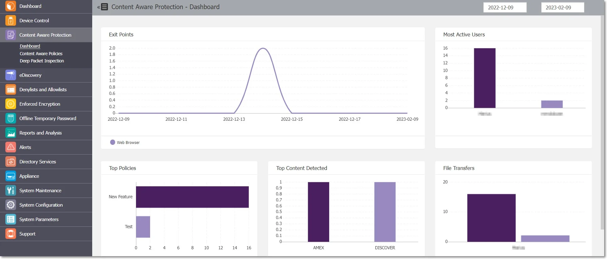

# Content Aware Protection

Content Aware Protection is Endpoint Protector's complete Data Loss Prevention (DLP) module for
data in motion. It lets administrators set up and enforce content-aware and context-aware
filtering policies for selected users, computers, groups, or departments, taking control over the
risk of accidental or intentional transfers of sensitive company data, such as:

- Personal Identifiable Information (PII): SSNs, national ID numbers, passports, driving licenses,
  phone numbers, addresses, tax IDs, VAT IDs, and health insurance numbers, with region-specific
  patterns covering dozens of countries.
- Financial and payment card information: credit card numbers for Visa, Mastercard, American
  Express, JCB, Discover, Diners Club, China UnionPay, Prostir, and more, plus bank account and IBAN
  numbers.
- Source code and file types: dozens of programming languages (C, C++, Java, Python, JavaScript,
  Go, Swift, PowerShell, and more) plus extensive built-in detection across graphic, office,
  archive, media, and CAD file formats.
- Regulatory and compliance content: built-in HIPAA detection for protected health information
  (PHI), helping meet requirements such as PCI DSS, GDPR, and HIPAA.
- Document classification labels: recognizes labels from Microsoft Purview Information Protection
  (MIP) and Netwrix Data Classification (NDC), extending existing classification policies directly
  into Content Aware Protection.
- Confidential files and custom content: sales and marketing reports, technical documents, customer
  databases, and organization-defined dictionaries, regular expressions, file names, and domains or
  URLs.

:::note
Predefined Content patterns cover the following countries and regions (exact pattern types
available — SSN, passport, driving license, and so on — vary by country): Albania, Argentina,
Australia, Austria, Belgium, Brazil, Bulgaria, Canada, Chile, China Mainland, Colombia, Croatia,
Cyprus, Czech Republic, Denmark, Ecuador, Estonia, Finland, France, Germany, Greece, Hong Kong,
Hungary, Iceland, India, Indonesia, Ireland, Israel, Italy, Japan, Kazakhstan, Korea, Latvia,
Lithuania, Luxembourg, Macao, Malaysia, Mexico, Netherlands, Norway, Peru, Poland, Portugal,
Romania, Russia, Singapore, Slovenia, South Africa, Spain, Sweden, Switzerland, Taiwan, Thailand,
Turkey, Ukraine, United Arab Emirates, United Kingdom, United States, and Venezuela. Upcoming
releases will extend coverage to Bosnia and Herzegovina, Montenegro, North Macedonia, and Serbia.
:::

To prevent sensitive data leakage, Endpoint Protector closely monitors all activity at various exit
points:

- Portable storage and media devices: USB drives, external HDDs, CDs, DVDs, SD cards, and other
  removable media, either directly or through encryption software such as Enforced Encryption.
- Local network and thin client transfers: Network Share and Thin Clients.
- Web browsers and e-mail clients: Chrome, Firefox, Safari, Edge, and others; Outlook, Thunderbird,
  and other e-mail clients, including attachments and message body.
- Instant messaging and cloud services/file sharing: messaging apps and cloud storage clients such
  as Google Drive, iCloud, Dropbox, and OneDrive.
- AI and LLM applications: AI chat and prompt-based tools such as ChatGPT, Claude, Cursor, and
  Microsoft Copilot.
- Remote access and utility applications: tools such as AnyDesk, ALFTP, and AWS CLI.
- Copy & Paste / Cut & Paste operations, print screens, and printers (local and network).

## Content Aware Protection Activation

Content Aware Protection comes as the second level of data protection available in Endpoint
Protector. The module appears but requires activation by pressing the Enable button.
Provide the Main Administrator's contact details if you haven't already.

:::note
The Content Aware Protection module is separate from Device Control or eDiscovery modules,
and requires separate licensing.
:::

## Dashboard

This section offers a quick overview in the form of graphics and charts related to the Content Aware
Protection module.

:::warning
Endpoint Protector can't scan encrypted files or applications that use encryption to
secure communication.
:::

:::note
**Known limitation:** When using Zoho WorkDrive or GDrive (Google Drive) sync applications, file names that are reported, blocked, or both display internal cache paths instead of the original file name, which prevents location-based and file name denylists from working reliably. Block and Report log entries may be duplicated due to application-level transfer retries, and reported file sizes may be inaccurate. File shadowing works intermittently — shadows may contain corrupted content or be created without a hash, preventing download from the server.
:::
