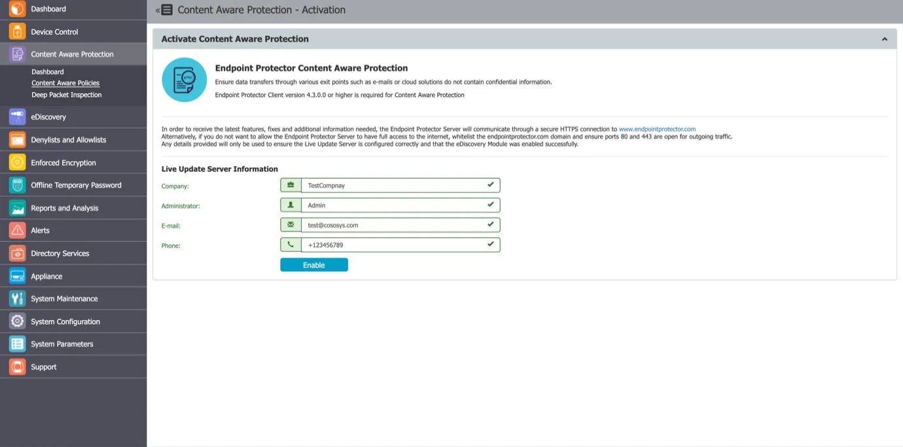

# Content Aware Protection

This module allows the Administrator to set up and enforce strong content filtering policies for
selected users, computers, groups, or departments and take control over the risks posed by
accidental or intentional file transfers of sensitive company data, such as:

- Personal Identifiable Information (PII): social security numbers (SSN), driving license numbers,
  email addresses, passport numbers, phone numbers, addresses, dates, etc.
- Financial and credit card information: credit card numbers for Visa, MasterCard, American Express,
  JCB, Discover Card, Diners Club, bank account numbers, etc.
- Confidential files: sales and marketing reports, technical documents, accounting documents, customer
  databases, etc.

:::warning
Endpoint Protector cannot scan encrypted files or applications that use encryption to
secure communication.
:::

To prevent sensitive data leakage, Endpoint Protector closely monitors all activity at various exit
points:

- Transfers on portable storage and other media devices (USB Drives, external HDDs, CDs, DVDs, SD
  cards, etc.), either directly or through encryption software (e.g., Enforced Encryption)
- Transfers on local networks (Network Share)
- Transfers via the Internet (email Clients, File Sharing Application, Web Browsers, Instant
  Messaging, Social Media, etc.)
- Transfers to the cloud (iCloud, Google Drive, Dropbox, Microsoft SkyDrive, etc.)
- Transfers through Copy & Paste / Cut & Paste
- Print screens
- Printers and others

## Content Aware Protection Activation

Content Aware Protection comes as the second level of data protection available in Endpoint
Protector. The module is displayed but requires a simple activation by pressing the Enable button.
If not previously provided, the contact details of the Main Administrator will be required.

:::note
The Content Aware Protection module is separate from Device Control or eDiscovery modules,
and requires separate licensing.
:::

## Dashboard

This section offers a quick overview in the form of graphics and charts related to the Content Aware
Protection module.

