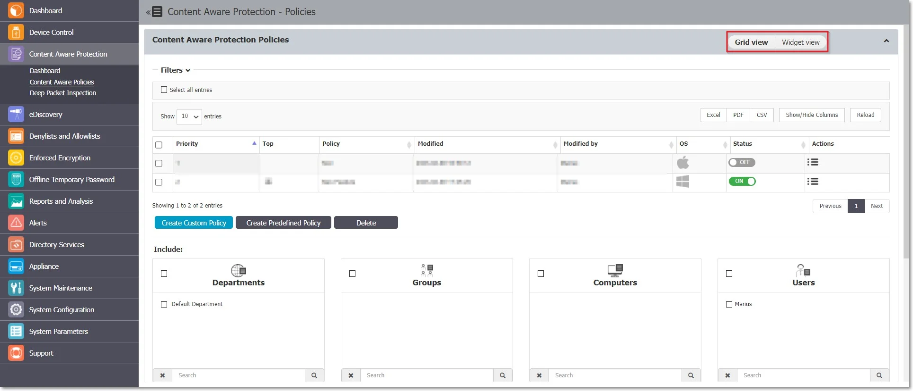
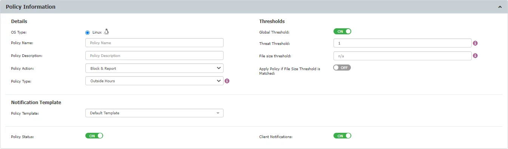
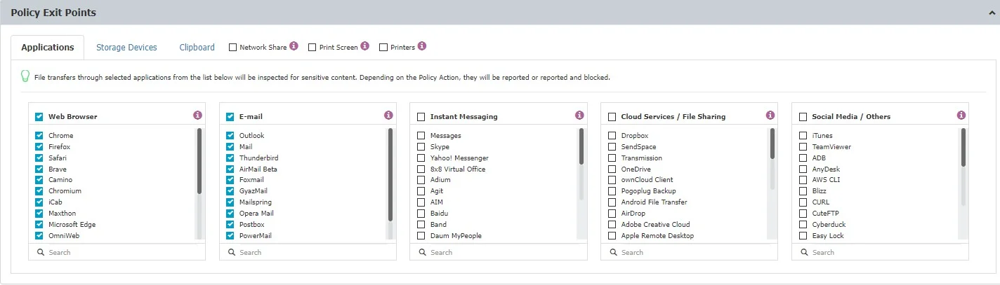
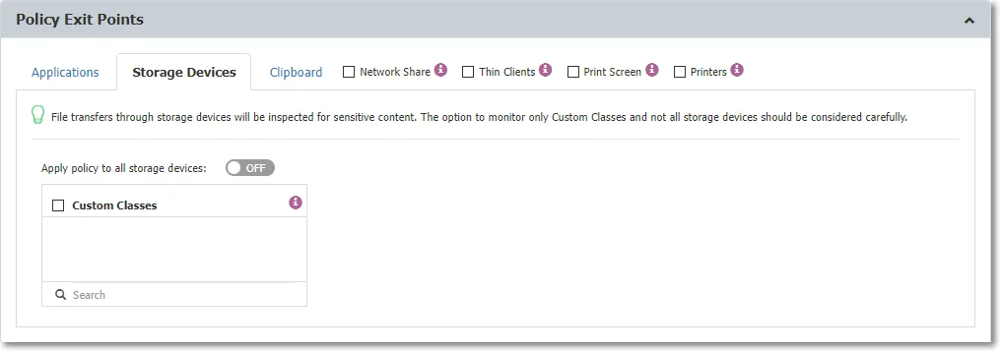
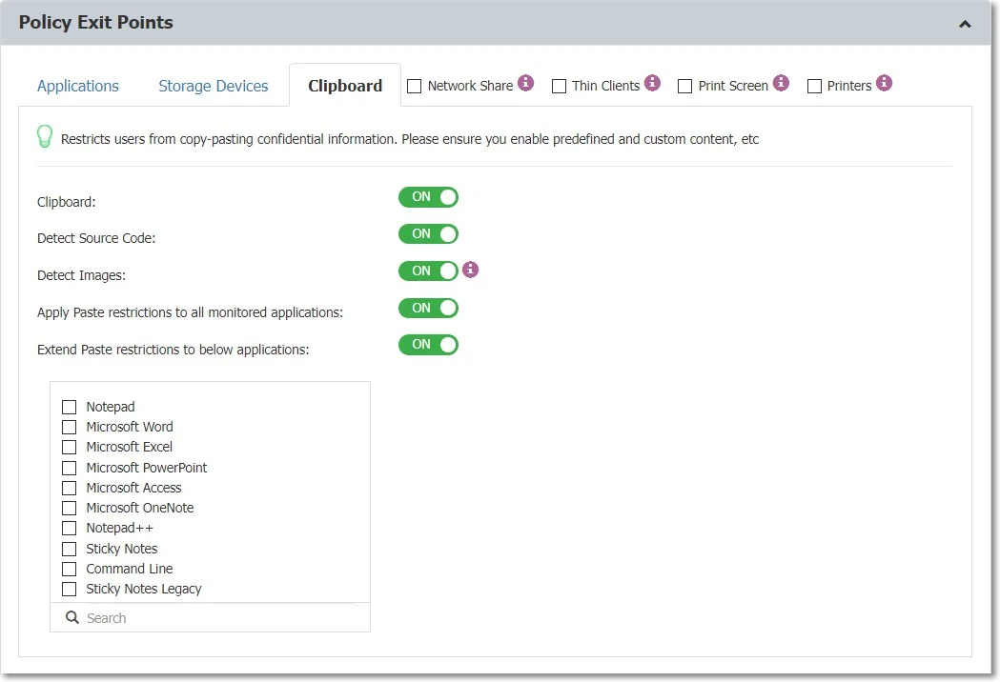

# Policy Configuration and Application

Content Aware Policies are sets of rules for sensitive content detection that enforce file transfers
management on selected entities (users, computers, groups, departments).

From this section, you can create a new policy, edit or delete an existing policy or create and
apply a predefined policy.

For example; Content Aware Policy can be set to only block Credit Cards AND Email Addresses. In this
case, a file that contains a Credit Card AND an email address will be blocked, but if transferring a
file that only contains Credit Cards, it will not be blocked.

Each company can define its sensitive content data lists as Custom Content Dictionaries corresponding
to their specific domain of activity, targeted industry, and roles.

To ease this task, the Content Aware Protection module comes with a Predefined Content Dictionary
that covers the most used sets of confidential terms and expressions.

For example; a policy can be set up for the Financial Department of the company to block Excel
reports sent via E-mail or to report all transfers of files containing personally identifiable and
financial information (e.g., credit card numbers, E-mail, phone numbers, social security numbers
etc.).

:::note
Content Aware Policies also apply to the File Allowlist. As a result, all files that were
previously allowed will now be inspected for sensitive content and, depending on the policy
configuration, either reported, blocked, or allowed.
:::

Similar to Device Control policies, Content Aware policies remain enforced on a computer even after
it is disconnected from the company network.

One or more Content Aware Policy can be enforced on the same computer, user, group, or department.
To avoid any conflicts between the applied rules, a prioritization of policies is performed through a
left-to-right ordering. The leftmost policy has the highest priority (Priority 1), while the
rightmost policy has the lowest priority. Changing priorities for one or more policies can be
performed by moving the policy to the right or the left with a simple click on the left arrow for
higher priority or on the right arrow for lower priority.

To manage Content Aware Protection policies, you can:

- Switch views between Grid or Widget mode using the controls in the top-right corner
- Edit policy priority by double-clicking on a policy listed in the Priority column

## Policy Information

Starting with Endpoint Protector version 5.9.4, you can now create up to 300 Content Aware
Protection policies, an increase from the previous limit of 48.

To create a Content Aware Policy, provide the following information:

:::note
Depending on the specific application and OS, some limitations may apply.
:::

- OS Type - select the operating system to which the policy applies, Windows, macOS, or Linux
- Policy Name – add a name for the policy
- Policy Description – add a description for the policy
- Policy Action - select the type of action you want the policy to perform

    - Block & Report – this policy will deny all transfers of data that include sensitive content
      and report the action
    - Report only – this policy will allow all transfers of data that include sensitive content and
      will only report the action
    - Block only - this policy will deny all transfers of data that include sensitive content but
      not report the action
    - Block and Remediate - this policy will deny all transfers of data that include sensitive
      content but allow the user to remediate the action by using a justification

:::note
Initially, we recommend using the Report only action to gain a better view of data use
across your network and not interrupt your activity.
:::

- Policy Type - select the policy type, Standard, Outside Hous, or Outside Network

:::note
To enforce the Outside Hours and Outside Network options, after you save the policy,
enable the setting on the specific device from Device Control, Global settings, Group or Computers.
:::

- Policy Template – select a custom notification from the drop-down list or create one from System
  Parameters, Device Types and Notification,
 [Custom Content Aware Protection Notifications](/docs/endpointprotector/admin/systempar.md)
  section
- Policy Status – enable to set policy status to active
- Client Notifications – enable this setting to send notifications to clients
- Global Thresholds – if disabled, the threshold can be considered a Regular Threshold
- Threat Threshold – type the number of maximum allowed content violations for a file transfer
- File size threshold – enter the file size (in MB) starting from which the file transfer is either
  blocked or reported

:::note
If a File Size Threshold is set, it will be applied to the whole policy, regardless of
what file types or custom contents are checked inside the policy. The value used in the File Size
Threshold must be a positive, whole number.
:::

- Apply Policy if File Size Threshold is Matched – enable this setting to apply the policy in
  combination with the threshold. The content selected from the Denylist will be blocked taking into
  consideration the threshold.

:::note
This setting does not apply for File Name and File Location.
:::

:::note
The Threshold option applies only to multiple filters, including Predefined Content, Custom
Content, and Regular Expressions. As a general rule, it is recommended that Block & Report policies
that use the Threshold should be placed with higher priority than Report Only policies.
:::

### Regular and Global Threshold Use Cases

This section allows Block & Report policies to handle Social Security Numbers (SSN) and phone
numbers, emphasizing the distinctions between Regular and Global Thresholds.

1. Block & Report Policy for Social Security Numbers (SSN) in Multiple Browsers:

    - Set a policy to block transfers of SSNs across various internet browsers
    - Regular Threshold: Blocks transfers with four or more individual SSN instances
    - Global Threshold: Blocks four or more threats of different types combined

1. Block & Report Policy for SSN and Phone Numbers:

    - Set a policy to block transfers of both SSNs and phone numbers
    - Regular Threshold: Does not block two threats (SSN + phone number)
    - Global Threshold: Blocks two SSNs or any combination of two threats

## Policy Exit Points

Policy Exit Points allow you to monitor and control the transfer of sensitive data across various
platforms and channels. The following exit points are available for monitoring.

### Applications

- Web Browsers (e.g., Internet Explorer, Chrome, Firefox, Safari, etc.)
- E-mail (e.g., Outlook, Thunderbird, Lotus Notes, etc.)

:::warning
Universal Windows Platform applications, including the Windows 10 Mail application, run
in an isolated environment, restraining the use of add-ons. This will prevent Content Aware policies
with Windows Mail set as Exit Point to block restricted file transfers.
:::

- Instant Messaging (e.g., Skype, Pidgin, Google Talk, etc.)
- Cloud Services / File Sharing (e.g., Google Drive Client, iCloud, Dropbox, DC++, etc.)
- Social Media / Others (e.g., iTunes, Total Commander, GoToMeeting, etc.)

:::note
Select Adobe Flash Player from the Web Browser category to block sites that use Adobe
Flash Active X.
:::

:::note
To distinguish OneDrive for Business from OneDrive, enable Deep Packet Inspection (DPI).
:::

### Storage Devices

From the storage devices tab, you can select to monitor transfers:

- only to Custom Classes
- for all Storage Devices - enable the **Apply policy to all storage devices** setting to enforce
  content policies on all storage devices, regardless of Custom Classes.

:::note
For Windows, file transfers will be monitored both to and from removable media.
:::

:::warning
On Linux the paste functionality only works when the default gnome session is Xorg. On
other gnome sessions the paste functionality is disabled (ex: wayland).
:::

:::note
The **Block CD/DVD Burning** feature is only available for Windows, built-in or
third-party burning features.
:::

To restrict the user from saving sensitive content on a CD or DVD using the built-in Windows
features, follow these steps:

**Step 1 –** Create a **Content Aware Policy**

**Step 2 –** From the Policy Exit Points section, on the Storage Devices tab, enable the **Apply
policy to all storage devices setting**

**Step 3 –** From the Policy Denylist section, select the threats you want the policy to detect

To restrict the user from saving sensitive content on a CD or DVD using third-party applications,
follow these steps:

**Step 1 –** Create a **Content Aware Policy**

**Step 2 –** From the Policy Exit Points section, on the Storage Devices tab, enable the **Apply
policy to all storage devices setting**

**Step 3 –** On the Applications tab, from the Social Media/Others options, select the following:

- **CDBurnerXP**
- **ImgBurn CD/DVD**
- **InfraRecorder CD - DVD**

**Step 4 –** From the Policy Denylist section, select the threats you want the policy to detect

:::note
The feature will apply to CD/DVD burning options Like a USB flash drive and With a CD/DVD
player, using either Drag and Drop or Copy and Paste actions.
:::

### Clipboard

The Clipboard functionality enables you to monitor all content captured through Copy & Paste or Cut
& Paste operations.

:::note
The Clipboard functionality applies only to confidential content that is defined inside the
Policy Denylists section for the Source Code tab, Predefined Content, Custom Content, or Regular
Expressions.
:::

The Clipboard functionality provides a certain degree of granularity and can be enabled:

- Clipboard – enable this setting to monitor all content from a computer, regardless of the defined
  exit points.

    :::note
    This setting only applies to Copy operations.
    :::

When performing a Copy operation, the Endpoint Protector Client will inspect the clipboard content
and if confidential information is detected, the content will be deleted. As such, the Paste
operation will not work because the clipboard content was deleted.

- Source code – enable this setting to detect the defined in the policy.

    :::note
    This setting applies to Copy or Paste operations.
    :::

The Endpoint Protector Client will inspect the clipboard content for source codes and if source code
is detected and monitored in a Content Aware policy (e.g., C++ is selected in a Content Aware
policy, and the detected clipboard content is C++) the content will be blocked on a Copy or Paste
operation (depending if the Apply Paste restrictions to all monitored applications settings is
enabled)

- Detect Images – enable this setting to detect copying images to clipboard. The following image
  types will be targeted:

    1. print screen type images - the content is automatically blocked
    2. image files copied with CTRL+C shortcut and pasted to clipboard (this will paste the file URL
       to clipboard)

    :::note
    If multiple files are copied and the content contains at least one image, the file
    content will be blocked.
    :::

Similar to code source detection, the Detect images setting applies if the file type is blocked in
Content Aware Protection policy (if the user will copy a PNG file, the file will be blocked if the PNG
file type is checked in the Content Aware Protection policy).

The Endpoint Protector notifier will save the content of an image in a temporary location, which will
be moved if shadow is enabled or deleted if not after scan.

- To inspect certain applications and set Paste restrictions, enable the **Apply Paste restrictions
  to all monitored applications** setting

    :::note
    This setting restricts the Paste operations for the defined Policy Exit Points.
    :::

When performing a Copy operation, the Endpoint Protector Client will inspect the clipboard content
and if confidential information is detected, the content will be allowed, instead, it will block a
Paste operation if the application is monitored in a Content Aware policy.

:::warning
The Paste operation is allowed when the user changes the window to other applications.
:::

For example; in a Content Aware policy, Firefox is monitored, Chrome is not monitored and the Apply
Paste restrictions to all monitored applications setting is enabled. The user performs a Copy
operation from Notepad which contains confidential information, then the Paste operation on Firefox
is blocked, and the Paste operation on Chrome is allowed

- To inspect extended applications and set Paste restrictions, enable the **Extend Paste
  restrictions to below applications** setting

    :::note
    This setting restricts the Paste operation for the defined applications.
    :::

Use this setting to extend the applications not listed in a Content Aware policy and block the Paste
operations.

For example; Microsoft Word is not listed in a Content Aware policy, but you can select the
application from the list to monitor the Paste operation on the Microsoft Word app.

On-demand, Endpoint Protector can add other applications.

:::warning
On certain Linux environments, like those utilizing Wayland protocol by default, paste
control is limited due to Wayland's lack of support for detecting the focused window. To ensure
security, content blocking occurs during the copy operation.
:::

Newer Linux Ubuntu versions have 'snap'-based applications installed by default, affecting Endpoint
Protector Client functionality. This may result in missing file-related events in Content Aware
Protection scans. The reliance on 'snap'-based applications also affects file-related web browser
activities, exacerbating this limitation. Consider non-’snap’-based applications (where possible) as
alternative configurations for optimal functionality.

Below are additional setting found under Policy Exit Points:

1. **Network Share** Endpoint Protector will report all the events for Report Only policies for
   macOS. For Block & Report policies the transfer from a Local Share towards the Local Disk,
   Controlled Storage Device Types, and Controlled Applications are blocked.
2. **Thin Clients** applies to file transfers to thin clients drives.
3. **Print Screen** applies to the screen capture options.
4. **Printers** apply to both local and network shared printers.

:::info
When enabled, it is recommended to enable the **Advanced Printer** and **MTP
Scanning** option in Settings (Global, Groups, Computers, etc.)

:::
