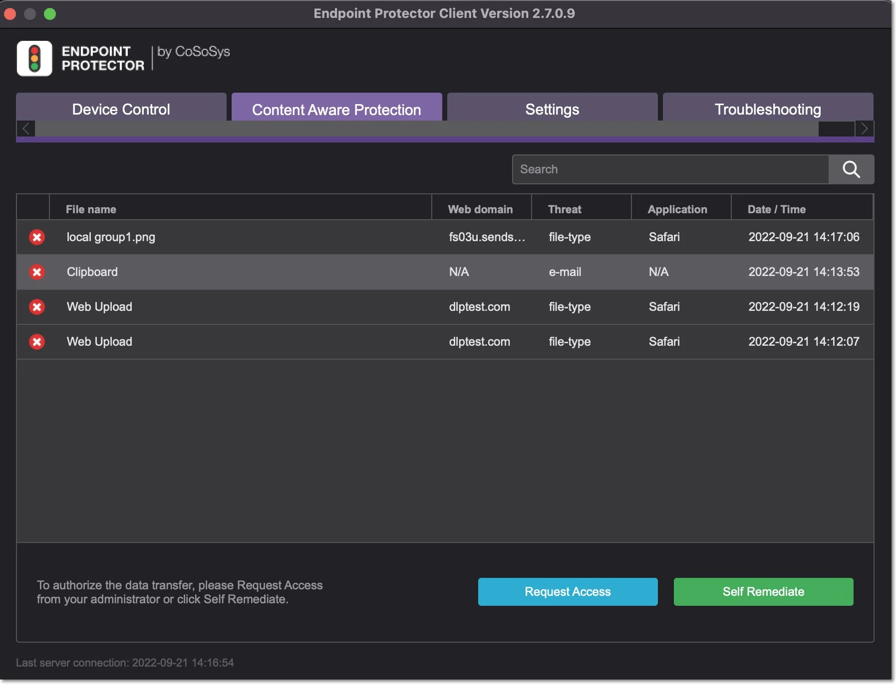

# Content Detection, Remediation and Compliance

Content detection identifies sensitive data across various file types and applications. Remediation
allows users to resolve policy violations, while compliance ensures adherence to regulations like
HIPAA and GDPR. By configuring detection rules, denylists, allowlists, and contextual filters,
organizations can control the transfer of sensitive information and mitigate risks associated with
data leakage.

## Content Detection Summary

The Custom Detection Summary displays all predefined content, custom content, regular expressions,
and HIPAA which were checked in the Content Aware Policy.

You can use the Content Detection Rule to define the policy by combining multiple criteria using the
operators **AND**, **OR**.

To edit a Content Detection Rule, click **Edit** and then, on the Define operation section, provide
the following information:

- Select operator - OR (default), **AND**
- Enable **Threshold** and type the number adjacent to each entry from 1 to 1000; this will disable
  the Global Threshold setting from the Content Detection, Remediation and Compliance section.
- Add item and select from the drop-down Personal Identifiable Information; before saving the
  operation, you can change PIIs by selecting from the drop-down list. To delete an entry from the
  list, click **x** adjacent to each PII.
- **Add group**

Use the up and down arrows or drag and drop an entry from the list to change the order from the
operation.

To Restrict Content Detection, select from the drop-down list the file types you want to apply the
Content Detection Rule to.

If no file type is set, the content defined in the content Detection Rule will be searched in all the
file types that are not blocked by this policy.

The Context Detection Rules allows you to specify the minimum or maximum number of contexts matches
for one or more threat types previously defined in the Content Detection Rule and reducing false
positive detections.

:::warning
You can create Context Detection Rules only if you define a Content Detection Rule using
an OR operator.
:::

To create a new Context Detection Rules click **Add**, fill in the following and then **Save**:

- Name – add a name for the context detection rule
- Apply Contextual for Items – select from the drop-down list the predefined content selected in the
  Content Detection Rule
- Proximity – add a number between 50 and 3000
- Included Context – select the AND/OR operator and then select from the drop-down list the custom
  content, RegEx or HIPPA you want to be included in the rule
- Excluded Context – select the AND/OR operator and then select from the drop-down list the custom
  content, RegEx or HIPPA you want to be excluded from the rule

    :::note
    Custom content used in Content Detection rules will not be displayed in the included
    and excluded context drop-down lists.
    :::

- Apply context rule for - select if you want to apply the rule to All items or At least 1 item.

    :::note
    You can create a maximum number of 15 Context Detection Rules.
    :::

:::warning
To address conflicts between per-policy and Global Contextual Rules, Endpoint Protector
clients no longer receive Global Contextual Rules if at least one policy has its individual
Contextual Rule set. This marks the deprecation of Global Contextual Rules, emphasizing the
prioritization of individual policy configurations.
:::

## Policy Denylists and Allowlists

The policy denylist and allowlist specify the content to be detected – it includes file type
filtering, predefined content filtering, custom content filtering, file allowlists, regular expressions
and domain allowlists, deep packet inspection, etc.

:::note
Upgrade to Endpoint Protector 5.9.4+ to take advantage of increased denylist/allowlist
capabilities: 1000 lists (previously 10/100) and 50,000 entries per list.
:::

### Policy Denylists

You can use the following Denylists:

- File Type - since many files (e.g.: Programming Files) are actually .TXT files, we recommend more
  precaution when selecting this file type to avoid any unexpected effects.

    :::note
    File type detection will not always work accurately for some very large
    password-protected Microsoft Office files.
    :::

- Source Code - An N-gram based detection method is used to increase the accuracy of these file
  types. However, as various source code is closely linked together (e.g.: C, C++, etc.), these also
  are checked. To make things easier, Endpoint Protector automatically marks these correlations.

When the Deep Packet Inspection is enabled an extended way to monitor Git is available. If Git is
selected from the Restricted Apps, Git-related actions (fetch, clone, push, pull) will be blocked,
regardless of the git application used. This will result in completely blocking Git. However, Deep
Packet Inspection Allowlists can be used to allow a specific Git, linked to a specific domain (e.g.:
internalgit.mydomain.com).

:::note
All Git traffic is encrypted therefore, allowing a specific domain will result in any file
transfers to be allowed, regardless of content or other policy restrictions defined.
:::

If Git is selected from Restricted Apps, no Endpoint Protector client notifications and logs will be
generated for the Git-related actions (fetch, clone, push, pull).

**Italian SSN and ID Usage**

Starting with Endpoint Protector server version 5.7.0.0, Italian SSN was added to the PII list.
Similar to Italian ID, if selected from the list of PIIs, the SSN will detect the same entity.

:::info
When using Italian SSN and ID, we recommend you upgrade to the latest Endpoint
Protector agent version.
:::

To maintain compatibility with older agent versions after the server upgrade, Italian ID will remain
under section ID and server upgrade will retain previous settings, including Italian ID.

- Use Italian SSN when deploying to agent versions xxx and later
- Use Italian ID when deploying to agent versions xxx and earlier
- Use both Italian SSN and ID for a mixed environment of new and older agent versions

Because the Italian SSN and ID detect the same entity, do not select Italian ID to avoid multiple
reporting results.

The new Endpoint Protector agent versions will report on both Italian ID and SSN.

- Predefined Content - the majority of the Predefined Content items are country-specific (e.g.
  Australia, Canada, Germany, Korea, United Kingdom, United States, .etc.). To avoid a large number
  of logs or potential false positives, only enable the Passports that apply to your region or
  sensitive data.
- Custom Content
- File Name
- File Location
- Regular Expressions
- HIPAA
- Domain and URL

### HIPAA Compliance

Any Content Aware Protection policy automatically becomes a HIPAA policy if any options from the
HIPAA tab are selected. The available options refer to FDA-approved lists and ICD terms. These will
automatically report or block transfer files containing PII like Health Insurance Numbers, Social
Security Numbers, Addresses, and much more.

:::note
For a HIPAA policy to be effective and more accurate, it is recommended to utilize
Contextual Detection Rules in conjunction with Predefined Content and Custom Content filters. To
enhance precision, users should also enable ‘Whole Word Only’ under Custom Content. The ICD-11
dictionary focuses solely on specific terms, not insurance codes.
:::

:::note
It is advisable to set appropriate thresholds and combinations of arguments to minimize
false positives for shorter disease descriptions
:::

### Policy Allowlists

You can use the following Allowlists:

- MIME Type
- Allowed Files
- File Location
- Network Share
- Email Domain
- URL Name
- Deep Packet Inspection

:::note
For detailed information on Denylists and Allowlist, refer to the
[Denylists and Allowlists](/docs/endpointprotector/admin/denylistsallowlists/overview.md) topic.
:::

:::warning
The Content Aware Protection Policies continue to report and/or block sensitive data
transfers from protected computers even after they are disconnected from the company network. Logs
will be saved within the Endpoint Protector Client and will be sent to the Server once the
connection has been reestablished.
:::

## DPI Monitored URL Categories

You can define the monitored URL categories the Deep Packet Inspection will filter. If none is
selected, Deep Packet Inspection will filter all content uploaded for any URL.

You can add, delete and edit [Denylists and Allowlists](/docs/endpointprotector/admin/denylistsallowlists/overview.md) from the
Denylists and Allowlists section.

## Policy Entities

The final step in creating a policy is selecting the entities that it will apply to from the
available ones:

- Departments
- Groups
- Computers
- Users

:::note
If a Content Aware Policy was already enforced on a computer, user, group, or department,
when clicking on it, the corresponding network entities on which it was applied will be highlighted.
:::

You can also define a list of entities that will be excluded from the policy by selecting from the
Excluded section.

## Block and Remediate Policies

Block and Remediate policies are a category of Content Aware Policies. This category of policies
gives the end-user the possibility to resolve the Content Aware threats by using justifications.

You can create Block and Remediate Content Aware Policies from the Content Aware Protection section,
Create Content Aware Policies, Policy Action, Block and Remediate.

When detected, Content Aware threats are displayed:

- in the Endpoint Protector notifier, the Content Aware tab
- as pop-up notifications if this option is enabled from the Settings section

To remediate the threat, the user has to follow these steps:

**Step 1 –** Open the Endpoint Protector notifier and go to the **Content Aware Protection** tab.

**Step 2 –** Select the file for remediation and click Self **Remediate**.

**Step 3 –** On the Self Remediate section:

- select a **justification** from the drop-down list
- add a **reason** for the justification (if required)
- navigate to the custom **URL** situated under the logo
- add your credentials if the **Require Credentials** setting was enabled (click the username icon
  to refresh your current username)
- add the **number of minutes** needed to remediate the device (you can hover over the default
  number to view the maximum time interval)
- click **Authorize**

:::note
You can manage more settings for the Self Remediate feature from System Preferences and
[User Remediation](/docs/endpointprotector/admin/systempar.md#user-remediation) sections.
[User Remediation](/docs/endpointprotector/admin/systempar.md#user-remediation) sections.
:::

User Remediation for Content Aware Protection can remediate file transfers via web domains.

To apply User Remediation on specific web domains, enable Deep Packet Inspection from
Global/Computers/Users/Group. This feature will then be enabled by default for Browsers and Desktop
Email applications.

To enable Deep Packet Inspection for other applications, navigate to the **Content Aware
Protection** module, specifically the **Deep Packet Inspection** section, and manually activate it
in the **Actions** column.

- When Deep Packet Inspection is enabled – you can apply User Remediation for files transferred on a
  specific web domain.

    For example; If you upload a file on uploadsite.com and apply User Remediation, you can only
    upload on uploadsite.com, not on otheruploadsite.com.

- When Deep Packet Inspection is disabled – you can only apply User Remediation for files transferred
  on a specific application.

    For example; If you upload a file on Chrome and apply User Remediation, you can upload the file on
    any URL from Chrome.

You can view the web domains used for the User Remediation in the Endpoint Protector Client, the
Content Aware Protection tab on the Web Domains column.

## Applying multiple Content Aware Policies

Content Aware Protection is a very versatile tool, where you can perform the granular implementation
of actions regarding the report and/or block and report of files.

A Content Aware Policy is a set of rules for reporting or blocking & reporting the selected
information. All the other options left unchecked will be considered as Ignored by Endpoint
Protector.

When applying two policies to the same PC, it is possible to block one type of file, for example, PNG
files, when they are uploaded through Mozilla Firefox, while a second policy is to report only PNG
files when they are uploaded through Internet Explorer. In the same way, it is possible to report
only files that contain confidential words from a selected dictionary that are sent through Skype,
while the second policy is to block the same files if they are sent through Yahoo Messenger.
Similarly, it is possible to create combinations that block a file type or a file that contains
predefined content/custom content/regular expression for one application, while letting it through
reporting it only for another.

The following rules are used in the application of one or more Content Aware Policies on a
computer/user/group/department for each separately selected item (e.g., a specific file type,
predefined information, or a custom content dictionary):

| Policy A with Priority 1 | Policy B with Priority 2 | Policy C with Priority 3 | Endpoint Protector Action                    |
| ------------------------ | ------------------------ | ------------------------ | -------------------------------------------- |
| IGNORED                  | IGNORED                  | IGNORED                  | Information will not be blocked or reported. |
| IGNORED                  | IGNORED                  | REPORTED                 | Information will be reported.                |
| IGNORED                  | REPORTED                 | REPORTED                 | Information will be reported.                |
| REPORTED                 | REPORTED                 | REPORTED                 | Information will be reported.                |
| IGNORED                  | IGNORED                  | BLOCKED                  | Information will be blocked.                 |
| IGNORED                  | BLOCKED                  | BLOCKED                  | Information will be blocked.                 |
| BLOCKED                  | BLOCKED                  | BLOCKED                  | Information will be blocked.                 |
| IGNORED                  | REPORTED                 | BLOCKED                  | Information will be reported.                |
| IGNORED                  | BLOCKED                  | REPORTED                 | Information will be blocked.                 |
| REPORTED                 | IGNORED                  | BLOCKED                  | Information will be reported.                |
| BLOCKED                  | IGNORED                  | REPORTED                 | Information will blocked.                    |
| REPORTED                 | BLOCKED                  | IGNORED                  | Information will be reported.                |
| BLOCKED                  | REPORTED                 | IGNORED                  | Information will be blocked.                 |

:::warning
The information left unchecked when creating a policy will be considered as Ignored by
Endpoint Protector and not as Allowed.
:::

The deep packet inspection feature has been expanded to email scanning based on domain allowing.

:::info
HIPAA should be considered a Content Aware Policy that, besides the options in
the HIPAA tab, also has the below configuration:
:::

- All the File Types recognized should be included.
- All Personal Identifiable Information should be Country Specific to the United States (Address,
  Phone/Fax, and Social Security Numbers)
- Both Internet Protocol Addresses Access should be selected
- The URL and Domain Allowlists options should also be checked

HIPAA policies can be created and used on their own or in combination with regular policies, for
better control of the data inside the network. These policies are available for Windows, Mac OS X,
or Linux computers.

