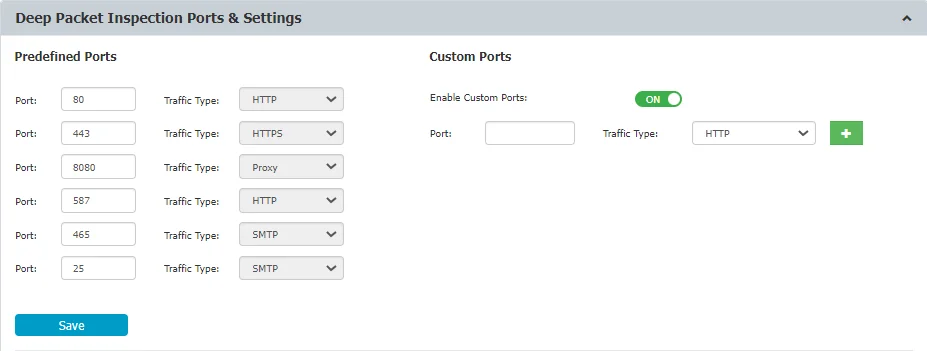
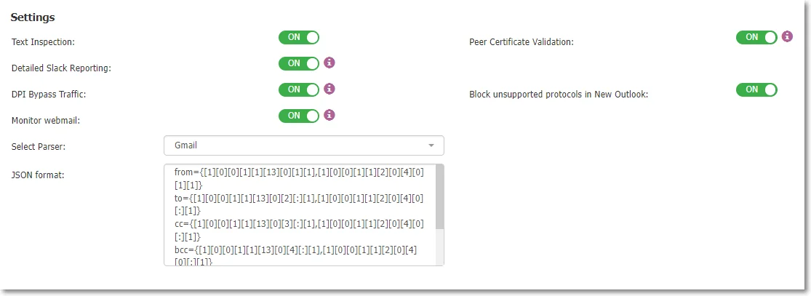
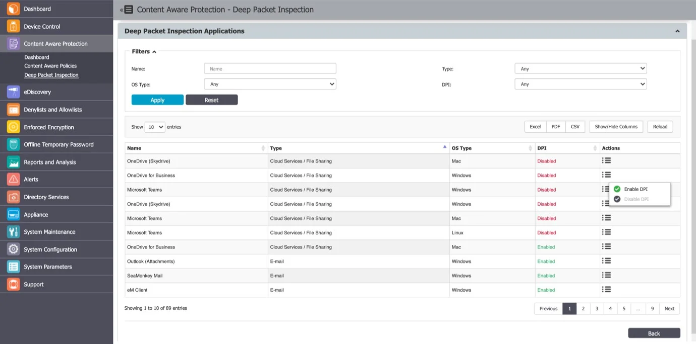

# Deep Packet Inspection

The Deep Packet Inspection functionality provides a certain degree of granularity, allowing you to
fine-tune the content inspection functionality to the network specifications.

:::note
Enabling Deep Packet Inspection could impact upload speed of inspected files. Use our
network extension instead of Packet Filter as a possible workaround (i.e., turn Intercept VPN Traffic
on).
:::

:::warning
Newer Linux Ubuntu versions have 'snap'-based applications installed by default,
affecting Endpoint Protector Client functionality. This may result in missing file-related events in
DPI file resolution. The reliance on 'snap'-based applications also affects file-related web browser
activities, exacerbating this limitation. Consider non-’snap’-based applications (where possible) as
alternative configurations for optimal functionality.
:::

:::warning
To ensure consistent DPI behavior after enabling or disabling the feature or upgrading
the Endpoint Protector, a restart of your computer is required.
:::

## Stealthy DPI vs. regular DPI

What are the different network visibility strategies available on Windows?

-   Stealthy DPI: Taps into a newly established network flow, where the content is extracted, decrypted, analyzed, encrypted, and then reintroduced. This method creates a direct network flow between the original application and the internet, without intermediaries.
-   Regular DPI (Redirect-Based): Redirects network traffic to a transparent proxy server on localhost before it reaches the internet. This approach results in observable traffic directed to the localhost proxy on the local computer.

How do Stealthy DPI and Redirect-Based DPI compare in terms of EPP Client functionality?

-   Stealthy DPI and Redirect-Based DPI are functionally similar and require no changes to Endpoint Protector policies. Users can select the mode that best suits their infrastructure preferences. Both methods use the same resources and generate identical events.
-   However, they differ in handling bypasses for failed connections:
    -   Regular DPI (Redirect-Based): Offers more flexibility by allowing a feature to bypass connections that cannot be intercepted, with the proxy rebuilding the network connection to the destination after a failure.
    -   Stealthy DPI: Achieves a similar bypass result using the improved "DPI Bypass" feature available in Endpoint Protector version 5.9.3.0.

When should you choose Stealthy DPI over Regular DPI (Redirect-Based)?

-   Third-Party DLP or Firewall Software: If third-party software has trouble handling or blocking network traffic originating from a local proxy, switching to Stealthy DPI is recommended.
-   Security-Enhanced Applications: If certain applications experience connectivity issues with Regular DPI (Redirect-Based), opting for Stealthy DPI can resolve these issues.

## Deep Packet Inspection Diagrams

The diagrams below illustrate the high-level logic for Deep Packet Inspection (DPI) across different operating systems. Additionally, they illustrate the distinctions between Stealthy and Regular DPI modes of operation for macOS.

### For Windows
- regular DPI

- Stealthy DPI:

### For MacOS
- intercept VPN off:

- intercept VPN on:

### For Linux

## Deep Packet Inspection Certificate

The Deep Packet Inspection functionality uses Certificates generated from Endpoint Protector Root
Certificate Authority to intercept network traffic by Deep Packet Inspection and for Client-Endpoint
Protector Server communication.

Endpoint Protector offers the option to automatically refresh Certificates with various scheduling
alternatives. After a new Certificate is generated, it will be sent in to the Client and replace the
existing one.

To configure Deep Packet Inspection - Auto-refresh Certificate feature, please reference the following
steps:

**Step 1 –** Go to **System Configuration** > **System Settings**> **Deep Packet Inspection -
Auto-refresh Certificate** and chose **Automatically** option

**Step 2 –** Choose one of available scheduling options and **Save** changes.

**Step 3 –** New Certificate will be distributed automatically to the endpoints after it is
generated.

**Step 4 –** Reboot the endpoint to enforce a new Certificate.

EPP DPI module generates a certificate only at the first time a user visits a website and caches that certificate for subsequent visits to the same website. The certificate cache deletion interval can be configured in EPP Server versions 5.8.0.0 and above (please refer to this UM section [System Settings - DPI certificate](/docs/endpointprotector/admin/systemconfiguration/systemsettings) . Alternatively, the certificate cache is cleared either upon computer reboot or when the DPI feature is disabled.

Endpoint Protector employs the same criteria as the Chromium open-source web browser for verifying website certificates, referencing the corporate CA certificates found in the system certificate stores. You can assess this validation by using diagnostic websites like https://badssl.com/.

If needed, this feature can be configured through the DPI Bypass option described here [Global Settings - DPI configuration](/docs/endpointprotector/admin/dc_module/globalsettings#dpi-configuration).

### DPI on Windows

:::note
Issuing the Deep Packet Inspection Certificate on Windows is handled automatically and
transparently by the Endpoint Protector Client. No additional steps are required.
:::

### DPI Certificate on macOS

Due to the latest changes in the macOS 11.0 that affect Deep Packet Inspection, a new Root
Certificate is needed in order for the Deep Packet Inspection feature to work on the mentioned macOS
version.

:::note
Deep Packet Inspection will only work on macOS 11.0 and newer if Deep Packet Inspection
Certificate is added for the Endpoint Protector Client.
:::

This certificate can be downloaded from System Configuration, System Settings, and Deep Packet
Inspection Certificate and added manually or automatically through deployment solutions.

To add it manually, follow these steps.

**Step 1 –** Go to **System Configuration** >**System Settings** >**Deep Packet Inspection
Certificate**,

and download the **CA Certificate**.

**Step 2 –** Open the **Keychain Access** application from your macOS and select **System**.

**Step 3 –** Decompress the downloaded **ClientCerts** file.

**Step 4 –** Select **cacert.pem** file and drag and drop it on **System** > **Keychain Access**.

**Step 5 –** Double click the **X** from the newly added certificate and from the Trust section,
select **Always Trust**.

**Step 6 –** **Save** the changes.

:::warning
Please be aware that regenerating the Server Certificate Stack will require macOS and
Linux users to manually add the new certificate into the keychain. On Windows, the certificate will
be updated automatically.
:::

### DPI Certificate on Linux

Due to system-level requirements in Linux, adding the Deep Packet Inspection certificate involves
specific steps to ensure compatibility. The certificate enables Endpoint Protector to perform secure
inspection for printing and file transfers to MTP devices. The process differs slightly for
Debian-based and Red Hat-based systems.

:::note
Ensure the cacert.pem certificate is downloaded from the Endpoint Protector Server and
properly configured for your Linux distribution.
:::

Follow the steps below, specific to your Linux distribution, to configure the certificate manually.

**Debian-based Systems (e.g., Ubuntu)**

**Step 1 –** Download the archived certificates from the Endpoint Protector Server.

**Step 2 –** Unzip the certificate file:

**unzip ClientCerts.zip**

**Step 3 –** Copy the cacert.pem file to the trusted certificate directory and rename it to .crt:

**sudo cp cacert.pem /usr/local/share/ca-certificates/cacert.crt**

**Step 4 –** Update the system's certificate store:

**sudo update-ca-certificates**

Red Hat-based Systems (e.g., RHEL, Fedora)

**Step 1 –** Download the archived certificates from the Endpoint Protector Server.

**Step 2 –** Unzip the certificate file:

**unzip ClientCerts.zip**

**Step 3 –** Copy the cacert.pem file to the appropriate directory for trusted anchors:

**sudo cp cacert.pem /etc/pki/ca-trust/source/anchors/**

**Step 4 –** Update the system's certificate store:

**sudo update-ca-trust**

Additional Resources

For more details on certificate installation and management on Linux, see the following references:

- [Installing a Root CA Certificate in Ubuntu's Trust Store](https://ubuntu.com/server/docs/install-a-root-ca-certificate-in-the-trust-store)
- [Configuring the CA Trust List on Red Hat](https://www.redhat.com/en/blog/configure-ca-trust-list)
- [Managing CA Certificates on Linux](https://www.baeldung.com/linux/ca-certificate-management)

:::warning
Ensure the certificate is added correctly for the Endpoint Protector Client to function
properly. If the Server Certificate Stack is regenerated, Linux users must manually reconfigure the
certificate using the steps above.
:::

## Deep Packet Inspection Ports and Settings

From this section, you can correlate the monitored applications with the ports used in each network,
manage settings and add allowed domains for the Gmail provider.

By default, the Deep Packet Inspection functionality comes with a list of predefined ports (80, 443,
8080, etc.). You can add ports from this section, if custom ports are used in a specific network,
particularly by one of the monitored applications defined as an Exit Point within a Content Aware
Protection Policy.

:::note
The "Local" flag setting will only function with "Stealthy DPI" on Windows and "Intercept VPN Traffic" on macOS. It is not operational on Linux.
:::

In this section you can also manage the following settings:

- Text Inspection - enable this setting to monitor confidential content typed in Teams, Skype, Slack,
  Mattermost or Google Spreadsheet, Facebook Post, Facebook Comment, and Instagram Comment online
  applications.

    :::note
    For comprehensive visibility while using 'Teams over web' in a MS Edge browser, make
    sure to enable **Edge** under **Policy Exits Points** > **Applications** > **Web Browser** in
    the CAP policy.
    :::

    :::warning
    In blocking mode, Instant Messaging events related to platforms such as Slack and
    Google Chat might be generated multiple times. This behavior is attributed to the tools'
    inherent retry mechanisms when a message is blocked. Endpoint Protector is designed to block all
    such retry attempts for enhanced security.
    :::

- Detailed Slack Reporting – to access this setting, ensure Text Inspection is enabled and use
  Reporting V2 from **System Configuration** > **System Settings**. Once enabled, you can view
  Destination Details for Slack on the Content Aware Report page in the Reports and Analysis
  section.

    :::note
    This setting requires an active Internet connection for the Endpoint Protector Client.
    :::

- Block unsupported protocols in New Outlook – Enable this setting to block unsupported protocols and the send email function in New Outlook without affecting legacy Outlook. Recommended for those not using the EPP add-in to limit the app as an egress channel. Keep off if EPP add-in is used.

- Monitor webmail – Enable this setting to scan the subject and body for Gmail, Outlook and Yahoo on
  the browser. Attachments will be monitored regardless of this setting.

    :::warning
    When using Yahoo, the email recipients whitelist for attachments will work only if
    the attachment is uploaded after the recipients are added. If the recipients are modified after
    the attachment has been added, the file will not be scanned again and validated against the new
    recipients list. Inconsistent behavior may be experienced on Linux machines.
    :::

    You can also use the Monitor webmail feature to detect source code for web browsers emails in
    subject and body. For email applications, source code can be detected in subject, and for the
    body, source code cannot be enabled for detection without breaking other functionality.

    :::note
    Always use Monitor webmail with Extended Source Code Detection setting enabled.
    :::

- Allowed domains for Google Business accounts - You can use this setting to allow the users to
  access specific Google domains for professional usage when Deep Packet Inspection is enabled.

    To specify the allowed business accounts, type an entry on the Add allowed Business accounts and
    then click **+**

    The new entry will be displayed on the Allowed Business accounts list, from where you can delete
    by clicking **X**.

    :::warning
    Endpoint Protector will block access to all Google domains (business and private)
    used for Gmail, Google Drive, Google Docs, etc. that are not listed here. If the list remains
    empty, no Google domain will be blocked.
    :::

    :::warning
    "To include consumer Google Accounts, such as those ending in @gmail.com and @googlemail.com, enter "consumer_accounts" in the list instead of "gmail.com". This change is necessary, and the current issue is being closed as "won't fix". We may consider opening a documentation task to link the relevant Google document to our user manual. For more information, refer to: [Google Support](https://support.google.com/a/answer/1668854?hl=en).
    :::

### Monitor Webmail JSON Format Parser Usage

To use this setting, you need to be familiarized with JSON concepts and structures.

Go over the following Syntax examples considering the values used are the default values from the
Endpoint Protector Server UI:

- You can specify multiple paths, separated by a comma "," inside the curly brackets. The paths will
  then be parsed and used, in the specified order, one by one, until the information is successfully
  extracted

- \[:] takes all entries from the array and parses the result, and can be used with both of the
  following examples:

1. Subject extraction example for Yahoo:

    `__subject={requests[:].payloadParts[:].payload.message.headers.subject}__`

    - Uses named key-value pairs and arrays (\[])

        for example; If the \[:] array located at the requests key has 3 elements, the path will be
        expanded for each element:

        - requests\[0].payloadParts\[:].payload.message.headers.subject
        - requests\[1].payloadParts\[:].payload.message.headers.subject
        - requests\[2].payloadParts\[:].payload.message.headers.subject

        The process is then repeated for the payloadParts array,

1. Subject extraction example for Gmail:

    `__subject={[1][0][0][1][1][13][0][7]}__`

    - Uses only nested arrays
    - The subject here is located at a specific path inside nested arrays without having to go
      through all elements of a specific array and use \[:]

:::info
It is advised, that due to recent changes applied by cloud providers, to not
apply any changes in the JSON parser, unless Monitor Webmail is not working
:::

## Deep Packet Inspection Applications

From this section, you can enable or disable the Deep Packet Inspection functionality for each
application that is subject to this functionality.

:::note
Only the applications that support Deep Packet Inspection are available in the list below.
:::

:::note
The Deep Packet Inspection functionality needs to be first enabled from **Device
Control** > **Settings** (Global, Groups, Computers, etc.). For detailed information on, refer to
the [Device Control](/docs/endpointprotector/admin/dc_module/dcmodule.md) topic.
:::

## Certificate status matrix

The following table lists when Endpoint Protector Server reports specific states:

| OS      | is Available | is Trusted | Server Side |
| ------- | ------------ | ---------- | ----------- |
| macOS   | N/A          | N/A        | N/A         |
| macOS   | N/A          | 0          | N/A         |
| macOS   | N/A          | 1          | N/A         |
| macOS   | 0            | N/A        | Not added   |
| macOS   | 0            | 0          | Not added   |
| macOS   | 0            | 1          | Not added   |
| macOS   | 1            | N/A        | Not trusted |
| macOS   | 1            | 0          | Not trusted |
| macOS   | 1            | 1          | Trusted     |
| Linux   | N/A          | N/A        | N/A         |
| Linux   | N/A          | 0          | N/A         |
| Linux   | N/A          | 1          | N/A         |
| Linux   | 0            | N/A        | N/A         |
| Linux   | 0            | 0          | N/A         |
| Linux   | 0            | 1          | N/A         |
| Linux   | 1            | N/A        | N/A         |
| Linux   | 1            | 0          | N/A         |
| Linux   | 1            | 1          | N/A         |
| Windows | N/A          |            | N/A         |
| Windows | 0            |            | Not added   |
| Windows | 1            |            | Trusted     |

:::note
Linux has dedicated certificate stores.
:::

:::note
On Windows, if the certificate is added, it is automatically trusted.

:::
