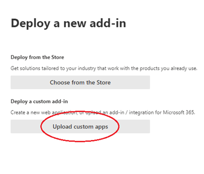
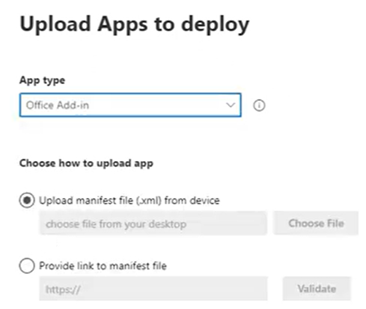

# Content Aware Protection for New Outlook

Starting from Endpoint Protector Clients version 5.9.4.3, New Outlook can be fully managed as a Content Aware Protection Exit Point via the Microsoft 365 Web Add-in. Unlike COM add-ins for classic Outlook, which are installed directly on individual endpoints, Microsoft Web Add-ins need to be deployed centrally using the Microsoft 365 Admin Center or manually within the user account in Outlook application.

Microsoft 365 Web Add-ins are associated with user accounts rather than computers or devices. Once an add-in is deployed to a user account, every device that the user employs to access that account will have the add-in available. This means it cannot be restricted to just one device, such as the user's Mac computer only.

For detailed instructions and more information, please refer to the official documentation available through Microsoft and Endpoint Protector resources:
- [Microsoft resources](https://learn.microsoft.com/en-us/office/dev/add-ins/overview/office-add-ins)
- [Centralized deployment FAQ](https://learn.microsoft.com/en-us/microsoft-365/admin/manage/centralized-deployment-faq?view=o365-worldwide)

:::note
Both Netwrix and Microsoft recommend deploying the add-in in phases, starting with a few users who work in IT and security or are business stakeholders, then selected groups of users, and finally the whole organization.
:::

:::warning Important
It is important to configure the policy correctly so that the add-in is deployed selectively, rather than to all users—especially those who do not require it. Also the javascript's variables configuration allows for the add-in to remain inactive or non-obtrusive unless the EPP agent is running on a device. This ensures that the add-in does not block operations unnecessarily if the agent is not active. Please refer to dedicated subchapter [Default Behavior of New Outlook Add-in and EPP Client](#default-behavior-of-new-outlook-add-in-and-epp-client).
:::

When you install an add-in in Outlook.com, it will also appear in other versions of Outlook. For example, if you install an add-in in Outlook.com, you will see it when you open the desktop version of Outlook.

The EPP Client will also enforce the Content Aware Policies on those accounts when accessed through Outlook on the Web, with no additional configuration needed. Note that the presence of the add-in is not displayed in the Outlook interface.

To obtain the Outlook add-in manifest and validator files, visit the latest announcements on the <a href="https://community.netwrix.com/t/version-5-9-4-3-released-now-with-hotfix-1/15972" target="_blank" title="Netwrix community portal" alt="Netwrix community portal">Netwrix community portal</a> or contact <a href="https://www.netwrix.com/support.html" target="_blank" title="Netwrix Support" alt="Netwrix Support">Netwrix Global Services &amp; Support</a>.

## Requirements

To ensure full configuration and functionality of the EPP Microsoft New Outlook add-in, three dependencies must be addressed collectively:

1. Update EPP Clients\
Ensure that all Endpoint Protector (EPP) Clients are updated to at least version 5.9.4.3. This version is necessary to support the features and capabilities of the new add-in.

2. Deploy configured Microsoft Outlook Add-in (manifest.xml)\
Configure and deploy the Microsoft Outlook add-in and assign it to the relevant user accounts. This can be managed centrally via the Microsoft 365 Admin Center or manually on individual user accounts.

3. Host Validation Part and Icons\
The Endpoint Protector add-in requires certain files to be hosted by the customer and accessible from the internet. This includes:

   - **mainpage.html** - Needs to be hosted; this is the entry point of the add-in.
   - **validator.js** - The script that performs the necessary functions for the add-in.
   - **main_64.png, main_128.png** - These icons are also required by Microsoft; otherwise, the add-in cannot be validated by Microsoft admin center.

   Hosting the above ensures that the add-in can communicate appropriately with the EPP system to enable its functionalities.

   :::warning Important
   Having any downtime to the hosted files (mainpage.html, validator.js) will result in an impossibility to send ANY emails for the users that have the add-in assigned to their account.
   :::

   :::note
   It is recommended that the two files, mainpage.html and validator.js, be hosted together in the same directory (folder) and be accessible from the internet. If you choose to host the files differently, you must update the link to the validator in mainpage.html by modifying the "src" attribute as follows:
   ```html
   <script type="text/javascript" src="https://domain.com/validator.js"></script>
   ```
   :::

4. Standard EPP Content Aware Protection Policy\
Ensure that a standard Endpoint Protector (EPP) Content Aware Protection (CAP) policy is set up with the appropriate Outlook definition.

5. Deep Packet Inspection Setting\
Ensure that the setting under Content Aware Protection → Deep Packet Inspection called "Block Unsupported Protocols in New Outlook" is turned off. This setting is no longer needed if the EPP add-in is in use.

:::note
On MacOS a EPP certificate is utilized to ensure secure communication between the add-in and the EppClient. Please refer to the existing User Manual chapter for [detailed instructions](https://docs.netwrix.com/docs/endpointprotector/admin/cap_module/deeppacket#deep-packet-inspection-certi%EF%AC%81cate-on-macos). If you have configured DPI certificate on MacOS, you can ignore this note.
:::

## Pre-configuring add-in (manifest.xml)

At the core of any Office Add-in is the manifest file (.xml). This file acts as the blueprint for the add-in, containing:

- **Basic Information:** Includes the name, version, and description of the add-in.
- **Entry Points:** Specifies the URLs that direct Outlook to the hosted HTML and JavaScript files.
- **Permissions & Capabilities:** Defines what the add-in can do, such as accessing email data.
- **Icons:** Visual assets that appear in Outlook, enhancing the add-in's interface.

In short, the manifest tells Outlook how to integrate and run the add-in. If the manifest is missing or incorrect, the add-in won't function properly.

In order to prepare the Netwrix EPP add-in for Outlook accounts, the provided template needs to be updated in several places listed below. All these places are marked with the comment `<!-- CUSTOMER EDIT: xxxxxxx-->`.

1. Define icons location\
This part is mandatory for Microsoft add-in validator. Edit it by defining proper URL to mentioned files.

    ```xml
    <!-- CUSTOMER EDIT: optionally, you have to change the icon of the add-in -->
    <IconUrl DefaultValue="https://www.example.com/validator/main_64.png" />

    <!-- CUSTOMER EDIT: optionally, you have to change the high resolution icon of the add-in -->
    <HighResolutionIconUrl DefaultValue="https://www.example.com/validator/main_128.png"/>
    ```

2. Define domain name for add-in url
    Edit it by defining proper domain.

    ```xml
    <!-- CUSTOMER EDIT: add here the domain name of the add-in URL, for example: www.example.com -->
    <AppDomain>www.example.com</AppDomain>
    ```

    Make sure that every domain in the URLs of the hosted files is added to the `<AppDomains>` list:
    - If the same domain is used for all URLs, it only needs to be added once.
    - Extend the existing list by adding your domain at the end between the `<AppDomain></AppDomain>` tags, and before the closing `</AppDomains>` tag.

3. Define validator location\
    Edit it by defining proper URL to validator.

    ```xml
    <DesktopSettings>
    <!-- CUSTOMER EDIT: add here the URL of the add-in main page, for example:
    https://www.example.com/validator/mainpage.html. The URL MUST be a valid HTTPS URL
    and point to the "mainpage.html" file provided in this package.
    -->
    <SourceLocation DefaultValue="https://www.example.com/validator/mainpage.html" />
    ```

4. Define mainpage validator\
    Edit it by defining proper URL to mainpage validator.

    ```xml
    <bt:Urls>
    <!-- CUSTOMER EDIT: add here the URL of the add-in main page, for example:
    https://www.example.com/validator/mainpage.html. The URL MUST be a valid
    HTTPS URL and point to the "mainpage.html" file provided in this package.
    -->
    <bt:Url id="residUILessFunctionFileUrl"
    DefaultValue="https://www.example.com/validator/mainpage.html" />
    ```

:::warning Important
Ensure these URLs are correctly hosted on your server and accessible via the internet to enable required functionalities for the add-in.
:::

## Default Behavior of New Outlook Add-in and EPP Client

The default behavior of the New Outlook add-in and EPP Client will align with the EPP Content Aware Protection (CAP) policy defined for email and Outlook actions. This includes capabilities such as reporting, blocking, and other egress channel controls when specific conditions are met.

However, the add-in has a predefined, hardcoded behavior when it cannot communicate with the EPP Client, assuming the EPP Client is not present. In this scenario, it is configured to allow sending messages. For customers who wish to enforce a restrictive policy that blocks the option to send out emails, this option is available.

**To change that:**

1. Edit hosted **validator.js** file.
2. In first line edit value:
   ```javascript
   const DEFAULT_ACTION = true; // true = Allow, false = block
   ```
3. Change argument value "true" for "false".

:::warning Important
Use this option carefully and ensure it is aligned with your rollout plan to avoid interruptions in essential business email communication.
:::

## Default Blocking Message of New Outlook Add-in

There is also an option to replace the add-in default message in the tooltip prompt in the email editor window in New Outlook with a custom one.

**To change that:**

1. Edit hosted **validator.js** file.
2. Edit 2nd line "DEFAULT_MESSAGE" value:
   ```javascript
   const DEFAULT_MESSAGE = "This email was blocked due to a policy violation. Please review and modify the message before resending.";
   ```

:::note
This prompt supports only one language locale.
:::

 

## Manual Deployment Method

Manual deployment method is not the recommended one as it requires to be repeated on each user account. This method is intended for pilot phases, troubleshooting or feature PoC's.

This option is only available if your organization defines the possibility to add custom add-ins by user.

Refer to official Microsoft KB article: [Use add-ins in Outlook](https://support.microsoft.com/en-us/office/use-add-ins-in-outlook-1ee261f9-49bf-4ba6-b3e2-2ba7bcab64c8)

**Steps:**

1. Host validators and icon files.
2. Preconfigure manifest.xml as described in previous chapter.
3. In your preferred browser, go to https://aka.ms/olksideload. This opens Outlook on the web, then loads the Add-Ins for Outlook dialog after a few seconds:
4. Select **My add-ins**.
5. In the Custom Add-in's section, select **Add a custom add-in**, then choose **Add from file**.
 
6. Select the XML file for the add-in.
7. Select **Open** to install the add-in.
8. After making changes, please allow some time for them to propagate. According to Microsoft, this process can take anywhere from a few minutes to up to 24 hours.

## Central Deployment Method

The central deployment method provides administrators with the capability to deploy the EPP New Outlook add-in in phases across global user populations. This approach helps minimize administrative effort and ensures a smooth implementation process. For detailed guidance, please consult the official Microsoft Knowledge Base (KB): [Office add-ins](https://learn.microsoft.com/en-us/microsoft-365/admin/manage/office-addins?view=o365-worldwide)

**To deploy the add-in through the Microsoft Admin Center (https://admin.microsoft.com/):**

1. Host validators and icon files.
2. Preconfigure manifest.xml as described in the previous chapter.
3. Go to **Settings** → **Integrated apps** → **Add-ins**, select **Deploy Add-in**, and click **Next**.
4. Choose **Upload custom apps**.\
 
5. Under **Upload Apps to Deploy**, choose the **App type** of **Office Add-in**, choose **Upload manifest file (.xml) from device**, and click **Choose File**.\
 
6. After selecting the file and clicking **Next**, under **Add users**, choose **Specific users/groups** and use the search box to populate the search box with the desired groups.\
  
7. When the desired list appears under **To be added**, click **Next** and then click **Accept Permissions**. Review the needed permissions and click **Accept**.
8. Ensure to keep **Deployment Method** as **Fixed (Default)**.
9. Click **Next** and then **Finish deployment**.
10. After making changes, please allow some time for them to propagate. According to Microsoft, this process can take anywhere from a few minutes to up to 24 hours.
