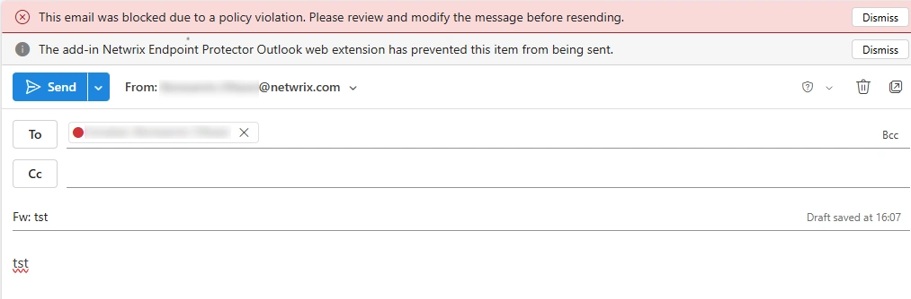
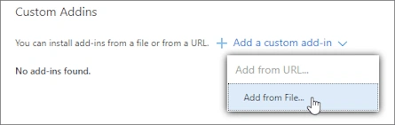
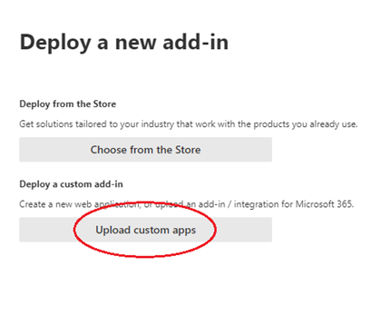
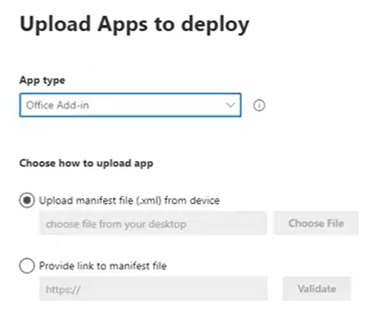
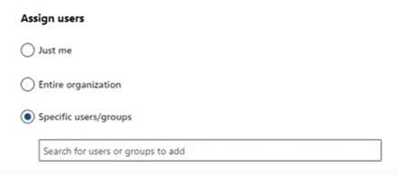

# Content Aware Protection for New Outlook

Starting from Endpoint Protector Clients version 5.9.4.3, New Outlook can be fully managed as a Content Aware Protection Exit Point via the Microsoft 365 Web Add-in. Unlike COM add-ins for classic Outlook, which are installed directly on individual endpoints, Microsoft Web Add-ins need to be deployed centrally using the Microsoft 365 Admin Center or manually within the user account in Outlook application.

Microsoft 365 Web Add-ins are associated with user accounts rather than computers or devices. Once an add-in is deployed to a user account, every device that the user employs to access that account will have the add-in available. This means it can't be restricted to just one device, such as the user's Mac computer only.

For detailed instructions and more information, refer to the official documentation available through Microsoft and Endpoint Protector resources:
- [Microsoft resources](https://learn.microsoft.com/en-us/office/dev/add-ins/overview/office-add-ins)
- [Centralized deployment FAQ](https://learn.microsoft.com/en-us/microsoft-365/admin/manage/centralized-deployment-faq?view=o365-worldwide)

:::note
Both Netwrix and Microsoft recommend deploying the add-in in phases, starting with a few users who work in IT and security or are business stakeholders, then selected groups of users, and finally the whole organization.
:::

:::warning Important
Configure the policy correctly so that the add-in is deployed selectively, rather than to all users—especially those who don't require it. The JavaScript variable configuration also allows the add-in to remain inactive or non-obtrusive unless the EPP agent is running on a device. This ensures that the add-in doesn't block operations unnecessarily if the agent isn't active. Refer to the dedicated subchapter [Default Behavior of New Outlook Add-in and EPP Client](#default-behavior-of-new-outlook-add-in-and-epp-client).
:::

When you install an add-in in Outlook.com, it will also appear in other versions of Outlook. For example, if you install an add-in in Outlook.com, you will see it when you open the desktop version of Outlook.

The EPP Client will also enforce the Content Aware Policies on those accounts when accessed through Outlook on the Web, with no additional configuration needed. The Outlook interface doesn't display the add-in.

To obtain the Outlook add-in manifest and validator files, visit the latest announcements on the <a href="https://community.netwrix.com/t/version-5-9-4-3-released-now-with-hotfix-1/15972" target="_blank" title="Netwrix community portal" alt="Netwrix community portal">Netwrix community portal</a> or contact <a href="https://www.netwrix.com/support.html" target="_blank" title="Netwrix Support" alt="Netwrix Support">Netwrix Global Services &amp; Support</a>.

## Requirements

To ensure full configuration and functionality of the EPP Microsoft New Outlook add-in, three dependencies must be addressed collectively:

1. Update EPP Clients\
Ensure that all Endpoint Protector (EPP) Clients are updated to at least version 5.9.4.3. This version is necessary to support the features and capabilities of the new add-in.

2. Deploy configured Microsoft Outlook Add-in (manifest.xml)\
Configure and deploy the Microsoft Outlook add-in and assign it to the relevant user accounts. This can be managed centrally via the Microsoft 365 Admin Center or manually on individual user accounts.

3. Host Validation Part and Icons\
The Endpoint Protector add-in requires certain files to be hosted by the customer and accessible from the internet. This includes:

   - **mainpage.html** - Needs to be hosted; this is the entry point of the add-in.
   - **validator.js** - The script that performs the necessary functions for the add-in.
   - **main_64.png, main_128.png** - These icons are also required by Microsoft; otherwise, the add-in can't be validated by Microsoft admin center.

   Hosting the above ensures that the add-in can communicate appropriately with the EPP system to enable its functionalities.

   You are responsible for hosting these files. Host them at a publicly reachable URL. The URL of each hosted file must match the value configured in the manifest. The following chapters describe each requirement.

   :::warning Important
   Any downtime affecting the hosted files (mainpage.html, validator.js) will prevent users with the add-in assigned from sending any emails.
   :::

   :::note
   Host mainpage.html and validator.js in the same directory. If you host the files separately, update the validator link in mainpage.html by modifying the `src` attribute as follows:
   ```html
   <script type="text/javascript" src="https://domain.com/validator.js"></script>
   ```
   :::

4. Standard EPP Content Aware Protection Policy\
Ensure that a standard Endpoint Protector (EPP) Content Aware Protection (CAP) policy is set up with the appropriate Outlook definition.

5. Deep Packet Inspection Setting\
Ensure that the setting under Content Aware Protection → Deep Packet Inspection called "Block Unsupported Protocols in New Outlook" is turned off. This setting is no longer needed if the EPP add-in is in use.

:::note
On macOS, an EPP certificate is used to ensure secure communication between the add-in and the EppClient. Refer to the existing User Manual chapter for [detailed instructions](./deeppacket#dpi-certi%EF%AC%81cate-on-macos). If you have configured the DPI certificate on macOS, you can ignore this note.
:::

## Pre-configuring add-in (manifest.xml)

At the core of any Office Add-in is the manifest file (.xml). This file acts as the blueprint for the add-in, containing:

- **Basic Information:** Includes the name, version, and description of the add-in.
- **Entry Points:** Specifies the URLs that direct Outlook to the hosted HTML and JavaScript files.
- **Permissions & Capabilities:** Defines what the add-in can do, such as accessing email data.
- **Icons:** Visual assets that appear in Outlook, enhancing the add-in's interface.

In short, the manifest tells Outlook how to integrate and run the add-in. If the manifest is missing or incorrect, the add-in won't function properly.

To configure the EPP add-in for Outlook accounts, update the provided template in the places listed below. All these places are marked with the comment `<!-- CUSTOMER EDIT: xxxxxxx-->`.

1. Define icons location\
This is required by the Microsoft add-in validator. Replace the placeholder URLs with the actual URLs for the icon files.

    ```xml
    <!-- CUSTOMER EDIT: optionally, you have to change the icon of the add-in -->
    <IconUrl DefaultValue="https://www.example.com/validator/main_64.png" />

    <!-- CUSTOMER EDIT: optionally, you have to change the high resolution icon of the add-in -->
    <HighResolutionIconUrl DefaultValue="https://www.example.com/validator/main_128.png"/>
    ```

2. Define the add-in domain name
    Replace `www.example.com` with your actual domain.

    ```xml
    <!-- CUSTOMER EDIT: add here the domain name of the add-in URL, for example: www.example.com -->
    <AppDomain>www.example.com</AppDomain>
    ```

    ensure that you add every domain in the URLs of the hosted files to the `<AppDomains>` list:
    - If the same domain is used for all URLs, it only needs to be added once.
    - Extend the existing list by adding your domain at the end between the `<AppDomain></AppDomain>` tags, and before the closing `</AppDomains>` tag.

3. Define the validator location\
    Replace the placeholder URL with the actual URL to your `validator.js` file.

    ```xml
    <DesktopSettings>
    <!-- CUSTOMER EDIT: add here the URL of the add-in main page, for example:
    https://www.example.com/validator/mainpage.html. The URL MUST be a valid HTTPS URL
    and point to the "mainpage.html" file provided in this package.
    -->
    <SourceLocation DefaultValue="https://www.example.com/validator/mainpage.html" />
    ```

4. Define the main page URL\
    Replace the placeholder URL with the actual URL to your `mainpage.html` file.

    ```xml
    <bt:Urls>
    <!-- CUSTOMER EDIT: add here the URL of the add-in main page, for example:
    https://www.example.com/validator/mainpage.html. The URL MUST be a valid
    HTTPS URL and point to the "mainpage.html" file provided in this package.
    -->
    <bt:Url id="residUILessFunctionFileUrl"
    DefaultValue="https://www.example.com/validator/mainpage.html" />
    ```

:::warning Important
Ensure these URLs are correctly hosted on your server and accessible via the internet to enable required functionalities for the add-in.
:::

## Default Behavior of New Outlook Add-in and EPP Client

The default behavior of the New Outlook add-in and EPP Client will align with the EPP Content Aware Protection (CAP) policy defined for email and Outlook actions. This includes capabilities such as reporting, blocking, and other egress channel controls when specific conditions are met.

However, the add-in has a predefined, hardcoded behavior when it can't communicate with the EPP Client, assuming the EPP Client isn't present. In this scenario, it is configured to allow sending messages. For customers who want to enforce a restrictive policy that blocks the option to send out emails, this option is available.

**To change that:**

1. Edit hosted **validator.js** file.
2. In first line edit value:
   ```javascript
   const DEFAULT_ACTION = true; // true = Allow, false = block
   ```
3. Change the value from `true` to `false`.

:::warning Important
Use this option carefully and ensure it is aligned with your rollout plan to avoid interruptions in essential business email communication.
:::

## Default Blocking Message of New Outlook Add-in

There is also an option to replace the add-in default message in the tooltip prompt in the email editor window in New Outlook with a custom one.

**To change that:**

1. Edit hosted **validator.js** file.
2. Edit the `DEFAULT_MESSAGE` value on the second line:
   ```javascript
   const DEFAULT_MESSAGE = "This email was blocked due to a policy violation. Please review and modify the message before resending.";
   ```

:::note
This prompt supports only one language locale.
:::

 

## Manual Deployment Method

The manual deployment method isn't recommended because it must be repeated for each user account. This method is intended for pilot phases, troubleshooting, or feature PoCs.

This option is only available if your organization lets users add custom add-ins.

Refer to official Microsoft KB article: [Use add-ins in Outlook](https://support.microsoft.com/en-us/office/use-add-ins-in-outlook-1ee261f9-49bf-4ba6-b3e2-2ba7bcab64c8)

**Steps:**

1. Host validators and icon files.
2. Preconfigure manifest.xml as described in previous chapter.
3. In your preferred browser, go to https://aka.ms/olksideload. This opens Outlook on the web and loads the **Add-Ins for Outlook** dialog after a few seconds.
4. Select **My add-ins**.
5. In the Custom Add-in's section, select **Add a custom add-in**, then choose **Add from file**.
 
6. Select the XML file for the add-in.
7. Select **Open** to install the add-in.
8. After making changes, allow some time for them to propagate. According to Microsoft, this process can take anywhere from a few minutes to up to 24 hours.

## Central Deployment Method

The central deployment method allows administrators to deploy the EPP New Outlook add-in in phases across global user populations. This approach helps minimize administrative effort and ensures a smooth implementation process. For detailed guidance, refer to the official Microsoft Knowledge Base (KB): [Office add-ins](https://learn.microsoft.com/en-us/microsoft-365/admin/manage/office-addins?view=o365-worldwide).

**To deploy the add-in through the Microsoft Admin Center (https://admin.microsoft.com/):**

1. Host validators and icon files.
2. Preconfigure manifest.xml as described in the previous chapter.
3. Go to **Settings** → **Integrated apps** → **Add-ins**, select **Deploy Add-in**, and click **Next**.
4. Choose **Upload custom apps**.\
 
5. Under **Upload Apps to Deploy**, choose the **App type** of **Office Add-in**, choose **Upload manifest file (.xml) from device**, and click **Choose File**.\
 
6. After selecting the file and clicking **Next**, under **Add users**, choose **Specific users/groups** and use the search box to populate the search box with the groups you want.\
  
7. When the list appears under **To be added**, click **Next** and then click **Accept Permissions**. Review the needed permissions and click **Accept**.
8. Ensure to keep **Deployment Method** as **Fixed (Default)**.
9. Click **Next** and then **Finish deployment**.
10. After making changes, allow some time for them to propagate. According to Microsoft, this process can take anywhere from a few minutes to up to 24 hours.
