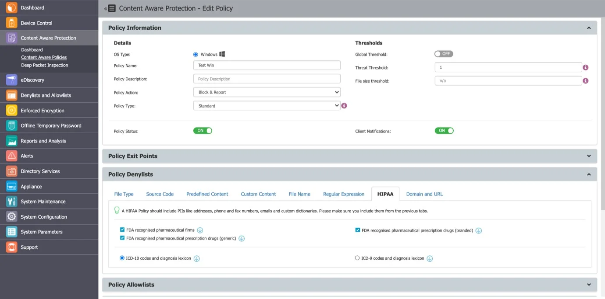
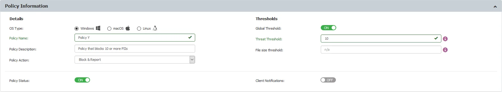
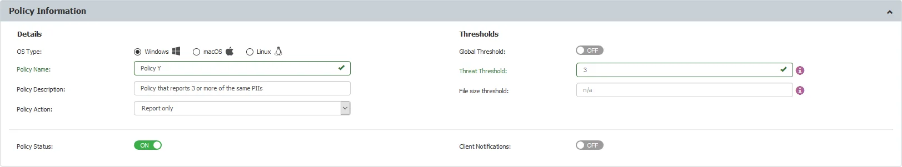

# Content Aware Protection Use Cases

Content Aware Protection enables organizations to define policies for monitoring and controlling the
transfer of sensitive data. This section highlights real-world use cases to illustrate how these
policies can be applied to protect information, ensure compliance, and prevent unauthorized data
leakage.

## Use Case 1: HIPAA Compliance for Patient Data Protection

Company X manages electronic medical records containing sensitive information such as patient names,
addresses, birthday, phone numbers, social security numbers, and email address. The company aims to
block the transfer of this data through common Windows desktop applications.

Since the data is organized by patient profile, the administrator can create a HIPAA-compliant
policy as shown below.

This policy is set to Block & Report, with a Global Threshold of 4. It scans the following:

- Controlled Storage Device Types (configured in **System Parameters** > **Device Types**)
- Clipboard
- Network Share
- All applications recognized by Endpoint Protector.

This policy blocks the transfer of files containing 4 or more instances of the selected Personally
Identifiable Information (PII). Files with fewer instances (e.g., 1 address, 2 phone numbers, or 2
email addresses) will be allowed to transfer.

## Use Case 2: Blocking Sensitive PII in Employee Records

Company Y maintains a large database of sensitive patient information, stored in individual office
files. Each file contains 10 or more Personal Identifiable Information (PII) items per patient. In
addition to these files, the company’s staff frequently handles files that contain 3 PII items.
Company Y wants to block the transfer of files containing 10 or more PII items while only reporting
the transfer of files containing 3 PII items.

You can create a policy to block the transfer of files containing 10 or more PIIs by setting the
Global Threshold to 10, as shown in the policy example below.

Another HIPAA-compliant policy can be configured to report the transfer of files containing 3 PII
items by setting the Regular Threshold to 3, as shown in the example below.

The Block & Report policy takes priority, while the Report Only policy is secondary.
