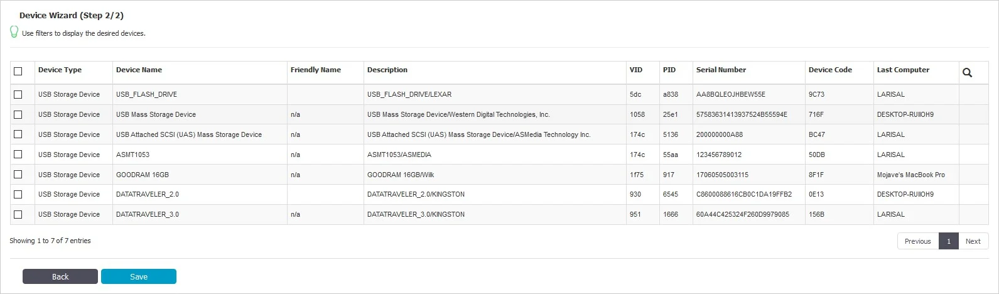

# Custom Classes

This section provides you with the option to create new classes of devices for easier management. It
is a powerful feature, especially for devices belonging to the same vendor and/or being the same
product (same VID and/or PID).

A new Custom Class can be created by clicking on the Create. An existing policy can be edited by
double-clicking on it.

You can edit, duplicate or delete a policy after selecting the policy.

Before adding devices to a Custom Class, the Name, Description, Device Type (USB Storage Devices,
Cameras, etc.), Device Right (Allow Access, Block Access, etc.) must be provided. Once this is done,
there are multiple ways of adding devices to a Custom Class:

- New Device (VID, PID, Serial Number) – will allow at Step 2 to add new devices based on Vendor ID,
  Product ID, and Serial Number.

- Existing Device (Wizard) – will allow at Step 2 to add devices previously connected to protected
  computers and already in the Endpoint Protector database.

- Device Serial Number Range – will allow at Step 2 to add multiple devices at the same time, by
  specifying the first and last Serial Number in the range. The recommended use for this feature is
  for devices that have a consecutive range, with a clear, noticeable pattern.

> **NOTE:** Although this feature can work in situations where the Serial Number range does not
> follow a noticeable pattern, this is not recommended. In this type of situation, some devices will
> be ignored by Endpoint Protector and the Custom Class will not have the expected effect.

- Bulk List of Devices – will allow at Step 2 to add up to 1000 devices at the same time. There are
  two methods to choose from, either importing a list or simply pasting the information.

- Device Class (Device Type) – will allow at Step 2 to add a specific right to a Device Type. This
  option is intended to be used in scenarios when a very fast way to change all device types in the
  system but specific device rights were granularly added to some users or computers.

For example; we created a Custom Class CD-ROM Allow and set Allow access rights to devices of type
CD-ROM /DVD-ROM. Let’s say that CD-ROMs have Deny access rights set on Client PC CIP0. Once the
custom class CD-ROM Allow is created and Custom Classes is enabled, all the CD-ROMs/DVD-ROMs will
have access, even if on the Client PC CIP0 they have Deny access.

## Priorities for Device Rights

Computer Rights, Group Rights, and Global Rights form a single unit and they inherit each-others
settings. This means that changes to any one of these entities affect the other ones.

There are three levels of hierarchy: Global Rights, Group Rights, and Computer Rights, the latter
being the deciding factor in rights management.

The device rights surpass all computer, group, and global rights.

The user rights are on the same level as the computer rights. The priority can be set from the
System Settings section.

:::note
For detailed information, refer to the
[System Configuration](/docs/endpointprotector/admin/systemconfiguration/overview.md) topic.
:::

Select an option to grant access for clients based on the Department Code. You can also view the
Default Department code – defdep.

Select an option to grant access for clients based on the Department Code.

You can also view the Default Department code - defdep.

:::note
For detailed information, refer to the
[System Configuration](/docs/endpointprotector/admin/systemconfiguration/overview.md) topic.
:::

### Session Settings

You can modify the following session timeout settings:

- Session Timeout – set the amount of time the user is inactive until the session expires between 5
  and 60 minutes
- Timeout counter – set the amount of time for the session timeout countdown between 5 seconds and
  Session Timeout minus one minute

For example; If you define the Session Timeout to 5 minutes and the Timeout counter to 60 seconds,
then after 4 minutes of inactivity you will be notified by the pop-up window that in 60 seconds you
will be logged out.

If you remain idle for the defined amount of time, then Endpoint Protector stops responding and
displays a message that indicates the session will expire in the predefined countdown.

You can choose to log out or continue your session, resetting the session timeout interval.

**Endpoint Protector Rights Functionality**

For example; Device X is allowed from Global Rights. If in the Computer Rights section, the same
device does not have permission to be used, the device will not be usable. Same applies vice-versa:
if the device lacks access permission globally, and has permission set per computer, the device will
be allowed. The same applies for Global Rights and Group Rights: if globally the device does not
have permission to be used, and group permission exists, the device will be allowed.

### Priorities for Device Control Policies

By default, only the Standard Device Control Rights are available. They include the Device Types and
the Already Existing Devices sections.

Custom Classes can be defined. They represent a group of devices that have particular access right
across the entire network. Custom Classes surpass the Standard rights.

If enabled, Outside Network and Outside Hours device rights can be configured. These surpass the
Custom Classes rights.

The Offline Temporary Password rights allow the creation of exceptions from applied rules. These
rights surpass all others.

