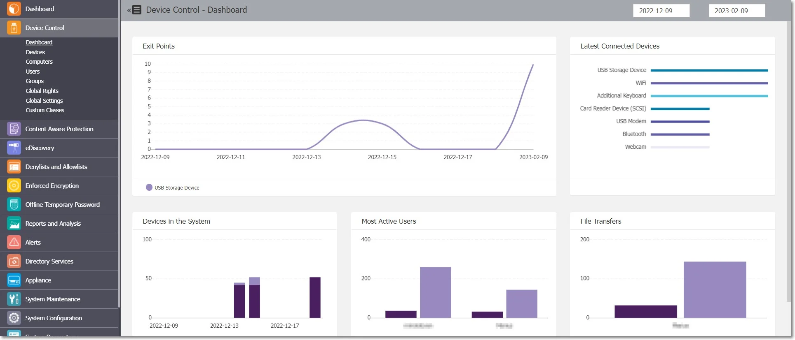

# Device Control

From this section, you can manage all entities in the system, their subsequent rights, and settings.
You can also manage other types of settings from the Device Control section such as Endpoint
Protector Client and Deep Packet Inspection settings. As the first layer of security within Endpoint
Protector, it is activated by default in every configuration provided.

For a detailed overview of the devices that are discovered and covered under the Device Control
settings, please refer to the
[Device Types (Standard)](globalrights.md#device-types-standard) subtopic.

## Dashboard

This section offers an overview in the form of graphics and charts related to the Endpoint Protector
Entities. You can select the start and end date for the data used in these visual representations
from the top-right calendars and view the data in real time.

