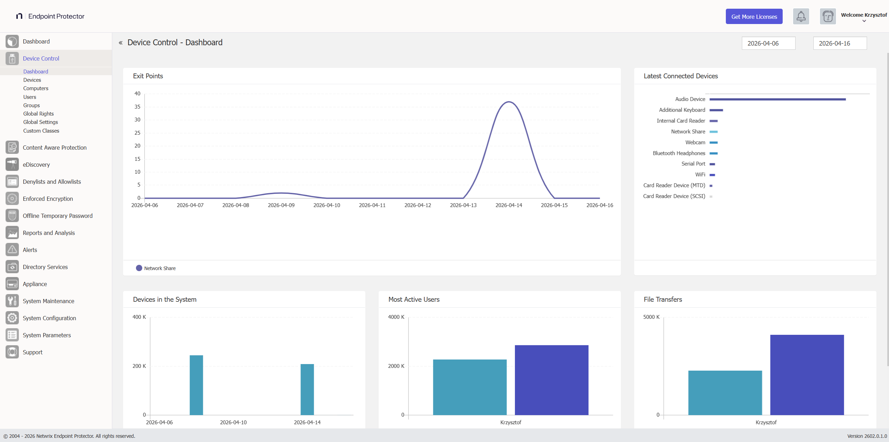
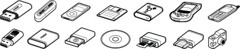

# Device Control

From this section, you can manage all entities in the system, their subsequent rights, and settings.
You can also manage other types of settings from the Device Control section such as Endpoint
Protector Client and Deep Packet Inspection settings. As the first layer of security within Endpoint
Protector, Device Control activates by default in every configuration provided.

For a detailed overview of the devices that are discovered and covered under the Device Control
settings, refer to the
[Device Types (Standard)](globalrights.md#device-types-standard) subtopic.

## Dashboard

This section offers an overview in the form of graphics and charts related to the Endpoint Protector
Entities. You can select the start and end date for the data used in these visual representations
from the top-right calendars and view the data in real time.

## Device Types (Standard)

Endpoint Protector supports a wide range of device types, which represent key sources of security breaches. You can authorize these devices. With authorization, users can view, create, or modify their content, and administrators can view the data transferred to and from the authorized devices.

- Removable Storage Devices
- Normal USB Flash Drives, U3, and Autorun Drives, Disk on Key, etc.
- USB 1.1, USB 2.0, USB 3.0
- Memory Cards - SD Cards, MMC Cards, Compact Flash Cards, etc.
- Card Readers - internal and external
- Virtual Machine drives (VM drives)
- Thin Client Storage (RDP Storage)
- CD/DVD-Player/Burner - internal and external
- Digital Cameras
- Smartphones / Handhelds / PDAs (includes Android, but also older ones like Nokia, Blackberry, and Windows CE-compatible devices, Windows Mobile devices, etc.)
- iPods / iPhones / iPads
- MP3 Player / Media Player Devices
- External HDDs / portable hard disks
- FireWire Devices
- PCMCIA Devices
- Biometric Devices
- Bluetooth, with full granularity for overall BT radio control, or:
  - Tablet
  - Other
  - Keyboard
  - Mouse
  - Smartphone
  - Headphones
- Printers (applies to serial, USB, and LPT connection methods)
- Express Card (SSD)
- Wireless USB
- LPT/Parallel ports \*applies only to storage devices
- Floppy disk drives, ZIP drives
- Serial ATA Controllers
- Serial ports (COMs)
- Teensy boards
- Network Printers
- Additional Keyboard
- USB Modem
- Wi-Fi adapters
- Webcams
- FireWire Bus
- Thunderbolt
- Chip card Devices
- Audio cards (output)

Depending on the device type, besides the Allow and Deny Access rights, additional rights are also available. These include Read-Only Access or multiple combinations of Allow Access but with various limitations, such as Allow access but exclude from CAP scanning or Allow Access if Trusted Device Level 1 to 4.

By default, Endpoint Protector blocks the majority of device types. However, because you need a working internet connection or wireless keyboards during the configuration process, Endpoint Protector sets several devices to Allow Access. These include Wi-Fi, Bluetooth, Network Share, Additional Keyboard, and USB Modem.
