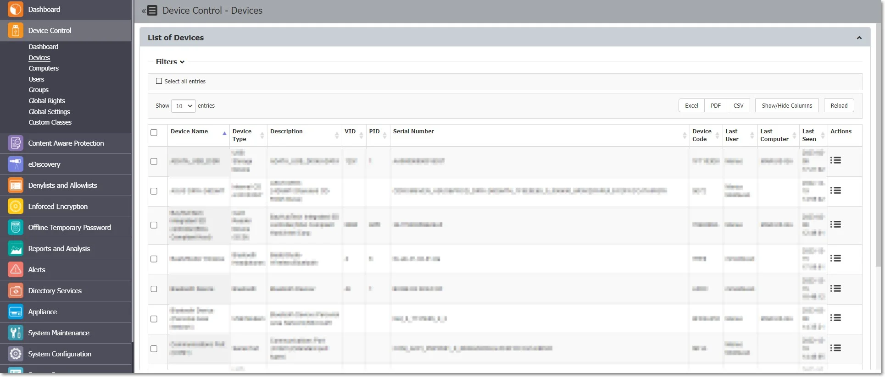
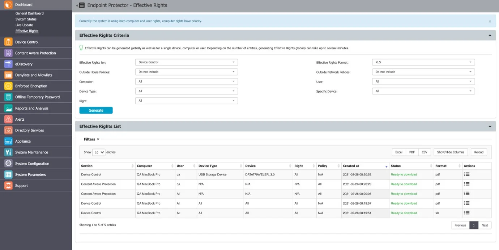
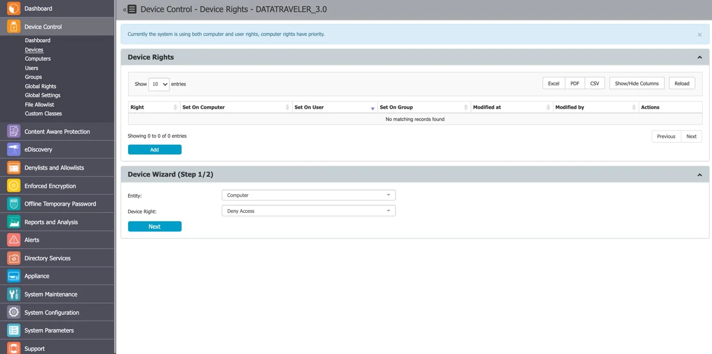
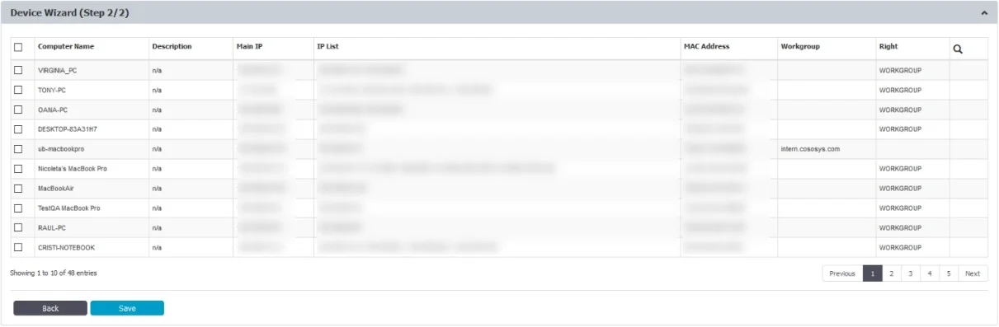
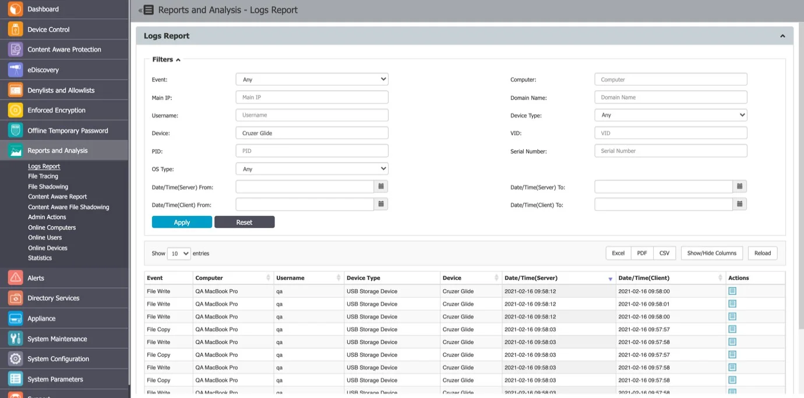
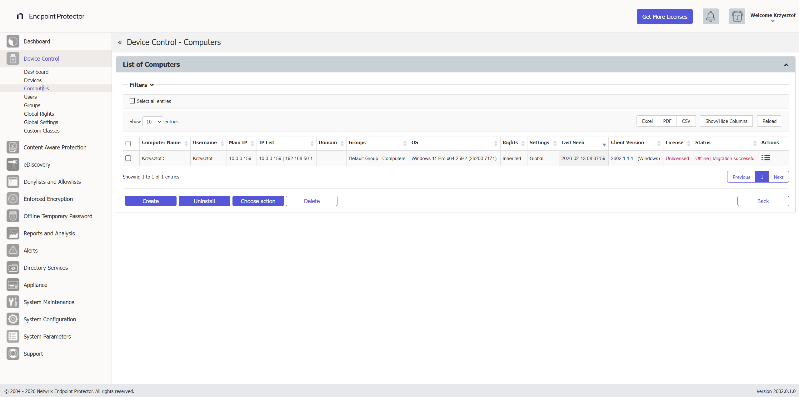
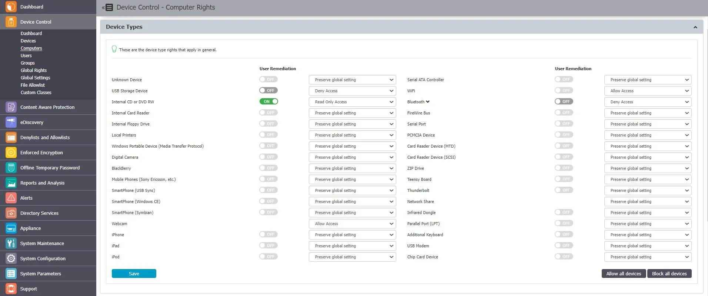
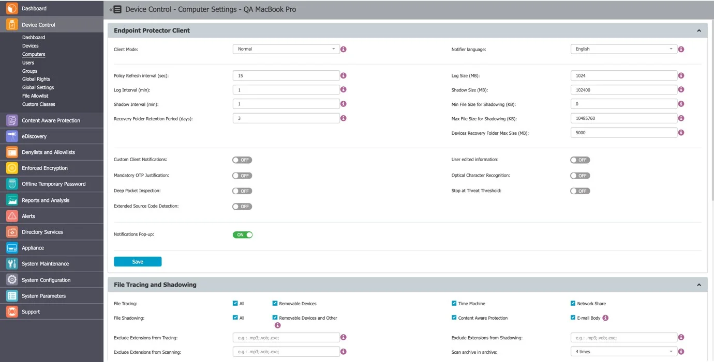
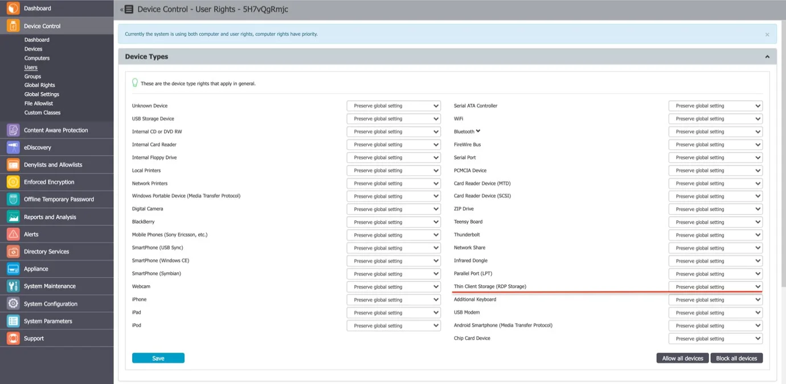
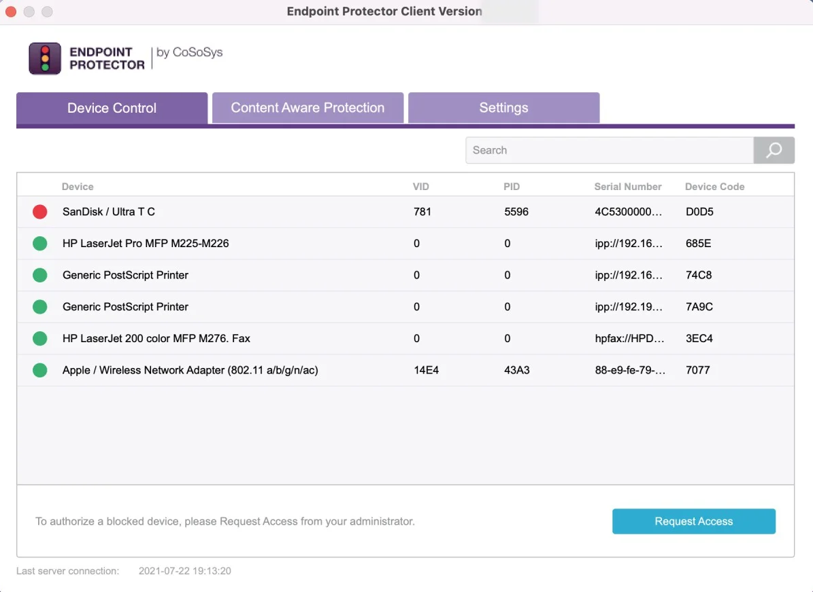

# Devices and Computers

## Devices

From this section, you can view, sort, and export any devices in the system in Excel, PDF, or CSV
format. Use the Actions column to edit, manage rights, view device history, and delete a specific
device.

You can view the right for each device based on the color code from the Status column:

- Red indicates the device is blocked in the system
- Green indicates the device is allowed on computers or for users
- Yellow indicates the device is allowed for some users or computers with restrictions

:::note
Endpoint Protector automatically adds any new device connected to a protected computer to the
database and assigns it to its first user, which you can change later.
:::

Click **Create** to manually add a new device on the list by providing device information: name,
friendly name, type PID, department, description, friendly description, VID, serial number and
custom class.

Use **Choose action** to export the list of devices, schedule a list export, or refresh the device
codes. You can also export or import devices in JSON format.

With the **Export/Import Devices** in JSON format feature, you can manage device lists from one
Endpoint Protector Server to another, correlating the device rights and the Groups.

- If the same Groups exist on both Servers, the imported devices will also maintain the access
  rights
- If the Groups don't exist, Endpoint Protector still imports the devices but ignores the access
  rights

You can also import the devices directly from Active Directory.

:::note
For detailed information on Active Directory, refer to the
[Directory Services](/docs/endpointprotector/admin/directoryserv.md) topic.
:::

### Priority order

If you don't configure the devices, the devices inherit rights from the default Global Rights set
per Device Type (USB Storage Device, Digital Camera, iPod, Thunderbolt, Chip Card Device,
etc.).

:::note
For detailed information, refer to the
[Directory Services](/docs/endpointprotector/admin/directoryserv.md) topic.
:::

If you configure device rights granularly for all entities, the priority order will be the following,
starting with the highest:

For example, if global rights indicate that no computer on the system has access to a specific
device, and you authorize that device for one computer, then that computer has access to
that device.

### Device Rights

To manage device rights for specific computers, groups, or users, select **Manage Rights** from the
Actions column.

After selecting a device and assigning rights to specific users, computers, or groups, follow these
steps:

**Step 1 –** Select the **Entity** and the **Device** right.

**Step 2 –** Select the **Entities** (Computers, Groups, or Users).

### Device History

From this section, you can view the device history by selecting the View Device History action.
Endpoint Protector then displays the Logs Report page filtered for the respective device.

## Computers

From this section, you can filter, create, uninstall, or delete a computer and use the Choose action
option to create a Settings Report, Export List of Computers and Schedule Export list.

You can download the Settings Report from System Maintenance, the
[Exported Entities](/docs/endpointprotector/admin/systemmaintenance/overview.md#exported-entities) topic to view the Deep
Packet Inspection (DPI) status for each entity (Computer/User/Group) and the entity from which Deep
Packet Inspection is used.

Endpoint Protector automatically adds any new computer that has the Endpoint Protector Client
deployed to the database, making it manageable.

### DPI Status

The Computers list includes an optional **DPI Status** column that shows the Deep Packet Inspection
status for each computer. Endpoint Protector hides this column by default.

To display the DPI Status column, click **Show/Hide Columns** and select **DPI Status**.

:::note
DPI Status reflects the status only for computers actively communicating with the server.
The value updates at each policy refresh interval and represents the last reported state rather than real-time status.
:::

### Filtering by migration status

The **Status** filter in the Computers list includes migration-specific values (for example,
"Migration successful"). Use these values to filter the list and identify computers at each stage of
a client migration.

Endpoint Protector also includes the migration status in SIEM export events as the
`migration_status` attribute.

The Endpoint Protector Client has a self-registration mechanism. This process runs once after you
install the Client software on a client computer. The Client then communicates its existence in the
system to the Server. The Server stores the information regarding the Computer in the database and
assigns a License.

:::note
The self-registration mechanism acts whenever you make a change in the Computer licensing
module, and also each time you reinstall the application Client. Self-registration doesn't save
the owner of the computer.
:::

For more details about Licensing, go to the
[System Configuration](/docs/endpointprotector/admin/systemconfiguration/overview.md) topic.

Endpoint Protector identifies a Computer by the computer parameters (Main IP, IP List, MAC, Domain,
Workgroup, Computer Serial Number or MachineUUID, OS version) but information like Name and
Description is also essential.

By default, Endpoint Protector assigns the computer to the first user that handles the computer. You
can change this later, and it updates automatically based on whoever logs into the computer.

:::note
Endpoint Protector may not collect the MachineUUID for virtual machines due to system limitations.
:::

You can manually create a new computer at any time by providing these computer parameters and
information, or import computers from Active Directory.

For more details about Active Directory, go to the
[Directory Services](/docs/endpointprotector/admin/directoryserv.md) topic. You can also assign the computers to
the following for a better organization:

- Devices and Computers e.g., several computers within the same office
- [System Configuration](/docs/endpointprotector/admin/systemconfiguration/overview.md) an alternative organization to Groups

### Computer Rights

You can manage computer rights from the Actions column for a specific computer by selecting **Manage
Rights**. This section focuses on the computers and lets you specify which Device Types and
Specific Devices are accessible.

The Standard device control rights include the Device Types and Already Existing Devices sections.
Most deployments use only these device rights.

In addition to the Standard device control rights, if you enable them in the Global Settings, you
can create fallback policies for Outside Network and Outside Hours circumstances.

For detailed information on Device Types and Specific Devices (Standard, Outside Network, and Outside
Hours), refer to the Devices and Computers topic.

:::note
Use Restore Global Rights to revert to a lower level of rights. After you enable it, Endpoint
Protector sets all rights on that level to preserve global settings and uses the next level of
rights.
:::

Endpoint Protector deletes all Existing Devices added on that level when you use the restore.

### Computer Settings

Use this section to edit the settings for each computer.

You don't need to define custom settings for all computers, because a computer functions correctly
without any manual settings.

The computer inherits the settings from the group it belongs to or, if that isn't possible, from
the global settings, which are mandatory and exist in the system with default values from
installation.

### Computer History

From this section, you can view the computer history by selecting the View Computer History action.
Endpoint Protector then displays the Logs Report page filtered for the respective computer.

### Terminal Servers and Thin Clients

Endpoint Protector can control file transfers on RDP storage between Thin Clients and Windows
Terminal Servers, as described in the following sections.

#### Initial Configuration

The process starts with the Mark as Terminal Server action in Device Control > Computers

.

After you select the computer in the system as a Terminal Server, Endpoint Protector displays “Yes”
for ease of identification, as shown in the following image:

:::note
This action targets only Windows Servers with Terminal Server roles properly configured.
:::

Ensure that at least one Terminal Server license is available when you perform the Mark as
Terminal Server action. If you successfully mark the Terminal Server, a new device type
appears when you edit that computer under Device Control, Computers, Computer Rights.

The settings for the Terminal Server-specific Device Types are: Preserve Global Settings, Allow
Access, Deny Access, and Read-Only Access.

An Allow Access right set on the RDP Storage device type lets all users who connect to the
Terminal Server by RDP transfer files to and from their local disk volume or shared storage
devices such as USBs.

By contrast, a Deny Access right set on the RDP Storage prevents any user who connects to the
Terminal Server by RDP from transferring files to and from their local disk volume or shared storage
devices such as USBs.

:::note
Enable **Use User Rights** in the settings bar from System Configuration, System Settings,
Endpoint Rights Functionality for the rights policy to apply on user logins with user priority.
:::

The Device Control > Users > Rights menu also presents an additional device type for all users in
Endpoint Protector: Thin Client Storage (RDP Storage).

Endpoint Protector can recognize multiple users as active users on any given Terminal Server, so
you can use this right to create access policies for specific users, as described in the following
use case.

On a Windows Terminal Server, the Endpoint Protector Client displays RDP Storage disks shared by
one or multiple Thin Clients, as shown in the following image.

