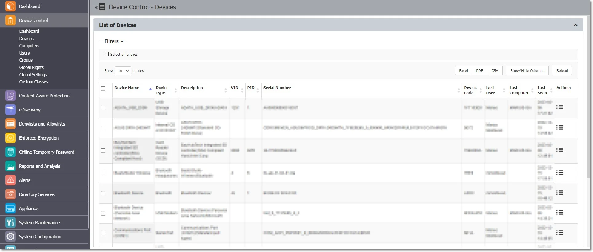
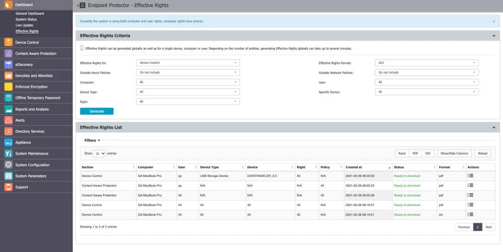
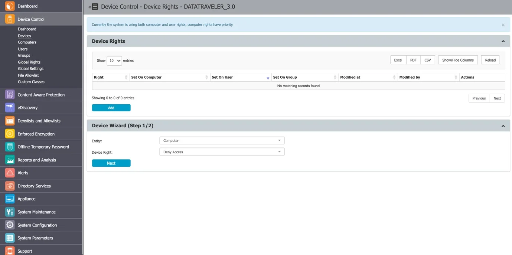
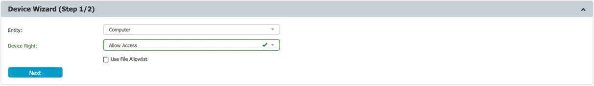
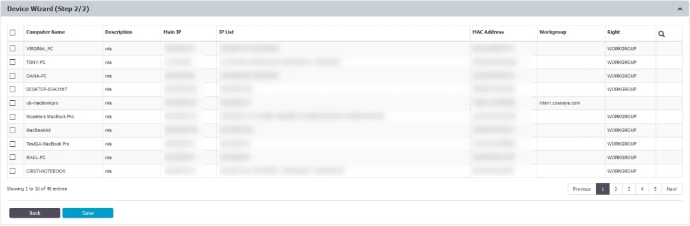
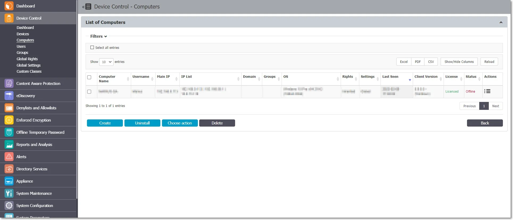
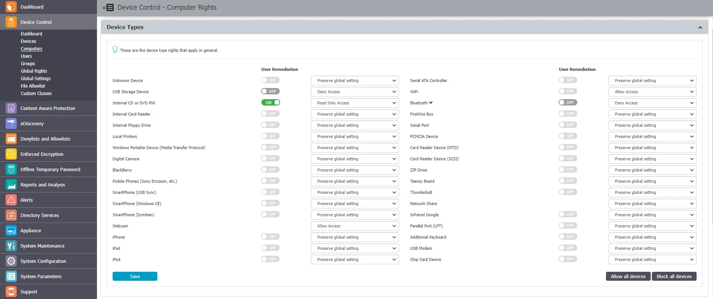
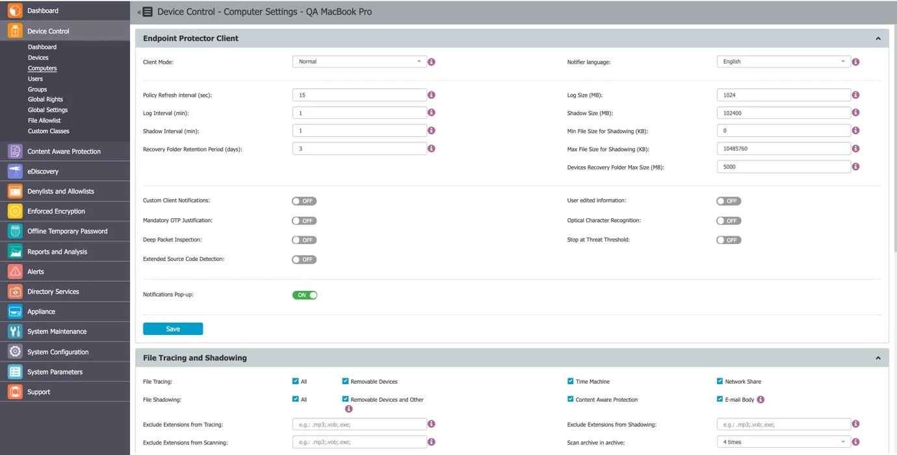
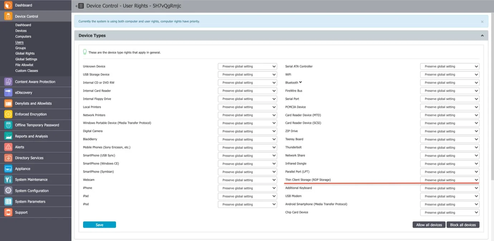
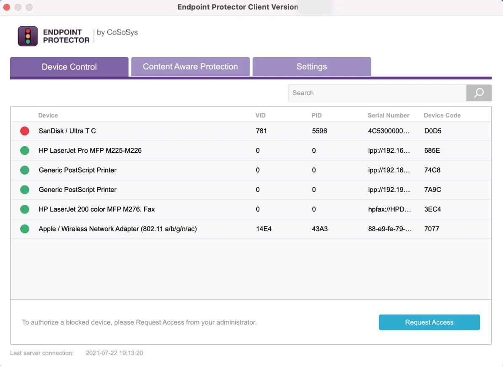

# Devices and Computers

## Devices

From this section, you can view, sort, and export in Excel, PDF or CSV format any devices from the
system. Use the Actions column to edit, manage rights, view device history and delete a specific
device.

You can view the right for each device based on the color code from the Status column:

- Red indicates the device is blocked in the system
- Green indicates the device is allowed on computers or for users
- Yellow indicates the device is allowed for some users or computers with restrictions

:::note
Any new device connected to a protected computer is automatically added to the database
and assigned to its first user which can be changed later.
:::

Click **Create** to manually add a new device on the list by providing device information: name,
friendly name, type PID, department, description, friendly description, VID, serial number and
custom class.

Use **Choose action** to export list of devices, schedule a list export, export or import in JSON
format or refresh the device codes.

The **Export/Import Devices** in JSON format feature allows you to manage device lists from one
Endpoint Protector Server to another and aims to correlate the device rights and the Groups.

- If the same Groups exist on both Servers, the imported devices will also maintain the access
  rights
- If the Groups do not exist, the devices will still be imported but the access rights will be
  ignored

You can also import the devices directly from Active Directory.

:::note
For detailed information on Active Directory, refer to the
[Directory Services](/docs/endpointprotector/admin/directoryserv.md) topic.
:::

### Priority order

If you do not configure the devices, the rights are inherited from the default Global Rights that are
set per Device Types (USB Storage Device, Digital Camera, iPod, Thunderbolt, Chip Card Device,
etc.).

:::note
For detailed information, refer to the
[Directory Services](/docs/endpointprotector/admin/directoryserv.md) topic.
:::

If you configure device rights granularly for all entities, the priority order will be the following,
starting with the highest:

For example, If global rights indicate that no computer on the system has access to a specific
device, and for one computer that device has been authorized, then that computer will have access to
that device.

### Device Rights

To manage device rights for specific computers, groups, or users, select **Manage Rights** from the
Actions column.

After selecting a device and assigning rights to specific users, computers or groups follow these
steps:

**Step 1 –** Select the **Entity** and the **Device** right.

**Step 2 –** Select the **Entities** (Computers, Groups, or Users).

### Device History

From this section, you can view the device history by selecting the View Device History action. This
will display the Logs Report page filtered for the respective device.

## Computers

From this section, you can filter, create, uninstall or delete a computer and use the Choose action
option to create a Settings Report, Export List of Computers and Schedule Export list.

You can download the Settings Report from System Maintenance, the
[Exported Entities](/docs/endpointprotector/admin/systemmaintenance/overview.md#exported-entities) topic to view the Deep
Packet Inspection status for each entity (Computer/User/Group) and the entity from which Deep Packet
Inspection is used.

Any new computer that has the Endpoint Protector Client deployed will be automatically added to the
database, thus making it manageable.

The Endpoint Protector Client has a self-registration mechanism. This process is run once after the
Client software is installed on a client computer. The Client will then communicate to the Server
its existence in the system. The Server will store the information regarding the Computer in the
database and it will assign a License.

:::note
The self-registration mechanism acts whenever a change in the Computer licensing module is
made, and also each time the application Client is reinstalled. The owner of the computer is not
saved in the process of self-registration.
:::

For more details about Licensing, go to the
[System Configuration](/docs/endpointprotector/admin/systemconfiguration/overview.md) topic.

A Computer is identified by the computer parameters (Main IP, IP List, MAC, Domain, Workgroup,
Computer Serial Number or MachineUUID, OS version) but information like Name and Description is also
essential.

By default, the computer is assigned to the first user that handles the computer. This can later be
changed and is updated automatically based on whoever logs into the computer.

:::note
Computer MachineUUID may not be taken for Virtual Machines due to System Limitations.
:::

You can manually create a new computer at any time by providing the computer parameters and
information mentioned above or import computers from Active Directory.

For more details about Active Directory, go to the
[Directory Services](/docs/endpointprotector/admin/directoryserv.md) topic. You can also assign the computers to
the following for a better organization:

- Devices and Computers e.g., several computers within the same office
- [System Configuration](/docs/endpointprotector/admin/systemconfiguration/overview.md) an alternative organization to Groups

### Computer Rights

You can manage computer rights from the Actions column for a specific computer by selecting **Manage
Rights**. This section is built around the computers, allowing you to specify which Device Types and
Specific Devices can be accessible.

The Standard device control rights include the Device Types and Already Existing Devices sections.
These are generally the only device rights used.

In addition to the Standard device control rights, if enabled from the Global Settings, you can
create fallback policies for Outside Network and Outside Hours circumstances.

For detailed information on Device Types and Specific Devices (Standard, Outside Network, and Outside
Hours), refer to the Devices and Computers topic.

:::note
Use Restore Global Rights to revert to a lower level of rights. Once enabled, all rights
on that level will be set to preserve global settings and the system will use the next level of
rights.
:::

All Existing Devices that were added on that level will be deleted when the restore is used.

### Computer Settings

This section allows you to edit the settings for each computer.

Defining custom settings for all computers is not necessary since a computer is perfectly capable of
functioning correctly without any manual settings defined.

It will do this by either inheriting the settings from the group it belongs to or, if not possible,
the global settings, which are mandatory and exist in the system with default values from
installation.

### Computer History

From this section, you can view the computer history by selecting the View Computer History action.
This will display the Logs Report page filtered for the respective computer.

### Terminal Servers and Thin Clients

The capability to control file transfers on RDP storage between Thin Clients and Windows Terminal
Servers can be enforced through Endpoint Protector, as detailed below.

#### Initial Configuration

The process starts with the menu view from Device Control > Computers, namely the action to Mark as
Terminal Server

.

After you selected the computer in the system as a Terminal Server, “Yes” will be displayed for ease
of identification, as seen below:

:::note
The computers that can be targeted by this action are strictly Windows Servers with
Terminal Server roles properly configured
:::

Make sure that there is at least one Terminal Server license available when the action Mark as
Terminal Server is performed. If the Terminal Server is successfully marked, a new device type will
appear when choosing to Edit it under Device Control, Computers, Computer Rights.

The settings for the Terminal Server-specific Device Types are: Preserve Global Settings, Allow
Access, Deny Access, and Read-Only Access.

An Allow Access right set to the RDP Storage device type will enable all users that connect to the
Terminal Server by RDP to transfer files to and from their local disk volume or shared storage
devices such as USBs.

By contrast, a Deny Access right set to the RDP Storage will not allow any user that connects to the
Terminal Server by RDP to transfer files to and from their local disk volume or shared storage
devices such as USBs.

:::note
Enable **Use User Rights** in the settings bar from System Configuration, System Settings,
Endpoint Rights Functionality for the rights policy to apply on user logins with user priority.
:::

Secondly, the menu from Device Control > Users > Rights will present an additional device type for
all the users in Endpoint Protector, namely Thin Client Storage (RDP Storage).

Multiple users can be recognized as active users on any given Terminal Server, and so, the setting
of this right can be used as a powerful tool to create access policies for specific users, as
detailed in the use case below.

On a Windows Terminal Server, the Endpoint Protector Client will display RDP Storage disks shared by
one or multiple Thin Clients as seen below.

