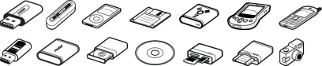
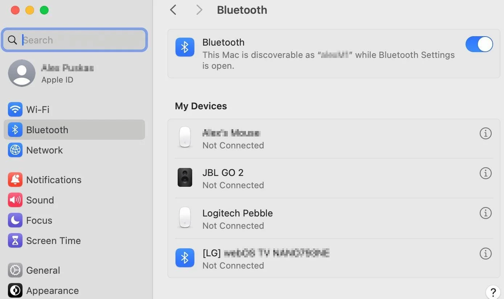
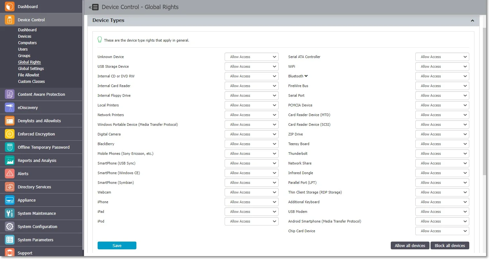
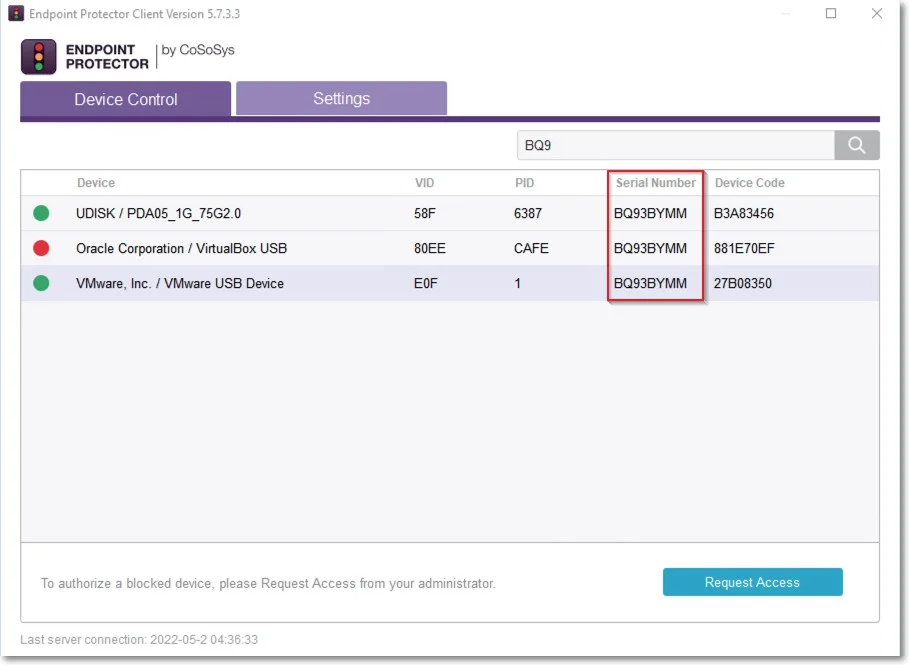
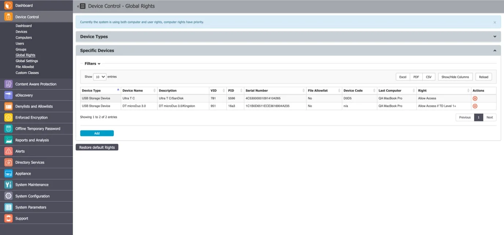
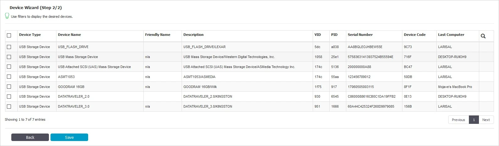
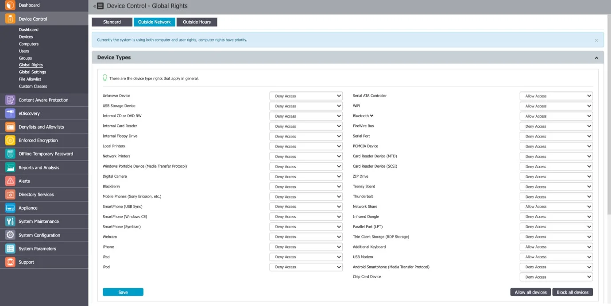
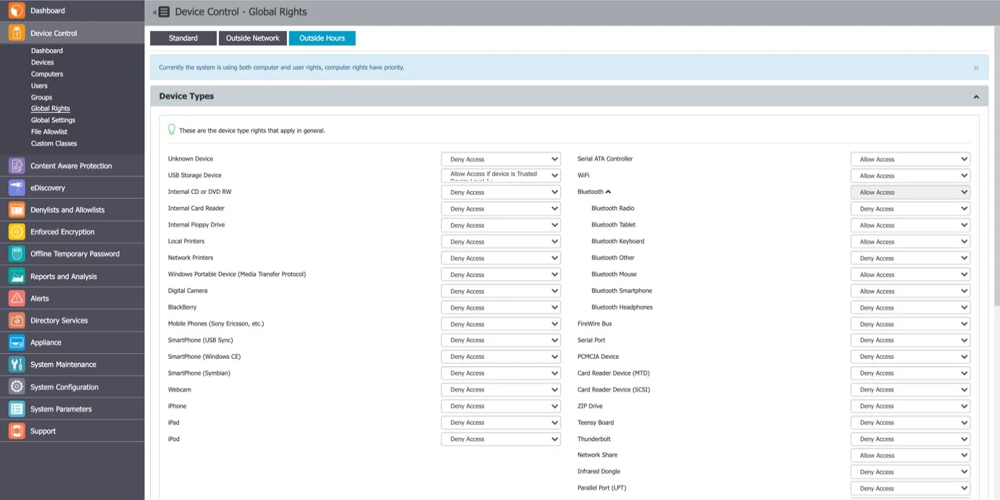

# Global Rights

From this section, you can manage the entire system and specify what rights and settings apply
globally, to all Endpoint Protector entities.

:::note
If device rights or other settings will be configured granularly for entities, the priority
order, starting with the highest, will be as follows:
:::

This section relates to the entire system, allowing you to specify what Device Types and Specific
Devices can be accessible. While Standard Rights Policies are the default ones, Outside Hours or
Outside Network Policies are also available. These are dependent on first activating settings from
Global Settings.

## Device Types (Standard)

Endpoint Protector supports a wide range of device types, which represent key sources of security
breaches. These devices can be authorized, which makes it possible for the users to view, create, or
modify their content and for administrators to view the data transferred to and from the authorized
devices.

- Removable Storage Devices
- Normal USB Flash Drives, U3 and Autorun Drives, Disk on Key, etc.
- USB 1.1, USB 2.0, USB 3.0
- Memory Cards - SD Cards, MMC Cards, Compact Flash Cards, etc.
- Card Readers - internal and external
- CD/DVD-Player/Burner - internal and external
- Digital Cameras
- Smartphones / Handhelds / PDAs (includes Nokia N-Series, Blackberry, and Windows CE compatible
  devices, Windows Mobile devices, etc.)
- iPods / iPhones / iPads
- MP3 Player / Media Player Devices
- External HDDs / portable hard disks
- FireWire Devices
- PCMCIA Devices
- Biometric Devices
- Bluetooth
- Printers (applies to serial, USB, and LTP connection methods)
- Express Card (SSD)
- Wireless USB
- LPT/Parallel ports \*applies only to storage devices
- Floppy disk drives
- Serial ATA Controllers
- Network Printers

Depending on the device type, besides the Allow and Deny Access rights, additional rights are also
available. These include Read-Only Access or multiple combinations of Allow Access but with various
limitations, such as Allow access but exclude from CAP scanning or Allow Access if Trusted Device
Level 1 to 4.

The Trusted Device™ technology integrated within Endpoint Protector is available in four security
levels, depending on the degree of protection offered by a device (trusted devices using Enforced
Encryption are TD level 1).

For detailed information on Trusted Device™ and Enforced Encryption, refer to the
[Trusted Device™](../ee_module/eemodule.md) topic.

:::note
With the WiFi – Block if wired network is present option you can disable the WiFi
connection, while a wired network connection is present. The WiFi connection will be available when
the wired network is not present.
:::

:::note
On macOS version 14 (Sonoma) and higher, Bluetooth devices are managed only when the
device is connected and visible under ‘My Devices’ in the Bluetooth section of ‘System settings’.
:::

:::note
Occasionally, the EPP system may display a limitation where certain webcams can be activated in Zoom meetings, even when rights are set to DENY in computer settings. To enforce proper rights after configuration, a restart of the PC is mandatory in such cases.
:::

By default, the majority of device types are blocked. However, as a working internet connection or
wireless keyboards are needed during the configuration process, several devices are set to Allow
Access. These include Wi-Fi, Bluetooth, Network Share, Additional Keyboard, and USB Modem.

### VM USB Device Usage

The VM USB device type extends Endpoint Protector applicability for VMWare and VirtualBox virtual
environments.

You can also use this option to manage USB access through the virtual environment.

When using a virtual environment, the USB devices will not be displayed in the Endpoint Protector
Notifier with their original names, VID and PID information. Only the original information will
remain the serial number.

For example; in the below image, you can view the 3 devices detected by Endpoint Protector have
different VID, PID and device code, but they all have the same serial number.

:::note
The Endpoint Protector Client does not distinguish between USB devices (e.g. USB hard
drive vs USB Webcam) by Device name/VID/PID.
:::

## Specific Devices (Standard)

From this section, you can manage access rights for a specific device.

Device rights can be set either Globally or, per Group, User, or Computer, by using the Manage
Rights action from each section/entity.

To add a new device click **Add** and provide the mandatory information. There are multiple ways of
adding devices:

- New Device (VID, PID, Serial Number) – will allow at Step 2 to add new devices based on Vendor ID,
  Product ID, and Serial Number.

- Existing Device (Wizard) – will allow at Step 2 to add devices previously connected to protected
  computers and already in the Endpoint Protector database.

- Device Serial Number Range – will allow at Step 2 to add multiple devices at the same time, by
  specifying the first and last Serial Number in the range. The recommended use for this feature is
  for devices that have a consecutive range, with a clear, noticeable pattern.

:::note
Although this feature can work in situations where the Serial Number range does not follow
a noticeable pattern, this is not recommended. In this type of situation, some devices will be
ignored by Endpoint Protector and will not have the expected effect.
:::

- Bulk List of Devices – will allow at Step 2 to add up to 1000 devices at the same time. There are
  two methods to choose from, either importing a list or simply pasting the information.

The File Allowlist feature is also available for USB storage devices that have allowed access. For
detailed information on using the File Allowlist, refer to the File
[Denylists and Allowlists](/docs/endpointprotector/admin/denylistsallowlists/overview.md) topic.

## Outside Network

:::note
To use this setting, the feature needs to be enabled in the Global Settings section.
:::

From this section, you can define fallback policies that will apply when outside the network. All of
the functionalities are identical to the Standard section.

## Outside Hours

:::note
To use this setting, the feature needs to be enabled in the Global Settings section.
:::

From this section, you can define fallback policies that will apply when outside working hours. All
of the functionalities are identical to the Standard section.

