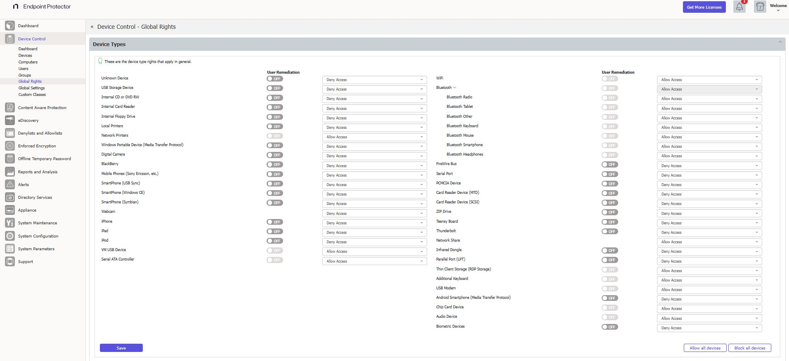
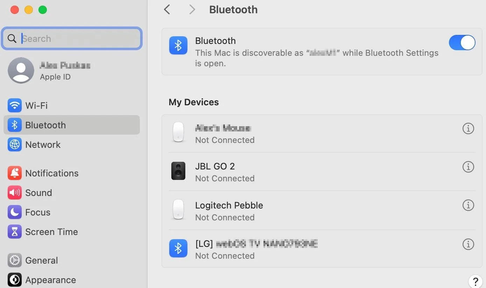
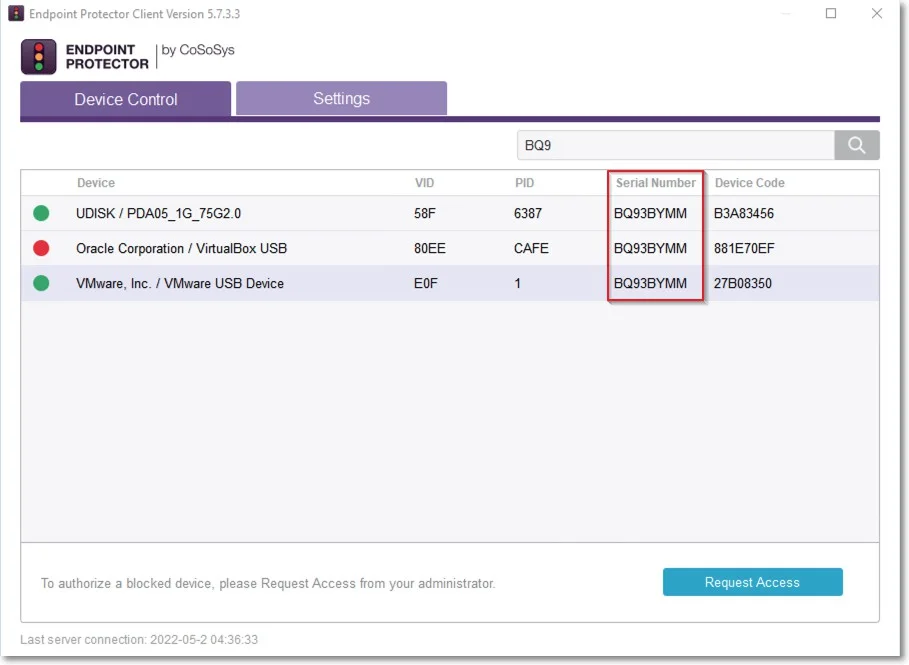
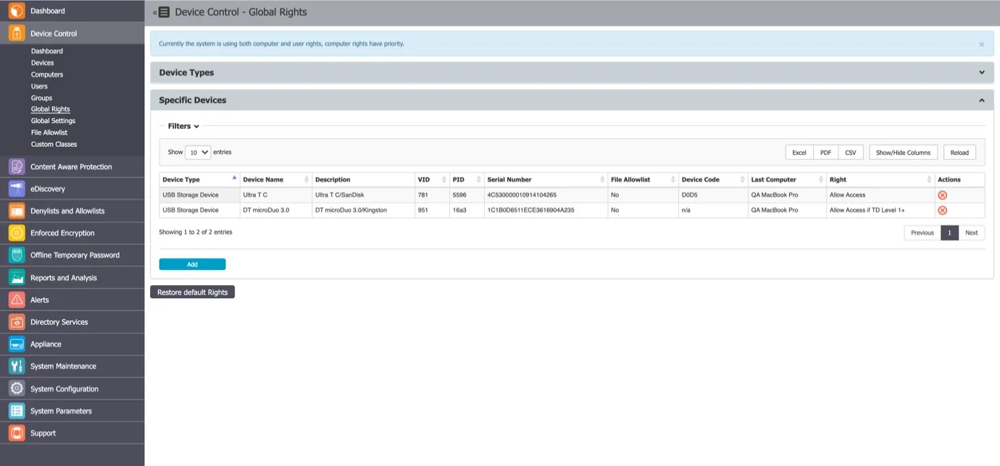
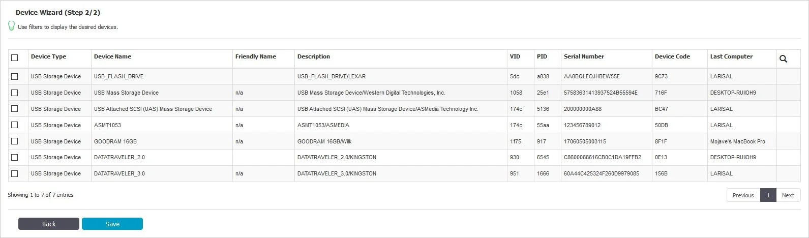
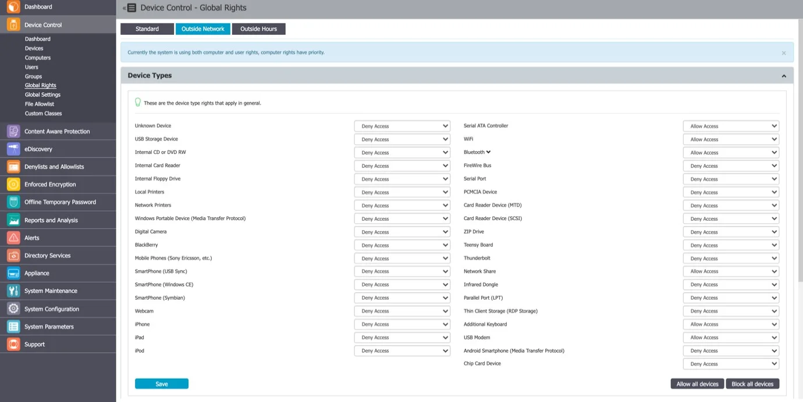
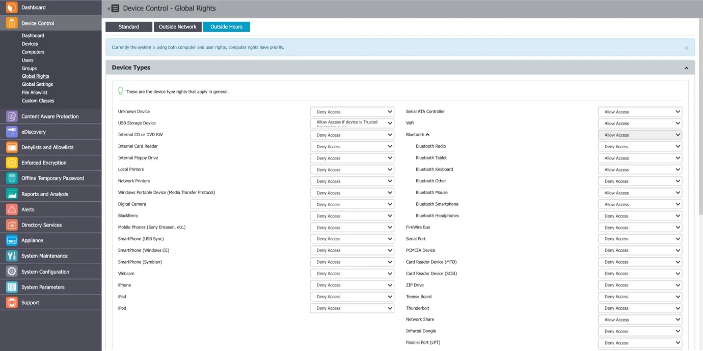

# Global Rights

From this section, you can manage the entire system and specify what rights and settings apply
globally, to all Endpoint Protector entities.

:::note
If you configure device rights or other settings granularly for entities, the priority
order, starting with the highest, is as follows:
:::

This section relates to the entire system, allowing you to specify what Device Types and Specific
Devices can be accessible. While Standard Rights Policies are the default ones, Outside Hours or
Outside Network Policies are also available. These are dependent on first activating settings from
Global Settings.

## Device Types (Standard)

Endpoint Protector supports a wide range of device types, which represent key sources of security breaches. These devices can be authorized. With authorization, users can view, create, or modify their content, and administrators can view the data transferred to and from the authorized devices.

Current list of all Device Categories:
- USB Storage Device
- Internal CD or DVD RW
- External CD or DVD RW
- Internal Card Reader
- Internal Floppy Drive
- Local Printers
- Network Printers
- Windows Portable Device (Media Transfer Protocol)
- Digital Camera
- BlackBerry
- Mobile Phones (Sony Ericsson, etc.)
- SmartPhone (USB Sync)
- SmartPhone (Windows CE)
- SmartPhone (Symbian)
- Webcam
- iPhone
- iPad
- iPod
- VM USB Device
- Serial ATA Controller
- WiFi
- Bluetooth
  - Bluetooth Radio
  - Bluetooth Tablet
  - Bluetooth Other
  - Bluetooth Keyboard
  - Bluetooth Mouse
  - Bluetooth Smartphone
  - Bluetooth Headphones
- FireWire Bus
- Serial Port
- PCMCIA Device
- Card Reader Device (MTD)
- Card Reader Device (SCSI)
- ZIP Drive
- Teensy Board
- Thunderbolt
- Network Share
- Infrared Dongle
- Parallel Port (LPT)
- Thin Client Storage (RDP Storage)
- Additional Keyboard
- USB Modem
- Android Smartphone (Media Transfer Protocol)
- Chip Card Device
- Biometric Devices
- Audio Device (Output)

The Trusted Device™ technology integrated within Endpoint Protector is available in four security
levels, depending on the degree of protection offered by a device (trusted devices using Enforced
Encryption are TD level 1).

For detailed information on Trusted Device™ and Enforced Encryption, refer to the
[Trusted Device™](../ee_module/eemodule.md) topic.

:::note
With the WiFi – Block if wired network is present option you can disable the WiFi
connection, while a wired network connection is present. The WiFi connection will be available when
the wired network isn't present.
:::

:::note
Audio Device Control for sound cards is supported only on Windows and applies only to the audio output channel. Audio input channels, whether analog or digital, aren't covered.
::: 

:::note
Occasionally, the EPP system may display a limitation where certain webcams can be activated in Zoom meetings, even when rights are set to DENY in computer settings. To enforce proper rights after configuration, a restart of the PC is mandatory in such cases.
:::

### Bluetooth Low Energy Devices on macOS

The standard Bluetooth protocol on macOS works accurately and with full granularity and feature parity to other operating systems.

However, macOS handles Bluetooth Low Energy (BLE) devices differently. Due to the shortened handshake frame in the BLE protocol, macOS may misidentify the device category in rare edge cases, which can cause the EPP Client to behave unexpectedly. This behavior is a macOS limitation and is outside of Netwrix Endpoint Protector's control. To mitigate this, Netwrix Endpoint Protector provides predefined tailored BLE device categories.

:::note
On macOS version 14 (Sonoma) and higher, Bluetooth devices are managed only when the device is connected and visible under ‘My Devices’ in the Bluetooth section of ‘System settings’.
:::

:::note
Occasionally, the EPP system may display a limitation where certain webcams can be activated in Zoom meetings, even when rights are set to DENY in computer settings. To enforce proper rights after configuration, a restart of the PC is mandatory in such cases.
:::

By default, Endpoint Protector blocks the majority of device types. However, because you need a working internet connection or wireless keyboards during the configuration process, Endpoint Protector sets several devices to Allow Access. These include Wi-Fi, Bluetooth, Network Share, Additional Keyboard, and USB Modem.

### VM USB Device Usage

The VM USB device type extends Endpoint Protector applicability for VMWare and VirtualBox virtual
environments.

You can also use this option to manage USB access through the virtual environment.

When using a virtual environment, the Endpoint Protector Notifier will not display the USB devices with their original names, VID, and PID information. Only the original information will
remain the serial number.

For example; in the following image, you can view the 3 devices detected by Endpoint Protector have
different VID, PID, and device code, but they all have the same serial number.

:::note
The Endpoint Protector Client doesn't distinguish between USB devices (e.g. USB hard
drive vs USB Webcam) by Device name/VID/PID.
:::

## Specific Devices (Standard)

From this section, you can manage access rights for a specific device.

You can set device rights either Globally or per Group, User, or Computer by using the Manage
Rights action from each section/entity.

To add a new device click **Add** and provide the mandatory information. There are multiple ways of
adding devices:

- New Device (VID, PID, Serial Number) – will allow at Step 2 to add new devices based on Vendor ID,
  Product ID, and Serial Number.

- Existing Device (Wizard) – will allow at Step 2 to add devices previously connected to protected
  computers and already in the Endpoint Protector database.

- Device Serial Number Range – will allow at Step 2 to add multiple devices at the same time, by
  specifying the first and last Serial Number in the range. The recommended use for this feature is
  for devices that have a consecutive range, with a clear, noticeable pattern.

:::note
Although this feature can work in situations where the Serial Number range doesn't follow
a noticeable pattern, this isn't recommended. In this type of situation, Endpoint Protector will ignore some devices, and they will not have the expected effect.
:::

- Bulk List of Devices – will allow at Step 2 to add up to 1000 devices at the same time. There are
  two methods to choose from, either importing a list or simply pasting the information.

The File Allowlist feature is also available for USB storage devices that have allowed access. For
detailed information on using the File Allowlist, refer to the File
[Denylists and Allowlists](/docs/endpointprotector/admin/denylistsallowlists/overview.md) topic.

## Outside Network

:::note
To use this setting, the feature needs to be enabled in the Global Settings section.
:::

From this section, you can define fallback policies that will apply when outside the network. All of
the functionalities are identical to the Standard section.

## Outside Hours

:::note
To use this setting, the feature needs to be enabled in the Global Settings section.
:::

From this section, you can define fallback policies that will apply when outside working hours. All
of the functionalities are identical to the Standard section.

