# Global Settings

From this section, you can apply settings globally to all Endpoint Protector entities.

Any setting that appears in Global Settings offers additional functionality, as you can customize these settings per group, user, or computer. This lets administrators configure precise, granular policies across the organization using the options available in this tab. As a result, Global Settings may include options also available in other components, such as [Content Aware Protection](/docs/endpointprotector/admin/cap_module/capmodule.md), [Deep Packet Inspection](/docs/endpointprotector/admin/cap_module/deeppacket.md) or [Enforced Encryption](/docs/endpointprotector/admin/ee_module/eemodule.md).

- If a computer has no granular settings and doesn't belong to a group, it inherits these settings.
- If the computer belongs to a group, it inherits that group's settings.

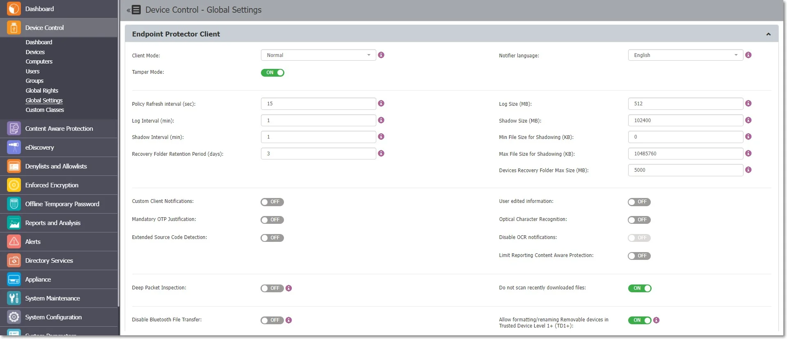

## Client Settings

From this section, you can manage settings that relate directly to the Endpoint Protector Client and
the Client's behavior for each specific entity (Global, Groups, and Computers).

- Client Mode – select a mode to change Endpoint Protector Client behavior.

    :::note
    See the [Client Mode](#client-mode) section.
    :::

- Notifier Language – Configure the Endpoint Protector Client to automatically match the OS language
  of the user for notifications. When you select "Automatic," the client adjusts its language to the
  user's OS language preference without any server interactions, enhancing the user experience and
  reducing confusion.

    To configure the Endpoint Protector Notifier language selection:

> **Step 1 –** Navigate to Device Control > Global Settings in the Endpoint Protector Console.
>
> **Step 2 –** In the "Notifier language" section, select either "Automatic" or "Default" based on
> your preferences.
>
> - "Automatic" means the client detects the language automatically from the OS, without server
>   interaction.
> - "Default" means the client applies the language you selected on the server. If you selected
>   "Automatic" on the server, the client uses the "Automatic" language.
>
> **Step 3 –** Save your settings to apply the chosen language selection.

> This feature makes notifications more accessible to users.

- Tamper Mode – enable this setting to protect the Endpoint Protector Client from unauthorized termination and modification. When enabled, EPP Client installation folders have limited access and the EPP Client prevents unauthorized actors from unloading its processes on Windows and daemons macOS. 
Tamper Mode applies to all supported operating systems (Windows, macOS, and Linux).

  :::note
  Requires EPP Client version 2605 hotfix 1 or later (2605.x.2.x) for the full feature set.
  :::

  :::important
  Tamper Mode restricts access to EPP resources. Don't enable it during pilot deployments or when troubleshooting use cases.
  :::

  :::note
  Reboot the machine or restart the service after enabling this setting for it to take effect.
  :::

- Policy Refresh Interval (sec) – enter the time interval at which the Client checks with the Server
  and updates with the latest settings, rights, and policies.

    :::note
    Azure Active Directory sync intervals (or Active Directory syncs) may affect the policy refresh cycles if you configure Endpoint Protector to sync entities. Consider
    the sync intervals of your Azure Active Directory or Active Directory sync processes when
    determining an appropriate policy refresh interval.
    :::

- Recovery Folder Retention Period (days) – this setting is specific for Mac and Linux computers. It
  acts as a quarantine folder before Endpoint Protector fully inspects a transferred file for
  content, avoiding any potential file loss due to blocked transfers. After the specified time interval,
  Endpoint Protector permanently deletes the files.
- Log Size (MB) – enter the largest size of all logs stored on the Client. When the value
  reaches this limit, new logs overwrite the oldest ones. This occurs only when the Client and Server
  don't communicate for an extended period.
- Shadow Size (MB) – enter the largest size of all file shadows on the Client. When the value
  reaches this limit, new shadows overwrite the oldest ones. This occurs only when the
  Client and Server don't communicate for an extended period.
- Min File Size for Shadowing (KB) – enter the smallest file size at which Endpoint Protector creates
  a File Shadow.
- Max File Size for Shadowing (KB) – enter the largest file size at which Endpoint Protector creates
  a File Shadow.
- Devices Recovery Folder Max Size (MB) – this setting is specific for Mac and Linux computers.
  Maximum size for the quarantine folder. When the folder reaches this limit, new files overwrite the
  oldest ones.

- Total Debug Log Size Limit – set the maximum total disk space for all client debug log files.
  When the logs reach this limit, the client automatically deletes the oldest ones. Default: 1 GB.
  Allowed range: 500 MB–8 GB.

  :::note
  Choose this value carefully based on the available free space on the workstation.
  :::

- Single Debug Log File Size – set the maximum size for an individual client debug log file.
  When a single log file reaches this limit, the client rotates to a new log file.

- Custom Client Notifications - if enabled, you can customize the Client Notifications.
- Mandatory OTP Justification - if enabled, the Justification a User has to provide when requesting or
  using an Offline Temporary Password is mandatory.
- Extend Source Code Detection - if enabled, detection extends to file types such as PDF and Docx. With Monitor Webmail enabled, you can also detect source code in emails sent through web browsers.

    :::note
    Source Code Detection may struggle with small code snippets due to overlap among programming languages.
    :::

- User edited information - if enabled, the User can edit the user and computer information from
  within the Endpoint Protector Client.
- Optical Character Recognition - if enabled, Endpoint Protector can inspect JPEG, PNG, GIF, BMP,
  and TIFF file types for content. This option will also change the global MIME Type Allowlists.
- Disable OCR notifications – if enabled, this will disable all notifications that the Optical
  Character Recognition setting generates.
- Limit Reporting Content Aware Protection - if enabled, Endpoint Protector no longer logs
  information discovered after reaching the Threat Threshold or after matching the Content Detection
  Rule that contains AND operator for a Report Only Content Aware Protection policy. This
  considerably reduces the number of logs, therefore, optimizing the allocated storage space.

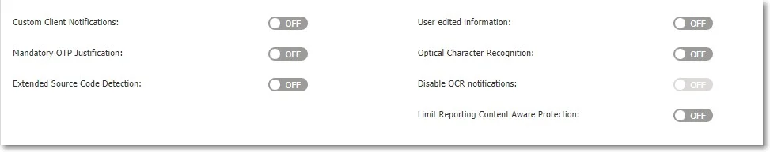

- Disable Bluetooth File Transfer – if enabled, this setting will block transfers to Bluetooth
  Devices, regardless of whether they're paired with the endpoint. This only applies to
  Windows endpoints.
- Allow formatting/renaming Removable devices in Trusted Device™ Level 1+ (TD1+) – available only
  for Windows. Enable this setting to allow the user to format or rename a USB device that has TD1-x
  access permission.

    :::note
    For this setting to work successfully, enable the Minifilter Driver setting.
    :::

- User Remediation Pop-up – this setting is available when the
  [User Remediation](/docs/endpointprotector/admin/systempar.md#user-remediation) feature is active and enables
  User Remediation pop-up notifications for end-users.
- Enforce User Remediation Pop-up - this setting is available only if the User Remediation Pop-up
  setting is enabled. When this setting is enabled, end-users can't disable User Remediation Pop-up
  notifications.
- Notifications Pop-up – you can select between the traditional notification, system tray, or pop-up
  notifications.
- Enable Minifilter driver – only available for Windows, this setting enables an enhanced
  driver for more reliability and easier maintenance. You can also enable this setting on
  the Computers/Users/Groups/Global Rights sections with Manage Settings from the Actions column.
- User Remediation Notification Template - you can select from the dropdown list a custom
  notification.
- Show Request OTP section in Endpoint Protector Client – disable this setting to hide the Request
  OTP action from Endpoint Protector Client
- Show Authorize section in Endpoint Protector Client – disable this setting to hide the Authorize
  action from Endpoint Protector Client

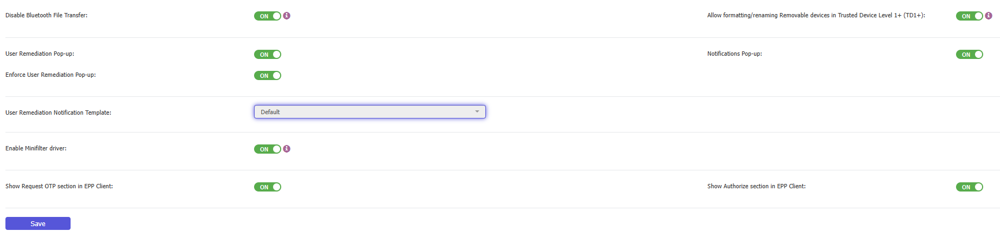

### Client Mode

Select from the dropdown list a client mode to define the Endpoint Protector Client behavior.

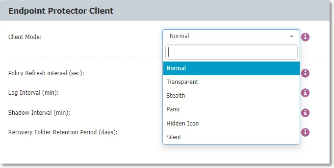

1. Normal – this is the default and recommended setting to use before you are fully aware of what the
   other modes imply. Normal mode doesn't apply to Content Aware Protection; all other client
   modes, except Silent mode, are specific to Device Control.

    :::note
    If the Normal Mode doesn't suit your needs, consider the Hidden or Silent modes as
    the best alternatives.
    :::

2. Transparent – use this mode to block all devices while keeping users unaware of any
   restrictions or of the presence of the Endpoint Protector Client. Transparent mode doesn't apply to
   Content Aware Protection; all other client modes, except Silent mode, are specific to Device
   Control.

    Selecting this mode will:

    - Not display the system tray icon
    - Not display system tray notifications
    - Block all devices, regardless of authorization, with the following exceptions:

        - Endpoint Protector blocks keyboards either when a third keyboard connects to the same
          computer or after 48 hours
        - Endpoint Protector doesn't block Wi-Fi connections
        - Bluetooth devices remain operational
        - Endpoint Protector doesn't block USB modems

    - Administrator receives alerts for all activities

3. Stealth - Use this mode to discreetly monitor users and computers with a focus on Device Control
   and file-tracing. Stealth mode doesn't apply to Content Aware Protection; all other client modes,
   except Silent mode, are specific to Device Control.

    :::note
    As Stealth mode allows everything, users experience no disruptions in their daily
    activities.
    :::

    Selecting this mode will:

    - Not display the system tray icon
    - Not display system tray notifications
    - Allow everything, regardless of authorized or not
    - Enable file shadowing and file tracing to view and monitor all user activity
    - Administrator receives alerts for all activities

4. Panic – Select this mode in extreme situations, when the Endpoint Protector Admin detects a
   user's malicious intent or activity. Panic mode doesn't apply to Content Aware
   Protection; all other client modes, except Silent mode, are specific to Device Control.

    :::info
    Use this mode for selected users/groups/computers only, as it will block all devices and
    generate a high volume of logs.
    :::

    Selecting this mode will:

    - Display the system tray icon
    - Display system tray notifications
    - Block all devices, regardless of authorization, with the following exceptions:

        - Endpoint Protector blocks keyboards either when a third keyboard connects to the same
          computer or after 48 hours
        - Endpoint Protector doesn't block Wi-Fi connections
        - Bluetooth devices remain operational
        - Endpoint Protector doesn't block USB modems

    - Enable file shadowing and file tracing to view and monitor all user activity
    - Administrator receives alerts when computers go in and out of Panic Mode

5. Hidden Icon - this mode is similar to Normal mode, except that the Endpoint Protector Client is
   not visible to the user. Hidden Icon mode doesn't apply to Content Aware Protection; all other
   client modes, except Silent mode, are specific to Device Control.

    Selecting this mode will:

    - Not display the system tray icon
    - Not display system tray notifications
    - Apply all set rights and settings as per their configuration

    When you select Hidden Icon mode, the **Show notifications in Hidden Icon mode** setting becomes available under the Client Mode section. This setting is disabled by default. Enable it to display client notifications while the Endpoint Protector Client icon remains hidden.

6. Silent - this mode is similar to Normal mode, except that pop-up notifications aren't visible to
   the user.

    Selecting this mode will:

    - Display the system tray icon
    - Not display system tray notifications
    - Apply all set rights and settings as per their configuration

:::note
Certain Linux distributions (like SLED) lack system tray support, resulting in the absence
of an Endpoint Protector Notifier icon. To receive Endpoint Protector notifications in these
systems, keep the Endpoint Protector Notifier window open.
:::

## DPI Configuration

:::note
For more Deep Packet Inspection (DPI) description refer to dedicated chapter: [Deep Packet Inspection](/docs/endpointprotector/admin/cap_module/deeppacket.md).
:::

In this section, you can manage the following settings:

- Deep Packet Inspection - if enabled, Endpoint Protector can inspect both network and browser
  traffic for content. This option is required for both the Deep Packet Inspection Allowlists and
  URL and Domain Denylist

- Use Stealthy DPI Driver – enable this driver to improve interoperability with independent software
  vendors

- Intercept VPN Traffic – if you enable this setting, you allow the Endpoint Protector Client to
  intercept VPN traffic on macOS using the network extension framework

    :::note
    See the [Intercept VPN Traffic](#intercept-vpn-traffic) topic.
    :::

- Linux proxy loopback address – supports integration with custom VPN and proxy solutions, such as Cisco ANYConnect. When you enable this setting, you can specify a custom loopback address, typically within the 127.0.0.0/8 range. This feature applies to Linux Clients with version 2509.x.x.x or later

- Enable Http/2 - lets administrators enable support for HTTP/2 within DPI protocols, giving greater flexibility and control over HTTP/2 protocol usage. If negotiation fails, the protocol reverts to HTTP.

- Endpoint Protector Behavior with Network Extension Off – select a behavior type from the available
  entries
- Peer Certificate Validation – enable this setting to turn on the Endpoint Protector certificate
  validation of the websites that the user accesses when DPI is active

    - Ignore Expiration Date - when checked, Endpoint Protector ignores expired certificates and permits traffic.
    - Ignore Trust - when checked, Endpoint Protector doesn't validate certificates against the Root Certificate.
    - Ignore Hostname - when checked, Endpoint Protector doesn't validate the certificate hostname property against the server hostname.

    :::warning
    Disabling setting 'Peer Certificate Validation' will not impact Endpoint Protector
    functionality. Disable it only when an alternative network traffic inspection product,
    such as a Secure Web Gateway Solution, is validating website certificates.
    :::

- Display Dialog Boxes for DPI Dropped Connections - enable this setting to display dialog windows
  containing more details on endpoint machines.
- Disable DPI Dropped Connections Notifications - check this setting to suppress notifications that
  the Notification Center shows near the System tray.
- Block Unsecured Connection - if enabled, blocks unsecured HTTP access and restricts user
  access.

    :::note
    The Block Unsecured Connection feature is only available when the Deep Packet
    Inspection feature is enabled.
    :::

- DPI Bypass Traffic – this setting automatically bypasses non-inspectable traffic and sends an event
  for allowed traffic.

    Possible Bypass reasons:

    1. Bypass DPI Certificate Rejection by Third-Party Applications

        - Enable this setting if you encounter SSL errors from the source applications, such as
          web browsers, like:

            > SSL_R_TLSV1_ALERT_UNKNOWN_CA
            >
            > SSL_R_SSLV3_ALERT_CERTIFICATE_UNKNOWN

            - This signifies that the source application failed to validate the server certificate
              that Endpoint Protector issued.
            - The absence of the DPI certificate in the system keychain may also contribute to this
              scenario.
            - 'Certificate Pinning' also falls under this category.

        :::note
        See [Using Wireshark for Network Traffic Analysis](#using-wireshark-for-network-traffic-analysis).
        :::

    2. Bypass Unknown TLS Handshakes

        - Enable this setting when a secure port connection uses custom encryption instead of
          TLS. Endpoint Protector then activates the DPI bypass.

            - For example, this occurs when you configure Telegram.app for DPI monitoring, log into
              the app, and encounter an unknown TLS handshake.

    3. Bypass Websites Temporarily Whitelisted (Possible mTLS Connection/SSL Setup
       Failure/Unsupported TLS Protocol)

        - Enable this setting where an SSL setup failure or an unsupported TLS protocol error occurs
          on the server side of an SSL connection. Endpoint Protector temporarily allow-lists the
          website.

            - While specific examples are infrequent, such instances involve potential mTLS
              connections.

    4. Bypass Websockets

        - Enable this setting when Websites use websockets with arbitrary data protocols.

            - Endpoint Protector passes connections through when the HTTP connection upgrades to a
              websocket.
            - Examples are applications, such as WhatsApp Web, Firefox Send etc.

    5. Bypass on HTTP Errors Indicating mTLS Requirement

        - Enable this setting, when a server indicates the requirement of a client certificate
          (mTLS).

            - Endpoint Protector triggers bypass for HTTP error codes like '400 Bad Response' and '496 SSL Certificate Required'.
            - Accessing [https://client.badssl.com/](https://client.badssl.com/) from a web browser
              without providing the necessary client certificate illustrates such situations.

    6. Bypass Invalid Peer Certificates

        - Enable this setting, to permit connections with invalid peer certificates when 'Peer
          Certificate Validation' is enabled.

            - If both 'Bypass Invalid Peer Certificates' and 'Peer Certificate Validation' are
              enabled, 'Bypass Invalid Peer Certificates' will override setting 'Peer Certificate
              Validation'.
            - Accessing [https://expired.badssl.com/](https://expired.badssl.com/)from a web browser
              with both settings 'Bypass Invalid Peer Certificates' and 'Peer Certificate Validation'
              enabled, illustrates such situations (the website will be accessible).

    :::warning
    The current Default DPI list and the new Default DPI bypass list apply only when manually
    checked within CAP (Content Aware Protection) policies.
    :::

    :::note
    See the Timeout Period for Bypassed Websites, and Handling of Bypassed Domains and Applications sections.
    :::

- DPI Bypass Event Logging – this setting will automatically send DPI Bypass events/reasons to
  Endpoint Protector Server when Endpoint Protector bypasses connections on endpoints.

    :::note
    See [Bypass Log Reporting Frequency](#bypass-log-reporting-frequency).
    :::

- DPI Bypass for Unidentified Application – this will enable bypassing DPI while logging traffic details,
  if available. Applicable only to EPP Clients for Linux with version 2.4.5.x or higher.

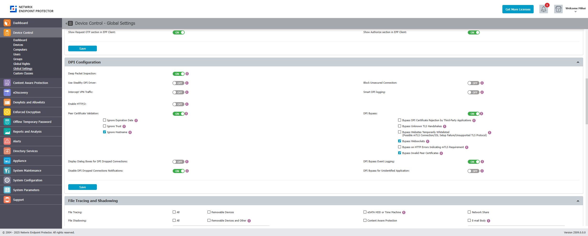

### Intercept VPN Traffic

:::note
For more additional DPI Intercept VPN traffic, check: [Deep Packet Inspection Intercept VPN Traffic](/docs/endpointprotector/admin/cap_module/deeppacket.md#deep-packet-inspection-diagrams).
:::

If you enable this setting, the Endpoint Protector Client will intercept VPN traffic on macOS using
the network extension framework.

:::note
The Intercept VPN Traffic feature is only available when the Deep Packet Inspection feature
is enabled. It will only work for macOS from version 11.0 onwards and only if you also add the Deep
Packet Inspection Certificate.
:::

To use this feature, follow these steps:

**Step 1 –** Enable **Deep Packet Inspection**.

**Step 2 –** Enable **Intercept VPN Traffic**.

**Step 3 –** Select an option for **Endpoint Protector behavior when network extension is disabled**

- **Temporary Disable Deep Packet Inspection** – this will disable Deep Packet Inspection temporary
- **Block Internet Access** - this will block the Internet connection until the user approves the
  Endpoint Protector Proxy configuration. The user also can allow the configuration after rebooting
  the PC.
- **Repeat VPN notification** – this will display the VPN pop-up window multiple times even after the
  user has previously denied permission.

**Step 4 –** Click **Save**.

**Step 5 –** On the pop-up window informing the user that a System Extension is blocked, click
**OK** to allow.

**Step 6 –** Go to **System Preferences** >**Security and Privacy** > **General**, and then
**allow** the Endpoint Protector Client Extension.

**Step 7 –** On the Endpoint Protector Proxy Configuration pop-up window, click **Allow**.

:::note
When the network extension is successfully enabled, Endpoint Protector generates a Client Integrity
OK log.
:::

**Step 8 –** Go to **System Configuration** > **System Settings** > **Deep Packet Inspection
Certificate**, and then download the CA Certificate.

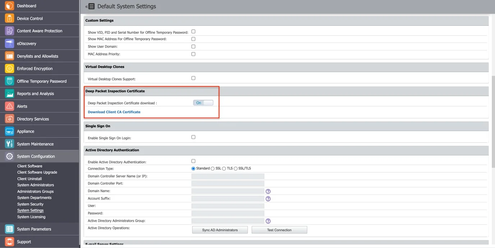

**Step 9 –** On your macOS, open the **Keychain Access** application and go to **System**.

**Step 10 –** Decompress the ClientCerts file.

**Step 11 –** Select the **cacert.pem** file and drag and drop it under **System** > **Keychain
Access**.

**Step 12 –** Double click the **X** from the newly added certificate and select **Always Trust**
from the Trust section.

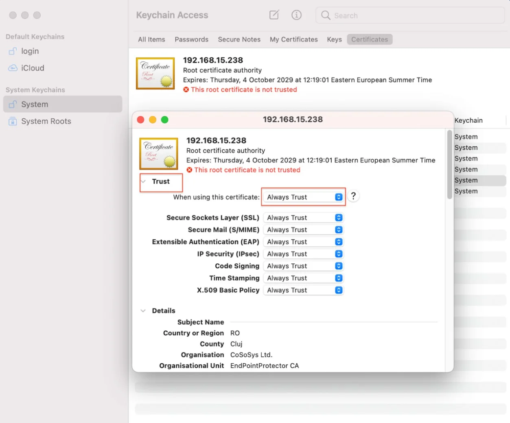

**Step 13 –** **Save** the changes.

### Smart DPI (Log Throttling)

Enable this setting to reduce excessive false positives for URL Denylists. Filtering out
non-relevant information produces a more accurate log that focuses on true false positives, reduces
unnecessary noise, and saves database storage.

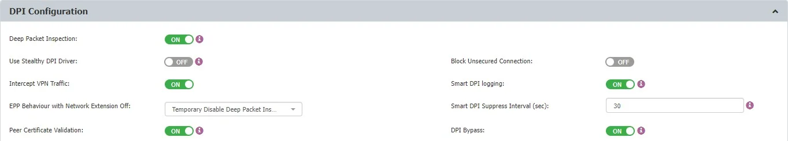

### Bypass Log Reporting Frequency

Endpoint Protector's agent ensures efficient resource utilization by reporting each domain name and
application pair at most once every two weeks. This approach prevents an overwhelming influx of logs,
which could reach excessive numbers if reported more frequently.

### Timeout Period for Bypassed Websites

To maintain a streamlined process, Endpoint Protector enforces a timeout period of two weeks. During
this time frame, Endpoint Protector retains the state for bypassed websites. Beyond this period,
Endpoint Protector automatically removes the bypass state, contributing to effective resource
management.

### Handling of Bypassed Domains and Applications

Endpoint Protector handles bypassed domains and applications as follows:

#### Memory and Disk Persistence

Endpoint Protector stores bypassed website information in both memory and on disk. This dual storage ensures that
the list of skipped websites is readily accessible for efficient future reference. Persisting this
information controls the frequency of log generation and avoids unnecessary strain on resources.

#### Clearing Bypass State

To reset the bypass state and clear associated records, administrators can temporarily disable and re-enable the bypass DPI setting on the Endpoint Protector server.

### Using Wireshark for Network Traffic Analysis

Before a "DPI certificate rejected" event, Wireshark helps you diagnose network traffic. The presence of a "TLS alert" error in Wireshark signals the impending event.

## File Tracing and Shadowing

In this section, you can manage the following settings:

- File Tracing – use this feature to monitor data traffic between protected endpoints and
  removable devices, internal eSATA HDDs, and Network Shares. It also shows other actions that took
  place, such as files named, deleted, accessed, modified, etc.

    To enable this feature, you can do so from Device Control, Global Settings, or granularly for
    Groups or Computers.

- File Shadowing – this feature extends the information File Tracing provides, creating exact
  copies of the files users access.

The following events trigger shadow copy creation: file copy, file write, and file read. Events such as file deleted, file renamed, etc. don't trigger the function. You can enable File
Shadowing on all supported Removable Devices:

- eSATA HDDs or Time Machines
- Network Shares
- Content Aware Protection - file transfers through various exit points such as online applications,
  printers, clipboards, etc.
- E-mail Body

:::warning
File Shadowing requires File Tracing.
:::

Network traffic and Endpoint Protector settings for different computers or file sizes can delay File
Shadowing. Shadowed files are usually available after a few minutes. Shadow creation may
not occur for newly created files; however, the system diligently tracks file activities and generates
File Shadowing for subsequent file events as expected.

:::note
For your deployment, activate File Shadowing for not more than 15% of your total endpoint capacity (e.g., for a 1000-endpoint deployment, activate File Shadowing on a maximum of 150 endpoints for optimal performance). For more users, contact customer support for recommended settings.
:::

- Exclude Extensions from Tracing – you can disable File Tracing for specific file types.

- Exclude Extensions from Scanning – you can disable scanning for specific file types.
- File Tracing Direction – this setting lets you monitor file transfers based on transfer
  direction:

    - Outgoing File Tracing Direction covers transfers from the local machine to removable devices.
    - Incoming File Tracing Direction indicates transfers from the removable devices to the local
      machine.
    - Both (Outgoing & Incoming) lets you monitor all transfers between removable devices and the
      local machine.

    :::note
    The File Tracing Direction setting only applies for transfers between removable
    devices, computers, and network shares and works only on Windows and macOS starting with version
    11.0.
    :::

    :::note
    Endpoint Protector supports MTP (Media Transfers Protocols) file transfer only on Windows
    client machines. Use it to transfer files in one direction, from your PC to your Android
    device.
    :::

- Exclude Extensions from Shadowing – use this setting to disable File Shadowing for specific file
  types.

- Scan archive in archive – use this setting to define the archive depth in which content is
  inspected.

- Block Time Machine – if you enable this setting, you will block Time Machine backups on macOS.

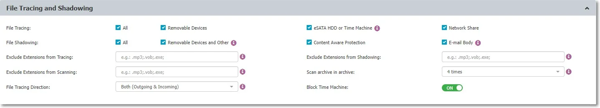

- Metadata Scanning - if you disable this setting, Endpoint Protector will not scan metadata for PDFs, ZIPs, and
  Office Files DOCX, XLSX, PPTX, DOC, XLX, PPT).

- Advanced Printer and MTP Scanning – enables a feature that loads a small DLL into certain Windows applications when they launch. That small DLL enables Endpoint Protector to monitor printing and files copied to MTP devices, by hooking Windows API functions responsible with printing and copying files to MTP devices.
For example, when a user opens Microsoft Word, Endpoint Protector loads a DLL into Microsoft Word's address space. If the user wants to print a document, Endpoint Protector calls that DLL and can scan the printed document content. If the printed content contains sensitive data Endpoint Protector can block the print operation.

    :::note
    This feature increases accuracy and reduces false positives for File Tracing and File
    Shadowing. It is available only for Windows and will require a computer restart.
    :::

- Advanced Scanning Exceptions is a list of applications into which Endpoint Protector won't inject its DLL when the "Advanced Printer and MTP Scanning" is enabled.
For example, many applications can't print or copy files to MTP devices, so it doesn't make sense to inject the Endpoint Protector DLL into them. For best performance or to avoid unexpected interactions with Endpoint Protector, add these applications to the "Advanced Scanning Exceptions" list.

- Block Print from Browsers – prevents users from printing web pages from any supported browser on Windows. For details, see [Block Print from Browsers](#block-print-from-browsers).

    :::note
    The Content-Aware Protection (CAP) feature is available only for Chrome and Edge via a
    dedicated extension. For other browsers, this setting will block print functionality.
    :::

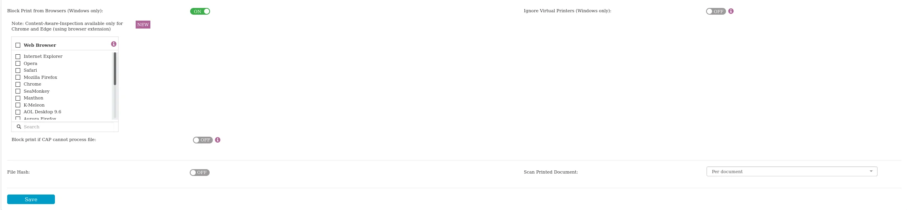

- Block Print if CAP Can't Process File – This setting determines the action if CAP can't access
  the file content. By default, Endpoint Protector allows printing. This option applies only to Chrome and Edge
  with the browser extension on Windows.

- File Hash - if you enable this setting, Endpoint Protector generates a file hash and includes it
  in the file transfer logs.

- Scan Printed Document – specifies whether to scan the entire document or individual pages when Endpoint Protector detects a print operation.
  - `Per printed page` – scans each page as it prints. Metadata isn't included, as metadata isn't printed.
  - `Per document` – scans the entire file, including metadata (MIP/NDC). Use this option when you need to inspect metadata.

:::warning
Newer Linux Ubuntu versions have 'snap'-based applications installed by default,
affecting Endpoint Protector Client functionality. This may result in missing file-related events in
File Tracing and File Shadow artifacts. The reliance on 'snap'-based applications also affects
file-related web browser activities, exacerbating this limitation. Consider non-'snap'-based
applications (where possible) as alternative configurations for optimal functionality.
:::

## Block Print from Browsers

Enable this setting to restrict the user from printing web pages from various browser types
available, define the specific browsers, and create and enforce a Content Aware Policy that includes
Printers from the Policy Exit Points section.

:::note
This setting is available only for Windows.
:::

:::warning
After enabling the Block Print from Browsers setting and applying the configuration on
the Client to enforce it, reload open browser tabs or restart the browser for the changes to take effect.
:::

:::warning
Since version 5.9.4.1, Endpoint Protector Clients require binding to the new Endpoint
Protector web printing extensions. Customers using GPO configuration should update the browser
extension ID configured in the GPO. The old extensions will soon be deprecated. Customers
using this feature and older Endpoint Protector Clients than version 5.9.4.1 should immediately
enforce an Endpoint Protector Client upgrade process. After updating the GPO configurations and
completing the Endpoint Protector Client upgrade process, fully reboot the computer for the
changes to take effect.
:::

:::warning
Upgrading the Endpoint Protector Client with the browser plug-in enabled will require a
full computer restart.
:::

:::note
When printing from Excel Online, Endpoint Protector may not immediately inspect changes made in the last few seconds. The web application must sync recent changes to OneDrive before Endpoint Protector can inspect them. The sync delay depends on your connection bandwidth and the autosave configuration in your Microsoft 365 apps.
:::

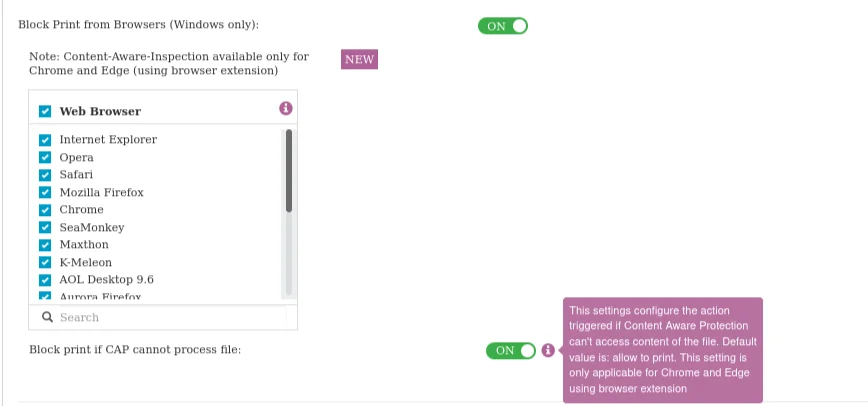

Users printing from Google Chrome and Microsoft Edge can use content-aware detection by
enforcing a Content Aware Policy that includes Printers from the Policy Exit Points section. For
seamless protection, the Endpoint Protector Browser Connection extension installs automatically the
first time upon enabling the Block Print from Browsers setting. This extension enhances content
scanning during web document printing on both server and client sides.

:::note
The extension doesn't function in 'in Private/Incognito' mode. If it fails to load, it
reverts to full Block-mode with Printing, providing comprehensive protection.
:::

:::note
To ensure the extensions' stability and prevent user interference, use Group Policy
Objects (GPO), the exclusive and recommended method for installing on both Google Chrome and
Microsoft Edge.
:::

:::warning
Use Group Policies to set PDF files to download instead of open in the web
browser so that block print from the browser functions accurately.
:::

:::warning
Group Policy Objects (GPO) are the only supported method to prevent users from
disabling or uninstalling the Google Chrome and Microsoft Edge extension.
:::

### Configuring GPO for Browser Extensions

To configure Group Policy Objects (GPO) to deploy a browser extension to Windows machines and prevent
users from removing it, follow these steps:

1. Google Chrome

    **Step 1 –** Refer to the official
    [Google support guide](https://support.google.com/chrome/a/answer/10407780?hl=en) for detailed
    instructions.

    **Step 2 –** Download the
    [Chrome Group Policy](https://chromeenterprise.google/browser/download/#chrome-group-policy).

    **Step 3 –** Configure your Group Policy as shown in the following screenshot.

    - Endpoint Protector Browser Connector ID: nnnaeanocbmnnjjlcfhcbpefmlgbcgoi

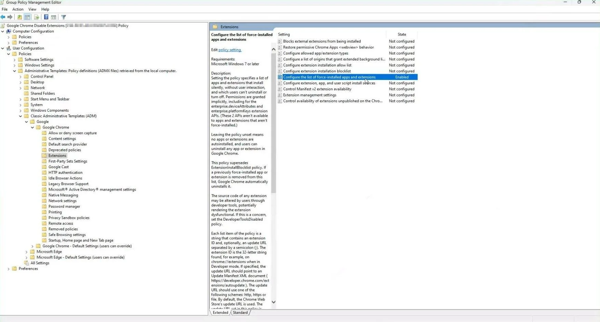

1. Microsoft Edge

    **Step 1 –** use the
    [Configure Microsoft Edge](https://learn.microsoft.com/en-us/deployedge/configure-microsoft-edge)
    guide provided by Microsoft.

    **Step 2 –** Download the
    [Edge Group Policy Template](https://learn.microsoft.com/en-US/troubleshoot/windows-client/group-policy/create-and-manage-central-store).

    **Step 3 –** Configure your Group Policy as shown in the following screenshot.

    - Endpoint Protector Browser Connector ID: nnnaeanocbmnnjjlcfhcbpefmlgbcgoi

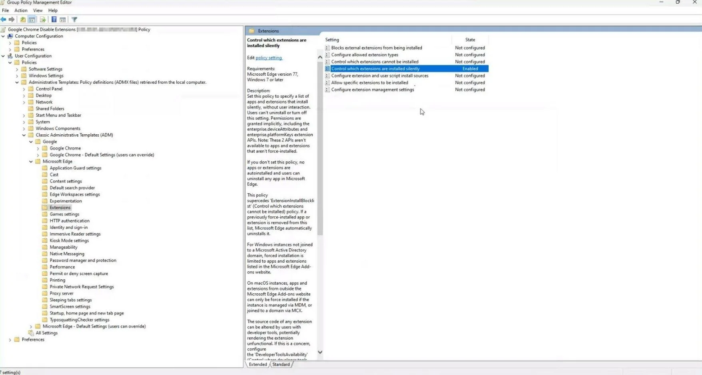

:::warning
Thoroughly test the configuration in a controlled environment to confirm the
intended behavior. Always keep endpoint security policies updated and aligned with organizational
security standards.
:::

## Ignore Virtual Printers

The option to Ignore Virtual Printing events lets you control Content Aware Protection and File
Tracing visibility over virtual printers like Microsoft to PDF, PDFCreator, and more. This conserves
log space and reduces the workload on your analytics and administration teams. With this option, you
can track PDFs only when they exit your organization's environment rather than when Endpoint
Protector creates them, streamlining monitoring efforts and improving efficiency.

:::note
This feature only applies for Windows.
:::

## Configure Max File Size

In this section, you can tailor the Content Aware Protection scanner's file size settings to your
organization's requirements. The default maximum file size is 40 MB, with a maximum limit of
4096 MB.

You can also configure additional file type sizes. The defaults are PDF (2048 MB) and Archives
(256 MB). You can adjust these file type sizes within the range of 1 KB to 4 GB.

On Windows, Endpoint Protector applies a default time-out of 10 seconds. On macOS, Apple OS
architecture enforces a strict 10-second time-out, because it terminates processes that don't
respond promptly. Linux operates without a specific time-out limitation.

:::note
This setting only applies to Content Aware Protection policies and doesn't affect
eDiscovery Policies and Max File Size for File Shadows.
:::

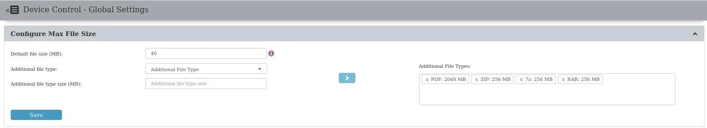

## Outside Hours and Outside Network

From this section, users can manage Outside Network and Outside Hours Policies, for both Device
Control and Content Aware modules.

- Outside Hours policies – enable the setting and then set the Working days, Business hours start
  time, and end time.
- Outside Network policies – enable the setting and then add the DNS Fully Qualified Domain Name and
  DNS IP Addresses.

After you make these settings, you can set the fallback device type rights globally, or per Groups,
Users, or Computers.

:::warning
When triggered, fallback policies supersede the standard device rights. Regarding
fallback policies, the Outside Network Policies supersede the Outside Hours Policies.
:::

:::note
For [Content Aware Protection](/docs/endpointprotector/admin/cap_module/capmodule.md), the Outside Network
and Outside Hours Policy Type also needs to be selected.
:::

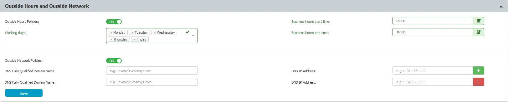

## Transfer Limit

From this section, users can set the transfer limit, within a specific time interval (hours). Once
transfers reach the limit, file transfers to storage devices (Device Control) to control applications
(Content Aware Protection) will no longer be possible, until the time interval expires and the count
resets. Similarly, you can also include file transfers through Network Shares in the Transfer
Limit.

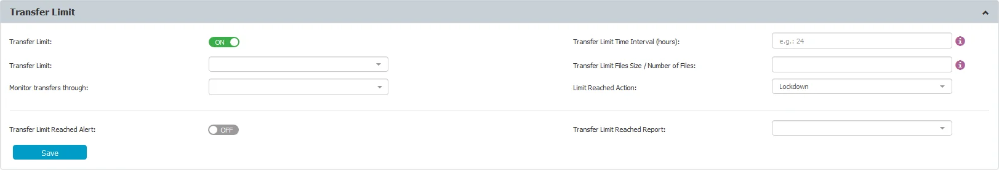

The mechanism that checks when transfers reach the Transfer Limit doesn't impact computer performance.

Therefore, there might be a slight delay between the exact time transfers reach the limit and the
enforcement of the transfer restrictions. In general the delay is a few seconds, but depending on
the network it could be up to a few minutes.

There are three actions to choose from when transfers reach the Transfer Limit:

- Monitor Only – this setting reports when transfers reach the limit
- Restrict – this setting blocks the devices and applications that you defined in the Device
  Control policies
- Lockdown – this setting blocks all devices, regardless of whether you defined them within the
  Device Control policies, including the network interfaces and therefore, any type of transfer

:::note
To re-establish the Server-Client communication before the Transfer Limit Time Interval
expires, use a Transfer Limit Reached Offline Temporary Password. For detailed information,
refer to the Offline Temporary Password chapter.
:::

You can enable a Transfer Limit Reached Alert and schedule a Transfer Limit Reached Report on a
daily, weekly, or monthly basis.

## Debug Logging

You can use this feature to collect logs for a specific issue and send the resulting archive to the
Endpoint Protector Server on the Reports and analysis section, the Logs Report page.

When you enable this feature, the Endpoint Protector Client creates the log file (general log file),
and if Deep Packet Inspection is enabled, it collects supplementary Deep Packet Inspection logs
along with sslsplit logs.

:::note
Use the Debug level mode, as it contains more than error and warning type information.
:::

### Debug Logging Activation

To use the debug feature and collect logs, follow these steps:

**Manual Logging**

On the Global > Computer > User Settings page, configure the following settings:

**Step 1 –** Enable **Debug Mode** from the DEBUG logging section.

**Step 2 –** Click and select an option on the **set logs level** (None, Error, Warning,
Informational, Debug) dropdown. For new deployments, the default level is **Error**.

**Step 3 –** For Error, Warning, Informational, and Debug log levels select **obfuscate sensitive
data**. For new deployments, **Obfuscate Sensitive Data** is enabled by default.

**Step 4 –** **Save.**

:::note
See [Data Obfuscation Rules](#data-obfuscation-rules).
:::

:::warning
Use debug mode only for troubleshooting or when replicating an issue for further Netwrix Support Escalations. Debug mode enables detailed logging of all EPP Client operations, which causes local EPP logs to grow rapidly. For regular operation, use a less verbose mode, such as `informational` or `error`.
:::

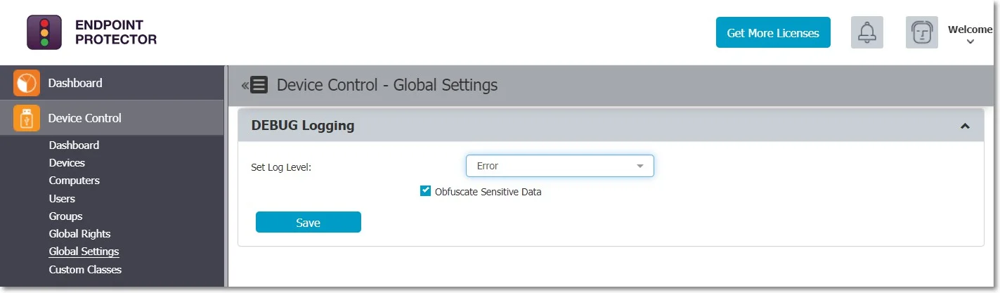

**Step 5 –** Right-click the **Endpoint Protector Client icon** and select **Update Policies Now**.

**Step 6 –** Replicate the issue to generate the corresponding logs.

**Step 7 –** Open the Endpoint Protector Client and go to the **Troubleshooting** tab.

**Step 8 –** Click **Upload Logs** - this will upload the logs on the Endpoint Protector Server.

**Step 9 –** Go to the **Global Settings** page and disable **Debug Mode**.

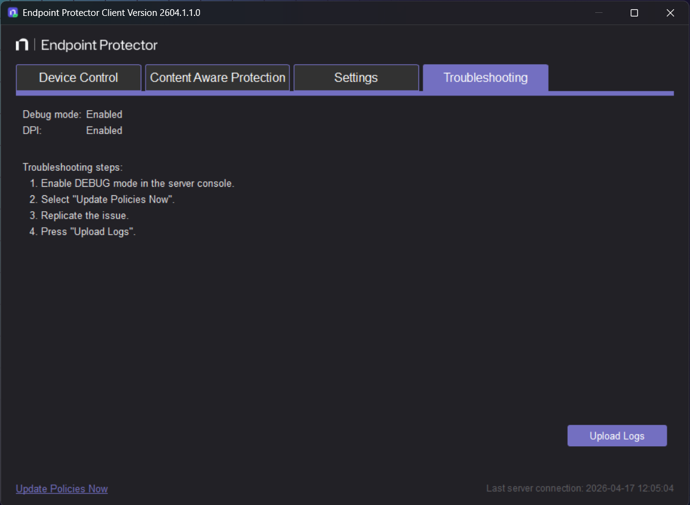

**Automatic Logging**

You can also substitute the user action from the Manual Logging procedure by using the automatic
logging option.

- This option is available under **Device Control** on the **Computer** page.
- Hover over a computer, right-click, and select **Collect diagnostic** - this will collect logs
  from a specific computer without input or knowledge from the computer user.

The Client sends logs to the Endpoint Protector Server on the Logs Report page, and Endpoint
Protector registers Artifact Received events when it receives diagnostic data.

### Getting Debug Logs via EPP Server

To view the log actions, go to the **Device Control** module, on the **Computer**s page and click
the **Actions** column.

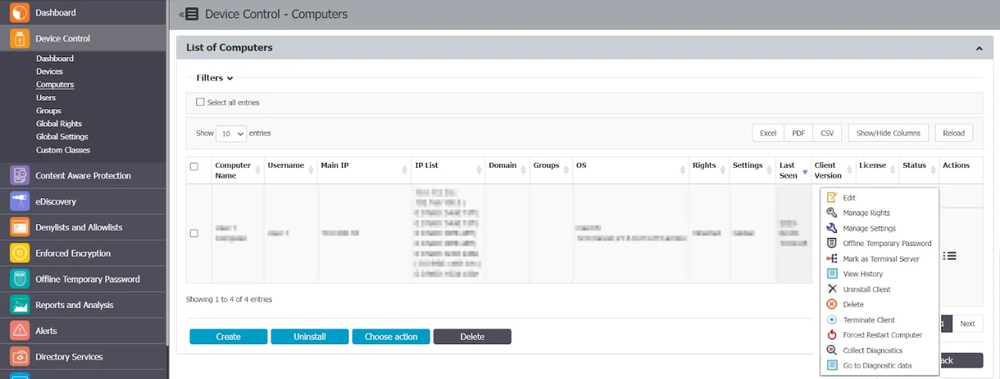

- Collect Diagnostics - registers an event when you request diagnostic data (Artifact requested
  event)

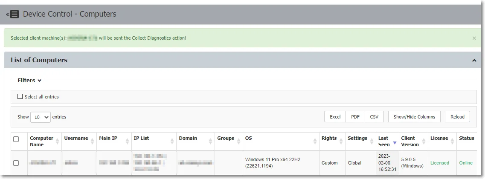

- Go to Diagnostic data - this option redirects the user to the Reports and Analysis module on the
  Logs Report page to Artifact received type events with debug mode logs

- Terminate Client - this option terminates the Endpoint Protector Client

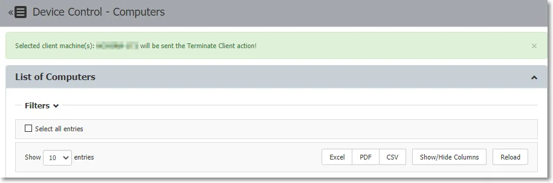

- Forced Restart Computer - this option sends a force reboot command to the computer, restarting it
  in 10 minutes after using the command. The user receives a message warning to avoid losing unsaved
  documents.

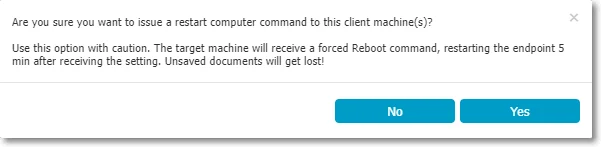

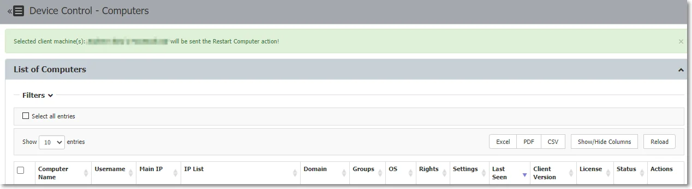

### Getting Debug Logs locally on Endpoint

If the EPP Client can't communicate with the Endpoint Protector Server, collect debug logs directly
on the endpoint with the diagnostic collection script instead.

:::note
If Tamper Mode is enabled, the script only works on Windows.
:::

#### Windows

**Step 1 –** Run the following script from PowerShell or Command Prompt as an administrator:

`"C:\Program Files\CoSoSys\Endpoint Protector\Resources\epp_collect_dpi_info.bat"`

**Step 2 –** Wait for the script to finish. Some steps, such as listing installed apps and
collecting console logs, can take a few minutes. Don't interrupt the script.

**Step 3 –** Collect the generated files from the output folder the script prints at the end of the
run. By default, this is `%TEMP%\epp_logs`.

#### macOS

**Step 1 –** Run the following command as root:

`sudo /Applications/EndpointProtectorClient.app/Contents/Resources/epp_collect_dpi_info_mac.sh`

**Step 2 –** Enter the password when prompted. The script must run as root.

**Step 3 –** Wait for the script to finish. Some steps, such as listing installed apps and
collecting console logs, can take a few minutes. Don't interrupt the script.

**Step 4 –** Collect the generated files from the output folder the script prints. By default, this
is `/tmp/epp_logs`.

#### Advanced Options

Both scripts accept optional parameters to also collect Deep Packet Inspection (DPI) diagnostics
(network, proxy, and certificate information) and to change the output folder. Both scripts delete
the destination folder if it already exists and recreate it, then print the final path where they
save the collected files.

**Windows:**

`epp_collect_dpi_info.bat -dpi --output="C:\epp_logs"`

- `-dpi` (or `/dpi`, `--dpi`) — also collects DPI information (network, WFP, proxy). Without this
  flag, the script only collects basic logs and configuration.
- `--output="C:\path"` (or `-output`, `/output`) — sets the destination folder. Defaults to
  `%TEMP%\epp_logs`.

**macOS:**

`sudo /Applications/EndpointProtectorClient.app/Contents/Resources/epp_collect_dpi_info_mac.sh 1 /tmp/epp_logs`

- First parameter — `1` also collects DPI information (network, proxy, certificates); `0` skips it.
- Second parameter (optional) — sets the destination folder. Defaults to `/tmp/epp_logs`.

### Data Obfuscation Rules

Endpoint Protector obfuscates all data according to these rules:

- display the first 4 characters if the threat is shorter than 12 characters, or
- display the first 6 characters if the threat is longer than 12 characters

Specific use cases:

1. For credit cards, Endpoint Protector implements the PCI Security Standards with full text
   obfuscation
2. For SSNs, Endpoint Protector displays the last 4 characters
3. For Brazil ID (CPF), Endpoint Protector obfuscates the first 3 and the last 2 characters

:::note
Endpoint Protector doesn't obfuscate file-type, file-size, and date threats.
:::

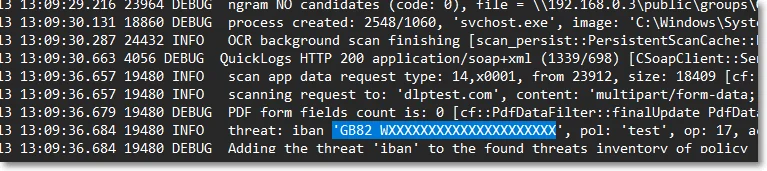

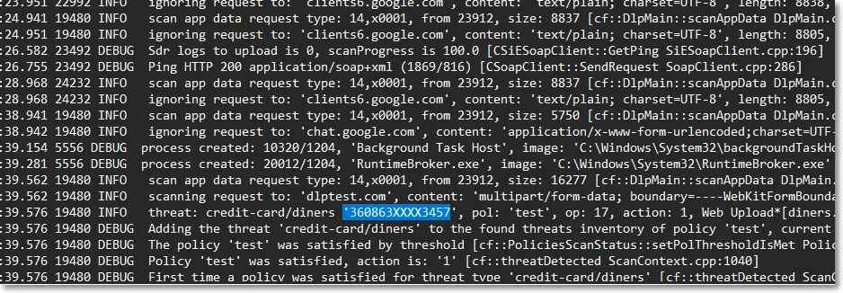

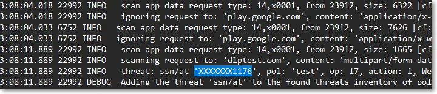

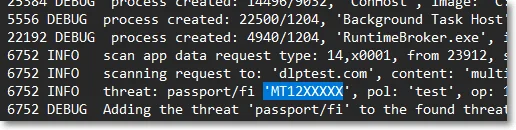

## Enforced Encryption (EasyLock) Settings

From this section you can allow EasyLock to install and run only on computers that have
Endpoint Protector installed or in relation to a list of trusted Endpoint Protector Servers.

:::note
Before you use these settings, ensure that you configure a Master Password. See [Enforced Encryption](/docs/endpointprotector/admin/ee_module/eemodule.md) for how to configure it.
:::

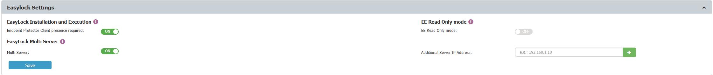

- **Endpoint Protector Client Presence Required** — When enabled, EasyLock (Enforced Encryption) runs only on computers where the Endpoint Protector (EPP) Client is installed.

  Group-level Client Presence settings take effect only when the EPP Client is present and can evaluate the applicable user or computer group policy. If a user connects an encrypted USB drive to a computer without the EPP Client, that computer can't evaluate group-level EasyLock settings, and EasyLock falls back to the global Client Presence setting instead.

  For example, if Client Presence is disabled globally but enabled for a specific user or group, the group-level setting applies only on computers where the EPP Client is running. On computers without the EPP Client, EasyLock uses the global setting.

  :::note
  To prevent EasyLock from running on computers that don't have the EPP Client installed, enable **Client Presence Required** at the global level.
  :::

- **EE Read-Only Mode** — When enabled, EasyLock blocks write access to encrypted drives on computers not managed by the EPP Client. When disabled (default), EasyLock doesn't start at all on unmanaged computers. See [Enforced Encryption in Read-Only mode](/docs/endpointprotector/admin/ee_module/eemodule.md#enforced-encryption-in-read-only-mode).

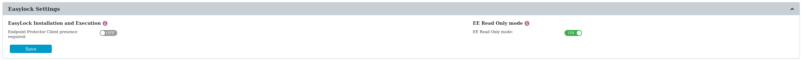

## eDiscovery: User-Initiated Scan Settings

This section configures the eDiscovery feature for [user-initiated scans](/docs/endpointprotector/admin/ed_module/edscanning.md#user-initiated-scan-settings).

- **User-Initiated Scans** — Enables the User-Initiated Scan feature in the end-user EPP Notifier.

- **Number of Scans** — Retains a specified number of scan results (range: 1–10, default: 1).
- **Number of Days** — Retains scan results for a specified number of days (range: 1–30, default: 1).
:::note
These two settings are mutually exclusive—select one retention method.
:::

- **Send User-Initiated Scan Events** — Sending scan events can consume significant storage space. Reports can't distinguish these scans from administrator-initiated scans. Consider enabling only if needed.
- **Prioritize Server-Initiated Scans** — When enabled, administrator-initiated scans automatically stop any running user-initiated scans.
- **Log File Rollover Size (MB)** — Sets the maximum log file size, in MB, before EPP archives it automatically. Minimum: 0 MB, maximum: 10240 MB.
- **Log Disk Space Threshold (%)** — Sets the maximum percentage of disk space log files can use before EPP archives them automatically. Minimum: 1%, maximum: 25%.

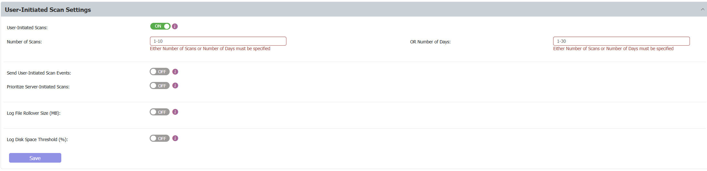

## Additional Information

From this section you can restore global settings to default and view who performed the action and
when.

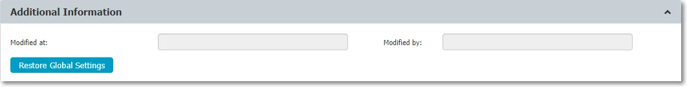

## Display Settings

From this section you can set the maximum number of logs displayed on the Endpoint Protector Server
and the number of reports per page.

You can display a maximum of 10 000 logs per report. To export all entries when
the log number exceeds the maximum 10 000 limit, use the Create export option or narrow the search
using filters.

:::note
This setting also applies to eDiscovery.
:::

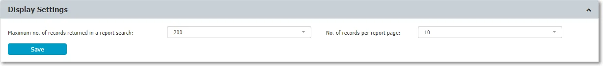
