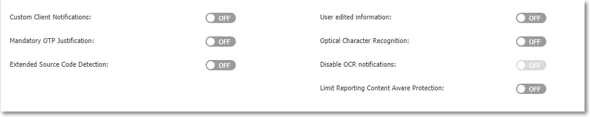
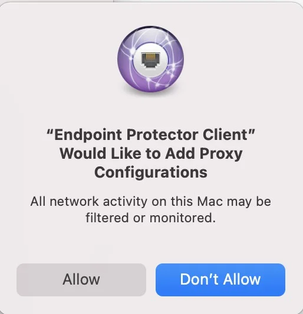
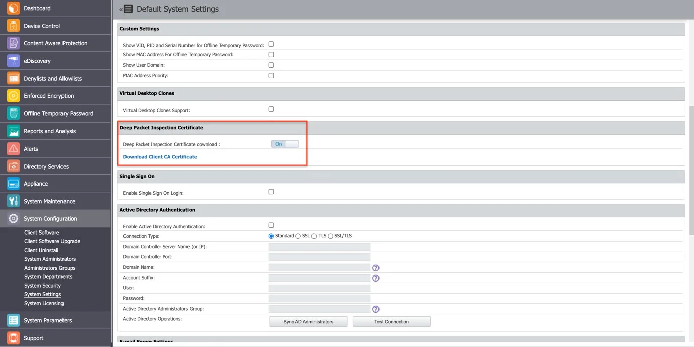
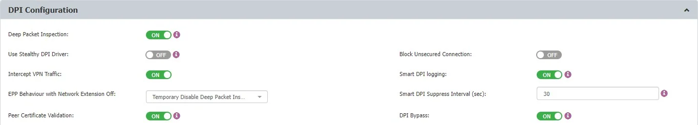
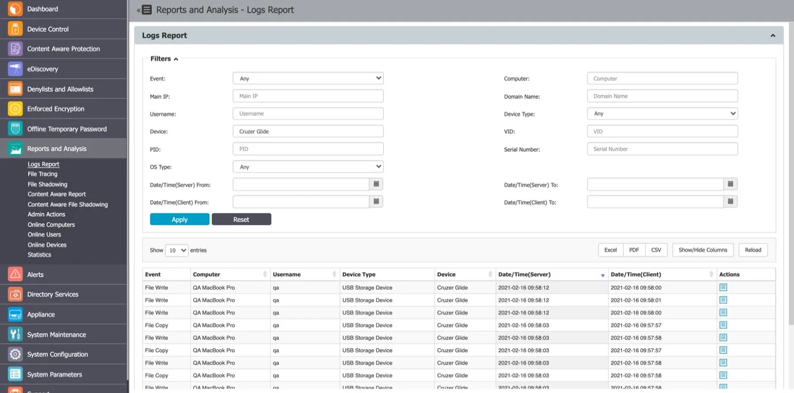
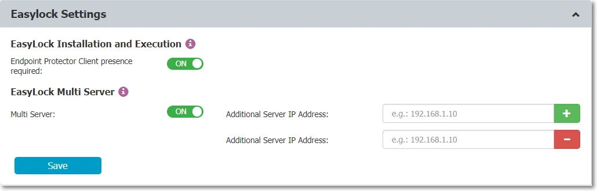

# Global Settings

From this section, you can apply settings globally to all Endpoint Protector entities.

Any setting that appears in Global Settings offers additional functionality, as these settings can be customized per group, user, or computer. This allows administrators to configure precise, granular policies across the organization using the options available in this tab. Because of this, Global Settings may include options that are also available in other components, such as [Content Aware Protection](/docs/endpointprotector/admin/cap_module/capmodule.md), [Deep Packet Inspection](/docs/endpointprotector/admin/cap_module/deeppacket.md) or [Enforced Encryption](/docs/endpointprotector/admin/ee_module/eemodule.md).

- If there are no settings defined granularly for a computer, and it does not belong to a group,
  these are the settings it will inherit.
- If the computer belongs to a group, then it will inherit that group’s settings.

## Client Settings

From this section, you can manage settings that relate directly to the Endpoint Protector Client and
the Client’s behavior for each specific entity (Global, Groups, and Computers).

- Client Mode – select a mode to change Endpoint Protector Client behavior.

    :::note
    Learn more from the [Client Mode](#client-mode) section.
    :::

- Notifier Language – Configure the Endpoint Protector Client to automatically match the OS language
  of the user for notifications. When set to "Automatic," the client adjusts its language to the
  user's OS language preference without any server interactions, enhancing the user experience and
  reducing confusion.

    To configure the Endpoint Protector Notifier language selection:

> **Step 1 –** Navigate to Device Control > Global Settings in the Endpoint Protector Console.
>
> **Step 2 –** In the "Notifier language" section, select either "Automatic" or "Default" based on
> your preferences.
>
> - “Automatic" means the language will be detected automatically from the OS, without server
>   interaction.
> - "Default" means the language selected on the server will be applied. If the "Automatic" language
>   was selected on the server, the "Automatic" language will be used.
>
> **Step 3 –** Save your settings to apply the chosen language selection.

> With this enhanced language selection feature, Endpoint Protector provides a more accommodating
> experience for users, making notifications and alerts more accessible and user-centric.

- Tamper Mode – enable this setting to protect the Endpoint Protector Client from unauthorized
  termination and modification

> **CAUTION:** A machine or service reboot is mandatory after enabling this setting to work
> correctly.

- Policy Refresh Interval (sec) – enter the time interval at which the Client checks with the Server
  and updates with the latest settings, rights, and policies.

    :::note
    The policy refresh cycles may be influenced by Azure Active Directory sync intervals
    (or Active Directory syncs) if Endpoint Protector is configured to sync entities. Please consider
    the sync intervals of your Azure Active Directory or Active Directory sync processes when
    determining an appropriate policy refresh interval.
    :::

- Log Interval (min) – enter the time interval at which the Client attempts to re-send the Logs to
  the Server.
- Shadow Interval (min) – enter a time interval between 0-720 minutes at which the Endpoint
  Protector Client sends the file Shadows to the Endpoint Protector Server.

    :::note
    Set the interval to 0 to send the file shadows instantly.
    :::

- Recovery Folder Retention Period (days) – this setting is specific for Mac and Linux computers. It
  acts as a quarantine folder before a transferred file has been fully inspected for content,
  avoiding any potential file loss due to blocked transfers. After the specified time interval, the
  files are permanently deleted.
- Log Size (MB) – enter the largest size of all logs stored on the Client. If the value is reached,
  new logs will overwrite the oldest ones. These circumstances occur only when the Client and Server
  do not communicate for a large period of time.
- Shadow Size (MB) – enter the largest size of all file shadows on the Client. If the value is
  reached, new shadows will overwrite the oldest ones. These circumstances occur only when the
  Client and Server do not communicate for a large period of time.
- Min File Size for Shadowing (KB) – enter the smallest size of a file at which a File Shadow is
  created.
- Max File Size for Shadowing (KB) – enter the largest size of a file at which a File Shadow is
  created.
- Devices Recovery Folder Max Size (MB) – this setting is specific for Mac and Linux computers.
  Maximum size for the quarantine folder. If the value is reached, new files will overwrite the
  oldest ones.

- Custom Client Notifications - if enabled, the Client Notifications can be customized.
- Mandatory OTP Justification - if enabled, the Justification a User has to provide when requesting or
  using an Offline Temporary Password is mandatory.
- Extend Source Code Detection - if enabled, this will extend the detection also inside of file type,
  such as PDF, Docx, etc. With Monitor Webmail setting enabled, you can also detect source code in
  emails in subject and body using web browsers.

    :::note
    Source Code Detection may encounter challenges when dealing with small code snippets.
    This can occur due to the potential overlap among various programming languages. It's important
    to consider these limitations when configuring and utilizing Source Code Detection for optimal
    results.
    :::

- User edited information - if enabled, the User can edit the user and computer information from
  within the Endpoint Protector Client.
- Optical Character Recognition - if enabled, JPEG, PNG, GIF, BMP, and TIFF file types can be
  inspected for content. This option will also change the global MIME Type Allowlists.
- Disable OCR notifications – if enabled, this will disable all notifications generated by the Optical
  Character Recognition setting.
- Limit Reporting Content Aware Protection - if enabled, this will allow information discovered
  after reaching the Threat Threshold or after matching the Content Detection Rule that contains AND
  operator for a Report Only Content Aware Protection policy, to no longer be logged. This
  considerably reduces the number of logs, therefore, optimizing the allocated storage space.

- Disable Bluetooth File Transfer – if enabled, this setting will block transfers to Bluetooth
  Devices, without considering if they are paired or not to the endpoint. This only applies to
  Windows endpoints.
- Allow formatting/renaming Removable devices in Trusted Device™ Level 1+ (TD1+) – only available
  for Windows, enable this setting to allow the user to format or rename a USB device that has TD1-x
  access permission.

    :::note
    For this setting to work successfully, enable the Minifilter Driver setting.
    :::

- User Remediation Pop-up – this setting is available when the
 [User Remediation](/docs/endpointprotector/admin/systempar.md#user-remediation) feature is active and enables
[User Remediation](/docs/endpointprotector/admin/systempar.md#user-remediation) feature is active and enables
  User Remediation pop-up notifications for end-users.
- Enforce User Remediation Pop-up - this setting is available only if the User Remediation Pop-up
  setting is enabled. When this setting is enabled, end-users cannot disable User Remediation Pop-up
  notifications.
- Notifications Pop-up – you can select between the traditional notification, system tray, or pop-up
  notifications.
- Enable Minifilter driver – only available for Windows, this setting allows the use of an enhanced
  driver that provides more reliability and ease of maintenance. You can also enable this setting on
  the Computers/Users/Groups/Global Rights sections with Manage Settings from the Actions column.
- User Remediation Notification Template - you can select from the drop-down list a custom
  notification.
- Show Request OTP section in Endpoint Protector Client – disable this setting to hide the Request
  OTP action from Endpoint Protector Client
- Show Authorize section in Endpoint Protector Client – disable this setting to hide the Authorize
  action from Endpoint Protector Client

### Client Mode

Select from the drop-down list a client mode to define the Endpoint Protector Client behavior.

1. Normal – this is the default and recommended setting to use before being fully aware of what the
   other modes imply. Normal mode does not apply to Content Aware Protection; all other client
   modes, except Silent mode, are specific to Device Control.

    :::note
    If the Normal Mode does not suit your needs, consider the Hidden or Silent modes as
    the best alternatives.
    :::

2. Transparent – use this mode to block all devices whilst maintaining users unaware of any
   restrictions or presence of the Endpoint Protector Client. Transparent mode does not apply to
   Content Aware Protection; all other client modes, except Silent mode, are specific to Device
   Control.

    Selecting this mode will:

    - Not display the system tray icon
    - Not display system tray notifications
    - Block all devices, regardless of authorization, with the following exceptions:

        - Keyboards are blocked either when a third one is connected to the same computer or after
          48 hours have passed
        - Wi-Fi connections are not blocked
        - Bluetooth devices remain operational
        - USB modems are not blocked

    - Administrator receives alerts for all activities

3. Stealth - Use this mode to discreetly monitor users and computers with a focus on Device Control
   and file-tracing. Stealth mode does not apply to Content Aware Protection; all other client modes,
   except Silent mode, are specific to Device Control.

    :::note
    As everything is allowed, there will be no disruptions in the daily activities of the
    users.
    :::

    Selecting this mode will:

    - Not display the system tray icon
    - Not display system tray notifications
    - Allow everything, regardless of authorized or not
    - Enable file shadowing and file tracing to view and monitor all user activity
    - Administrator receives alerts for all activities

4. Panic – This mode should be selected under extreme situations when a user’s malicious intent or
   activity is detected by the Endpoint Protector Admin. Panic mode does not apply to Content Aware
   Protection; all other client modes, except Silent mode, are specific to Device Control.

    :::info
    It is recommended to use this mode for selected users/groups/computers only,
    as it will block all devices and generate a high volume of logs.
    :::

    Selecting this mode will:

    - Display the system tray icon
    - Display system tray notifications
    - Block all devices, regardless of authorization, with the following exceptions:

        - Keyboards are blocked either when a third one is connected to the same computer or after
          48 hours have passed
        - Wi-Fi connections are not blocked
        - Bluetooth devices remain operational
        - USB modems are not blocked

    - Enable file shadowing and file tracing to view and monitor all user activity
    - Administrator receives alerts when computers go in and out of Panic Mode

5. Hidden Icon - this mode is similar to Normal mode, except that the Endpoint Protector Client is
   not visible to the user. Hidden Icon mode does not apply to Content Aware Protection; all other
   client modes, except Silent mode, are specific to Device Control.

    Selecting this mode will:

    - Not display the system tray icon
    - Not display system tray notifications
    - Apply all set rights and settings as per their configuration

6. Silent - this mode is similar to Normal mode, except that pop-up notifications are not visible to
   the user.

    Selecting this mode will:

    - Display the system tray icon
    - Not display system tray notifications
    - Apply all set rights and settings as per their configuration

:::note
Certain Linux distributions (like SLED) lack system tray support, resulting in the absence
of an Endpoint Protector Notifier icon. To receive Endpoint Protector notifications in these
systems, keep the Endpoint Protector Notifier window open.
:::

## DPI Configuration

:::note
For more Deep Packet Inspection (DPI) description please refer to dedicated chapter: [Deep Packet Inspection](/docs/endpointprotector/admin/cap_module/deeppacket.md).
:::

In this section, you can manage the following settings:

- Deep Packet Inspection - if enabled, network and browser traffic can be inspected for content. This
  option is required for both the Deep Packet Inspection Allowlists and URL and Domain Denylist

- Use Stealthy DPI Driver – enable this driver to improve interoperability with independent software
  vendors

- Intercept VPN Traffic – if you enable this setting, you allow the Endpoint Protector Client to
  intercept VPN traffic on macOS using the network extension framework

    :::note
    Learn more from the [Intercept VPN Traffic](#intercept-vpn-traffic) topic.
    :::

- Linux proxy loopback address –  aims to facilitate seamless integration with custom VPN and proxy solutions, particularly those like Cisco ANYConnect. When activated, you can specify a custom loopback address, tipically within the 127.0.0.0/8 range. This features is applicable for Linux Clients with version 2509.x.x.x or later

- Enable Http/2 - this feature is designed to enhance network protocol management and allows administrators to enable support for HTTP/2 within DPI protocols. If negotiation fails, the protocol will revert to HTTP. It aims to provide greater flexibility and control over HTTP/2 protocol usage.

- Endpoint Protector Behavior with Network Extension Off – select a behavior type from the available
  entries
- Peer Certificate Validation – enable this setting to turn on the Endpoint Protector certificate
  validation of the websites that are accessed by the user when DPI is active

    - Ignore Expiration Date - when checked, expired certificates will be ignored and traffic will be
      permitted.
    - Ignore Trust - when checked, certificates will not be validated against the Root Certificate.
    - Ignore Hostname - when checked, the certificate hostname property will not be validated against
      the server hostname.

    :::warning
    Disabling setting ‘Peer Certificate Validation’ will not impact Endpoint Protector
    functionality. It should only be disabled when an alternative network traffic inspection product,
    such as a Secure Web Gateway Solution, is validating website certificates.
    :::

- Display Dialog Boxes for DPI Dropped Connections - enable this setting to display Dialog windows
  on endpoint machines, containing more details.
- Disable DPI Dropped Connections Notifications - check this setting to suppress notifications shown
  by the Notification Center nearby the System tray.
- Block Unsecured Connection - if enabled, unsecured access through HTTP will be blocked and user
  access restricted.

    :::note
    The Block Unsecured Connection feature is only available when the Deep Packet
    Inspection feature is enabled.
    :::

- DPI Bypass Traffic – this setting automatically bypasses non-inspectable traffic and sends an event
  for allowed traffic.

    Possible Bypass reasons:

    1. Bypass DPI Certificate Rejection by Third-Party Applications

        - Enable this setting, if SSL errors are encountered from the source applications, such as
          web browsers, like:

            > SSL_R_TLSV1_ALERT_UNKNOWN_CA
            >
            > SSL_R_SSLV3_ALERT_CERTIFICATE_UNKNOWN

            - This signifies that the source application failed to validate the server certificate,
              which was issued by Endpoint Protector.
            - The absence of the DPI certificate in the system keychain may also contribute to this
              scenario.
            - ‘Certificate Pinning’ also falls under this category.

        :::note
        Learn more about
        [Using Wireshark for Network Traffic Analysis](#using-wireshark-for-network-traffic-analysis).
        :::

    2. Bypass Unknown TLS Handshakes

        - Enable this setting, when a secure port connection employs custom encryption instead of
          TLS, the DPI bypass is activated.

            - This is exemplified by configuring Telegram.app for DPI monitoring, logging into the
              app, and encountering an unknown TLS handshake.

    3. Bypass Websites Temporarily Whitelisted (Possible mTLS Connection/SSL Setup
       Failure/Unsupported TLS Protocol)

        - Enable this setting where an SSL setup failure or an unsupported TLS protocol error occurs
          on the server side of an SSL connection. Endpoint Protector temporarily allow-lists the
          website.

            - While specific examples are infrequent, such instances involve potential mTLS
              connections.

    4. Bypass Websockets

        - Enable this setting, when Websites utilize websockets with arbitrary data protocols.

            - Endpoint Protector passthroughs connections upon the HTTP connection's upgrade to a
              websocket.
            - Examples are applications, such as WhatsApp Web, Firefox Send etc.

    5. Bypass on HTTP Errors Indicating mTLS Requirement

        - Enable this setting, when a server indicates the requirement of a client certificate
          (mTLS).

            - Endpoint Protector triggers bypass for HTTP error codes like ‘400 Bad Response’ and
              ‘496 SSL Certificate Required’.
            - Accessing [https://client.badssl.com/](https://client.badssl.com/) from a web browser
              without providing the necessary client certificate illustrates such situations.

    6. Bypass Invalid Peer Certificates

        - Enable this setting, to permit connections with invalid peer certificates when ‘Peer
          Certificate Validation’ is enabled.

            - If both ‘Bypass Invalid Peer Certificates’ and ‘Peer Certificate Validation’ are
              enabled, ‘Bypass Invalid Peer Certificates’ will override setting ‘Peer Certificate
              Validation’.
            - Accessing [https://expired.badssl.com/](https://expired.badssl.com/)from a web browser
              with both settings ‘Bypass Invalid Peer Certificates’ and ‘Peer Certificate Validation’
              enabled, illustrates such situations (the website will be accessible).

    :::warning
    Please be aware that the current Default DPI list and the new Default DPI bypass
    list are exclusively utilized when manually checked within CAP (Content Aware Protection)
    policies.
    :::

    :::note
    Learn more about Timeout Period for Bypassed Websites, and Handling of Bypassed
    Domains and Applications.
    :::

- DPI Bypass Event Logging – this setting will automatically send DPI Bypass events/reasons to
  Endpoint Protector Server when connections are being bypassed on endpoints.

    :::note
    Learn more about [Bypass Log Reporting Frequency](#bypass-log-reporting-frequency).
    :::

- DPI Bypass for Unidentified Application – this will enable bypassing DPI while logging traffic details,
  if available. Applicable only to EPP Clients for Linux with version 2.4.5.x or higher.

### Intercept VPN Traffic

:::note
For more additional DPI Intercept VPN traffic, check: [Deep Packet Inspection Intercept VPN Traffic](/docs/endpointprotector/admin/cap_module/deeppacket.md#deep-packet-inspection-diagrams).
:::

If you enable this setting, the Endpoint Protector Client will intercept VPN traffic on macOS using
the network extension framework.

:::note
The Intercept VPN Traffic feature is only available when the Deep Packet Inspection feature
is enabled. It will only work for macOS from version 11.0 onwards and only if Deep Packet Inspection
Certificate is also added.
:::

To use this feature, follow these steps:

**Step 1 –** Enable **Deep Packet Inspection**.

**Step 2 –** Enable **Intercept VPN Traffic**.

**Step 3 –** Select an option for **Endpoint Protector behavior when network extension is disabled**

- **Temporary Disable Deep Packet Inspection** – this will disable Deep Packet Inspection temporary
- **Block Internet Access** - this will block the Internet connection until the user approves the
  Endpoint Protector Proxy configuration. The user also can allow the configuration after rebooting
  the PC.
- **Repeat VPN notification** – this will display the VPN pop-up window multiple times even after the
  user has previously denied permission.

**Step 4 –** Click **Save**.

**Step 5 –** On the pop-up window informing the user that a System Extension is blocked, click
**OK** to allow.

**Step 6 –** Go to **System Preferences** >**Security and Privacy** > **General**, and then
**allow** the Endpoint Protector Client Extension.

**Step 7 –** On the Endpoint Protector Proxy Configuration pop-up window, click **Allow**.

:::note
When network extension is successfully enabled, a Client Integrity OK log is generated.
:::

**Step 8 –** Go to **System Configuration** > **System Settings** > **Deep Packet Inspection
Certificate**, and then download the CA Certificate.

**Step 9 –** On your macOS, open the **Keychain Access** application and go to **System**.

**Step 10 –** Decompress the ClientCerts file.

**Step 11 –** Select the **cacert.pem** file and drag and drop it under **System** > **Keychain
Access**.

**Step 12 –** Double click the **X** from the newly added certificate and select **Always Trust**
from the Trust section.

**Step 13 –** **Save** the changes.

### Smart DPI (Log Throttling)

Enable this setting to address the number of excessive false positives for URL Denylists. This
improvement provides you with a configuration option to filter out non-relevant information, resulting
in a more accurate log that focuses on true false positives and reduces unnecessary noise saving
database storage.

### Bypass Log Reporting Frequency

Endpoint Protector's agent ensures efficient resource utilization by reporting each domain name and
application pair at most once every two weeks. This approach prevents an overwhelming influx of logs,
which could reach excessive numbers if reported more frequently.

### Timeout Period for Bypassed Websites

To maintain a streamlined process, Endpoint Protector enforces a timeout period of two weeks. During
this time frame, the state for bypassed websites is retained. Beyond this period, the bypass state
is automatically removed, contributing to effective resource management.

### Handling of Bypassed Domains and Applications

Endpoint Protector employs a nuanced approach to handle bypassed domains and applications:

#### Memory and Disk Persistence

Bypassed website information is stored in both memory and on disk. This dual storage ensures that
the list of skipped websites is readily accessible for efficient future reference. By persisting this
information, the frequency of log generation can be controlled to avoid unnecessary strain on
resources.

#### Clearing Bypass State

To reset the bypass state and clear associated records, administrators can initiate a simple
process. Temporarily disabling and subsequently re-enabling the bypass DPI setting on the Endpoint
Protector server achieves this reset.

### Using Wireshark for Network Traffic Analysis

Prior to a "DPI certificate rejected" event, Wireshark can be instrumental in diagnosing network
traffic. The presence of a "TLS alert" error in Wireshark signals the impending event.

## File Tracing and Shadowing

In this section, you can manage the following settings:

- File Tracing – this feature allows you to monitor data traffic between protected endpoints and
  removable devices, internal eSATA HDDs, and Network Shares. It also shows other actions that took
  place, such as files named, deleted, accessed, modified, etc.

    To enable this feature, you can do so from Device Control, Global Settings, or granularly for
    Groups or Computers.

- File Shadowing – this feature extends the information provided by File Tracing, creating exact
  copies of files accessed by users.

The creation of shadow copies can be triggered by the following events: file copy, file write, and file
read. Events such as file deleted, file renamed, etc. do not trigger the function. You can enable File
Shadowing on all supported Removable Devices:

- eSATA HDDs or Time Machines
- Network Shares
- Content Aware Protection - file transfers through various exit points such as online applications,
  printers, clipboards, etc.
- E-mail Body

:::warning
File Shadowing cannot be used without File Tracing.
:::

File Shadowing can be delayed due to network traffic and Endpoint Protector Settings for different
computers or file sizes. Shadowed files are usually available after a few minutes. Shadow creation may
not occur for newly created files; however, the system diligently tracks file activities and generates
File Shadowing for subsequent file events as expected.

:::note
For your deployment, we strongly advise activating File Shadowing for not more than 15% of
your total endpoint capacity (e.g., for a 1000 endpoint deployment, File Shadowing should be set to
a maximum of 150 endpoints for optimal performance). For more users, please contact customer support
for recommended settings.
:::

- Exclude Extensions from Tracing – you can disable File Tracing for specific file types.

- Exclude Extensions from Scanning – you can disable scanning for specific file types.
- File Tracing Direction – this setting enables you to monitor file transfers based on transfer
  direction:

    - Outgoing File Tracing Direction is defined by transfers made from the local machine to
      removable devices.
    - Incoming File Tracing Direction indicates transfers from the removable devices to the local
      machine.
    - Both (Outgoing & Incoming) allows you to monitor all types of transfers that are made between
      removable devices and the local machine.

    :::note
    The File Tracing Direction setting only applies for transfers between removable
    devices, computers, and network shares and works only on Windows and macOS starting with version
    11.0.
    :::

    :::note
    MTP (Media Transfers Protocols) file transfer is currently supported only on Windows
    client machines. It allows you to transfer files in one direction, from your PC to your Android
    device.
    :::

- Exclude Extensions from Shadowing – use this setting to disable File Shadowing for specific file
  types.

- Scan archive in archive – use this setting to define the archive depth in which content is
  inspected.

- Block Time Machine – if you enable this setting, you will block Time Machine backups on macOS.

- Metadata Scanning - if you disable this setting, metadata will not be scanned for PDFs, ZIPs, and
  Office Files DOCX, XLSX, PPTX, DOC, XLX, PPT).

- Advanced Printer and MTP Scanning – enables a feature in Endpoint Protector by which a small DLL is loaded into certain Windows applications when they are launched. That small DLL enables Endpoint Protector to monitor printing and files copied to MTP devices, by hooking Windows API functions responsible with printing and copying files to MTP devices.
For example, when a user opens Microsoft Word, an Endpoint Protector DLL is loaded into Microsoft Word's address space. If the user wants to print a document, that DLL is called, and Endpoint Protector can scan the printed document content. If the printed content contains sensitive data Endpoint Protector can block the print operation.

    :::note
    This feature increases accuracy and reduces false positives for File Tracing and File
    Shadowing. It is available only for Windows and will require a computer restart.
    :::

- Advanced Scanning Exceptions is a list of applications into which Endpoint Protector won't inject its DLL when the "Advanced Printer and MTP Scanning" is enabled.
For example, many applications can't be used to print or to copy files to MTP devices, so it does not make sense to inject the Endpoint Protector DLL into them. For best performance or to avoid unexpected interactions with Endpoint Protector, these applications can be added to the “Advanced Scanning Exceptions” list.

- Block Print from Browsers – Enable this setting to prevent users from printing web pages from any
  supported browser on Windows.

    :::note
    The Content-Aware Protection (CAP) feature is available only for Chrome and Edge via a
    dedicated extension. For other browsers, this setting will block print functionality.
    :::

- Block Print if CAP Cannot Process File – This setting determines the action if CAP cannot access
  the file content. By default, printing is allowed. This option applies only to Chrome and Edge
  with the browser extension on Windows.

- File Hash - if you enable this setting, a file hash will be generated and included in the file
  transfer logs.

- Scan Printed Document – select if you want to be notified a threat was restricted on the whole
  document or on the specific page.

:::warning
Newer Linux Ubuntu versions have 'snap'-based applications installed by default,
affecting Endpoint Protector Client functionality. This may result in missing file-related events in
File Tracing and File Shadow artifacts. The reliance on 'snap'-based applications also affects
file-related web browser activities, exacerbating this limitation. Consider non-’snap’-based
applications (where possible) as alternative configurations for optimal functionality.
:::

## Block Print from Browsers

Enable this setting to restrict the user from printing web pages from various browser types
available, define the specific browsers, and create and enforce a Content Aware Policy that includes
Printers from the Policy Exit Points section.

:::note
This setting is available only for Windows.
:::

:::warning
After enabling the Block Print from Browsers setting and applying the configuration on
the Client to enforce it, please be aware that open browser tabs will need to be reloaded, or a
browser restart will be required for the changes to take effect.
:::

:::warning
Since version 5.9.4.1, Endpoint Protector Clients require binding to the new Endpoint
Protector web printing extensions. Customers using GPO configuration, should ensure that the browser
extension ID configured in the GPO is updated. The old extensions will soon be deprecated. Customers
using this feature and older Endpoint Protector Clients than version 5.9.4.1 should immediately
enforce an Endpoint Protector Client upgrade process. After updating the GPO configurations and
completing the Endpoint Protector Client upgrade process, a full computer reboot is required for the
changes to take effect.
:::

:::warning
Upgrading the Endpoint Protector Client with the browser plug-in enabled will require a
full computer restart.
:::

Users printing from Google Chrome and Microsoft Edge can utilize content-aware detection by
enforcing a Content Aware Policy that includes Printers from the Policy Exit Points section. For
seamless protection, the Endpoint Protector Browser Connection extension installs automatically the
first time upon enabling the Block Print from Browsers setting. This extension enhances content
scanning capabilities during web document printing, integrating seamlessly on both server and client
sides.

:::note
The extension does not function in 'in Private/Incognito' mode. If it fails to load, it
reverts to full Block-mode with Printing, providing comprehensive protection.
:::

:::note
To ensure the extensions' stability and prevent user interference, use Group Policy
Objects (GPO), the exclusive and recommended method for installing on both Google Chrome and
Microsoft Edge.
:::

:::warning
Use the Group Policies to set PDF files to be downloaded instead of opened in the web
browser for the block print from the browser to function accurately.
:::

:::warning
Group Policy Objects (GPO) are the only supported method to prevent users from
disabling or uninstalling the Google Chrome and Microsoft Edge extension.
:::

### Configuring GPO for Browser Extensions

To configure Group Policy Objects (GPO) to deploy a browser extension to Windows machines and prevent
users from removing it, follow these steps:

1. Google Chrome

    **Step 1 –** Refer to the official
    [Google support guide](https://support.google.com/chrome/a/answer/10407780?hl=en) for detailed
    instructions.

    **Step 2 –** Download the
    [Chrome Group Policy](https://chromeenterprise.google/browser/download/#chrome-group-policy).

    **Step 3 –** Configure your Group Policy as shown below.

    - Endpoint Protector Browser Connector ID: nnnaeanocbmnnjjlcfhcbpefmlgbcgoi

1. Microsoft Edge

    **Step 1 –** Utilize the
    [Configure Microsoft Edge](https://learn.microsoft.com/en-us/deployedge/configure-microsoft-edge)
    guide provided by Microsoft.

    **Step 2 –** Download the
    [Edge Group Policy Template](https://learn.microsoft.com/en-US/troubleshoot/windows-client/group-policy/create-and-manage-central-store).

    **Step 3 –** Configure your Group Policy as shown below.

    - Endpoint Protector Browser Connector ID: nnnaeanocbmnnjjlcfhcbpefmlgbcgoi

:::warning
Make sure to thoroughly test the configuration in a controlled environment to ensure the
intended behavior. Always keep endpoint security policies updated and aligned with organizational
security standards.
:::

## Ignore Virtual Printers

The option to Ignore Virtual Printing events, empowers users to have control over Content Aware
Protection and File Tracing visibility over virtual printers like Microsoft to PDF, PDFCreator, and
more. This not only helps conserve valuable log space but also reduces the workload on your
analytics and administration teams. With this option, users can focus on tracking PDFs only when
they exit your organization's environment and not when they have been created, streamlining
monitoring efforts and improving efficiency.

:::note
This feature only applies for Windows.
:::

## Configure Max File Size

This section allows customers to tailor Content Aware Protection scanner’s file size settings
according to their specific needs. By customizing these settings, users can ensure Endpoint Protector
meets their organization's requirements. The default maximum file size is set at 40 MB, with a
maximum limit of 4096 MB.

Furthermore, users have the flexibility to configure additional file type sizes, which are set as
follows by default: PDF (2048 MB) and Archives (256 MB). These file type sizes can be adjusted within
the range of 1 KB to 4 GB to accommodate your specific needs.

Additionally, in the Windows environment, a default time-out of 10 seconds is applied. For MacOS, a
strict 10-second time-out is enforced due to Apple OS architecture, which terminates processes that
do not respond promptly. Linux currently operates without a specific time-out limitation.

:::note
This setting only applies to Content Aware Protection policies and does not affect
eDiscovery Policies and Max File Size for File Shadows.
:::

## Outside Hours and Outside Network

From this section, users can manage Outside Network and Outside Hours Policies, for both Device
Control and Content Aware modules.

- Outside Hours policies – enable the setting and then set the Working days, Business hours start
  time, and end time.
- Outside Network policies – enable the setting and then add the DNS Fully Qualified Domain Name and
  DNS IP Addresses.

Once these settings are made, the fallback device type rights can be set Globally, per Groups,
Users, or Computers.

:::warning
When triggered, fallback policies supersede the standard device rights. Regarding
fallback policies, the Outside Network Policies supersede the Outside Hours Policies.
:::

:::note
For [Content Aware Protection](/docs/endpointprotector/admin/cap_module/capmodule.md), the Outside Network
and Outside Hours Policy Type also needs to be selected.
:::

## Transfer Limit

From this section, users can set the transfer limit, within a specific time interval (hours). Once
the limit is reached, file transfers to storage devices (Device Control) to control applications
(Content Aware Protection) will no longer be possible, until the time interval expires and the count
is reset. Similarly, file transfers through Network Shares can also be included in the Transfer
Limit.

The mechanism that checks when the Transfer Limit is reached has been designed in such a way that it
does not impact the performance of the computer.

Therefore, there might be a slight delay between the exact time the limit is reached and the
enforcement of the transfer restrictions. In general, it’s just a few seconds but also depending on
the network, it could be up to a few minutes.

There are three actions to choose from when the Transfer Limit is reached:

- Monitor Only – this setting reports when the limit is reached
- Restrict – this setting blocks the devices and applications that have been defined in the Device
  Control policies
- Lockdown – this setting blocks all devices, regardless if they have been defined within the Device
  Control policies, including the network interfaces and therefore, any type of transfer

:::note
To re-establish the Server-Client communication before the Transfer Limit Time Interval
expires, a Transfer Limit Reached Offline Temporary Password is available. For detailed information,
refer to the Offline Temporary Password chapter.
:::

You can enable a Transfer Limit Reached Alert and schedule a Transfer Limit Reached Report on a
daily, weekly, or monthly basis.

## Debug Logging

You can use this feature to collect logs for a specific issue and send the resulting archive to the
Endpoint Protector Server on the Reports and analysis section, the Logs Report page.

By enabling this feature, the Endpoint Protector Client will create the log file (general log file),
and if Deep Packet Inspection is enabled, it will collect supplementary Deep Packet Inspection logs
along with sslsplit logs.

:::note
We recommend using the Debug level mode as it contains more than error and warning type
information.
:::

### Debug Logging Usage

To use the debug feature and collect logs, follow these steps:

**Manual Logging**

On the Global > Computer > User Settings page, configure the following settings:

**Step 1 –** Enable **Debug Mode** from the DEBUG logging section.

**Step 2 –** Click and select an option on the **set logs level** (None, Error, Warning,
Informational, Debug) drop down.

**Step 3 –** For Error, Warning, Informational, and Debug log levels select **obfuscate sensitive
data**.

**Step 4 –** **Save.**

:::note
Read the [Data Obfuscation Rules](#data-obfuscation-rules) section for more information.
:::

**Step 5 –** Right-click the **Endpoint Protector Client icon** and select **Update Policies Now**.

**Step 6 –** Replicate the issue to generate the corresponding logs.

**Step 7 –** Open the Endpoint Protector Client and go to the **Troubleshooting** tab.

**Step 8 –** Click **Upload Logs** - this will upload the logs on the Endpoint Protector Server.

**Step 9 –** Go to the **Global Settings** page and disable **Debug Mode**.

**Automatic Logging**

You can also substitute the user action from the Manual Logging procedure by using the automatic
logging option.

- This option is available under **Device Control** on the **Computer** page.
- Hover over a computer, right-click, and select **Collect diagnostic** - this will collect logs
  from a specific computer without input or knowledge from the computer user.

Logs will be sent to the Endpoint Protector Server on the Logs Report page, Artifact Received events
are registered when diagnostic data are received.

### Debug Logging Actions

To view the log actions, go to the **Device Control** module, on the **Computer**s page and click
the **Actions** column.

- Collect Diagnostics - registers an event when diagnostic data are requested (Artifact requested
  event)

- Go to Diagnostic data - this option redirects the user to the Reports and Analysis module on the
  Logs Report page to Artifact received type events with debug mode logs

- Terminate Client - this option terminates the Endpoint Protector Client

- Forced Restart Computer - this option sends a force reboot command to the computer, restarting it
  in 10 minutes after using the command. The user receives a message warning to avoid losing unsaved
  documents.

### Data Obfuscation Rules

All data is obfuscated according to the following rules:

- the first 4 characters are displayed if the length of the threat is lower than 12 characters, or
- the first 6 characters are displayed if the length of the threat is longer than 12 characters

Specific use cases:

1. For credit cards, the PCI Security Standards were implemented
2. For SSNs, the last 4 characters are displayed
3. For Brazil ID (CPF), the first 3 and the last 2 characters are obfuscated

:::note
Data is not obfuscated for the file-type threat, file-size threat, and date threat.
:::

## EasyLock Settings

From this section you can allow EasyLock to be installed and run only on computers that have
Endpoint Protector installed or in relation to a list of trusted Endpoint Protector Servers.

EE Read Only mode, will block write access to encrypted drive on computers not managed by EPP Client. Default value is OFF, it means that EE application will not start on computer not managed by EPP Client. For more information refer to [Enforced Encryption in Read-Only mode](/docs/endpointprotector/admin/ee_module/eemodule.md#enforced-encryption-in-read-only-mode)

## Additional Information

From this section you can restore global settings to default and view the name and date when the
action was performed.

## Display Settings

From this section you can set the maximum number of logs displayed on the Endpoint Protector Server
and the number of reports per page.

You can set a maximum number of 10 000 logs to be displayed per report. To export all entries when
the log number exceeds the maximum 10 000 limit, use the Create export option or narrow the search
using filters.

:::note
The information you set on this setting will also be applied for eDiscovery.
:::

