# Users and Groups

## Users

From this section, you can manage all the users in the system. Users are defined as the end-users who
are logged on a computer on which the Endpoint Protector Client software is installed. Any new user
will be automatically added to the database, thus making them manageable.

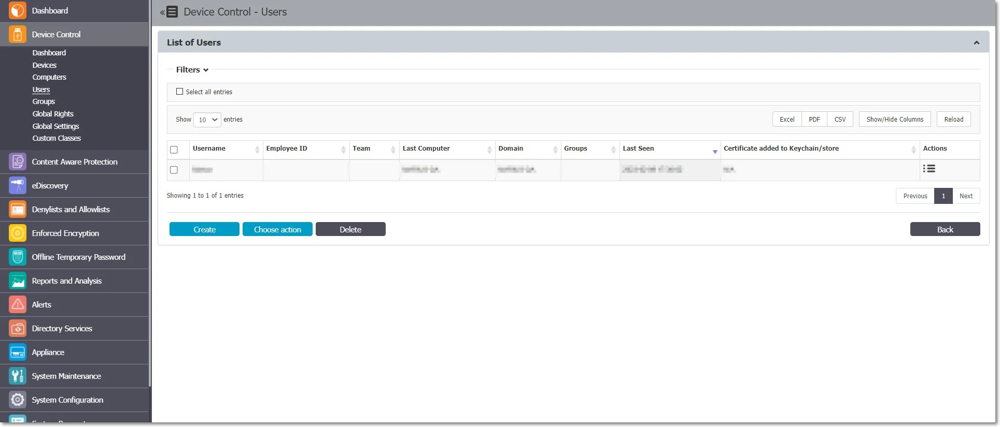

A user is identified by information like Name (Username, First Name, Last Name), Department, Contact
Details (Phone, E-mail), and others and is also automatically assigned to a computer.

The Administrator can manually create a new user at any time by providing the user’s parameters and
information mentioned above. Users can also be imported into Endpoint Protector from Active
Directory.

For detailed information on Active Directory, refer to the
[Directory Services](/docs/endpointprotector/admin/directoryserv.md) chapter.

There are two users created by default during the installation process of Endpoint Protector:

- noUser is the user linked to all events performed while no user was logged into the computer.
  Remote users’ names who log into the computer will not be logged and their events will be stored
  as events of noUser. Another occurrence of noUser events would be to have an automated
  script/software which accesses a device when no user is logged in to the specific computer.
- autorunUser indicates that an installer has been launched by Windows from a specific device. It is
  the user attached to all events generated by the programs launched from the specific device when
  Autoplay is enabled in the Operating System.

:::warning
Depending on the OS, additional system users can appear:
:::

- \_mbsetupuser (for macOS, during updates)
- 65535, 62624, etc. (for Linux, during locked screens)

The Actions column offers multiple options related to user management like Edit, Manage Rights,
History, and Delete.

### User Rights

The User Rights can be accessed by going to the Actions column for the specific user and selecting
Manage Rights.

This section is built around the users, allowing the Administrator to specify what Device Types and
also what Specific Devices can be accessible.

The Standard device control rights includes the Device Types and Already Existing Devices sections.
These are generally the only device rights used.

In addition to the Standard device control rights, if enabled from the Global Settings, the
administrator can create fallback policies for Outside Network and Outside Hours circumstances.

:::note
The Restore Global Rights button can be used to revert to a lower level of rights. Once
this button is pushed all rights on that level will be set to preserve global settings and the
system will use the next level of rights.
:::

All Existing Devices that were added on that level will be deleted when the restore is used.

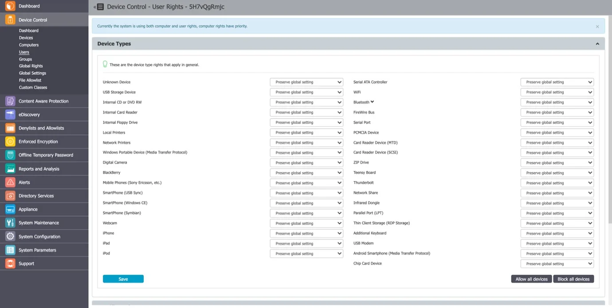

### User Settings

From this section, you can edit the settings for each user.

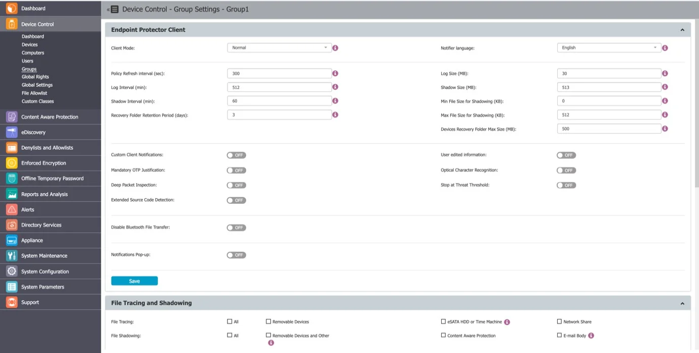

Defining custom settings for all users is not necessary since a user is perfectly capable of
functioning correctly without any manual settings defined. It will do this by either inheriting the
settings from the group it belongs to or, if not possible, the global settings, which are mandatory
and exist in the system with default values from installation.

### User History

From this section, you can view the user history by selecting the View User History action. This
will display the Logs Report page filtered for the respective user.

## Groups

From this section, you can manage all the groups in the system. Grouping computers and users will
help the Administrator manage rights or settings for these entities in a more efficient way.

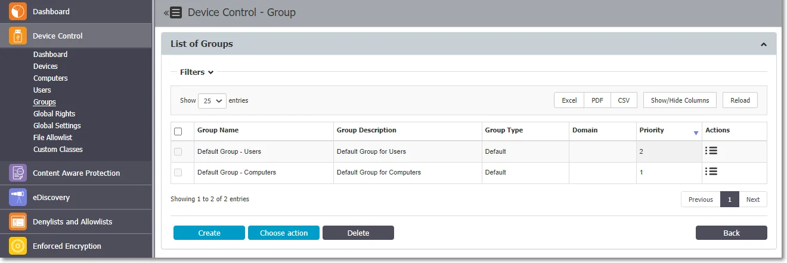

A group is identified by information like Name and Description, as well as based on the entities
(Computers and Users).

You can manually create a new group at any time by providing the group information mentioned above.
Groups can also be imported into Endpoint Protector from Active Directory.

:::note
For detailed information on Active Directory, refer to the
[Directory Services](/docs/endpointprotector/admin/directoryserv.md) topic.
:::

The Actions column offers multiple options related to the group’s management like Edit, Manage
Rights, Manage Settings, History, and Delete.

### Group Types

#### Regular Groups

Regular Groups are the groups created by the Administrator or are imported from AD and are not
created based on a rule. From this section you can add or remove Computers or Users.

#### Smart Groups

Smart Groups are a dynamic category of computers and user groups for which membership can be defined
based on element name patterns.

To use Smart Groups, follow these steps:

**Step 1 –** Enable Smart Groups from System Configuration, System Settings, on the Smart Groups
section, scroll to the bottom of the page and click **Save**.

:::note
By enabling the Smart Group feature, Computers and Users will not be automatically
assigned to the Default Group unless you create a Smart Group.
:::

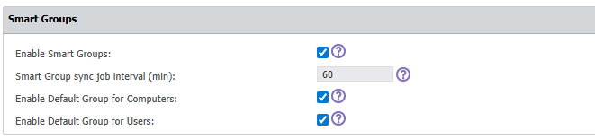

**Step 2 –** Create a Smart Groups from Device Control, Groups section. Click **Create**, provide
the following and then click **Save**:

- Group name, description and Department
- Enable the Smart Group setting
- Select the Entity, Computers or Users
- Set rules for the Computers or Users by adding conditions for their selected properties.

These entities support similar, but slightly different properties that can be used in filtering, as follows:

  | Computer   | Users     |
  |-------------------------------------- |---------------------------------------|
  | Computer ID   | First Name   |
  | Username   | Last Name   |
  | Main IP   | Employee ID   |
  | Main MAC Address   | Phone   |
  | Serial Number   | e-mail   |
  | Domain   | Team   |
  | Workgroup   | Last Computer   |
  | Department   | Domain   |
  | Groups   | Department   |
  | OS   | Groups   |
  | Last Seen   | Last Seen   |
  | Location   | Certificate added to Keychain/store   |
  | Client Version   | |
  | Terminal Server   | |
  | Certificate added to Keychain/store   | |

- Define the rules by adding a property, an operator and a value for that operator like: XYZ*, *XYZ*,*XYZ. You can add multiple rules using different or the same property.

:::warning
The values set are key-sensitive!

- After defining the rules, validate the expressions used in the conditions by clicking the Validate button. If the conditions are built correctly, the top ten matching results are displayed after validation.

:::note
Once created, you can manage the group's priority by drag and drop actions.
:::

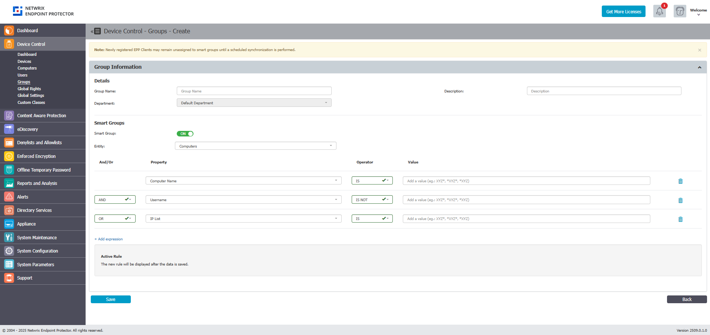

**Step 3 –** Synchronize entities to the Smart Groups.

The Smart Groups rule will not remove items from the regular groups to assign them to smart groups.
Entities are added to the Smart group through the synchronization process. After you created the
Smart Group, click **Sync** to start the synchronization at a given interval every 1 minute.

:::note
The Synchronization process will not change settings for the regular groups.
:::

If a new Computer is registered and matches one of the rules, the Computer will automatically be
assigned to that Group.

If the new Computer does not match the rule, it will be added to the Default Group, if Default
Groups are enabled from System Configuration, System Settings, and the Smart Groups section.

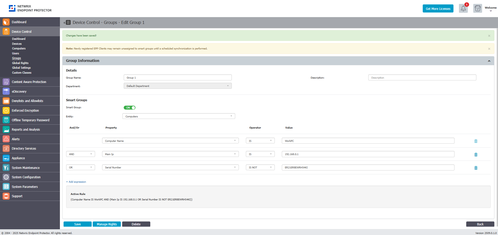

**Step 4 –** Delete a Smart Group from the Actions column or select the group from the list and then
click **Delete**.

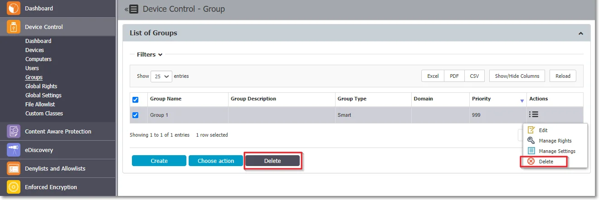

Smart Groups have the following limitations:

- Smart Groups do not display assigned computers or users
- You cannot manually add an entity to a Smart Group
- Smart Groups are part of the Default Department but do not use Departments

If you disable Smart Group from System Settings, the Smart Group will be converted into a Regular
Group. This will preserve its settings, rights, and other settings but will lose its entities and
will remove the Default Group for Computers and the Default Group for Users.

User entities can only be assigned to Smart Groups after the synchronization process, not when a
computer is registered, based on how the Endpoint Protector Client relays the user information.

When a Computer is registered, Endpoint Protector only receives information on computers; User
information is relayed through events (logs) or regular pings/reprovision requests. User information
is volatile: it can change between requests (different users can log in or log out on the same
computer; log out events/sleep can also result in default hard coded user entities being marked as
active/online).

#### Default Groups

Default Groups are groups of Computers and Users that do not belong to Smart Groups. These are
Computers and Users that do not follow the name pattern set for Smart Groups.

:::note
Default Groups are available only if Smart Groups are enabled. To use Default Groups,
follow these steps:
:::

**Step 1 –** Enable Default Groups for Computers and Users from System Configuration > System
Settings > on the Smart Groups section, scroll to the bottom of the page and click **Save**.

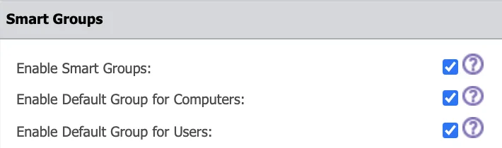

:::warning
You are not required to manually create Default Groups – by enabling them, the Default
Groups for Users and Computers will be automatically created.
:::

**Step 2 –** Synchronize entities to the Default Groups. To assign Computers and Users to the
Default Groups, navigate to the Device Control section and locate the Groups section. In the List of
Groups section, find the Actions column, select **Edit**, and then click **Sync**.

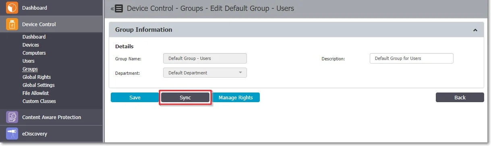

Default Groups have the following limitations:

- You can only edit Default Groups description, not the Default Groups name
- The Default Groups cannot be deleted, but can be disabled from System Configuration, System
  Settings, on the Smart Groups section
- If Default Groups are disabled, they will be deleted with all their dependencies

#### Allowlists on Computer Groups

File Location, Network Share Allowlists, and File Location Denylist can be set for groups of
Computers.

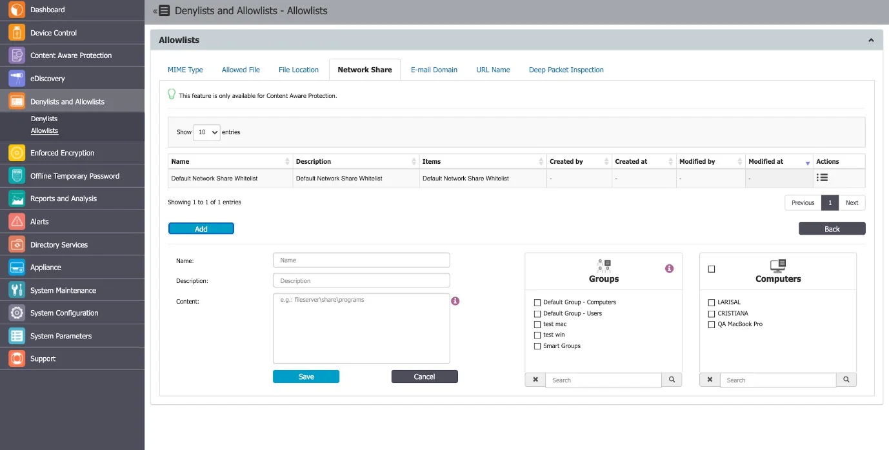

In the Groups select section, all groups will be displayed.

For a selected group the allowlist/denylist rule will apply only to computers from that group. If
the group contains no computer, the rule won’t apply to anything. The Administrator can select
additional computers from the select box.

Smart groups are always in sync with all the contained computers for denylists, just like they apply
to a policy. Groups selected on allowlists or denylists will be synchronized every 15 minutes.

### Group Rights

The Group Rights can be accessed from the Actions column for the specific group and selecting Manage
Rights.

This section is built around the group, allowing you to specify what Device Types and also what
Specific Devices can be accessible.

This section is similar to the Computer Rights section, the difference being that it applies to all
the computers that are part of the group simultaneously.

The Standard device control rights include the Device Types and Already Existing Devices sections.
These are generally the only device rights used.

In addition to the Standard device control rights, if enabled from the Global Settings, you can
create fallback policies for Outside Network and Outside Hours circumstances.

For detailed information on Device Types and Specific Devices (Standard, Outside Network, and Outside
Hours), refer to the Users and Groups topic.

:::note
Use Restore Global Rights to revert to a lower level of rights. Once enabled, all rights
on that level will be set to preserve global settings and the system will use the next level of
rights.
:::

:::note
All Existing Devices that were added on that level will be deleted when the restore is
used.
:::

### Group Settings

From this section, you can edit the settings for each group.

Computers and users can be grouped to make editing the settings easier and more logical. Defining
custom settings for all groups is not necessary since a computer is perfectly capable of functioning
correctly without any granular settings defined. It will do this by either inheriting the settings
from the group it belongs to or, if not possible, the global settings, which are mandatory and exist
in the system with default values from installation.
