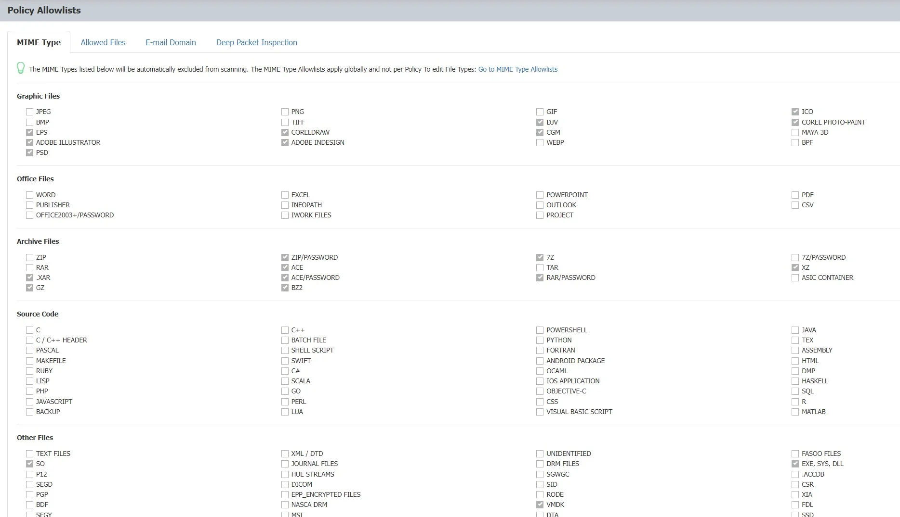
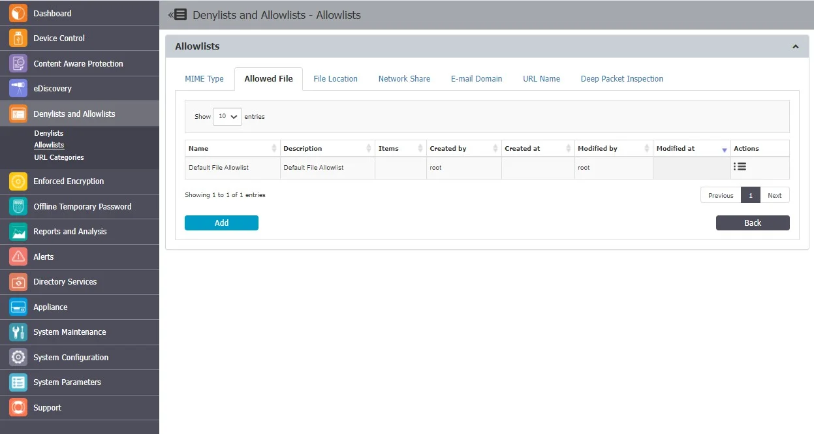
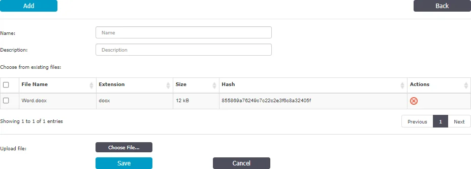
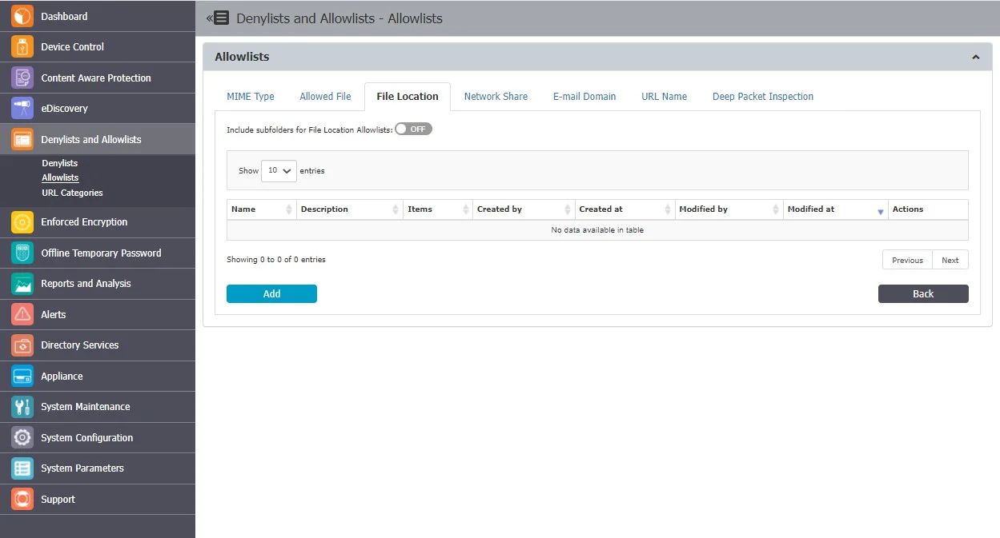
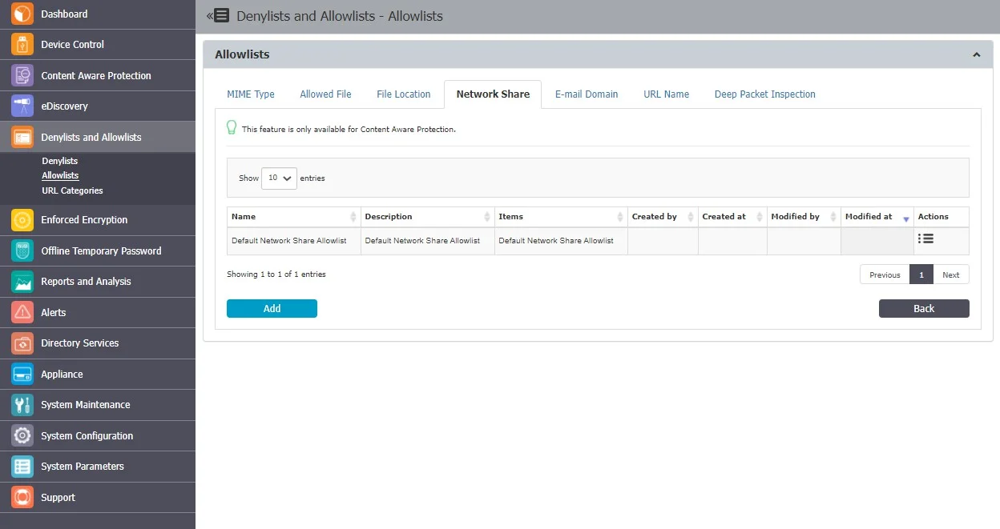
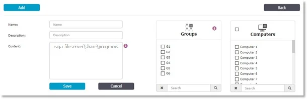
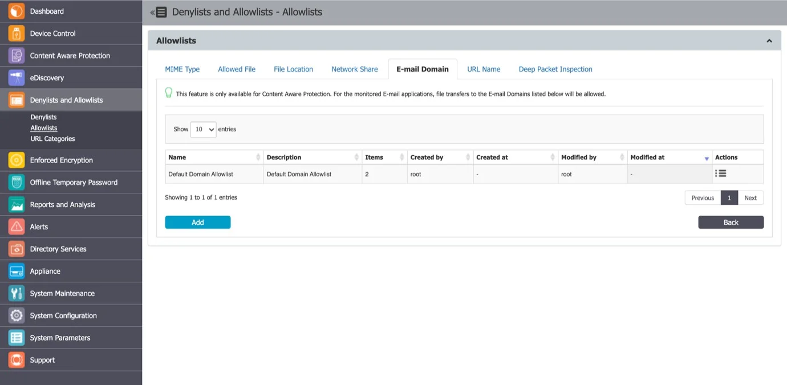
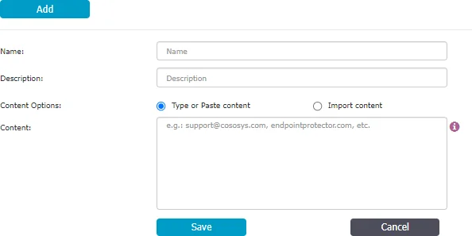
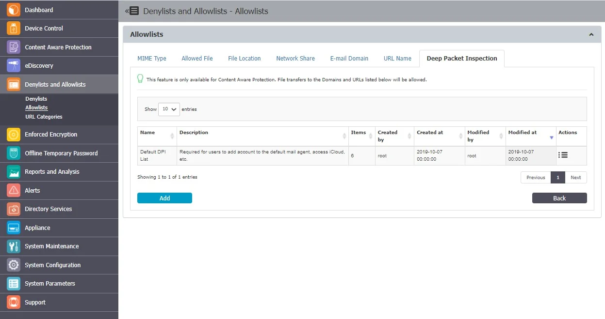
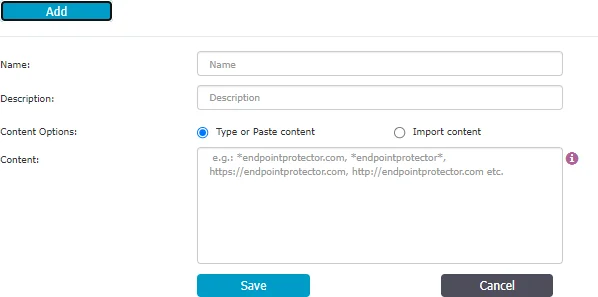

# Allowlists

## MIME Type

The content inspection functionally within Endpoint Protector identifies multiple file types. While
some files (e.g. Word, Excel, PDFs, etc.) can contain confidential information (e.g. PIIs, SSNs,
Credit Cards, etc.), other files are highly unlikely to contain such data (e.g. .dll, .exe, .mp3,
.avi, etc.).

The purpose of the MIME Type Allowlists is to eliminate the use of resources to inspect redundant
and unnecessary files for content, as well as reducing false positives due to information detected in
the metadata of files where the risk of data loss is extremely low.

Example: As songs or video files cannot contain lists of credit card numbers, there is no need to
inspect them using content filters.

MIME Type Allowlists are available for both the Content Aware Protection and eDiscovery modules and
apply to Custom Content, Predefined Content, and Regular Expressions.

:::note
By default, graphic files, media files, some password-protected archive files and some system
files are automatically defined within the MIME Type Allowlists. While this can be changed, we
recommend only doing so after gaining a deeper understanding of the type of data transferred used,
or stored by the users in your system, and the subsequent logs increase in the Endpoint Protector
Server.
:::

## Allowed Files

Allowed Files Allowlists are custom groups of files you exclude from Endpoint Protector sensitive
content detection, available for both Content Aware Protection and eDiscovery modules.

You can add a new allowlist or edit and delete from the Actions column.

To create a new allowlist, under the list of available allowlists, click **Add**, provide a **name**
and **description** and then select a file from the list or upload a new file you can use in multiple
allowlists.

Once the allowlist is created, it will be displayed on the Allowed File list and will be available
when creating or editing a Content Aware Protection or eDiscovery policy.

## File Location

File Location Allowlists are custom-defined lists of locations identified by Endpoint Protector. File
transfers within this location are automatically allowed, regardless of the content inspection rules
or permissions defined in various Policies.

File Location Allowlists are available for both Content Aware Protection and eDiscovery modules

Enable the **Include subfolders for File Location Allowlists** option to affect all other File
Location Denylists and Allowlists throughout the system. By default, the File Location Allowlists
apply to all files located in the specific folder but also to any other files located in containing
subfolders.

:::note
In addition to defining the File Location Allowlist, the browser or application used to
transfer files also needs to be selected from within the Content Aware Protection Policy.
:::

You can use wildcard patterns in the file location allow list, to specify wildcard matching. To match
a desktop folder on Windows use the pattern "?:\Users\\\*\Desktop\".

**Wildcards Usage Examples for File Location**

| Wildcards Type | File Location      | Results matched                                                                    | Results not matched                                                     |
| -------------- | ------------------ | ---------------------------------------------------------------------------------- | ----------------------------------------------------------------------- |
| Implicit       | \\file-share\public | \\file-share\public\jdoe\file.txt \\file-share\public\user512\file2.txt                | \\file-share\c$\file.txt \\file-server\public\jdoe\file.txt                 |
| Explicit       | \\\*\public\\\*    | \\localhost\public\payslip.xlsx \\192.168.20.2\public\Windows\system32\notepad.exe | \\localhost\c$\system32\notepad.exe C:\Windows.old\system32\notepad.exe |

You can add a new allowlist or edit, delete or export from the Actions column.

From this section, you can view and add file location denylists and from the Actions column, you can
edit, delete or export an existing denylist.

To create a new denylist, under the list of available denylists, click **Add**, provide a **name**
and **description**, add the items separated by a new line, comma, or semicolon and then select the
**groups** and **computers**.

File Location Allowlists will not apply to groups of users, only to groups of computers. File
Location Allowlists will only apply for the selected computer groups after 15 minutes.

:::note
By clicking the "Select All Computers" checkbox, ONLY computers existing in the Computers list at that moment can be checked and selected all at once. This DOES NOT imply that all the computers that will ever exist in the EPP Server Computer's list will be added to the "Allowlist - File Location" exception.

This is because adding new entities by default to the File Location's Allowlist exceptions without the Administrator knowledge could prove troublesome. When a new computer is added to the EPP Server, the "Select All Computers" checkbox becomes unchecked again but the computers that were checked before remain selected. By pressing that checkbox again, the newly added/unselected computers are added to the selectoion.

The same behavior also applies for Groups. The Administrator has the option to create custom Groups based on the existing computers/users already existing in the EPP Server's DB. When a new computer is added, it is not allocated to a group by default because the group in which the computer will be placed might not be the one that the Administrator intended for it to be in and it needs to be added manually.
:::

## Network Share

Network Share Allowlists are custom-defined lists of network share addresses where transfers of
confidential information will be allowed by Endpoint Protector.

:::note
Network Share Allowlists are available only for the Content Aware Protection module.
:::

You can use wildcard patterns in the Network Share Allowlist to specify wildcard matching. The
Network Share Allowlist can perform matching the whole file name, not only on the directory name,
when wildcard patterns are used.

:::warning
The Network Share must be set to Allow Access and Scan Network Share must be checked
inside a Content Aware Protection Policy.
:::

You can add a new allowlist or edit, delete or export from the Actions column.

To create a new allowlist, under the list of available allowlists, click **Add**, provide a **name**
and **description**, add server name or IP address to define a network share path separated by a new
line, comma, or semicolon and then select the **groups** and **computers**.

Network Share Allowlists will not apply to groups of users, only to groups of computers. Network
Share Allowlists will only apply for the selected computer groups after 15 minutes.

:::warning
Do not type the network share path with backslashes (\\) 192.168.0.1\public\users\test;
fileserver\documents\example
:::

## E-mail Domain

E-mail Domain Allowlists are custom-defined e-mail addresses to which sending of confidential
information will be allowed by Endpoint Protector.

:::note
E-mail Domain Allowlists are available only for the Content Aware Protection module.
:::

You can add a new allowlist or edit, delete or export from the Actions column.

To create a new allowlist, under the list of available allowlists, click **Add**, provide a **name**
and **description** and then type or paste items at least three characters separated by a new line,
comma, or semicolon. You can import content using the sample file provided on the form.

Once the allowlist is created, it will be displayed on the E-mail Domain list and will be available
when creating or editing a Content Aware Protection policy.

You can use wildcard patterns in the e-mail domain to specify wildcard matching as displayed in the
following example.

**Wildcards Usage Examples for E-mail Domain**

| E-mail Domain name | Results matched                              | Results not matched       |
| ------------------ | -------------------------------------------- | ------------------------- |
| @epp.com           | robert@epp.com jdoe@epp.com james@epp.com.ca | sara@epp.com jeff@ccs.com |

## Deep Packet Inspection

Available only for the Content Aware Protection module, Deep Packet Inspection Allowlists are
custom-defined lists or dictionaries with web domains Endpoint Protector will allow confidential
information uploads.

You can add a new allowlist or edit, delete or export from the Actions column.

You can create or import up to 100 lists of dictionaries, each dictionary comprising up to 50000 web
domains.

:::note
Dictionaries comprising up to 100 web domains can be edited, but for more extensive
dictionaries, you will need to import them again.
:::

To create a new allowlist, under the list of available allowlists, click Add, provide a name and
description and then type or paste items at least three characters separated by a new line, comma,
or semicolon. You can import content using the sample file provided on the form.

Example: example.endpointprotector, \*example.com, \*example\*, https://website.com, etc.

:::warning
“?” cannot be used to replace a character.
:::

:::note
Due to Gmail usage, take the following into consideration:
:::

- You need to allow **mail.google.com** for adding e-mail attachments or files using the drag and
  drop option
- You need to allow **doc.google.com** to add images in the email body

Once the allowlist is created, it will be displayed on the Deep Packet Inspection list and will be
available when creating or editing a Content Aware Protection policy.

**Wildcards Usage Examples for Deep Packet Inspection**

| Domain name         | Results matched                                                        | Results not matched                                                      |
| ------------------- | ---------------------------------------------------------------------- | ------------------------------------------------------------------------ |
| box.com             | box.com                                                                | Sub.box.com box1.com                                                     |
| \*.box.com          | Sub.box.com bad.box.com                                                | Fakebox.com mybox.com                                                    |
| box.\*.com          | Box.co.com box.bad.com                                                 | Sub.box.co.com Box1.co.com box.co.uk                                     |
| box.com.\*          | Box.com.co box.com.us                                                  | Sub.box.com.us box1.com.us                                               |
| https://cisco.com   | https://cisco.com/drives/downloads/ http://cisco.com/drives/downloads/ | https://sub.cisco.com/drives/download s/ https://cisco.com.ca/downloads/ |
| https://cisco.com\* | https://cisco.com.ca/downloads/ http://cisco.com.ca/downloads/         | https://sub.cisco.com.ca/downloads/ https://bad.cisco.com/downloads/     |

:::note
Using wildcards will search for domain names, not URLs.

:::
