# Denylists

## Custom Content

Custom Content denylists are custom-defined lists of terms and expressions detected as sensitive
content by Endpoint Protector, available for both Content Aware Protection and eDiscovery modules.

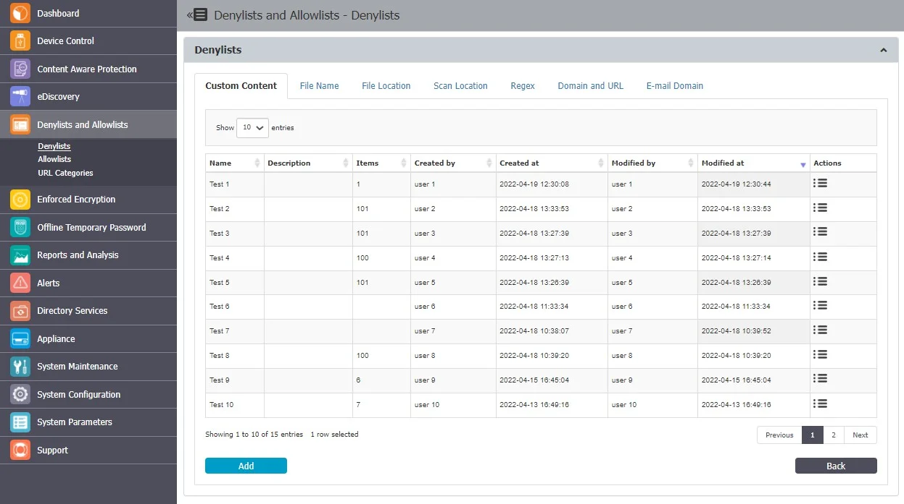

From this section, you can view and add e-mail custom content denylists and from the Actions column,
you can edit, delete or export an existing denylist.

To create a new denylist, under the list of available denylists, click **Add**, provide a **name**
and **description** and then type or paste items at least three characters separated by a new line,
comma, or semicolon. You can import content using the sample file provided on the form and then
select the option based on the number of uploaded items.

:::note
Dictionaries of under 100 items can be edited, while larger dictionaries have to be
uploaded again.
:::

Once the denylist is created, it will be displayed on the Custom Content list and will be available
when creating or editing a Content Aware Protection or eDiscovery policy.

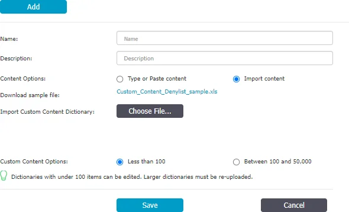

## File Name

File Name Denylists are custom-defined lists of file names detected by Endpoint Protector, available
for both Content Aware Protection and eDiscovery modules.

From this section, you can view and add filename denylists and from the Actions column, you can edit,
delete or export an existing denylist.

To create a new denylist, under the list of available denylists, click Add, provide a name and
description and then type or paste the file names separated by a new line, comma, or semicolon. You
can import content using the sample file provided on the form.

You can define the content by adding the filename and extension, or just the extension.

Examples: Matching and Non-Matching for File Names like “example.pdf”:

- Matching – example.pdf, my_example.pdf
- Non-Matching – example.txt, myexample.txt, test.pdf, example.pdf.txt, test_example.pdf_test.zip

Examples: Matching and Non-Matching for File Extensions like “.epp”:

- Matching – test.epp, mail.epp, 123.epp
- Non-Matching – 123.epp.zip, mail.epp.txt

Once the denylist is created, it will be displayed on the File Name list and will be available when
creating or editing a Content Aware Protection or eDiscovery policy.

:::warning
For Content Aware Protection, the File Name Denylists work only for Block & Report type
Policies. The Case Sensitive and Whole Words Only features do not apply.
:::

## File Location

File Location Denylists are custom-defined lists of locations identified by Endpoint Protector. File
transfers within this location are automatically blocked, regardless of the content inspection rules
or permissions defined in various Policies.

File Location Denylists are available for both Content Aware Protection and eDiscovery modules.

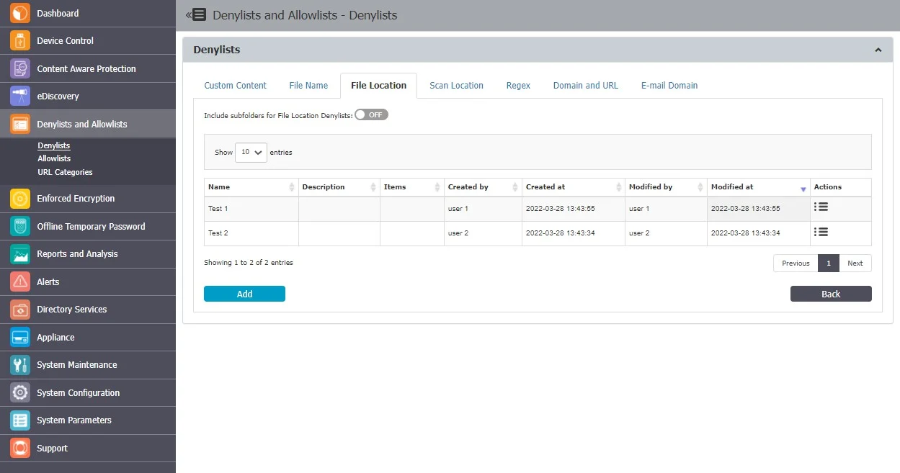

Enabling the option to Include subfolders for File Location Denylists will affect all other File
Location Denylists and Allowlists throughout the system. By default, the File Location Denylists
apply to all files located in the specific folder but also to any other files located in containing
subfolders.

:::note
In addition to defining the File Location Denylist, the browser or application used to
transfer files also needs to be selected from within the Content Aware Protection Policy.
:::

From this section, you can view and add file location denylists and from the Actions column, you can
edit, delete or export an existing denylist.

To create a new denylist, under the list of available denylists, click **Add**, provide a **name**
and **description**, add the items separated by a new line, comma, or semicolon and then select the
**groups** and **computers**.

:::note
File Location Denylist will not apply to groups of users, only to groups of computers.
File Location Denylist will only apply for the selected computer groups after 15 minutes.
:::

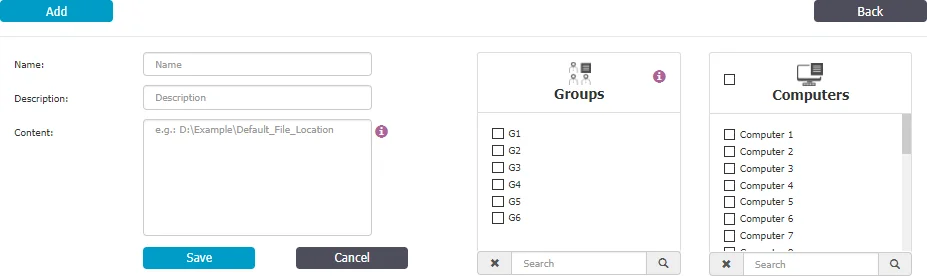

You can use wildcard patterns in the File Location Denylists to specify wildcard matching. To match
a desktop folder on Windows, use the pattern "?:\Users\\\*\Desktop\".

**Wildcards Usage Examples for File Location**

| Wildcards Type | File Location  | Results matched                                        | Results not matched                                            |
| -------------- | -------------- | ------------------------------------------------------ | -------------------------------------------------------------- |
| Implicit       | C:\temp        | C:\temp\file.txt C:\temp\test\file2.txt C:\tempfile.txt   | C:\temp1\file.txt C:\Windows\file.txt                            |
| Explicit       | C:\Windows\\\* | C:\Windows\regedit.exe C:\Windows\system32\notepad.exe | C:\Windows.old\regedit.exe C:\Windows.old\system32\notepad.exe |

## Scan Location

Scan Location Denylists are custom-defined lists of locations identified by the eDiscovery module.
Data at rest within this location are automatically inspected for content, depending on the rules
defined in various Policies.

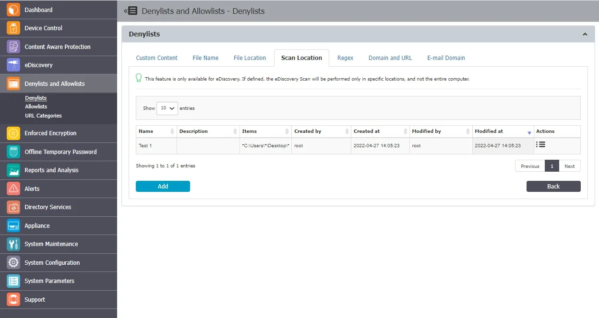

From this section, you can view and add scan location denylists and from the Actions column, you can
edit or delete an existing denylist.

To create a new denylist, under the list of available denylists, click **Add**, provide a **name**
and **description**, add the scan locations separated by a new line, comma, or semicolon or select
from the **Predefined Scan Locations** and then **Add to Content**.

When defining a Scan Location, use these special characters to define the path:

- \* - to replace any word
- ? - to replace any character

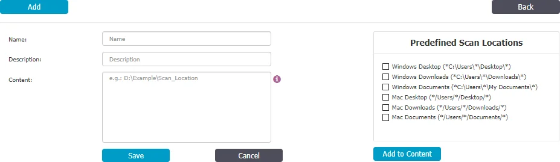

## Regex

Regular Expressions are sequences of characters that form a search pattern, mainly for use in
pattern matching with strings.

You can create a regular expression to find a certain recurrence in the data that is transferred
across the protected network. Regex Denylists are available for both the Content Aware Protection
and eDiscovery modules.

:::warning
If possible, avoid using Regular Expressions, as their complexity typically increases
the resources usage. Using a large number of regular expressions as filtering criteria typically
increases CPU usage. Also, improper regular expressions or improper use can have negative
implications.
:::

From this section, you can view and add regex expressions and from the Actions column, you can edit
or delete an existing denylist.

To create a new denylist, under the list of available denylists, click **Ad**d, provide a **name**
and **description** and then add the regex expression.

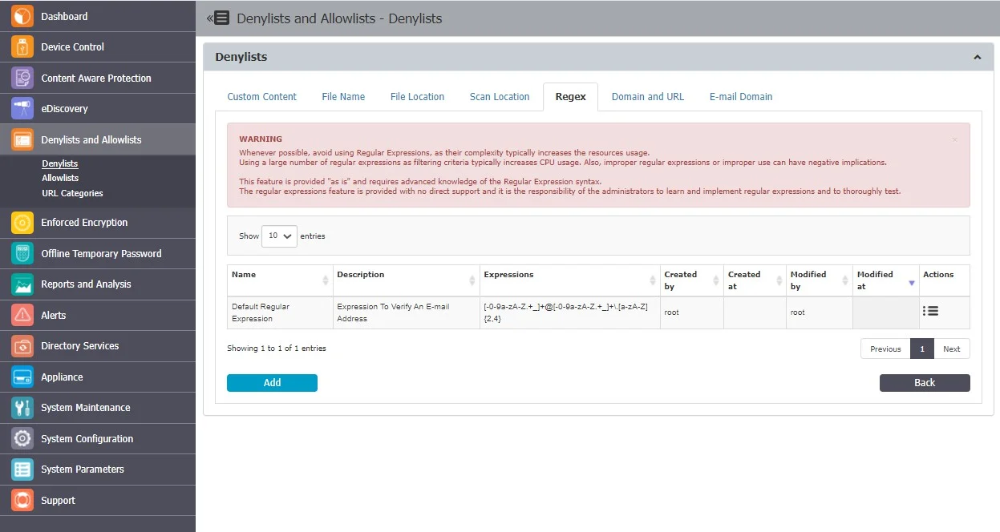

You can test a regular expression for accuracy using the right-side option. Add the content and then
click Test. If the Regular Expression has no errors, then the same content should appear into the
Matched content box, as shown below:

- To match an E-mail – `[-0-9a-zA-Z.+_]+@[-0-9a-zA-Z.+_]+\.[a-zA-Z]{2,4}`
- To match an IP –
  `(25[0-5]|2[0-4][0-9]|[01]?[0-9][0-9]?)(\.(25[0-5]|2[0-4][0-9]|[01]?[0-9][0-9]?)){3}`

:::note
This feature is provided “as is” and requires advanced knowledge of the Regular Expression
syntax. No direct support is offered and it is the responsibility of the customers to learn and
implement regular expressions and to thoroughly test.
:::

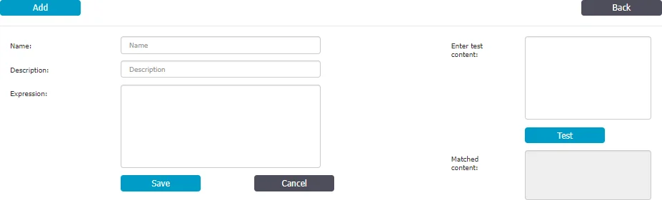

### Regex Supported Formats

Endpoint Protector supports both standard Regex syntax and **Perl-Compatible Regular Expression (PCRE)** extensions and modifiers. For example, you can use the (?i) modifier at the beginning of a regex pattern to make it case-insensitive during matching.

**Case Sensitivity Options in Regular Expressions**

Regular expressions allow you to control how text matching handles letter casing. Depending on your requirements, you can use case-sensitive, case-insensitive, or partially case-insensitive matching.

**1. Case-Sensitive Matching (Default)**

By default, Regex matching is case-sensitive.
This means that only text with the exact same casing will be matched.

**Example:** 
**Pattern:** `test@example\\.com` 
**Matches:** `test@example.com` 
Does **not match:** `TEST@EXAMPLE.COM` or `Test@Example.Com`

**2. Case-Insensitive Matching**
To make a Regex pattern case-insensitive, use the (?i) flag.
This enables matching regardless of the case of letters in the input text.

**Example:** 
**Pattern:** `(?i)test@example\\.com` 
**Matches:** `test@example.com`, `TEST@EXAMPLE.COM`, `Test@Example.Com`

In the following example, the pattern '(?i)test' will match “test,” “Test,” “TEST,” and other variations, regardless of letter case, as follows:

1. The Regex pattern is defined, added to the dictionary, and saved. Ensure that it is also included in the CAP Policy for proper application. 
   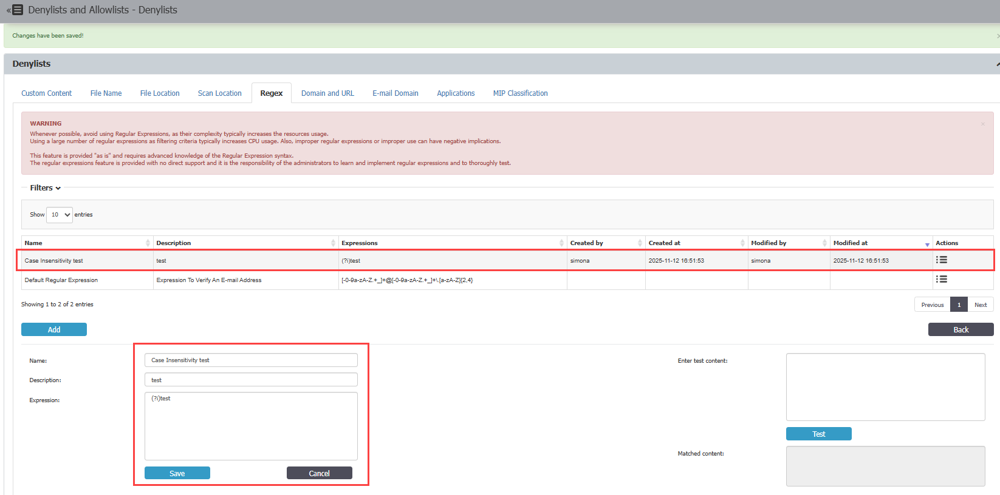
2. The Content Aware Report confirms that the test has completed successfully and that case-insensitive matching is functioning as expected. 
   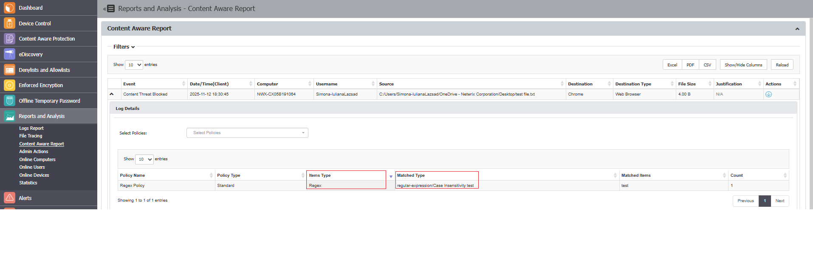

**3. Partial Case-Insensitive Matching**
Regex also allows you to apply case-insensitive matching only to specific parts of your pattern.
 You can enable and disable this mode using the following flags:

-   `(?i)` — enables case-insensitive mode
-   `(?-i)` — disables case-insensitive mode

**Example:** 
**Pattern:** `(?i)confidential(?-i) document` 
**Matches:** `"CONFIDENTIAL document"`, `"Confidential document"` 
Does **not match:** `"CONFIDENTIAL DOCUMENT"`

**Regex Operators**

| **Character** | **Description**                                                         | **Example**                                                          |
|---------------|-------------------------------------------------------------------------|----------------------------------------------------------------------|
| &circ;            | Matches the start of a string or line.                                  | \^abc matches “abc” only if it appears at the beginning of the line. |
| \$            | Matches the end of a string or line.                                    | abc\$ matches “abc” only if it’s at the end of the line.             |
| .             | Matches any single character except newline (\\n).                      | a.c matches “abc”, “axc”, etc.                                       |
| \*            | Matches 0 or more occurrences of the preceding character or group.      | bo\* matches “b”, “bo”, “boo”, “booo”, etc.                          |
| []            | Defines a character class, matching any one of the enclosed characters. | [abc] matches “a”, “b”, or “c”.                                      |
| [abc]         | Any single character of a, b or c                                       | [abc] matches “a”, “b”, or “c”.                                      |
| [&circ;abc]       | Any single character expect a, b or c                                   | It will match any single charact expect “a”, “b”, or “c”.            |
| [a-z]         | A character in range a-z                                                | It will match single character in range of a – z.                    |
| [a-zA-Z]      | A character in range a-z & A-Z                                          | It will match single character in range of a – z & A - Z             |
| \\d           | Any digit character                                                     | \\d will match any digit 0-9                                         |
| \|            | Groups expressions together or captures them for backreferences.        | (abc)+ matches one or more repetitions of “abc”.                     |
| ()            | Groups expressions together or captures them for backreferences.        | (abc)+ matches one or more repetitions of “abc”.                     |
| \\            | Used to escape special characters or indicate special sequences.        | \\. matches a literal period “.”; \\d matches any digit.             |
| (?i)          | Enables case-insensitive matching.                                      | (?i)abc matches “abc”, “ABC”, “AbC”, etc.                            |
| \\s           | Any whitespace character                                                |                                                                      |
| \\S           | Any non-whitespace character                                            |                                                                      |

## Domain and URL

Domain and URL Denylists are custom-defined lists of web addresses identified by Endpoint Protector.
Access to domains and URLs from these lists will be denied.

:::note
Domain and URL Denylists are available only for the Content Aware Protection module.
:::

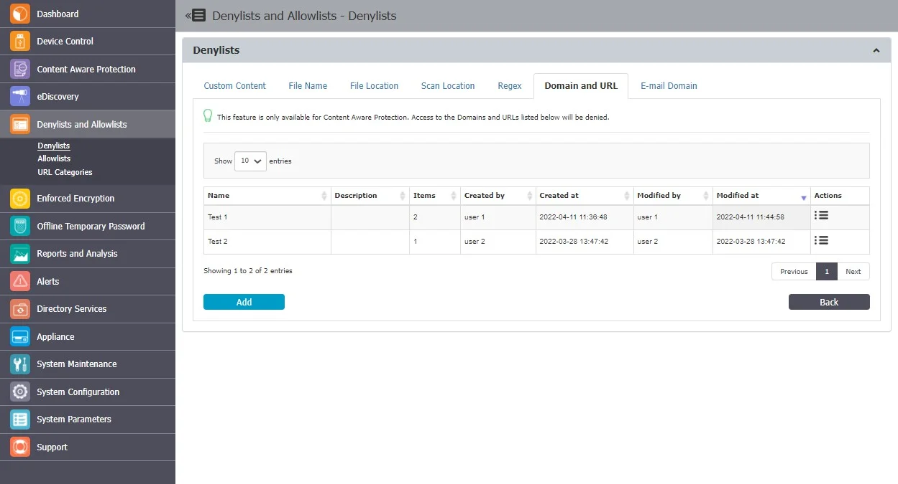

From this section, you can view and add domain and URL denylists and from the Actions column, you
can edit, delete or export an existing denylist.

To create a new denylist, under the list of available denylists, click **Add**, provide a **name**
and **description** and then **type or paste** items separated by a new line, comma, or semicolon.
You can import content using the sample file provided on the form.

You can create or import up to 100 lists of dictionaries, each dictionary comprising up to 50000 web
domains.

:::note
Dictionaries comprising up to 100 web domains can be edited, but for more extensive
dictionaries, you will need to import them again.
:::

You can define the content by adding the file name, file name and extension, or just the extension -
pdf, test1example.pdf. example.endpointprotector.com, \*example.com, \*example\*example,
https://website.com

Once the denylist is created, it will be displayed on the Domain and URL list and will be available
when creating or editing a Content Aware Protection policy.

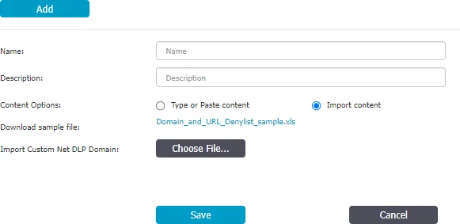

## E-mail Domain

E-mail Domain Denylists are custom-defined e-mail addresses and domains applicable to groups and
computers that block the user from sending emails.

:::warning
This feature blocks the user from sending emails regardless of content and type. As the
denylist applies to the computer, not the policy, it blocks emails sent from the applications you
select that have Report Only or Block and Remediate policies with no remediation possible.
:::

:::note
This feature is only available for Content Aware Protection when Deep Packet Inspection is
enabled and only impacts applications that retrieve the email recipients and are selected on Content
Aware Protection Policy.
:::

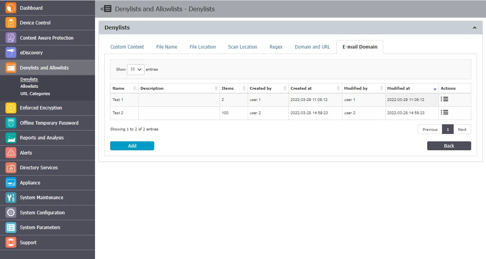

From this section, you can view and add e-mail domain denylists and from the Actions column, you can
edit, delete or export an existing e-mail domain denylist.

To create a new denylist, under the list of available denylists, click **Add**, provide a **name**
and **description**, add the items separated by a new line, comma, or semicolon and then select the
**groups** and **computers**. You can import content using the sample file provided on the form.

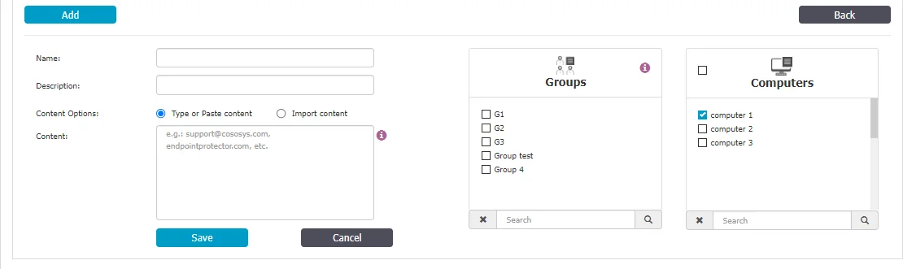

## Applications

This section introduces the documentation related to CLI (Command Line Interface) commands denylists
usage. CLI commands denylists empower customers with greater control over application start events
and offer the capability to scrutinize command line arguments used to launch specific applications.
This functionality enhances the precision of CAP (Content Aware Protection) policies, enabling users
to gain visibility and control over the usage of particular applications.

Example: Consider the scenario of controlling the startup mode of an application, as illustrated by
the example below for Google Chrome:

**chrome.exe --incognito**

With CLI commands denylists, you can define criteria for command line arguments that match specific
application behaviors. This allows you to create CAP policies tailored to your organization's needs,
ensuring that the launch and behavior of applications align with your security and compliance
requirements.

:::note
Certain native command line utilities such as `ls`, `md`, `cd`, which are embedded in the
Operating System Core, may not be captured by CAP visibility. These commands are integral to the
functioning of the operating system and are typically excluded from CAP policies, and are not an
egress channel.
:::

Follow the steps to define CLI command denylist policies.

**Step 1 –** Navigate to **Denylists** > **Application** tab in the Endpoint Protector Console.

**Step 2 –** Define your criteria based on the command line arguments used by the applications you
want to control.

**Step 3 –** Incorporate these criteria into your CAP policies as arguments to ensure precise
control and monitoring of application usage.

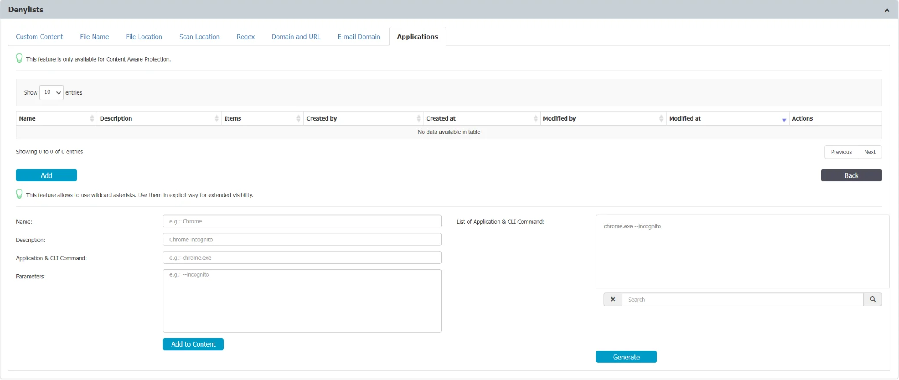

Follow these steps and leverage CLI commands denylists to enhance your organization's security
posture and ensure that applications are used in compliance with your policies and regulations.

:::note
The Endpoint Protector Client has limited visibility into activity within PowerShell and
PowerShell ISE environments, as well as basic command-line operations on macOS and Linux systems
(actions like `touch`, `cp`, `cd`, `mv`, and `mkdir`). To ensure Denylists entries match processes
with default parameters, use the wildcard character "\*" at the end of the Application Name field
(e.g, `notepad.exe *`.

:::

## Microsoft Information Protection

This section covers the use of Microsoft Purview Information Protection (MPIP) (formerly known as
Microsoft Information Protection (MIP) and Azure Information protection (AIP)), including
classification within Endpoint Protector 5.9.4+ Content Aware Protection and eDiscovery policies.

MPIP is a Microsoft toolset enabling organizations to enforce data classification, file encryption,
and Rights Management Services (RMS) on user data.

Since the 5.9.4 release, Endpoint Protector allows direct label definition for Content Aware
Protection and eDiscovery policies via the Endpoint Protector Server interface.

The Endpoint Protector Server offers three options for defining MIP labels:

- MIP Label Name – Specify the human-redable name of the MIP label.
- MIP GUID – Utilize the unique identifier associated with the MIP label.
- Both – Combine both the label name and GUID for maximum accuracy.

This flexibility allows administrators to avoid creating custom dictionaries to recognize
MIP-labeled files.

MIP labels can be used along other CAP conditions, including content-aware and label-aware data
scanning. This enable granular control over data protection based on MPIP classifications.

:::note
While Endpoint Protector can currently recognize MIP-encrypted files by their GUID (if
they follow the latest MIP format used by office web tools labeling), content-aware scanning for
these files is not yet supported.
:::

:::note
Endpoint Protector Server in Microsoft Entra (formerly Azure AD) applications is
unnecessary. Endpoint Protector relies on information with labeled files. This might change in
future releases.
:::

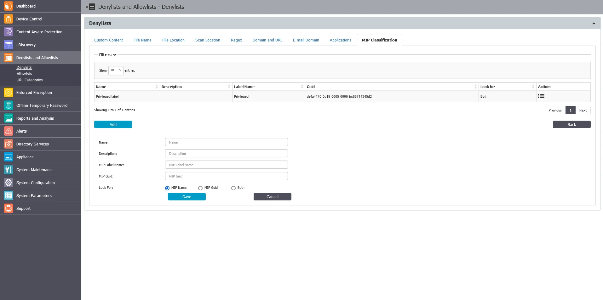

## NDC Classification

This section covers the use of and integration with Netwrix Data Classification, including classification within Content Aware Protection and eDiscovery policies.

Netwrix Data Classification is a tool designed to help organizations manage and protect their data more effectively by identifying, categorizing, and tagging data based on predefined policies. It assists in understanding where sensitive and valuable data resides, how it is being used, and who has access to it. The primary goals of data classification include enhancing data security, optimizing data management, ensuring compliance with regulations, and facilitating informed decision-making.

Starting with the 25.12 release, Endpoint Protector allows direct label definition for Content Aware
Protection and eDiscovery policies via the Endpoint Protector Server interface.

The Endpoint Protector Server offers the option to define custom labels for policy use like for ex. "ex. Confidential" in:
- keywords field
- document label custom field
- both

This flexibility allows administrators to avoid creating custom dictionaries to recognize labeled files.

NDC labels can be used along other CAP conditions, including content-aware and label-aware data scanning. This enables granular control over data protection based on NDC data classifications.

:::note
Label names can be obtained from the NDC administrator. Consider using the exact label definition, such as 'Confidential|Internal' to narrow detection.
:::

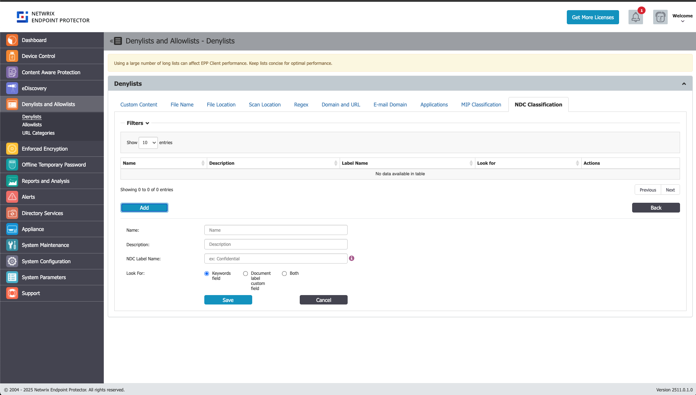
