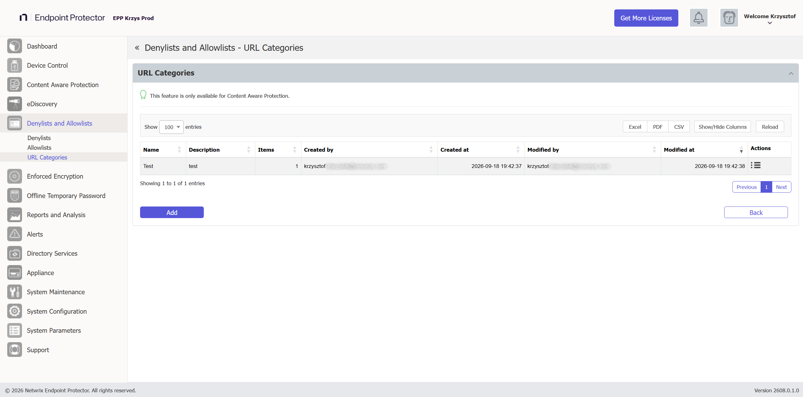
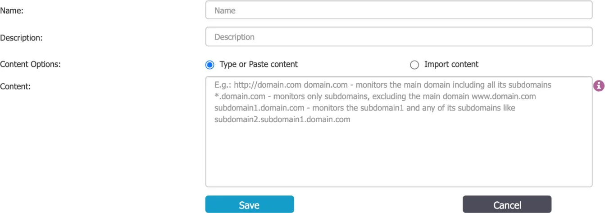

# URL Categories

URL Categories are custom-defined lists of web domains that can be set on Content Aware Policies to
limit the Deep Packet Inspection monitoring of the web traffic. If no Deep Packet Inspection Monitored
URL Category is set on a policy, the Endpoint Protector Client will monitor all web domains by
default.

You can create up to 1,000 URL category lists, with up to 50,000 entries per list.

:::warning
URL Categories only apply when the Deep Packet Inspection feature is active.
:::

Blocking content based on URL categories can cause data loss if misconfigured. Keep policies updated as new URLs are added to the category lists.

You can add a new URL category or edit, delete, or export from the Actions column.

To create a new URL category, under the list of available URL categories, click **Add**, provide a
**name** and **description** and then type or paste items at least three characters separated by a
new line, comma, or semicolon. You can import content using the sample file provided on the form and
then select the option based on the number of uploaded items.

Once created, the URL category appears on the list and is available when creating or editing a Content Aware Protection policy.

