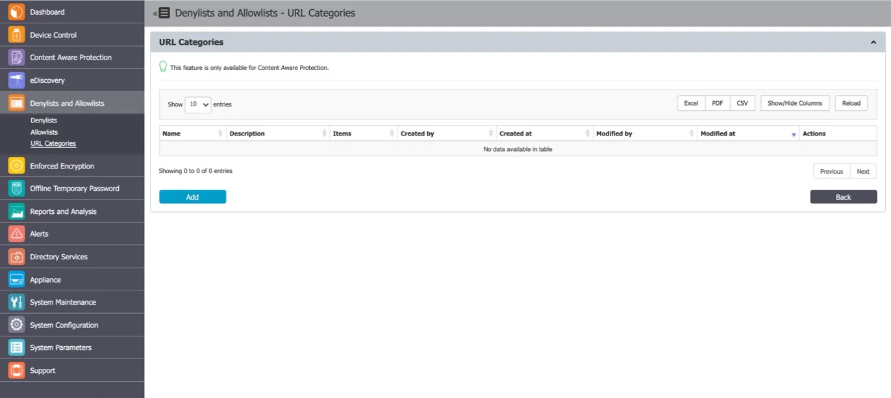

# URL Categories

URL Categories are custom-defined lists of web domains that can be set on Content Aware Policies to
limit the Deep Packet Inspection monitoring of the web traffic. If no Deep Packet Inspection Monitored
URL Category is set on a policy, the Endpoint Protector Client will monitor all web domains by
default.

:::warning
URL Categories only apply when the Deep Packet Inspection feature is active.
:::

Blocking content based on URL categories can lead to data loss if not used correctly because it will
restrict a policy to a few domain names. Policies must be constantly updated as new URLs need to be
added to the categories lists.

You can add a new URL category or edit, delete or export from the Actions column.

To create a new URL category, under the list of available URL categories, click **Add**, provide a
**name** and **description** and then type or paste items at least three characters separated by a
new line, comma, or semicolon. You can import content using the sample file provided on the form and
then select the option based on the number of uploaded items.

Once the URL category is created, it will be displayed on the URL category list and will be
available when creating or editing a Content Aware Protection policy.

