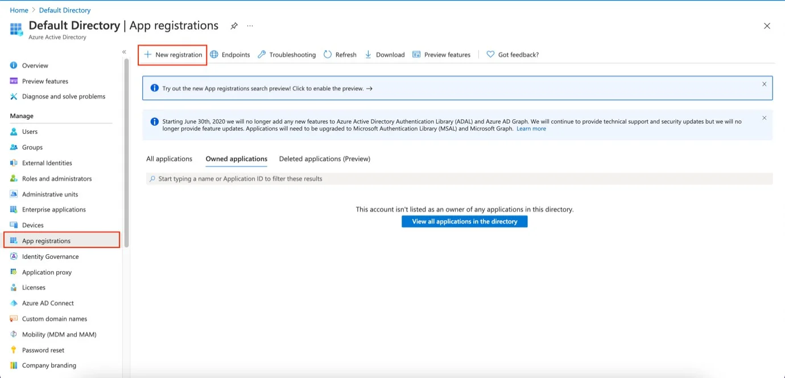
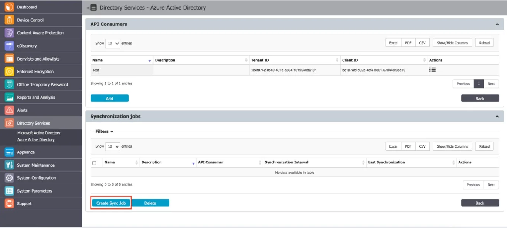

# Directory Services

From this section, you can import and synchronize the entities (Users, Computers, and Groups) from
the company’s Active Directories.

:::note
This section of the documentation is provided as a best-effort guideline to support deployment. Since third-party products can change frequently, the screenshots and images may not always reflect the latest interfaces or features. For the most up-to-date information, please refer to the official resources from the product vendor.
:::

## Microsoft Active Directory

You can create and manage connections from the Directory Services, Microsoft Active Directory
section. The required information includes the Connection Type, Server, Port, Username, and
Password.

:::note
When having to import a very large number of entities, we recommend using the Base Search
Path to get only the relevant information displayed. Due to browser limitations, importing the whole
AD structure may impede the display of the import tree if it contains a very large number of
entities.
:::

To ensure the information is correct, click Test to test the new connection.

Once a new connection has been created, it is available in the synchronization list and can be
further edited, to include the required entities.

For the defined connections, several synchronization options are available. From this section, the
connection credentials and synchronization interval can also be changed.

The Advanced Groups Filter can be used to import and synchronize only specific groups, ignoring all
other entities.

From the Directory Browser section, you can select the entities that need to be synced.

:::note
You can view only Organizational units (OU) and Groups in the Directory Browser.
:::

Once the entities have been selected, they can be saved to sync.

## Microsoft Entra ID

You can create and manage connections from the Directory Services, Microsoft Entra ID. From this
section, Groups from the Microsoft Entra ID will have their users synchronized with the Endpoint
Protector Server. Group membership will be retrieved recursively by the API platform itself.

**Example**

- Group 1 - User 1, User 2, User 3
- Group 2 - Group 1, User 4
- Group 3 - Group 2, User 5

If Group 3 is selected for the synchronization operation, only Group 3 will be imported and created
in the Endpoint Protector Server. User 5 will also be imported and will be added as a member of
Group 3. Group 2 and all subsequent groups will be parsed and only the Users will be retrieved and
the actual groups will not be added to the server.

After the synchronization is done, it will look like that on the Endpoint Protector server:

- Group 3 - User 5, User 4, User 3, User 2, User 1

### Configure Microsoft Entra ID

#### Create the Application on Microsoft Entra ID

Follow the steps to create the application on Microsoft Entra ID.

**Step 1 –** Log in to Azure Portal.

**Step 2 –** Go to Microsoft Entra ID.

**Step 3 –** Click App Registrations from the Manage section on the Active Directory menu on the
left side, then on New Registration.

**Step 4 –** On the Registration page enter your **Name**.

**Step 5 –** On the Supported account type select **Default Directory**.

:::warning
Do not fill in the Redirect URI field!
:::

**Step 6 –** Click **Register**.

**Step 7 –** On the Essentials section save the following information:

- Application (client) ID will be needed for adding it in the Application (client) ID field on the
  Endpoint Protector Server
- Directory (tenant) ID will be needed for adding it in the Tenant ID field on the Endpoint
  ProtectorEndpoint Protector Server

#### Create a Secret ID for the Application

The secret ID will be used as an authentication method to gain access to the application via Graph
API.

**Step 1 –** Click **Certificates & Secrets** on the side menu from the Manage section.

**Step 2 –** Click **New client secret** on the Certificates & secrets page.

**Step 3 –** Enter a **Description** for the secret ID.

**Step 4 –** Click **Add** and **Add a client** secret section.

**Step 5 –** Take note of the Secret ID value and make sure to copy it to the clipboard and also to
store it safely because it will be needed further on.

:::note
Notice that when navigating back, the secret ID will be hidden.
:::

#### Create Users/Groups Using Graph API

Follow the steps to create users/groups using Graph API.

**Step 1 –** Click **Home** and then Microsoft Entra ID.

**Step 2 –** Click **Add** from the Default Directory| Overview page

**Step 3 –** Click **Add User**.

- Select **Create User**.
- Enter the **Username** and select the **Domain**.
- Enter the **Name**.
- Either click **Auto-generate password** or create one on your own.
- Add the **Department**.
- Click **Create**.

**Step 4 –** Repeat Steps 1 and 2, then click **Group**.

- Select group type **security**.
- Enter a **name** for the group.
- Click **No members selected** to add membership.
- Search for the newly created user and click **Select**.

#### Add Permissions to the Application

Permission to be added to our application:

- Directory.Read.All
- Group.Read.All
- User.Read.All

Make sure the created application is open then:

**Step 1 –** Click **API Permissions**.

**Step 2 –** Click **Add a Permission**.

**Step 3 –** Click **Microsoft Graph**.

**Step 4 –** Click **Application Permissions**.

**Step 5 –** Search for the permissions mentioned above and check each of the permissions.
(Directory.Read.All, Group.Read.All, User.Read.All)

**Step 6 –** Click **Add Permissions**.

**Step 7 –** Click **Grant admin consent for Default Directory** from the API Permission page.

#### Add Graph Application to Server

Follow the steps to add a graph application to the Endpoint Protector server.

**Step 1 –** Open the Endpoint ProtectorServer and navigate to **Directory Services** > **Microsoft
Entra ID**.

**Step 2 –** Click **Add** to add an API Consumer – One API Consumer can be used for multiple
synchronization jobs.

**Step 3 –** Provide the following details:

- Name
- Description
- Directory (tenant) ID saved earlier on the Tenant ID field
- Application (client) ID saved earlier on the Application (Client) ID field
- Secret ID saved earlier in the Client Secret Value field

**Step 4 –** Click **Test** and then **Save**.

#### Create a Synchronization Job on the Server

Follow the steps to create a synchronization job on the Endpoint Protector server.

**Step 1 –** Click **Create Sync Job**.

**Step 2 –** Provide Synchronization information:

- Name
- Description
- Select the created API Consumer
- Select Sync Interval

**Step 3 –** Click **Save**.

The **Map on-premises users** switch in the Microsoft Entra ID connector controls how Endpoint
Protector retrieves user names in hybrid environments with both a local Active Directory and
Microsoft Entra ID. This switch has two states:

- Unmarked (feature disabled) – Endpoint Protector uses the "userPrincipalName" Azure AD attribute
  to retrieve user names. This attribute is the primary source for user identification and account
  mapping.
- Marked (feature enabled) – Endpoint Protector uses the "onPremisesSamAccountName" Azure AD
  attribute to retrieve user names, ensuring accurate synchronization between the local Active
  Directory and Azure AD.

By utilizing this feature, Endpoint Protector ensures seamless synchronization of user names,
preventing duplicate usernames. Enable or disable the "Map on-premises users" feature based on your
specific hybrid environment setup and requirements.
