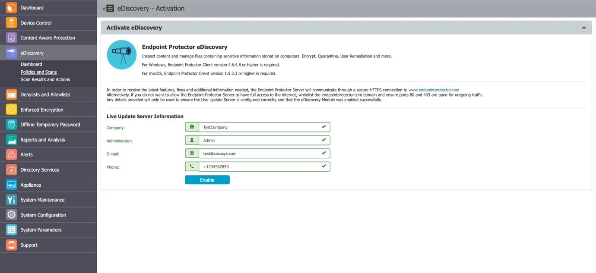
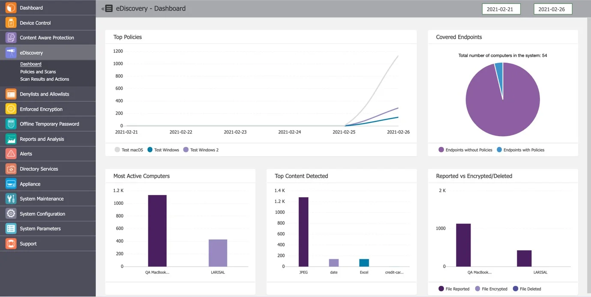
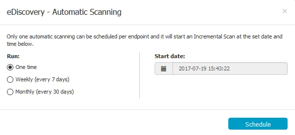
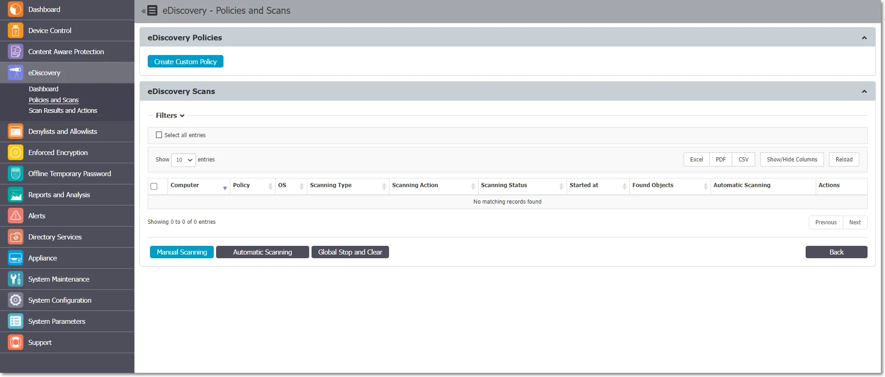
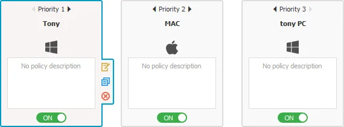
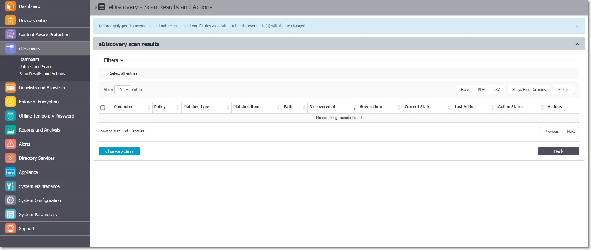
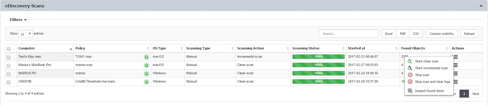
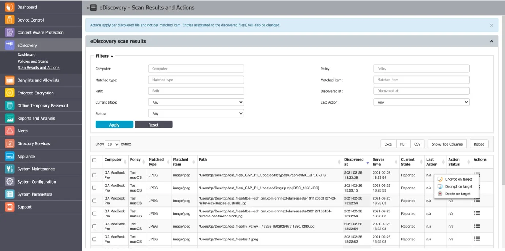

# eDiscovery

This module allows you to create policies that inspect data residing on protected Windows, Macs, and
Linux computers. The company’s data protection strategy can be enforced and risks posed by
accidental or intentional data leaks can be managed. You can mitigate problems posed by data at rest
by discovering sensitive data, such as:

- Personal Identifiable Information (PII) – social security numbers (SSN), driving license numbers,
  E-mail addresses, passport numbers, phone numbers, addresses, dates, etc.
- Financial and credit card information – credit card numbers for Visa, MasterCard, American
  Express, JCB, Discover Card, Diners Club, bank account numbers, etc.
- Confidential files – sales and marketing reports, technical documents, accounting documents,
  customer databases, etc.

## eDiscovery Activation

eDiscovery comes as the third level of data protection available in Endpoint Protector. The module
is displayed but requires a simple activation by pressing the Enable button. If not previously
provided, the contact details of the Main Administrator will be required.

:::warning
The eDiscovery module is separate from Device Control or Content Aware Protection
modules, and requires separate licensing.
:::

## Dashboard

This section offers a quick overview in the form of graphics and charts related to the eDiscovery
module.

## eDiscovery Policies and Scans

eDiscovery Policies are sets of rules for sensitive content detection for data stored on protected
computers.

An eDiscovery Policy is made up of five main elements:

- OS Type – the OS it applies to (Windows, Mac, or Linux)
- Thresholds – the number of acceptable violations
- Policy Denylists – the content to be detected
- Policy Allowlists – the content that can be ignored
- Entities – the departments, groups, or computers it applies to

:::note
Once the eDiscovery Policies are created, select the type of eDiscovery Scan.
:::

eDiscovery Scans are sets of rules for Policies, defining when to start the data discovery. There are
several types of scans:

- Clean scan – stars a new discovery (from scratch)
- Incremental scan – continues the discovery (skipping the previously scanned files)

eDiscovery Automatic Scanning is also available, allowing you to set an Incremental Scan

- One time – a scan will run once, at the specific date and time
- Weekly – a scan will run every 7 days, from the set date and time
- Monthly – a scan will run every 30 days, from the set date and time

An eDiscovery Scan can be stopped at any time as results can also be automatically cleared. This can
be done by using:

- Stop scan: stops the scan (but does not affect the logs)
- Stop scan and clear scan: stops the scan and clears the logs

:::note
Use Global Stop and Clear in situations where all the eDiscovery Scans need to be stopped
and all the Logs cleared.
:::

### Creating an eDiscovery Policy and Scan

You can easily create and manage eDiscovery Policies and Scans from the eDiscovery, Policies and
Scans section.

To create a new policy click **Create Custom Policy** and to edit an available policy, double-click
it. You need to select a policy to edit, duplicate or delete a policy.

When creating a new policy, select the following:

- Policy Information (OS Type, Policy name, description, action, and type)
- Policy Exit points
- Policy Denylists, Policy Allowlists
- Policy Entities (Departments, Groups, and Computers)

You can use the following thresholds:

- Limit Reporting eD
- Threat Threshold value
- File Size Threshold

You can find more details about Thresholds directly in the Endpoint Protector User Interface.

For detailed information on Denylists and Allowlist, refer to the
[Denylists and Allowlists](/docs/endpointprotector/admin/denylistsallowlists/overview.md) chapter.

After the eDiscovery Policy has been created, Scanning Actions can be assigned. These include Start
clean scan, Start incremental scan, Stop scan, and Clear logs.

:::note
Exactly like Content Aware Protection Policies, the eDiscovery Policies and Scans continue
to detect sensitive data stored on protected computers even after they are disconnected from the
company network. Logs will be saved within the Endpoint Protector Client and will be sent to the
Server once the connection has been reestablished.
:::

## eDiscovery Scan Result and Actions

After an eDiscovery Scan starts, you can inspect the items found and apply actions to remediate
(e.g., delete on target, encrypt on target, decrypt on target, etc.). All results are displayed in
the eDiscovery, Scan Results, and Actions section.

You can also access the Scan Results and Actions section directly from eDiscovery > Policies and
Scans by selecting a computer from the eDiscovery Scans list and choosing the Inspect found items
action. This will automatically filter the Scan Results list and display the items only for that
specific computer.

### Viewing Scan Results and Taking Actions

From this section, you can manage the scan results. A list of all the computers that were scanned
can be viewed and actions such as deleting, encrypting or decrypting files can be taken.

You can apply an action to each item individually or, can select multiple items and apply the action
simultaneously by using the Choose action button.
