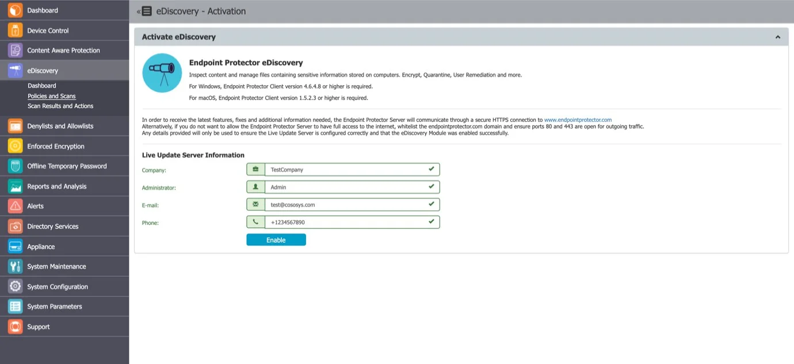
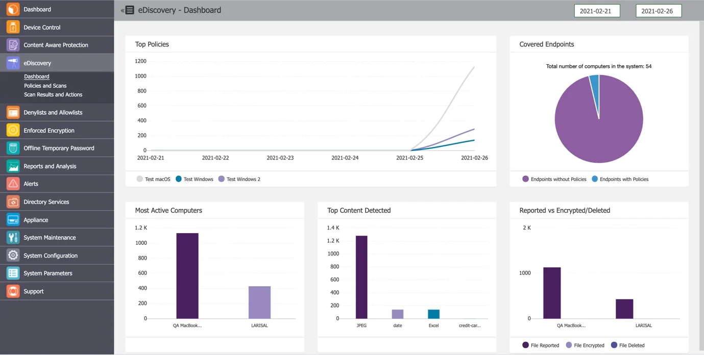

# eDiscovery

The eDiscovery module lets you create policies that scan data stored on protected Windows, macOS, and Linux computers. You can enforce your organization's data protection strategy and manage risks posed by accidental or intentional data leaks by discovering sensitive data at rest, such as:

- Personal Identifiable Information (PII)—social security numbers (SSN), driving license numbers, email addresses, passport numbers, phone numbers, addresses, and dates
- Financial and credit card information—credit card numbers for Visa, MasterCard, American Express, JCB, Discover Card, Diners Club, and bank account numbers
- Confidential files—sales and marketing reports, technical documents, accounting documents, and customer databases

The eDiscovery module provides the following key capabilities:

- **Policy-based scanning**—create up to 40 custom or predefined scan policies targeting specific content types, file types, and endpoints
- **Flexible scan scheduling**—run one-time, weekly, or monthly scans with configurable priorities and resource-aware constraints
- **User-initiated scans**—let end users start data-at-rest scans directly from endpoints
- **Bulk remediation**—select and remediate multiple discovered files in a single action, with support for encryption, decryption, deletion, and quarantine
- **Contextual detection**—configure per-policy contextual detection rules for more targeted and accurate scanning
- **CrateDB log storage**—eDiscovery scan results are stored in CrateDB for fast queries and horizontal scalability

## eDiscovery activation

The eDiscovery module requires separate licensing from Device Control and Content Aware Protection. You can activate and operate eDiscovery independently—a Device Control or CAP deployment isn't required.

To activate the module, navigate to **eDiscovery** and click **Enable**. If you haven't previously provided the Main Administrator's contact details, you're prompted to enter them.

:::warning
The eDiscovery module requires a separate license. Contact your Netwrix representative or visit the Netwrix website to obtain an eDiscovery license.
:::

## Dashboard

The eDiscovery dashboard provides a quick overview of eDiscovery activity through graphics and charts. Dashboard metrics are sourced from CrateDB and are updated on a daily schedule.

The dashboard displays:

- Total scanned objects and discovered threats
- Scan activity trends
- Policy-level scan summaries

## Module sections

The eDiscovery module is organized into the following sections:

| Section | Description |
|---------|-------------|
| **Policies and scans** | Create and manage scan policies, assign entities, and start or stop scans. See [eDiscovery policies and scans](edpolicies.md). |
| **Scan results and actions** | View scan results, inspect found items, and apply remediation actions. See [Scan results and actions](edscanresults.md). |
| **Scanning configuration** | Configure automatic scan schedules, user-initiated scan settings, and scan targets. See [Scanning configuration](edscanning.md). |

eDiscovery scan results are also accessible from the **Reports and Analysis** section. See [Reports and Analysis](/docs/endpointprotector/admin/reports.md) for more information on log exports and reporting.
