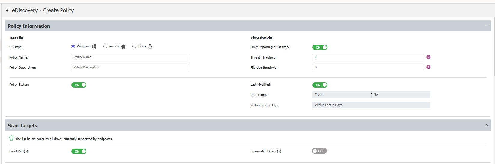
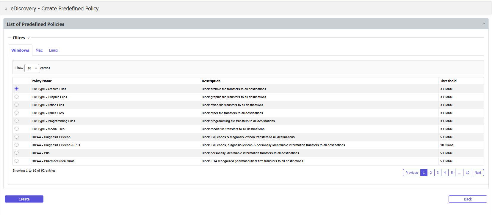

# eDiscovery policies and scans

eDiscovery policies are sets of rules that define what sensitive content to scan for on protected endpoints. Each policy specifies the content types to detect, the thresholds for reporting, and the computers or groups the policy applies to.

You can create up to 40 eDiscovery policies. A performance advisory appears when more than five policies are active simultaneously, because each additional policy increases the scanning workload on endpoints.

## Policy views

Policies can be displayed in two layouts:

- **List view**—displays policies in a table with sortable columns for name, OS type, status, priority, and assigned entities
- **Widget view**—displays policies as cards, providing a visual overview of all configured policies

## Create a custom policy

To create a new eDiscovery policy:

1. Navigate to **eDiscovery** > **Policies and Scans**.
2. Click **Create Custom Policy**.
3. Configure the following settings:

### Policy information

- **OS Type**—select the operating system the policy applies to (Windows, macOS, or Linux)
- **Policy Name**—enter a descriptive name for the policy
- **Description**—enter a description of the policy's purpose
- **Action**—select the action to take when sensitive content is detected
- **Scan Type**—select the scan behavior

### Thresholds

Configure thresholds to control when the policy reports a detection:

- **Threat Threshold**—set the number of content matches required before a file is reported. Turn the threshold off to report all matches.
- **File Size Threshold**—set a maximum file size. Files larger than the threshold are skipped.
- **Threshold operator**—select **AND** or **OR** to control how the Threat Threshold and File Size Threshold interact:
  - **AND**—both thresholds must be met for a file to be reported
  - **OR**—either threshold being met causes the file to be reported

### Policy exit points

Configure where the policy scans for content:

- **Local Disk**—scan files on the endpoint's local storage (enabled by default)
- **Removable Devices**—scan files on connected removable storage devices such as USB drives

### Policy denylists and allowlists

Define the content to detect and the content to ignore:

- **Policy Denylists**—select the content types, file types, MIME types, predefined content patterns, regular expressions, and dictionaries to detect
- **Policy Allowlists**—define exceptions for content that should be ignored during scanning

For detailed information on configuring denylists and allowlists, see [Denylists and Allowlists](/docs/endpointprotector/admin/denylistsallowlists/overview.md).

### Last Modified filter

You can configure the policy to target files based on their Last Modified date:

- **Last Modified Date Range**—scan only files modified within a specific date range
- **Last Modified Within Last n Days**—scan only files modified within the specified number of days

### Content Detection Summary

The Content Detection Summary lets you define boolean logic rules for content detection within the policy. This feature works the same way as the Content Detection Summary in Content Aware Protection policies, but each eDiscovery policy has its own independent configuration.

For more information on Content Detection Summary configuration, see [Content detection](/docs/endpointprotector/admin/cap_module/contentdetection.md).

### Contextual detection

Each eDiscovery policy can have its own contextual detection rules, replacing the previous global setting under System Parameters. You can configure up to 15 contextual detection rules per policy.

Contextual detection rules let you require or exclude specific context around detected content. For example, you can require that a social security number is found near a name and address before reporting it as a match. Each rule supports:

- **Included context**—content patterns that must be present near the detected item
- **Excluded context**—content patterns that, if found near the detected item, cause the detection to be ignored
- **AND / OR operators**—control how multiple context items within a rule are evaluated

:::note
Changes to contextual detection in an eDiscovery policy don't affect Content Aware Protection policies, and changes in CAP don't affect eDiscovery.
:::

### Policy entities

Assign the policy to specific departments, groups, or computers. Only endpoints in the selected entities are scanned by this policy.

4. Click **Save** to create the policy.

## Create a predefined policy

Endpoint Protector includes predefined eDiscovery policy templates for common compliance frameworks. Predefined policies provide pre-configured content detection rules and thresholds.

To create a predefined policy:

1. Navigate to **eDiscovery** > **Policies and Scans**.
2. Click **Create Predefined Policy**.
3. Select a predefined policy template from the list. Available templates include:
   - HIPAA
   - PCI DSS
   - GDPR (multiple regional variants)
   - FINRA
   - SOX
   - FERPA
   - ITAR
   - NY Shield Act
4. Review and adjust the policy settings as needed.
5. Click **Save**.

## Manage scan operations

After creating a policy, you can assign scan actions from the **eDiscovery** > **Policies and Scans** page. The following scan actions are available:

| Action | Description |
|--------|-------------|
| **Start clean scan** | Starts a new discovery scan, scanning all files matching the policy criteria |
| **Start incremental scan** | Continues a previous scan, skipping files that were already scanned |
| **Stop scan** | Stops the running scan without affecting the existing scan results |
| **Stop scan and clear logs** | Stops the scan, exports the eDiscovery logs to the Export Log List, and deletes the scan results |

:::note
Use **Global Stop and Clear** to stop all running eDiscovery scans and clear all logs at once.
:::

### Scan progress

The eDiscovery Scans table displays the following information for each active scan:

- **Scanning Status**—a progress bar showing the scan completion percentage
- **Found Objects**—the number of content threats discovered by the scan
- **Command Sent**—the scan action that was most recently sent to the endpoint

eDiscovery policies continue to scan endpoints even when they're disconnected from the network. Scan results are saved locally on the endpoint and sent to the server when the connection is reestablished.

## Duplicate or delete a policy

- To duplicate a policy, select the policy and click **Duplicate**. A copy of the policy is created with the same settings.
- To delete a policy, select the policy and click **Delete**.
