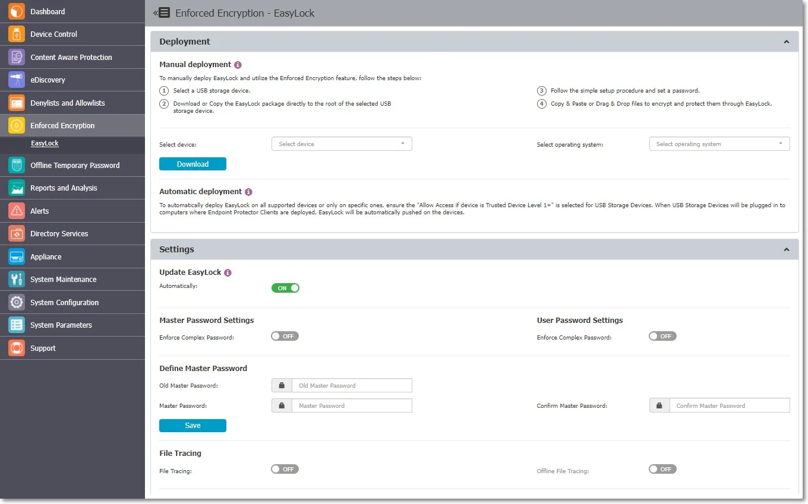
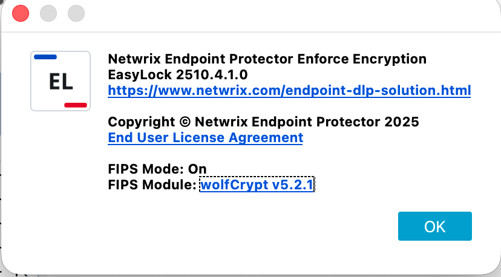
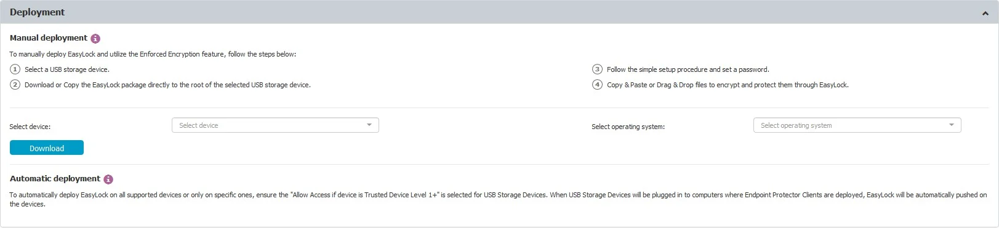
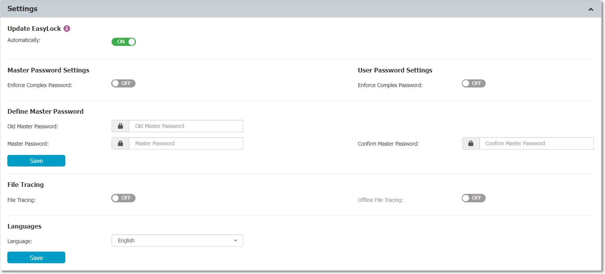
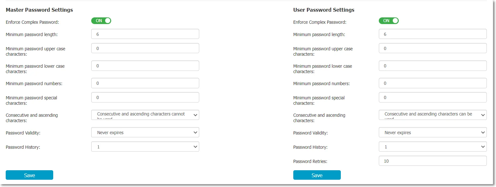
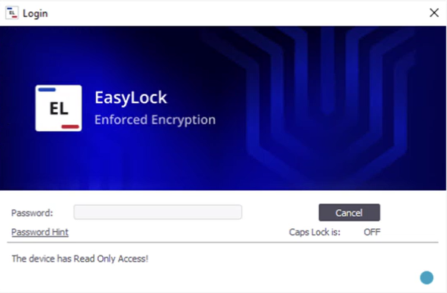
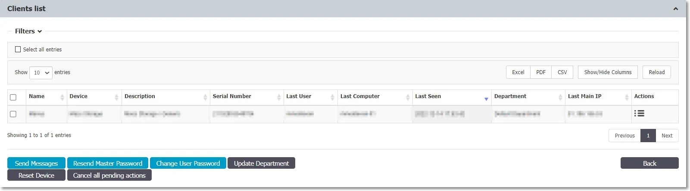

# Enforced Encryption

Enforced Encryption, Formerly known as EasyLock, is a cross-platform solution that protects data with government-approved FIPS 140-3 validated encryption. For USB devices, it needs to be deployed on the root of the device. With the intuitive Drag & Drop interface, files can be quickly copied to and from the device.

Used in combination with Endpoint Protector, Enforced Encryption allows USB storage devices to be
identified as Trusted Device™ Level 1. This can ensure that USB Enforced Encryption is used on
protected computers. Accessing data stored on the device can be done via the password the user
configured or via a Master Password set by the Endpoint Protector administrator. The encrypted data
can be opened by any user only after it is decrypted, therefore requiring the user to copy the
information out of Enforced Encryption.

:::warning
Enforced Encryption is not compatible with devices that have a write-protection
mechanism in place, preventing the modification or deletion of data. The write-protection mechanism
can be enforced using a hardware component (for example a switch on the USB device) or a software
component.
:::

:::note
While Endpoint Protector can detect any Enforced Encryption USB encrypted device as a
Trusted Device™ Level 1, to use the Enforced Encryption feature, a specific Enforced Encryption
version must be used. This is available for the Endpoint Protector User Interface.
:::

Enforced Encryption works on read-only mode if the device was formatted on Windows, the Enforced
Encryption configured on Windows or some files were encrypted on Windows. On macOS, these files can be
decrypted, except for NTFS due to incompatibility with Enforced Encryption.

## Enforced Encryption 140-3 FIPS Validated Engine

:::note
Starting with Netwrix Enforced Encryption version 3.0.0.2 (5.9.4.2 release), a new encryption engine has been introduced, replacing the previous 256-bit AES CBC-mode encryption with FIPS 140-3 validated cryptography. This FIPS 140-3 validated encryption provides the highest standards of data protection, ensuring compliance with the latest industry regulations. While the new encryption engine is fully backward compatible for existing users, allowing for a seamless upgrade and continued use of previously encrypted drives, USB sticks encrypted with the FIPS 140-3 validated engine will not be compatible with older Enforced Encryption Clients. Therefore, we recommend updating EE Clients to ensure compatibility.
:::

To verify the version of the 140-3 FIPS validated engine and view certification details, check the "About" section in the Enforced Encryption application.

## Enforced Encryption Deployment

Enforced Encryption is supported for both Mac and Windows computers.

Deployment can be done automatically if **Allow Access if Trusted Device™ Level 1+** is selected
for the USB Storage Devices. This can be done by going to Device Control, Global Rights section, or
using the quick links provided, as per the image above.

Manual deployment is also available. Download links for both Windows and Mac are available in this
section. The downloaded Enforced Encryption file must be copied onto the USB storage device and
executed from the root of the device. Due to extended security features for manual deployment,
Enforced Encryption will have to be redownloaded from the Endpoint Protector interface each time it
will be used to encrypt a new USB storage device.

:::note
Starting with Endpoint Protector 5.2.0.0, manual deployment can also be made by the user
if the device is set on Allow Access, by pressing the small USB icon- Encrypt Device with Enforced
Encryption.
:::

Both Enforced Encryption deployments are straightforward and require the user only to configure a
password.

:::note
On Macs, USB storage devices with multiple partitions are not supported by Enforced
Encryption and Trusted Device™ Level 1.
:::

## Enforced Encryption Settings

This section allows you to remotely manage Enforced Encryption encrypted devices. Before being able
to take advantage of these features, you must configure a Master Password.

In the Settings section, the Master Password can be configured, the Enforced Encryption File Tracing
enabled, as well as defining the installation and execution of Enforced Encryption only on computers
where the Endpoint Protector Client is present.

For both the Master Password and the User Password, complex rules can be enforced. If these are
enabled, the password lengths, minimum characters, validity, history, and other settings can be set.

Endpoint Protector allows tracing of files copied and encrypted on portable devices using Enforced
Encryption. This option can be activated from inside the Settings windows located under the Enforced
Encryption tab.

By checking the File Tracing option, all data transferred to and from devices using Enforced
Encryption is recorded and logged for later auditing. The logged information is automatically sent
to the Endpoint Protector Server if the Endpoint Protector Client is present on that computer. This
action takes place regardless of the File Tracing option being enabled or not for that specific
computer through the Device Control module.

In case the Endpoint Protector Client is not present, the information is stored locally in an
encrypted format on the device and it will be sent at a later time from any other computer with the
Endpoint Protector Client installed.

The additional Offline File Tracing option is an extension to the first option, offering the
possibility to store information directly on the device, before being sent to the Endpoint Protector
Server. The list of copied files is sent only the next time the device is plugged in and only if the
Endpoint Protector Client is present and communicates with the Endpoint Protector Server.

Additionally, Easy Lock performs File Shadowing for the files that are transferred if the Endpoint
Protector Client is present and the File Shadowing option is enabled on the computer on which the
events occur – through the Device Control module. This is a real-time event and no shadowing
information is stored on the device at any given time.

:::note
Enabling global File Tracing will not automatically activate the File Tracing option on
Enforced Encryption Trusted Device™ and vice versa.
:::

:::warning Important
After deploying the Enforced Encryption Client with Read-Only (RO) mode enabled, ensure you launch the EE Client for the first time on the EPP Client-managed computer to complete the configuration process.
:::

:::warning Important
When an Enforced Encryption (EE) encrypted USB drive is used by multiple users or across different machines with varying EE settings, the settings will not update automatically. To apply individual computer or user settings, the EPP administrator must update the related EE settings on the EPP Server at the computer/user level each time the USB drive is used on a specific computer or by a particular user. These settings will remain stored in the EE USB drive's configuration until further modifications are made.
:::

## Enforced Encryption in Read-Only mode

Netwrix Enforced Encryption Read-Only Mode for unmanaged computers is an innovative feature designed to maintain data security standards across non-corporate devices. It allows administrators to grant access to EE encrypted drives on personal computers, conference room setups, or exhibition areas while ensuring security through a Read-Only configuration. This enables the seamless transfer of corporate data across different environments, providing robust protection without sacrificing accessibility.

To activate this mode, navigate to the "Global Settings" section related to Enforced Encryption, and switch on the "EE Read-Only mode" toggle. Please refer to [Global Settings - EE configuration](/docs/endpointprotector/admin/dc_module/globalsettings#easylock-settings).

### Enforced Encryption Clients

In the Clients list section, all Enforced Encryption enforced devices are listed. By selecting the
Manage Client Action a list of Actions History is displayed, as well as the option to manage them by
sending a message, changing the user’s password, resetting the device, resending the master
password, and more.

### Trusted Device™

Protecting Data in Transit is essential to ensure no third party has access to data in case a device
is lost or stolen. The Enforced Encryption solution gives administrators the possibility to protect
confidential data on portable devices in case of loss or theft. Ensuring only encrypted devices can
be used on computers where Endpoint Protector is present can be done by utilizing Trusted Device™.
Trusted Device™ must receive authorization from the Endpoint Protector Server, otherwise, they will
be unusable. There are four levels of security for Trusted Device™:

- Level 1 – Minimum security for office and personal use with a focus on software-based encryption for
  data security. Any USB Flash Drive and most other portable storage devices can be turned into a
  Trusted Device™ Level 1. It does not require any specific hardware but it does need an encryption
  solution such as Enforced Encryption
- Level 2 – Medium security level with biometric data protection or advanced software-based data
  encryption. It requires special hardware that includes security software and has been tested for
  Trusted Device™ Level 2.
- Level 3 – High-security level with strong hardware-based encryption that is mandatory for
  regulatory compliance such as SOX, HIPAA, GBLA, PIPED, Basel II, DPA, or PCI 95/46/EC. It requires
  special hardware that includes advanced security software and hardware-based encryption that has
  been tested for Trusted Device™ Level 3.
- Level 4 – Maximum security for military and government use. Level 4 Trusted Device™ include
  strong hardware-based encryption for data protection and are independently certified (e.g., FIPS
  140). These devices have successfully undergone rigorous testing for software and hardware. It
  requires special hardware that is available primarily through security-focused resellers.
- Level 1+ – Derived from Level 1, it will ensure that Enforced Encryption 2 with Master Password
  will be automatically deployed on USB storage devices plugged into computers where the Endpoint
  ProtectorEndpoint Protector Client is present.

:::note
If a Trusted Device™ Level 1 right is enabled and a Trusted Device™ level 2, 3 or 4 is
connected, the right will apply accordingly.
:::

The table below provides a list of Trusted Device™:

| Device Names                          | Trusted Device™ Level |
| ------------------------------------- | ---------------------- |
| Enforced Encryption Encrypted devices | 1                      |
| AT1177                                | 2                      |
| UT169                                 | 2                      |
| UT176                                 | 2                      |
| Trek ThumbDrive                       | 2                      |
| BitLocker Encrypted devices           | 3                      |
| FileVault Encrypted devices           | 3                      |
| Buffalo Secure Lock                   | 3                      |
| CTWO SafeXs                           | 3                      |
| Integral Crypto                       | 3                      |
| Integral Crypto Dual                  | 3                      |
| Integral Courier Dual                 | 3                      |
| IronKey Secure Drive                  | 3                      |
| iStorage datAshur                     | 3                      |
| Kanguru Bio Drive                     | 3                      |
| Kanguru Defender                      | 3                      |
| Kanguru Elite (30, 200 & 300)         | 3                      |
| Kanguru Defender Elite                | 3                      |
| Kingston DataTraveler Locker+         | 3                      |
| Lexar 1 (Locked I Device)             | 3                      |
| Lexar Gemalto                         | 3                      |
| SaferZone Token                       | 3                      |
| ScanDisk Enterprise                   | 3                      |
| Verbatim Professional                 | 3                      |
| Verbatim Secure Data                  | 3                      |
| Verbatim V-Secure                     | 3                      |
| iStorage datAshur Pro                 | 4                      |
| Kanguru Defender (2000 & 3000)        | 4                      |
| SafeStick BE                          | 4                      |
| Stealth MXP Bio                       | 4                      |
